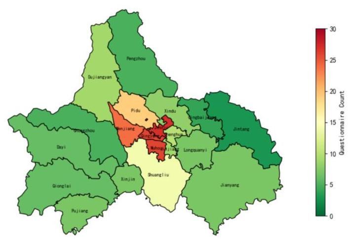
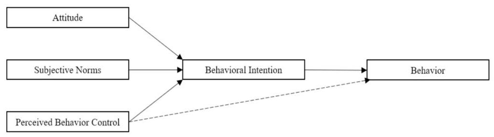
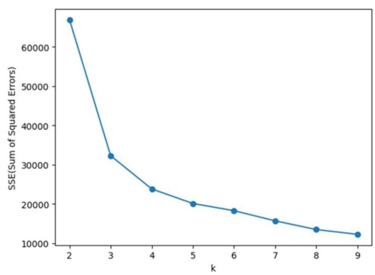
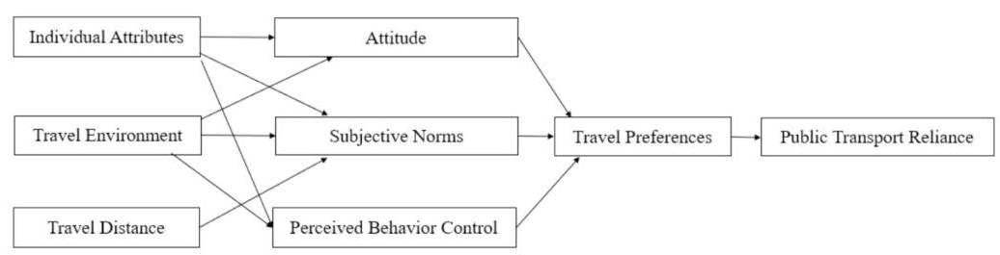
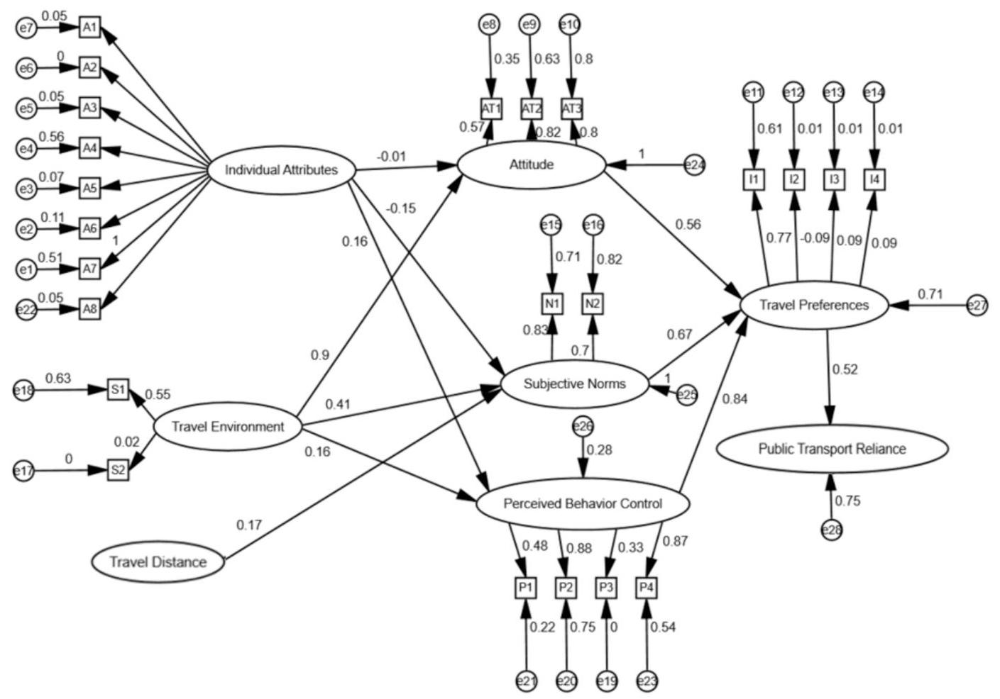

# Assessing the influence of the COVID-19 pandemic on passengers' reliance on public transport

Long Cheng ${}^{\mathrm{a},\mathrm{b}}$ , Zhe Ning ${}^{\mathrm{a},\mathrm{b}}$ , Da Lei ${}^{\mathrm{a}, * }$ , Xinmei Cai ${}^{\mathrm{a}}$ , Xuewu Chen ${}^{\mathrm{a}}$

${}^{a}$ Jiangsu Key Laboratory of Urban ITS, School of Transportation, Southeast University, China

${}^{\mathrm{b}}$ Key Laboratory of Transport Industry of Comprehensive Transportation Theory (Nanjing Modern Multimodal Transportation Laboratory), China

## ARTICLEINFO

Keywords:

Public transport

Travel behavior

Theory of planned behavior

Structural equation modeling

## A B S T R A C T

The COVID-19 pandemic has significantly influenced travel choices and the effective functioning of public transport. However, research into the pandemic's effects on public transport, specifically considering the combined impact of both risk perception and prevention tactics, remains limited. This study aims to examine the effect of COVID-19 on passengers' reliance on public transport, considering their risk perception and the strategies implemented for pandemic prevention. Data for this research were gathered through a questionnaire survey conducted in Chengdu, China, in March 2022, during a major outbreak of the pandemic in the city. Employing the Theory of Planned Behavior, the study establishes a structural equation model to analyze the questionnaire data and unveil the COVID-19's impact on passengers' reliance on public transport. The analysis shows that people's perception of infection risk has a significant impact on travel preference, and they pay attention to the convenience of public transport as well as safety. Based on the analysis, relevant suggestions are proposed from the perspectives of passengers, operators, and the government to improve the safety and efficiency of public transport.

## 1. Introduction

COVID-19, triggered by the novel coronavirus, emerged in early 2020 and rapidly spread worldwide, igniting a major health crisis. Its contagious nature and severe health effects compelled governments to implement containment strategies, including lockdowns, travel restrictions, and social distancing, which disrupted daily life and transformed travel patterns. These interventions, along with public perceptions of risk associated with the virus, have fundamentally altered the dynamics of public transport reliance, underscoring the importance of a comprehensive approach that considers both risk perception and prevention tactics. Despite a gradual return to normalcy, the pandemic's lingering effects on public transport require continuous research and vigilance. Dong et al. (2021) developed a model predicting that greater concern about pandemic-related information leads to higher anxiety and lower passenger satisfaction, highlighting how perceptions shaped during the pandemic could persistently affect public transport systems. Furthermore, Zhao and Gao (2022) revealed that pre-pandemic travel habits significantly influence post-pandemic transport choices, suggesting that understanding historical travel patterns is crucial for anticipating future public transport needs. Pezoa et al. (2023) emphasized the critical role of public transport during the pandemic and warned that without proper measures, the decline in usage could have long-term consequences. Supporting this notion, Long et al. (2023) conducted a survey in the West Midlands metropolitan area of the UK and found that while ${80}\%$ of passengers who had abandoned public transport during the pandemic had returned by 2022, their usage frequency still remained lower than pre-pandemic levels. Yang et al. (2021) explored the enduring alterations in travel behaviors during and post-COVID-19 in Huzhou, China, finding that travel restrictions significantly reduced travel demand and disproportionately affected vulnerable groups such as low-income earners and those employed in tourism and transport sectors. These studies collectively provide empirical evidence that the pandemic's effects on public transport are profound and prolonged. To fully understand these impacts, continued research is essential. Additionally, strategic planning is crucial for recovering and enhancing public transport systems in the post-pandemic era.

The pandemic's outbreak has significantly impacted public transport. Previous studies indicate that, compared to other transport modes, public transport demand has decreased more significantly during the pandemic (e.g., Li et al., 2021; Kopsidas et al., 2021; Gramsch et al., 2022). In this context, the factors influencing public transport have also evolved. Several studies have been conducted to identify the pandemic's influencing factors in different countries and at various stages. For instance, the research by Gkiotsalitis and Cats (2021) focuses on adjustments to public transport planning measures during the pandemic, aiming to develop more rational intervention strategies for transit service providers. Chuenyindee et al. (2022) utilized Structural Equation Modeling (SEM) to examine the factors impacting the quality of Public Utility Vehicle (PUV) services during the COVID-19 pandemic, with a particular emphasis on providing the government with an evaluation of PUVs' compliance with the imposed COVID-19 protocols. Meanwhile, Esmailpour et al. (2022) studied the impact of psychological factors on public transport usage during the pandemic, especially the perceptions of comfort, safety, and reliability in transit travel. The government's travel restrictions have had an undeniable impact on people's reliance on public transport. Jin et al. (2023) found that the positive effects of pre-pandemic population density and land use mix on ride usage have shifted to negative effects after the pandemic. The pandemic-induced panic has psychologically deterred people from choosing public transport (Cahigas et al., 2022; Böcker et al., 2023). Moreover, surveys in some countries show that government travel restrictions have greatly impacted public transport usage. A study from Poland (Wielechowski et al., 2020) indicates that the mandatory lockdowns implemented to curb the spread of COVID-19 effectively promoted social distancing in Polish public transport. However, it was government restrictions, rather than local pandemic conditions, that led to a significant decrease in mobility. Meanwhile, a study from Chile (Gramsch et al., 2022) shows that government travel restrictions were temporarily effective in reducing travel demand, particularly in cities with a larger elderly population and among high-income households, where the lockdown had a greater impact on reducing the demand for public transport.

---

* Corresponding author at: Sipailou 2, Nanjing 210096, China.

E-mail address: greatradar@gmail.com (D. Lei).

---

However, research into the pandemic's effects on public transport, specifically considering the combined impact of both risk perception and prevention tactics, remains limited. This study aims to address this gap. Utilizing the Theory of Planned Behavior (TPB), we collected questionnaire data in Chengdu and employed SEM to assess how these factors influence public transport usage. The main contributions of this study are twofold. Firstly, it determines the impact of passenger risk perception and the implementation of pandemic prevention policies on public transport reliance. Secondly, it offers relevant recommendations for passengers, operators, and governments to effectively respond to the pandemic, based on the identified changes in influencing factors.

The paper is organized as follows. Section 2 introduces relevant literature on the analysis of factors affecting public transport. Section 3 introduces how to obtain data related to public transport reliance through a questionnaire survey. Section 4 introduces the K-means algorithm and SEM. Section 5 explains the model results. Section 6 is the discussion and conclusions.

## 2. Literature review

The outbreak of the pandemic has significantly impacted the travel environment for travelers. Due to fears about the risk of infection and the implementation of related restrictive policies, there have been notable changes in travel behavior. Parr et al. (2020) analyzed Florida's 2019-2020 transport data and found a 47.5% decrease in state traffic, attributed to pandemic fears and travel restrictions. Hua et al. (2021) found that during the pandemic, the demand for shared bicycles, especially for commuting, has significantly decreased. Multiple studies also demonstrate a negative association between travel activity and the number of COVID-19 cases (e.g., Morita et al., 2020; Maloney and Taskin, 2020; Kashima and Zhang, 2021). Furthermore, the impact of psychological factors in the pandemic context has led to a shift in travelers' attitudes towards various modes of transport. Attitudes towards private cars, walking, and cycling are more positive or unchanged, while views on shared transport, like public transport, are predominantly negative (De Haas et al., 2020; Loa et al., 2021; Pezoa

## et al., 2023).

Given the enclosed nature of public transport environments and the high density of passengers, the risk of COVID-19 infection is relatively high. Consequently, targeted measures are necessary to reduce the risk of virus transmission and ensure the effective operation of public transport systems. Amid the pandemic, governments worldwide have imposed restrictions to limit travel and prevent gatherings (Beck and Hensher, 2020; De Haas et al., 2020; Zhang et al., 2021a). They also promoted online meetings, remote work, and e-learning (Zhang et al., 2021b). Public transport systems have adopted measures to counter the spread of the virus, including mandatory mask-wearing (Dzisi and Dei, 2020), regular vehicle disinfection (Al-Atawi and Saleh, 2014), and increased passenger spacing (Shelat et al., 2022).

The factors influencing people's choice of public transport are diverse, and scholars from various countries and regions have researched these factors before the pandemic outbreak. Fujii and Kita-mura (2003) through a controlled intervention experiment, discovered that psychological factors, such as attitudes towards public transport and travel habits, can affect the frequency of public transport usage. Thogersen (2006) found that although there are various influencing factors, past travel preferences play a more significant role in public transport choices. Al-Atawi and Saleh (2014) conducted a survey in Saudi Arabia, finding that socio-economic factors significantly impact travel mode choices in developing countries. Devika and Harikrishna (2020) employed TPB as a foundational framework to administer a preference survey aimed at examining the determinants of public transport utilization. The study comprehensively assessed various attributes of service quality alongside potential determinants, encompassing travel expenses, duration of commute, attitudinal dispositions, social influences captured by subjective norms, and the extent of perceived autonomy over commuting choices.

Inevitably, the pandemic has added complexity to the factors affecting public transport. Pezoa et al. (2023) conducted an investigation into the post-pandemic shift in public transport usage with a focus on travel intent. The study analyzed variations in public transport demand corresponding to distinct travel purposes and observed a notable rise in the proportion of commute-related usage, contrasted by a decline in recreational travel. Yang et al. (2023) investigated the variations in travel patterns across three distinct phases: pre-pandemic, amid the pandemic, and post-pandemic. Their findings revealed a strong correlation between the spatial distribution of travel demand and the location of socioeconomic resources and opportunities. In the aftermath of the COVID-19 outbreak, several researchers have integrated risk perception into their analytical models to examine its influence on the usage patterns of public transport (Cahigas et al., 2022; Böcker et al., 2023; Zhang et al., 2024). In response to the pandemic's impact on public transport operations, the restrictive measures adopted by different countries have also influenced people's choice of travel modes and their reliance on public transport (Gkiotsalitis and Cats, 2021; Loa et al., 2021). Beck et al. (2021) found that even when COVID-19 restrictions were relaxed, concerns about population and health were significantly negatively correlated with the use of public transport. The complexity of the public transport environment necessitates a comprehensive consideration of new factors when studying the influences on public transport. The factors considered in previous studies on the influencing factors of public transport are shown in the Table 1.

The research analyzing the factors affecting public transport usage and the reliance of passengers on public transport primarily employs the following methodologies: regression analysis (Liu et al., 2021; Guzman and Hessel, 2022) and methods based on factor analysis, as Principal Component Analysis (PCA) (Nwachukwu, 2014; Sharma and Patil, 2021), Confirmatory Factor Analysis (CFA) (Sam et al., 2019; Derahim et al., 2021), Latent Class Analysis (LCA) (e.g. Espino and Román, 2020; Rafiq and McNally, 2021; Bansal et al., 2022) or SEM (e.g. Munim and Noor, 2020; Cahigas et al., 2022; Böcker et al., 2023). SEM stands out as an advanced statistical tool capable of examining complex interrelationships between multiple variables. SEM offers several key advantages over basic regression analysis. It allows for the modeling of mediator variables, enabling the separation of effects into direct and indirect components. Additionally, it includes measurement error in the analysis of all observed variables to enhance precision and has the capacity to identify causal relationships beyond mere association as reflected in regression coefficients. SEM is particularly suited for analyzing the factors influencing passengers' reliance on public transport during the COVID-19 pandemic because it allows for the simultaneous evaluation of multiple interdependent variables. SEM can effectively handle complex variable relationships and latent constructs, such as attitudes, perceptions, and behaviors, which are critical in understanding how various factors-such as risk conception and prevention tactics-affect passenger decisions. By using SEM, we can gain a more nuanced understanding of direct and indirect influences on public transport reliance, providing insights that are essential for policymakers and transport providers in adapting services to meet user needs during and after the pandemic.

Table 1

The influencing factors considered in previous studies.

<table><tr><td>Reference</td><td>Travel expenses</td><td>Travel distance</td><td>Socio-economic factors</td><td>Travel environment</td><td>Psychological factors</td><td>Risk perception</td><td>Prevention tactics</td></tr><tr><td>Fujii and Kitamura, 2003</td><td>✓</td><td>✓</td><td>✓</td><td>✓</td><td>✓</td><td/><td/></tr><tr><td>Thogersen, 2006</td><td/><td/><td>✓</td><td>✓</td><td>✓</td><td/><td/></tr><tr><td>Al-Atawi and Saleh, 2014</td><td>✓</td><td>✓</td><td>✓</td><td>✓</td><td>✓</td><td/><td/></tr><tr><td>Devika and Harikrishna,</td><td>✓</td><td>✓</td><td>✓</td><td>✓</td><td>✓</td><td/><td/></tr><tr><td>2020</td><td/><td/><td/><td/><td/><td/><td/></tr><tr><td>Beck et al., 2021</td><td>✓</td><td>✓</td><td>✓</td><td/><td/><td/><td>✓</td></tr><tr><td>Loa et al., 2021</td><td/><td/><td>✓</td><td>✓</td><td>✓</td><td/><td>✓</td></tr><tr><td>Pezoa et al., 2023</td><td/><td/><td>✓</td><td>✓</td><td/><td>✓</td><td>✓</td></tr><tr><td>Yang et al., 2023</td><td>✓</td><td>✓</td><td>✓</td><td>✓</td><td/><td>✓</td><td>✓</td></tr><tr><td>Böcker et al., 2023</td><td>✓</td><td>✓</td><td>✓</td><td>✓</td><td/><td>✓</td><td/></tr><tr><td>Zhang et al., 2024</td><td>✓</td><td>✓</td><td>✓</td><td>✓</td><td>✓</td><td>✓</td><td/></tr></table>

Existing research indicates that the pandemic has significantly impacted the use of public transport. This is primarily reflected in changes in travel demand, the choice of travel modes, and shifts in attitudes towards public transport. In the context of the pandemic, the factors affecting public transport have become more complex compared to normal conditions. However, research into the pandemic's effects on public transport, particularly when considering the combined impact of both risk perception and prevention tactics, remains scarce.

## 3. Data

This study conducted a questionnaire survey in Chengdu, the capital of Sichuan Province, China, a city known for its rapidly developing and extensive public transport system. Chengdu is committed to improving the quality and coverage of its transport services, offering residents and tourists a comprehensive network of public transport options, including subways, buses, and trams. Since late February 2022, Chengdu has experienced repeated COVID-19 outbreaks, resulting in several confirmed cases, with a cumulative total of 34 cases by March 1, 2022. This brief outbreak has not only affected the daily lives of residents but also influenced their travel choices.

The survey was conducted over a period of 14 days, from March 4, 2022, to March 17, 2022. After implementing online surveys and distributing some offline questionnaires, a total of 263 responses were collected. Through conditional screening of the responses, 225 valid questionnaires were obtained. The questionnaire is mainly distributed in the main urban areas, where there are relatively more users of public transport. The specific distribution quantity is shown in the Fig. 1. To ascertain the validity of the questionnaire, it was necessary to test the reliability, validity, and other parameters of the data. For this purpose, the software SPSS was used. Upon importing and verifying the questionnaire results, it was found that the Cronbach's alpha coefficient is 0.814 and the validity test coefficient is 0.846 . These results indicate that the questionnaire data is of high quality and meets the requirements for reliability and validity, thereby ensuring the credibility of the survey data.

Fig. 1. Distribution of questionnaire responses.

The questionnaire's content is structured around latent and observed variables. There are seven latent variables, including individual attributes, travel distance, travel environment, attitude, subjective norms, perceived behavior control, and travel preference. The profile of the respondents, as detailed in Table 2, reveals that 54.39% are male and 45.61% are female. A majority are undergraduates (53.07%), with the largest occupational groups being students (23.25%) and government officials (17.98%). The most common monthly income range is 5000-8000 RMB (26.32%). Regarding travel mode availability, a significant portion of respondents finds car availability to be 'Very Easy' (36.40%) or 'Easy' (29.39%). For non-motorized vehicle availability, 'Very Easy' (37.72%) is the most frequent response. Additionally, 31.58% of respondents have children in their household. The latent variables considered in the questionnaire are presented in Table 3.

## 4. Methods

### 4.1. K-means clustering

In this study, the K-means clustering algorithm was chosen to quantify reliance on public transport. To analyze the impact of various factors on public transport reliance, cluster analysis was conducted based on three parameters: the proportion of public transport trips, the proportion of public transport travel days, and the consistency of public transport trips. The K-means algorithm is a straightforward and efficient technique that partitions data points into $k$ clusters, where $k$ is a user-defined parameter. Its advantages include rapid computational speed, simplicity in implementation, and ease of interpretation.

For a given sample set $D = \left\{  {{x}_{1},{x}_{2},\ldots ,{x}_{m}}\right\}$ , the K-means algorithm obtains clusters $C = \left\{  {{C}_{1},{C}_{1},\ldots ,{C}_{k}}\right\}$ for clustering, and the minimum scoring error for partitioning is:

$$
E = \mathop{\sum }\limits_{{i = 1}}^{k}\mathop{\sum }\limits_{{x \in  {\mathrm{C}}_{i}}}{\begin{Vmatrix}x - {\mu }_{i}\end{Vmatrix}}_{2}^{2}\#  \tag{1}
$$

$$
{\mu }_{i} = \frac{1}{\left| {C}_{i}\right| }\mathop{\sum }\limits_{{x \in  {C}_{i}}}x\#  \tag{2}
$$

Table 2

Survey data on the profile of respondents.

<table><tr><td>Name</td><td>Type</td><td>Proportion</td></tr><tr><td rowspan="5">Gender</td><td>Male</td><td>54.39%</td></tr><tr><td>Female</td><td>45.61%</td></tr><tr><td>Personnel of enterprises and institutions</td><td>13.60%</td></tr><tr><td>Government officials</td><td>17.98%</td></tr><tr><td>Individual workers and merchants</td><td>10.09%</td></tr><tr><td rowspan="7">Occupation</td><td>Worker</td><td>15.79%</td></tr><tr><td>Freelancer</td><td>3.51%</td></tr><tr><td>Unemployed/retired</td><td>2.63%</td></tr><tr><td>Student</td><td>23.25%</td></tr><tr><td>Other Occupations</td><td>13.16%</td></tr><tr><td>Less than 1500</td><td>23.25%</td></tr><tr><td>1500-3000</td><td>7.46%</td></tr><tr><td rowspan="4">Monthly income/RMB</td><td>3000-5000</td><td>21.49%</td></tr><tr><td>5000-8000</td><td>26.32%</td></tr><tr><td>8000-15,000</td><td>9.65%</td></tr><tr><td>15,000-20,000</td><td>7.89%</td></tr><tr><td rowspan="5">Educational background</td><td>More than 20,000</td><td>3.95%</td></tr><tr><td>High school and below</td><td>9.21%</td></tr><tr><td>Technical secondary school</td><td>25.44%</td></tr><tr><td>Undergraduate</td><td>53.07%</td></tr><tr><td>Graduate and other degrees</td><td>12.28%</td></tr><tr><td rowspan="5">Car availability</td><td>Very Difficult</td><td>6.58%</td></tr><tr><td>Difficult</td><td>14.47%</td></tr><tr><td>Ordinary</td><td>13.16%</td></tr><tr><td>Easy</td><td>29.39%</td></tr><tr><td>Very Easy</td><td>36.40%</td></tr><tr><td rowspan="5">Non-motorized vehicle availability</td><td>Very difficult</td><td>10.53%</td></tr><tr><td>Difficult</td><td>10.09%</td></tr><tr><td>Ordinary</td><td>12.72%</td></tr><tr><td>Easy</td><td>28.95%</td></tr><tr><td>Very easy</td><td>37.72%</td></tr><tr><td rowspan="2">Children presence in the household</td><td>Yes</td><td>31.58%</td></tr><tr><td>No</td><td>68.42%</td></tr></table>

where $k$ is the number of clusters, ${C}_{i}$ is the dataset of public transport reliance characteristic indicators for Class $i$ passengers, $x$ is the data vector in ${C}_{i}$ and ${\mu }_{i}$ is the mean vector of cluster ${C}_{i}$ .

Initially, $k$ values are randomly selected as the initial cluster centers. The distance between each sample and these centers is calculated, and each sample is assigned to the nearest center. This process is repeated iteratively: the cluster means are recalculated to determine new centers, continuing until the centers stabilize. This effectively divides the samples into $k$ distinct categories based on their similarities.

### 4.2. Structural equation modeling

This paper explores multiple psychological factors among the influencing factors studied, necessitating the design of observed variables to understand the relationships between latent variables. SEM is particularly suited for analyzing the factors influencing passengers' reliance on public transport during the COVID-19 pandemic because it allows for the simultaneous evaluation of multiple interdependent variables. SEM can effectively handle complex variable relationships and latent constructs, such as attitudes, perceptions, and behaviors, which are critical in understanding how various factors-such as risk conception and prevention tactics-affect passenger decisions. Consequently, SEM is employed, which accommodates errors in both dependent and independent variables and allows for multiple dependent variables. The foundation of the SEM constructed in this study is based on the TPB. TPB, initially proposed by Ajzen (1991), extends the Theory of Reasoned Action by introducing the concept of "perceived behavioral control," as illustrated in Fig. 2.

Table 3

Variables in the questionnaire.

<table><tr><td>Variables</td><td>Description</td><td>Mean (Percent)</td><td>Standard deviation</td></tr><tr><td colspan="4">Travel environment</td></tr><tr><td>S1</td><td>Total time from home and destination to transport station/min</td><td>24.45</td><td>11.15</td></tr><tr><td>S2</td><td>Probability of passing through medium-high risk areas</td><td>0.41</td><td>0.48</td></tr><tr><td colspan="4">Attitude</td></tr><tr><td>AT1</td><td>Safety level of public transport during the pandemic</td><td>3.22</td><td>1.21</td></tr><tr><td>AT2</td><td>Convenience level of public transport during the pandemic</td><td>3.12</td><td>1.33</td></tr><tr><td>AT3</td><td>Overall satisfaction with public transport during the pandemic</td><td>3.76</td><td>1.05</td></tr><tr><td colspan="4">Subjective norms</td></tr><tr><td>$\mathrm{N}1$</td><td>Support level of family and friends for using public transport</td><td>2.45</td><td>1.37</td></tr><tr><td>$\mathrm{N}2$</td><td>Using public transport due to influence from family and friends</td><td>2.52</td><td>1.28</td></tr><tr><td colspan="4">Perceived behavior control</td></tr><tr><td>P1</td><td>Familiarity with public transport routes</td><td>4.09</td><td>1.43</td></tr><tr><td>P2</td><td>Understanding of public transport's pandemic prevention policies</td><td>4.20</td><td>1.29</td></tr><tr><td>P3</td><td>Impact of pandemics on travel behavior</td><td>4.45</td><td>1.37</td></tr><tr><td>P4</td><td>Convenience and freedom of choosing public transport for travel</td><td>3.62</td><td>1.27</td></tr><tr><td colspan="4">Travel preferences</td></tr><tr><td>I1</td><td>Public transport preferences</td><td>3.42</td><td>1.32</td></tr><tr><td>12</td><td>Car travel preferences</td><td>4.15</td><td>1.12</td></tr><tr><td>13</td><td>Cycling preferences</td><td>3.96</td><td>1.44</td></tr><tr><td>I4</td><td>Walking preferences</td><td>4.10</td><td>1.05</td></tr><tr><td colspan="4">Other variables</td></tr><tr><td>R1</td><td>Proportion of public transport travel days/%</td><td>56.14</td><td>32.91</td></tr><tr><td>R2</td><td>Proportion of public transport trips/%</td><td>62.33</td><td>30.61</td></tr><tr><td>R3</td><td>Consistency of public transport trips/ %</td><td>76.92</td><td>23.44</td></tr><tr><td>D1</td><td>Travel distance/km</td><td>11.10</td><td>4.69</td></tr></table>

Notes: (1) For the observed variable S2, assign a value of 1 if the route includes passing through medium-high risk areas, otherwise assign a value of 0 . (2) For the observed variables related to attitudes, subjective norms, perceived behavioral control, and travel preferences, rate the degree from low to high on a scale of 1 to 5 , where 1 represents the lowest and 5 represents the highest degree. (3) The observed variables R1, R2, and R3 are utilized to determine public transport reliance through clustering, with D1 representing an independent latent variable. All four of these variables are continuous in nature. R3 denotes the usage of public transport for the entire round trip by respondents, assigning a value of 1 if they do and 0 otherwise.

TPB is recognized as a powerful framework for understanding and predicting a broad array of social behaviors. The TPB suggests that the intention to engage in a behavior is influenced by three key components: attitude towards the behavior, social norms, and perceived behavioral control. These components encompass behavioral beliefs, which predict the outcomes of the behavior; normative beliefs, reflecting societal expectations; and control beliefs, assessing factors that may facilitate or impede the behavior. Intentions form when control is adequate, leading to behavior execution when opportunities arise. Perceived behavioral control not only mirrors the actual control over behavior but also aids in predicting it directly (Ajzen, 2011).

Fig. 2. Structure of TPB (Ajzen, 1991).

We build upon the traditional TPB by incorporating additional latent and observed variables, such as individual attributes, travel environment, and travel distance. Through the extended SEM, our aim is to investigate the factors influencing public transport reliance in the context of the pandemic and to explore the underlying reasons behind these findings. The specific structural equation model that integrates these factors is depicted in Fig. 3. Personal attributes and the travel environment are fundamental factors in people's behavioral choices (Al-Atawi and Saleh, 2014; Böcker et al., 2023). Thus, we posit that these two latent variables influence travel preferences by affecting attitudes, subjective norms, and perceived behavioral control. Additionally, as a crucial factor in the choice of travel mode, travel distance is identified as a distinct element (Cheng et al., 2022, 2024; Devika and Harikrishna, 2020). We believe it impacts travel preferences primarily through its effect on subjective norms. Consequently, these travel preferences directly affect passengers' reliance on public transport (Lei et al., 2024; Si et al., 2022; Zhang et al., 2024).

## 5. Results

### 5.1. Clustering results

The correlation assessment index values were calculated using the survey sample data and served as input for the model. After multiple iterations, the sum of squared errors corresponding to various $k$ values was determined, as depicted in Fig. 4. The slope of the curve changes more significantly when $k$ equals 4, suggesting that the optimal number of clusters is four. This indicates that the respondents are categorized into four distinct groups based on their level of reliance on public transport.

The final four clustering results are displayed in Table 4. It is evident that the proportion of public transport travel days (R1), the proportion of public transport trips (R2), and the consistency of the public transport trips (R3) increase incrementally from clustering center 1 to clustering center 4. As a result, the levels of public transport reliance are categorized as minimal, moderate, high, and maximum, respectively.

#### 5.2.SEM results

1) Reliability and validity test

Fig. 4. Sum of squared errors.

Table 4

K-means clustering analysis results.

<table><tr><td>Variables</td><td>Minimal</td><td>Moderate</td><td>High</td><td>Maximum</td></tr><tr><td>R1</td><td>20.299</td><td>40.000</td><td>53.889</td><td>75.067</td></tr><tr><td>R2</td><td>25.239</td><td>45.319</td><td>56.806</td><td>74.107</td></tr><tr><td>R3</td><td>50.000</td><td>56.383</td><td>69.722</td><td>77.733</td></tr><tr><td>Cluster size</td><td>67</td><td>36</td><td>75</td><td>47</td></tr></table>

The fit index is utilized to evaluate the agreement between the proposed path analysis model and the actual model data. This evaluation includes both absolute and relative fit indices. For this study, the Chi-Square Minimum/Degrees of Freedom (CMIN/DF) and the Relative Fit Index (RFI) were chosen for assessment. The fitness test results reveal that the CMIN/DF value of the model is 2.654, satisfying the criteria for adaptation indicators between 1 and 3 (Marsh and Hocevar, 1985). Moreover, the RFI value is 0.961 , meeting the standard of an adaptation index above 0.9 (Bollen, 1989). These outcomes indicate that the model demonstrates good fit and is appropriate for further analysis.

2) Relationship between latent variables

Fig. 3. Structure of the extended SEM model.

Fig. 5 illustrates the path coefficients, delineating the relationships both among latent variables and between latent variables and their corresponding observed indicators.

From the path coefficients between latent variables shown in Fig. 5, the coefficient from the travel environment to attitudes is 0.9 , and the coefficient from perceived behavioral control to travel preferences is 0.84 . The analysis of the relationships between latent variables yields several key conclusions. Firstly, the impact of the travel environment on attitudes is highly significant. The outbreak of the pandemic has brought about substantial changes in people's travel environments compared to before. Under these altered conditions, individuals have become more cautious in their travel, paying increased attention to the safety, convenience, and overall satisfaction of public transit. Furthermore, perceived behavior has a notable effect on travel preferences. The risks of infection during travel, exacerbated by the pandemic, along with the policy measures taken by public transport authorities and governments, have affected people's travel behaviors. It is clear that both the travel environment and travel policies exert a considerable influence on individuals' travel preferences.

## 3) Relationship between latent variables and observed variables

From the perspective of the relationship between observed and latent variables, the path coefficient indicating the impact of travel intensity (P2) on perceived behavior control is 0.88 . Additionally, the path coefficient of support level of family and friends for using public transport (N1) on subjective norms is 0.83 . The path coefficient connecting convenience (AT2) to attitude is 0.82 , and the path coefficient relating overall satisfaction (AT3) to attitude is 0.8 . These high path coefficients suggest that the observed variables have a significant explanatory power for the corresponding latent variables.

The analysis of the relationships between observed and latent variables leads to several conclusions. First, in the context of the pandemic, passengers exhibit a heightened concern about how the pandemic impacts their travel intensity. Rather than focusing solely on the choice of transport mode, there is a greater emphasis on the feasibility of traveling as usual. Additionally, passengers' decisions to use public transport are influenced by their family and friends' transport choices, indicating that in the face of such a significant health crisis, people rely more on feedback from close contacts due to a lack of personal experience in choosing a mode of travel. Lastly, while safety is a priority, passengers also demand high levels of convenience in their travel.

## 4) Effect analysis of latent variables

In the SEM, it is possible to explain not only the interactions between variables but also to derive the indirect and total effects among them. The results of the indirect and total effects are presented in Table 5.

Travel preference directly influences public transport reliance, with its total effect being 0.395 , the highest among the seven latent variables. Among the latent variables that indirectly affect public transport reliance, perceived behavior control and travel distance have higher total effects. This is consistent with previous studies that have shown the influence of travel distance on travel mode selection (e.g., Thøgersen, 2006; Al-Atawi and Saleh, 2014; Devika and Harikrishna, 2020). The significance of perceived behavioral control in influencing travel preferences during a pandemic outbreak is noteworthy. This underscores the extent to which people's perception of infection risk impacts their reliance on public transport.

Table 5

Total effects of latent variables on public transport reliance.

<table><tr><td>Latent variables</td><td>Direct effect</td><td>Indirect effect</td><td>Total effect</td></tr><tr><td>Attitude</td><td>0.000</td><td>0.187</td><td>0.187</td></tr><tr><td>Subjective norm</td><td>0.000</td><td>0.035</td><td>0.035</td></tr><tr><td>Perceived behavioral control</td><td>0.000</td><td>0.305</td><td>0.305</td></tr><tr><td>Individual attributes</td><td>0.000</td><td>0.062</td><td>0.062</td></tr><tr><td>Travel environment</td><td>0.000</td><td>-0.153</td><td>-0.153</td></tr><tr><td>Travel distance</td><td>0.000</td><td>0.291</td><td>0.291</td></tr><tr><td>Travel preferences</td><td>0.395</td><td>0.000</td><td>0.395</td></tr></table>

Fig. 5. Path coefficients between variables.

## 6. Discussion and conclusions

The spread of COVID-19 has significantly affected the efficiency of public transport systems. In particular, the public's heightened awareness of infection risks and the control measures adopted by public transport authorities have shaped their reliance on these systems. Our research builds on previous studies regarding the impact of COVID-19 on travel behavior. Compared to earlier research, we focus on the combined effects of passengers' perceptions of infection risk during travel and the operational strategies of governments and public transport providers on passengers' reliance on public transport. This study places particular emphasis on understanding the long-term effects of the pandemic on public transport, highlighting its critical importance for future crisis management and for enhancing public health and transport policies. Utilizing the TPB and considering elements such as personal attributes, travel environment, travel distance, risk perception, and public transport control strategies, this paper develops SEM to investigate the determinants of people's reliance on public transport amidst the pandemic. Based on this analysis, the study underscores the necessity to provide targeted recommendations from the perspectives of passengers, operators, and government bodies, all aimed at enhancing the safety and efficiency of public transport systems.

In conclusion, the key insights into the pandemic's impact on public transport are as follows: (1) People's travel choices are heavily influenced by their perceptions of infection risk and public transport policies. (2) In the context of the pandemic, people prioritize not only safety but also greatly value the convenience of travel, indicating a heightened emphasis on overall satisfaction with their travel experiences. (3) People increasingly rely on their social networks, such as family and friends, for travel guidance, stemming from limited personal experience in these extraordinary times.

Based on the analysis, relevant recommendations can be made from the perspectives of government, individuals and operators to enhance the safety and efficiency of public transport. In response to the pandemic's impact on public transport, the government should focus on implementing and updating policies that balance safety and convenience, as well as encouraging community involvement in sharing travel information. Individuals need to prioritize their safety while seeking convenience, staying informed about health guidelines and leveraging their social networks for travel advice. Public transport operators should enhance safety measures and improve service efficiency to meet passengers' concerns about infection risks and their desire for convenient travel, actively engaging with passengers to understand and adapt to their evolving needs.

This research examined how the COVID-19 pandemic has affected passengers' reliance on public transport and offered strategies for adapting to the changes brought about by the health crisis. However, it does not delve into the prioritization of specific strategic implementations. Future research could beneficially explore this aspect, providing a more nuanced understanding of how to effectively action these suggestions.

## CRediT authorship contribution statement

Long Cheng: Conceptualization, Methodology, Software, Writing - original draft, Supervision, Funding acquisition. Zhe Ning: Writing - original draft, Methodology, Software, Formal analysis, Visualization. Da Lei: Methodology, Writing - review & editing. Xinmei Cai: Data curation, Writing - review & editing. Xuewu Chen: Supervision, Funding acquisition.

## Data availability

Data will be made available on request.

## Acknowledgements

This research is supported by the National Natural Science Foundation of China (No. 52372301 and U20A20330), the Fundamental Research Funds for the Central Universities (No. RF1028623146 and 2242023R40027), the Key Laboratory of Transport Industry of Comprehensive Transportation Theory (Nanjing Modern Multimodal Transportation Laboratory) (No. MTF2023006), and the Open Foundation of Key Laboratory of Transport Industry of Comprehensive Transportation Theory. References

Ajzen, I., 1991. The theory of planned behavior. Organ. Behav. Hum. Decis. Process. 50 (2), 179-211.

Ajzen, I., 2011. Design and evaluation guided by the theory of planned behavior. In: Social Psychology and Evaluation. Guilford Publications, pp. 74-100.

Al-Atawi, A., Saleh, W., 2014. Travel behaviour in Saudi Arabia and the role of social factors. Transport 29 (3), 269-277.

Bansal, P., Kessels, R., Krueger, R., Graham, D.J., 2022. Preferences for using the London underground during the COVID-19 pandemic. Transp. Res. A Policy Pract. 160, 45-60.

Beck, M.J., Hensher, D.A., 2020. Insights into the impact of COVID-19 on household travel and activities in Australia-The early days under restrictions. Transp. Policy 96, 76-93.

Beck, M.J., Hensher, D.A., Nelson, J.D., 2021. Public transport trends in Australia during the COVID-19 pandemic: an investigation of the influence of bio-security concerns on trip behaviour. J. Transp. Geogr. 96, 103167.

Böcker, L., Olsson, L.E., Uteng, T.P., Friman, M., 2023. Pandemic impacts on public transport safety and stress perceptions in Nordic cities. Transp. Res. Part D: Transp. Environ. 114, 103562.

Bollen, K.A., 1989. Structural Equations with Latent Variables, vol. 210. John Wiley & Sons.

Cahigas, M.M., Prasetyo, Y.T., Persada, S.F., Ong, A.K.S., Nadlifatin, R., 2022. Understanding the perceived behavior of public utility bus passengers during the era of COVID-19 pandemic in the Philippines: application of social exchange theory and theory of planned behavior. Res. Transp. Bus. Manag. 45, 100840.

Cheng, L., Cai, X., Liu, Z., Huang, Z., Chen, W., Witlox, F., 2024. Characterising travel behaviour patterns of transport hub station area users using mobile phone data. J. Transp. Geogr. 116, 103855.

Cheng, L., Jin, T., Wang, K., Lee, Y., Witlox, F., 2022. Promoting the integrated use of bikeshare and metro: A focus on the nonlinearity of built environment effects. Multimodal Transp. 1 (1), 100004.

Chuenyindee, T., Ong, A.K.S., Ramos, J.P., Prasetyo, Y.T., Nadlifatin, R., Kurata, Y.B., Sittiwatethanasiri, T., 2022. Public utility vehicle service quality and customer satisfaction in the Philippines during the COVID-19 pandemic. Util. Policy 75, 101336.

De Haas, M., Faber, R., Hamersma, M., 2020. How COVID-19 and the Dutch 'intelligent lockdown'change activities, work and travel behaviour: evidence from longitudinal data in the Netherlands. Transp. Res. Interdiscipl. Perspect. 6, 100150.

Derahim, N., Arifin, K., Wan Isa, W.M.Z., Khairil, M., Mahfudz, M., Ciyo, M.B., Samad, M. A., 2021. Organizational safety climate factor model in the urban rail transport industry through CFA analysis. Sustainability 13 (5), 2939.

Devika, R., Harikrishna, M., 2020. Analysis of factors influencing mode shift to public transit in a developing country. In: IOP Conference Series: Earth and Environmental Science, vol. 491, No. 1. IOP Publishing, p. 012054.

Dong, H., Ma, S., Jia, N., Tian, J., 2021. Understanding public transport satisfaction in post COVID-19 pandemic. Transp. Policy 101, 81-88.

Dzisi, E.K.J., Dei, O.A., 2020. Adherence to social distancing and wearing of masks within public transportation during the COVID 19 pandemic. Transp. Res. Interdiscipl. Perspect. 7, 100191.

Esmailpour, J., Aghabayk, K., Aghajanzadeh, M., De Gruyter, C., 2022. Has COVID-19 changed our loyalty towards public transport? Understanding the moderating role of the pandemic in the relationship between service quality, customer satisfaction and loyalty. Transp. Res. A Policy Pract. 162, 80-103.

Espino, R., Román, C., 2020. Valuation of transfer for bus users: the case of Gran Canaria. Transp. Res. A Policy Pract. 137, 131-144.

Fujii, S., Kitamura, R., 2003. What does a one-month free bus ticket do to habitual drivers? An experimental analysis of habit and attitude change. Transportation 30, 81-95.

Gkiotsalitis, K., Cats, O., 2021. Public transport planning adaption under the COVID-19 pandemic crisis: literature review of research needs and directions. Transp. Rev. 41 (3), 374-392.

Gramsch, B., Guevara, C.A., Munizaga, M., Schwartz, D., Tirachini, A., 2022. The effect of dynamic lockdowns on public transport demand in times of COVID-19: evidence from smartcard data. Transp. Policy 126, 136-150.

Guzman, L.A., Hessel, P., 2022. The effects of public transport subsidies for lower-income users on public transport use: a quasi-experimental study. Transp. Policy 126, 215-224.

Hua, M., Chen, X., Cheng, L., Chen, J., 2021. Should bike-sharing continue operating during the COVID-19 pandemic? Empirical findings from Nanjing, China. J. Transp. Health 23, 101264.

Jin, T., Cheng, L., Wang, S., Cao, J., Schwanen, T., Witlox, F., 2023. Do built environment factors have different effects on ridesourcing usage before and after the COVID-19 pandemic? Cities 141, 104520.

Kashima, S., Zhang, J., 2021. Temporal trends in voluntary behavioural changes during the early stages of the COVID-19 outbreak in Japan. Public Health 192, 37-44.

Kopsidas, A., Milioti, C., Kepaptsoglou, K., Vlachogianni, E.I., 2021. How did the COVID- 19 pandemic impact traveler behavior toward public transport? The case of Athens, Greece. Transp. Lett. 13 (5-6), 344-352.

Lei, D., Cheng, L., Wang, P., Chen, X., Zhang, L., 2024. Identifying service bottlenecks in public bikesharing flow networks. J. Transp. Geogr. 116, 103830.

Li, T., Wang, J., Huang, J., Yang, W., Chen, Z., 2021. Exploring the dynamic impacts of COVID-19 on intercity travel in China. J. Transp. Geogr. 95, 103153.

Liu, X., Wu, J., Huang, J., Zhang, J., Chen, B.Y., Chen, A., 2021. Spatial-interaction network analysis of built environmental influence on daily public transport demand. J. Transp. Geogr. 92, 102991.

Loa, P., Hossain, S., Mashrur, S.M., Liu, Y., Wang, K., Ong, F., Habib, K.N., 2021. Exploring the impacts of the COVID-19 pandemic on modality profiles for nonmandatory trips in the Greater Toronto Area. Transp. Policy 110, 71-85.

Long, A., Carney, F., Kandt, J., 2023. Who is returning to public transport for non-work trips after COVID-19? Evidence from older citizens' smart cards in the UK's second largest city region. J. Transp. Geogr. 107, 103529.

Maloney, W.F., Taskin, T., 2020. Determinants of social distancing and economic activity during COVID-19: a global view. In: World Bank Policy Research Working Paper, 9242.

Marsh, H.W., Hocevar, D., 1985. Application of confirmatory factor analysis to the study of self-concept: first-and higher order factor models and their invariance across groups. Psychol. Bull. 97 (3), 562.

Morita, H., Nakamura, S., Hayashi, Y., 2020. Changes of Urban Activities and Behaviors Due to COVID-19 in Japan. Available at SSRN 3594054.

Munim, Z.H., Noor, T., 2020. Young people's perceived service quality and environmental performance of hybrid electric bus service. Travel Behav. Soc. 20, 133-143.

Nwachukwu, A.A., 2014. Assessment of passenger satisfaction with intra-city public bus transport services in Abuja, Nigeria. J. Public Transp. 17 (1), 99-119.

Parr, S., Wolshon, B., Renne, J., Murray-Tuite, P., Kim, K., 2020. Traffic impacts of the COVID-19 pandemic: statewide analysis of social separation and activity restriction. Nat. Hazards Rev. 21 (3), 04020025.

Pezoa, R., Basso, F., Quilodrán, P., Varas, M., 2023. Estimation of trip purposes in public transport during the COVID-19 pandemic: the case of Santiago, Chile. J. Transp. Geogr. 109, 103594.

Rafiq, R., McNally, M.G., 2021. Heterogeneity in activity-travel patterns of public transit users: an application of latent class analysis. Transp. Res. A Policy Pract. 152, 1-18.

Sam, E.F., Brijs, K., Daniels, S., Brijs, T., Wets, G., 2019. Construction and validation of a public bus passenger safety scale. Transp. Res. Part F Traffic Psychol. Behav. 66, 47-62.

Sharma, G., Patil, G.R., 2021. Public transit accessibility approach to understand the equity for public healthcare services: a case study of greater Mumbai. J. Transp. Geogr. 94, 103123.

Shelat, S., Cats, O., Van Cranenburgh, S., 2022. Traveler behavior in public transport in the early stages of the COVID-19 pandemic in the Netherlands. Transp. Res. Part A Pol. Pract. 159, 357-371.

Si, H., Duan, X., Cheng, L., Zhang, Z., 2022. Determinants of consumers' continuance intention to use dynamic ride-sharing services. Transp. Res. Part D: Transp. Environ. 104, 103201.

Thøgersen, J., 2006. Understanding repetitive travel mode choices in a stable context: a panel study approach. Transp. Res. A Policy Pract. 40 (8), 621-638.

Wielechowski, M., Czech, K., Grzeda, Ł., 2020. Decline in mobility: public transport in Poland in the time of the COVID-19 pandemic. Economies 8 (4), 78.

Yang, Y., Cao, M., Cheng, L., Zhai, K., Zhao, X., De Vos, J., 2021. Exploring the relationship between the COVID-19 pandemic and changes in travel behaviour: a qualitative study. Transp. Res. Interdiscipl. Perspect. 11, 100450.

Yang, C., Wan, Z., Yuan, Q., Zhou, Y., Sun, M., 2023. Travel before, during and after the COVID-19 pandemic: exploring factors in essential travel using empirical data. J. Transp. Geogr. 103640.

Zhang, N., Jia, W., Wang, P., Dung, C.H., Zhao, P., Leung, K., Li, Y., 2021a. Changes in local travel behaviour before and during the COVID-19 pandemic in Hong Kong, Cities 112, 103139.

Zhang, J., Hayashi, Y., Frank, L.D., 2021b. COVID-19 and transport: findings from a world-wide expert survey. Transp. Policy 103, 68-85.

Zhang, T., Jia, Q., Cheng, L., Cheng, G., Yang, Y., 2024. Travel behavior of visually impaired people before and during COVID-19. Travel Behav. Soc. 35, 100717.

Zhao, P., Gao, Y., 2022. Public transit travel choice in the post COVID-19 pandemic era: an application of the extended theory of planned behavior. Travel Behav. Soc. 28, 181-195.