# Identifying service bottlenecks in public bikesharing flow networks

Da Lei ${}^{a, b}$ , Long Cheng ${}^{a, b, * }$ , Pengfei Wang ${}^{a, b}$ , Xuewu Chen ${}^{a, b}$ , Lin Zhang ${}^{a}$

${}^{a}$ Jiangsu Key Laboratory of Urban ITS, School of Transportation, Southeast University, China

${}^{b}$ Laboratory of Transport Industry of Comprehensive Transportation Theory (Nanjing Modern Multimodal Transportation Laboratory), China

## ARTICLEINFO

Keywords:

Resilient public transport

Role extraction

Smart card data

Network dynamics

Bikesharing flow patterns

## A B S T R A C T

Service bottlenecks are a key barrier to building a resilient public transport system. In this paper, we propose a new approach to automatically extract the role of a station in dynamical public transport flow networks based on the emerging role discovery method in network science. The term "role" in this study refers to the distinctive position or function that a station plays within the public transport flow network. Using smart card data from Nanjing public bikesharing agencies, we first construct dynamical public transport flow networks with notions of dynamical graph and edge. We then develop a dynamical algorithm to recursively compute the structural flow characteristics of nodes in passenger flow networks. Non-negative Matrix Factorization is conducted to extract the role memberships from the derived structural feature matrix and interpret each role in terms of measurements with practical values. The network hubs and potential service bottlenecks are then identified based on their operating characteristics and dynamics. Furthermore, the day-to-day and within-day role dynamics of public transport stations over time are unveiled. The results contribute to a better understanding of the interplay between stations in the network, and the identification of roles provides insight for public transport agencies to improve service resilience.

## 1. Introduction

Understanding the dynamics of public transport networks is important for identifying service bottlenecks and improving system resilience (Wang et al., 2020). With the rapid development of urbanization and technology, exploring the dynamics of public transport networks has become challenging due to their increasing size and complexity, along with our greater access to large-scale automatically-collected data sources such as smart card (SC) data (Wang et al., 2017). Network science, with its abstraction power, provides a quantitative framework for analyzing collective dynamics and interactions among network components in various disciplines, including transport systems. Specifically, graph theory has been instrumental in understanding transport networks, allowing for the study of topological structures, flow dynamics, and path relationships within these systems (Cheng et al., 2020a; Teix-eira and Derudder, 2021; Chen et al., 2022a). Studies have used graph theory to analyze public transport networks by examining their topological stability (Derrible and Kennedy, 2011), robustness against perturbations (Builes-Jaramillo and Lotero, 2022), and community structure (Chen et al., 2022b). These works have laid the groundwork for our paper, in which we apply emerging role discovery techniques from network science to investigate the dynamic roles of stations within public bikesharing networks. However, most existing studies focused only on investigating the topological complexity of public transport networks without providing in-depth insights into the attributes of public transport systems. This has led to claims from transport scientists that these works make only limited contributions to our understanding of the dynamics of public transport networks (see a detailed discussion in Luo et al. (2019)). Furthermore, most of the existing literature on the application of network science to public transport systems examines the time-varying network characteristics at a long granularity of time, resulting in growing concerns about the utility of network sciences in capturing the day-to-day and within-day dynamical network performance (Leng et al., 2014; Ding et al., 2015; Zhu and Luo, 2016; Cats, 2017).

In the field of public transport research, exploring spatial-temporal travel behavior (or passenger flow pattern) has been a focus for decades. One class of these studies relied on conventional travel survey data (Joh et al., 2002; Susilo and Kitamura, 2005). For a detailed discussion of the main drawbacks of applying travel survey data to analyze travel behavior, we refer to Tao et al. (2014). Given the increasing availability of automatically-collected data sources like smart card (SC) data, more research attention has been paid to spatial-temporal travel behavior analysis by exploiting emerging data sources (Morency et al., 2007; Cantelmo et al., 2020; Lei et al., 2021; Cheng et al., 2022b, 2023). Both types of data-based studies mainly offer insight into the dynamical characteristics of travel behavior of individuals or passenger flows, rather than the topological features of the physical networks of public transport. For example, Ma et al. (2013) applied a DBSCAN algorithm to identify the commuting patterns of transit passengers in Beijing. Traditional dynamic transportation models have revealed some of the characteristics of the traffic network that change over time, such as departure time distribution and passenger cost dynamics, from their simulated results, instead of travel flow patterns in the real world (Hamdouch et al., 2011; Yao et al., 2013; Cheng et al., 2020b).

---

* Corresponding author at: Sipailou 2, Nanjing 210096, China.

E-mail address: longcheng@seu.edu.cn (L. Cheng).

---

The notion of topological (structural) importance was first introduced by sociologists in the early 1950s (Parsons, 1951). They also defined "role" as groups of nodes with structural equivalence, meaning that nodes of the same role have the same topological importance. "Role" is a broad term that has different contextual interpretations in various disciplines based on their system characteristics. The term "role" in our study refers to the distinctive position or function that a station plays within the public transport flow network. It captures the station's structural features and its significance in the network dynamics. Previous research on the topological importance of stations (nodes) within public transport networks tends to be confined to "static analysis" employing topological evaluation metrics. For example, Háznagy et al. (2015) conducted a comprehensive network analysis of urban public transportation systems in five Hungarian cities, using node degree and centrality measurements to examine both weighted and unweighted networks to identify similarities, differences, and organizational inconsistencies in public transport networks. Similarly, De Bona et al. (2016) conducted the analysis of Curitiba's public bus system using metrics like closenesss and betweenness. They revealed the significance of integration terminals and their potential impact on the entire network in case of failure.

Including the studies mentioned, most existing research exploring the temporal features of public transport networks adopts an approach that aggregates traffic flow data into a series of static graph snapshots. From each snapshot, the service bottleneck node in the system is identified according to the size of the direct passenger flow (Rossi et al., 2012; Saha et al., 2018). However, this method may not fully reveal the dynamic connectivity and causality between nodes. Each static snapshot represents the traffic states of all nodes in each period, whereas, in reality, the traffic state of a node within a specific period is more likely to be influenced by the traffic states of its neighboring nodes in earlier periods. This lack of consideration of topological dynamics could undermine the reliability and precision of node role classification and bottleneck identification.

To this end, emerging techniques are necessary to capture the role of stations in dynamical traffic networks, unveiling the time-varying interplay among them and exploring role dynamics and behavioral patterns. In this study, we propose a novel algorithm, DyReFeX, which is a modified version of the Recursive Feature Extraction (ReFeX) algorithm Henderson et al. (2011). This modification allows us to capture the dynamical characteristics of public transport networks, uncovering the interplay among stations and their evolving roles over time. To the best of our knowledge, no studies have been reported that utilize role discovery techniques to investigate dynamics in public bikesharing networks. Our primary contributions are (1) providing an in-depth understanding of the within-day and day-to-day flow and changing characteristics of bikesharing stations; (2) identifying important nodes and potential service bottlenecks over time for policy-making and service improvement.

The remainder of the paper is structured as follows: Section 2 introduces the methods used in this study, including dynamical structural feature extraction, role clustering, automation of role number selection, and role interpretation approaches. In Section 3, one case study based on a dynamical bikesharing ridership flow network is described. Section 4 summarizes the main findings, discusses limitations, and suggests future research directions.

## 2. Methodology

In this section, we introduce the algorithm, indices, sets, network measurements, and variables. First, we introduce the following definitions as preliminaries:

Definition 1. Dynamical Edge: A dynamical edge (or temporal edge) $e = \left( {u, v,{t}_{s},{t}_{e}}\right)$ is defined as a directed edge with timestamp attributes, where $u$ and $v$ are the origin and destination nodes, respectively, and ${t}_{s}$ , ${t}_{e}$ are the corresponding start and end timestamps of $e$ . Timestamps denote the start and end periods instead of exact time points. In this study, each $e$ represents a passenger flow from the origin station $u$ to the destination $v$ (starting from ${t}_{s}$ to ${t}_{e}$ ). Note that ${t}_{s} = {t}_{e}$ is possible under our definition.

Definition 2. Checking Window: To evaluate the dynamics of flows in the network over a period of time, we define a checking window $T$ as a time period when the interplay between nodes occurs.

Definition 3. Dynamical Graph: A temporal graph or temporal network $G = \left( {V, E}\right)$ comprises a set of nodes $V$ and a temporal edge set $E = \left\{  {\left( {u, v,{t}_{s},{t}_{e}}\right)  \mid  u, v \in  V}\right\}$ . In the case study, we split one day into 15-min time intervals (96 intervals for one day). Daily travel transactions are then grouped into dynamical edges (flows) $e = \left( {u, v,{t}_{s},{t}_{e}}\right)$ from which dynamical graphs are constructed. Fig. 1 shows an example of a dynamical graph within an hourly checking window $T$ starting from "2019-03-04 07:00:00" to "2019-03-04 08:00:00". Timestamp labels $\left( {{t}_{s},{t}_{e}}\right\rbrack$ on edges of the network denote the specific beginning and ending periods of each flow. For example, $({29},{30}\rbrack$ means that the corresponding passenger flow starts in the 29th interval ("07:00:00-07:15:00") and ends in the 30th ("07:15:00-07:30:00"). Fig. 1 only presents a subgraph and timestamps on major streams for visual simplicity.

Definition 4. Egonet: The egonet of a target node $u$ consists of node u ("ego"), neighbors of $u$ , and edges linked to $u$ and its neighbors. Fig. 2 presents the egonet of a target node $u$ of the network shown in Fig. 1. Egonet has been utilized as a basis for extracting local structural attributes of complex networks (Edwards and Crossley, 2009; Yang et al., 2014).

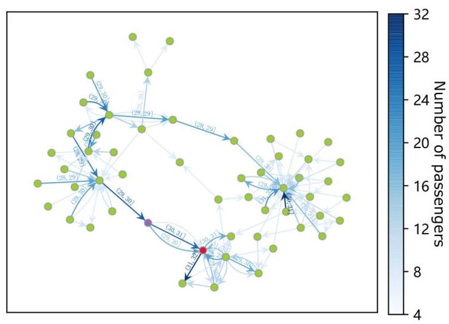

Fig. 1. An instance of dynamical bikesharing passenger flow network (subgraph) in Nanjing. The checking window $T$ starts from 2019 to 03-04 07:00:00 to 2019-03-04 08:00:00. Dynamical edges with any of their timestamps lying within $T$ are presented.

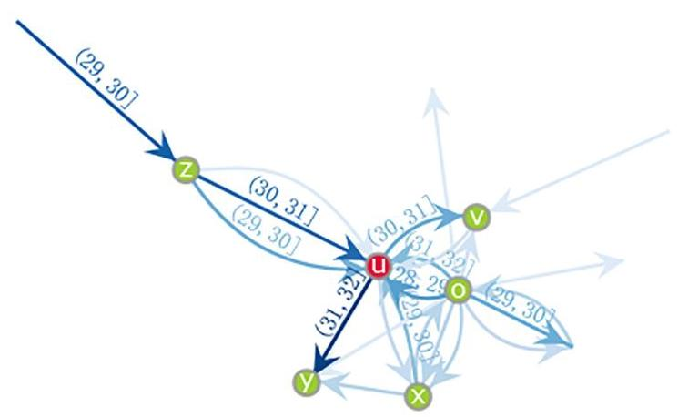

Fig. 2. An instance of a bikesharing-flow egonet of the target node $u$ within the checking window $T$ .

### 2.1. Dynamical recursive feature extraction

Node embedding is a crucial process for graph-based data mining. It involves encoding nodes in a given network to a feature space or mapping them to a feature matrix. Here, we propose a novel node embedding algorithm that recursively combines dynamical edges across the network via edges and produces regional flow features that capture topological information and flow dynamics, as shown in Algorithm. 1. Starting from a feature initialization, the previous method, ReFex, aggregates each node's neighboring attributes simultaneously in iterations to transmit information to the target node from its neighbors, neighbors' neighbors, and so on. However, the original ReFeX algorithm only applies to static networks. In reality, many networks, such as passenger flow networks, evolve over time with the changing number and weight of edges and nodes. Although the temporal information in graphs has received increasing attention from the research community, most existing studies can only partially capture it by approximating the dynamical network using a sequence of static network snapshots (Rossi et al., 2012, 2013; Saha et al., 2018). A few recent studies have developed temporal random walk-based approaches to address the problem of node embedding in dynamical networks, typically a communication network consisting of a sequence of edges with single unique timestamps (Béres et al., 2019; Lee et al., 2020). However, such methods are still not feasible for dynamical public transport flow networks, since a passenger flow generally has a start time and end time. Our proposed DyReFex echoes the mechanism of ReFeX but with an additional constraint that requires each aggregation to respect the arrival and departure time of passenger flows.

The initial features that seed the DyReFeX process include local and egonet features (together called neighborhood features), as shown in Eq. (1). Local features $\left( {{W}_{in}\left( u\right) }\right.$ and $\left. {{W}_{out}\left( u\right) }\right)$ are basically node degree measures, but in the directed and weighted version. Egonet features are computed for each node based on the node's egonet, including the total volume of within-egonet flows $\left( {{W}_{\text{in }}^{\text{ego }}\left( u\right) }\right)$ and the volume of flows entering and leaving the egonet $\left( {{W}_{\text{out }}^{\text{ego }}\left( u\right) }\right.$ . The set of initial features can be extended to seed the DyReFex for multi-layer networks (e.g., a multimode public transport network) to capture the heterogeneity of edges/ flows.

$$
{F}_{u}^{0} = \left\{  {{W}_{\text{in }}\left( u\right) ,{W}_{\text{out }}\left( u\right) ,{W}_{\text{in }}^{ego}\left( u\right) ,{W}_{\text{out }}^{ego}\left( u\right) }\right\}   \tag{1}
$$

where ${F}_{u}^{{t}_{0}}$ means the initial flow feature vector of node $u.{W}_{in}\left( u\right)$ and ${W}_{\text{out }}\left( u\right)$ are the weighted in/out degrees of node $u$ , which represent passenger flow arriving at/ alighting from node $u$ , respectively.

We utilize simple functions, summation and average (presented in Eq. (2) to Eq. (5)), as the aggregation methods. However, the DyFeReX is not restricted to these two functions.

$$
{\operatorname{sum}}_{in}\left( u\right)  = \mathop{\sum }\limits_{{v \in  {N}_{u}^{in}}}w\left( {e}_{v, u}^{{t}_{s},{t}_{e}}\right) {F}_{v}^{{t}_{s}} \tag{2}
$$

$$
{sum}_{out}\left( u\right)  = \mathop{\sum }\limits_{{v \in  {N}_{u}^{out}}}w\left( {e}_{u, v}^{{t}_{s},{t}_{e}}\right) {F}_{v}^{{t}_{s}} \tag{3}
$$

$$
{\operatorname{avg}}_{\text{in }}\left( u\right)  = \frac{1}{\left| {N}_{u}^{\text{in }}\right| }{\operatorname{sum}}_{\text{in }}\left( u\right)  \tag{4}
$$

$$
{\operatorname{avg}}_{\text{out }}\left( u\right)  = \frac{1}{\left| {N}_{u}^{\text{out }}\right| }{\operatorname{sum}}_{\text{out }}\left( u\right)  \tag{5}
$$

where ${e}_{u, v}^{{t}_{s},{t}_{e}}$ denotes the dynamical edge from $u$ at ${t}_{s}$ to $v$ at ${t}_{e}$ and node $v$ is called a in-neighbor of $u$ ; the node $v$ of an edge ${e}_{v, u}^{{t}_{s},{t}_{e}}$ is called a out-neighbor of node $u;w\left( \cdot \right)$ measure the weight/volume of the dynamical edge; ${F}_{v}^{{t}_{s}}$ is the feature set of $v$ at ${t}_{s};{N}_{u}^{\text{in }}$ and ${N}_{u}^{\text{out }}$ represent the in-neighbor and out-neighbor sets of node $u$ .

Algorithm 1. DyReFeX

---

Input: The dynamical network $G$ and the checking window $T$ .

Output: The regional feature matrix $\mathbf{F} = {F}_{\text{nodes }}$ of all nodes within $T$

	procedure $\operatorname{MainProcess}\left( {G, T}\right)$

		$t \leftarrow$ the first interval in $T$

			${F}^{t} \leftarrow$ computer initial features for all nodes

			for $t$ in $T$ do

				for all nodes $u$ in $G$ do

						${N}_{u}^{in} \leftarrow$ GETINNEIGHBORS(G, u)at $t$

						${N}_{u}^{\text{out }} \leftarrow$ GETOUTNEIGHBORS(G, u)at $t$

						${F}_{u}^{t + 1} \leftarrow  \left\{  {{su}{m}_{in}\left( u\right) ,{su}{m}_{out}\left( u\right) ,{av}{g}_{in}\left( u\right) ,{av}{g}_{out}\left( u\right) }\right\}$ for ${t}_{s} =  = t$

				end for

				${F}^{t + 1} \leftarrow  {F}_{u}^{t + 1}$ for $u \in  G$

				$t = t + 1$

			end for

	end procedure

---

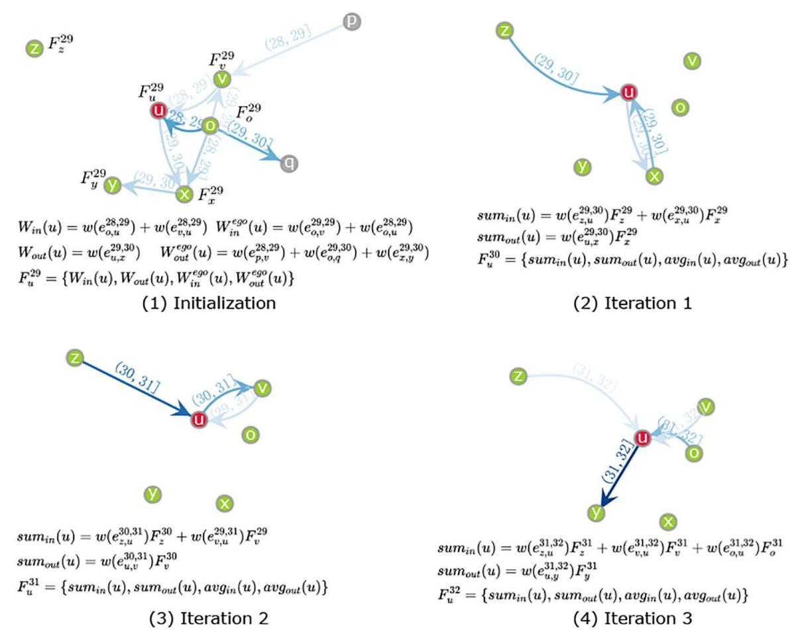

Fig. 3. The feature extraction process for node $u$ . The final output feature matrix for node $u$ within the checking window $T$ is ${F}_{u} = \left\{  {{F}_{u}^{29},{F}_{u}^{30},{F}_{u}^{31},{F}_{u}^{32}}\right\}$ .

The final output of Algorithm. 1 is a regional feature matrix $\mathbf{F} \in  {\mathbb{R}}^{n \times  f}$ where $n$ is the number of nodes and $f$ is the number of features. To capture the within-day and day-to-day variability of structural roles for nodes, we need to have multiple checking windows in a given day and employ DyReFeX to consecutive daily dynamical graphs. If we set a checking window every half hour for $d$ days, the dimension of $\mathbf{F}$ should be $\mathbf{F} \in  {\mathbb{R}}^{{48dn} \times  f}$ . Fig. 3 presents a concrete example of DyReFex of node $u$ based on the dynamical graph shown in Fig. 1 and Fig. 2. The start and end intervals do not need to be consecutive in the recursive feature extraction process. For example, ${e}_{v, u}^{{29},{31}}$ shown in Iteration 2 in Fig. 3 is valid. To ensure that the dimension of the output vector ${F}_{u}^{31}$ is 64 in Iteration 2, we extend the feature vector ${F}_{v}^{29}$ related to ${e}_{v, u}^{{29},{31}}$ with zeros to increase the dimension of ${F}_{v}^{29}$ from 4 to 16 . The length and number of checking window T, together with the length of iteration step (interval) in the feature extraction procedure, will determine the dynamical scale of the observation. However, there is a trade-off between dynamics granularity and computation cost.

### 2.2. Role extraction

The DyReFeX algorithm can convert graph data into an extensive set of features that capture the topological information of public transport flow networks. This subsection focuses on assigning nodes with similar structural features to the same role. In other words, this subsection is about conducting clustering. A variety of methods can be applied to complete the role assignment task, which can be grouped into two categories: hard and soft role assignment methods. Hard role assignment means that each node can only be allowed in one role/cluster (Nowicki and Snijders, 2001; Batagelj et al., 2004). Typical hard role assignment methods include clustering approaches such as k-means and k-medoids (Berkhin, 2006). Unlike hard role assignment, soft role assignment assigns nodes to multiple groups (Airoldi et al., 2008; Fu et al., 2009). Classical soft role assignment methods comprise Principal Component Analysis (PCA), Singular Value Decomposition (SVD), Spectral Decomposition, Non-negative Matrix Factorization (NMF) and so on (Lee and Seung, 1999).

In this study, we employed NMF to extract roles from the regional feature matrix because NMF is efficient for a large dataset. Its nonnegative decomposed matrix makes it easy to interpret roles. In addition, NMF offers a high level of flexibility. The output delivers a role membership distribution in a continuous manner, and such a soft role assignment could be transformed into a hard one by assigning each node to a specific role with the highest role membership. Given the feature matrix $\mathbf{F} \in  {\mathbb{R}}^{n \times  f}$ , we aim to construct a low-rank approximation $\mathbf{{WH}} \approx  \mathbf{F}$ , where each row of $\mathbf{W} \in  {\mathbb{R}}^{n \times  r}$ denotes a node’s role membership, and each column of $\mathbf{H} \in  {\mathbb{R}}^{r \times  f}$ expresses the contribution of each role to each regional feature.The two non-negative matrices $\mathbf{W}$ and $\mathbf{H}$ minimize the following objective function presented in Eq. (6).

$$
f\left( {\mathbf{W},\mathbf{H}}\right)  = \frac{1}{2}\parallel \mathbf{F} - \mathbf{{WH}}{\parallel }^{2} \tag{6}
$$

where $\parallel  \cdot  {\parallel }^{2}$ represents the divergence function (or objective function) for measuring the distance between $\mathbf{F}$ and the dot product $\mathbf{{WH}}$ . Some classical choices for $\parallel  \cdot  {\parallel }^{2}$ are the Frobenius norm and the Kullback-Leibler (KL) divergence, among others. Due to the non-convexity of the objective function of NMF, the optimal solution is usually approximated by iterative update algorithms such as Multiplicative Update (MU) (Lee and Seung, 1999), and Coordinate Descent (CD) (Wright, 2015). NMF is not tied to any specific objective function and solver setting. The setting choices for the NMF model are flexible according to the application and computational limits. In our case study, we found that NMF using KL-divergence with the MU solver is generally a suitable model setting for exploring public transport flow networks in terms of runtime, accuracy, and simplicity. The NMF is implemented using the Python library scikit.

### 2.3. Automating model selection

Note that the number of roles $r$ in NMF should be predefined. It is impractical to manually select $r$ each time when we want to extract roles from different network data. Therefore, an automatic role number selection mechanism is necessary to ensure the nonparametric and automated nature of our study's entire framework. Over the past decades, many methods have been proposed to determine the appropriate number of roles (or clusters). Among them, Akaike's information criterion (AIC) and Minimum Description Length (MDL) are two reliable approaches (Cook et al., 2007; Grünwald and Grunwald, 2007; Rossi and Ahmed, 2014).

Algorithm. 2 describes the automation of a role number selection mechanism based on MDL with KL-divergence. The model error $\mu$ is decomposed into two components: (1) the role extraction error (NMF in this study) denoted by ${\varepsilon }_{\text{extraction }}$ and (2) the description cost $\eta$ , which is defined as the number of bits required to encode the matrices $\mathbf{W}$ and $\mathbf{F}$ . As the number of roles $r$ increases, the complexity of the model increases, resulting in an increase in the description cost but a decrease in role extraction errors, and vice versa. In the study, the role extraction error represents the discrepancy between the original network and the reconstructed network based on the assigned roles. It quantifies how well the roles capture the structural characteristics and dynamics of the original network. A lower role extraction error indicates a better representation of the network by the assigned roles. Description cost, on the other hand, measures the complexity or compactness of role descriptions. It takes into account the number of roles and the amount of information required to describe each role. A lower description cost indicates more concise and informative role descriptions. Algorithm. 2 aims to find an optimal balance between these two types of errors. The role extraction error ${\varepsilon }_{\text{extraction }}$ is quantified by the KL-divergence measure, as shown in Eq. (7). The description cost $\eta$ is given in Eq. (8) in terms of bits, where $b$ is the average bits required to store a value. Typically, $b = {\log }_{2}M$ , where $M$ is the total number of distinct values in the matrices $\mathbf{W}$ and $\mathbf{H}$ . Fig. 4 illustrates the variation of the role extraction error and the description cost as the number of roles increases.

$$
{\varepsilon }_{\text{extraction }} = \mathop{\sum }\limits_{{ij}}\left( {{\mathbf{F}}_{ij}\log \frac{{\mathbf{F}}_{ij}}{{\left( \mathbf{{WH}}\right) }_{ij}} + {\left( \mathbf{{WH}}\right) }_{ij} - {\mathbf{F}}_{ij}}\right)  \tag{7}
$$

$$
\eta  = {br}\left( {n + f}\right)  \tag{8}
$$

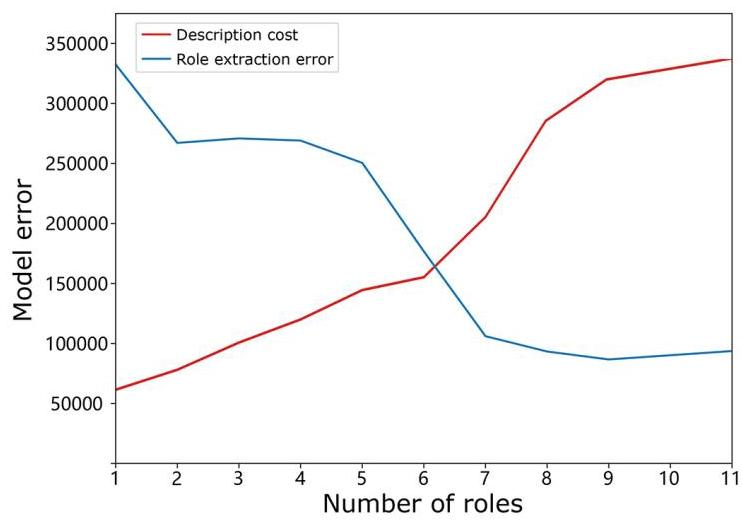

Fig. 4. Model error in bits with an increasing number of roles.

Algorithm 2. Role number selection

---

Input: The recursive feature set $\mathbf{F}$ .

Output: The optimal role number $r$ .

	minerror $\leftarrow  \infty$

	failure $\leftarrow  0$

	trails $\leftarrow  \theta$

	for $r = 1$ to $\min \left( {n, f}\right)$ do

			${\varepsilon }_{\text{extraction }},\eta  \leftarrow  \operatorname{NMF}\left( {\mathbf{F}, r}\right)$ with KL-divergence using MDL criterion

			$\mu  = {\varepsilon }_{\text{extraction }} + \eta$

			if $\mu  <$ minerror then

				minerror $\leftarrow  \mu$

			else

				failure $\leftarrow$ failure +1

			end if

			if failure $\geq$ trails then

				return $\mathbf{W},\mathbf{H} \leftarrow  \operatorname{NMF}\left( {\mathbf{F}, r}\right)$

			end if

	end for

---

In Fig. 4, we plot the variation of the role extraction error and description cost as the number of roles increases. This allows us to analyze the trade-off between the accuracy of the role extraction (lower role extraction error) and the complexity of the role descriptions (lower description cost). By examining this relationship, we can identify the optimal number of roles that balance the accuracy of representation and the simplicity of description within the network.

We also adopt cosine similarity, as presented in Eq. (9), to evaluate the consistency of the role classification. As we discussed earlier, the role membership distribution matrix $\mathbf{W} \in  {\mathbb{R}}^{n \times  r}$ derived from an NMF can be easily transferred to a hard role clustering matrix by assuming that the dominant role is the only one assigned to nodes. Thus, each row of ${\mathbf{W}}^{\prime } \in$ ${\mathbb{R}}^{n \times  r}$ is a vector of all zeros except the position of the dominant role, which is set to one. Then, we compute the node-wise similarity using Eq. (9) based on the feature matrix $\mathbf{F} \in  {\mathbb{R}}^{n \times  f}$ extracted using DyReFeX and calculate the average similarity role-wise, followed by maximum normalization.

$$
{S}_{C}\left( {u, v}\right)  = \frac{\mathbf{F}\left( u\right)  \cdot  \mathbf{F}\left( v\right) }{\parallel \mathbf{F}\left( u\right) \parallel \mathbf{F}\left( v\right) \parallel } \tag{9}
$$

where ${S}_{C}\left( {u, v}\right)$ is the cosine similarity between nodes $u$ and $v;u, v \in  G$ and $u \neq  v;\mathbf{F}\left( u\right)$ stands for the row vector in the matrix $\mathbf{F}$ with respect to node $u$ .

### 2.4. Network measurements for role interpretation

We interpret the roles based on a set of measurements that capture flow dynamics, topological, and spatial information. The role membership matrix we derived above and the node measurement matrices $\mathbf{M} \in$ ${\mathbb{R}}^{n \times  m}$ are used to calculate a non-negative matrix $\mathbf{C} \in  {\mathbb{R}}^{r \times  m}$ (such that $\mathbf{{WC}} \approx  \mathbf{M}$ ), which presents role contributions. The node measurements in $\mathbf{M}$ include the number of flows (node degree), the total volume of passenger flows (weighted degree), the weighted clustering coefficient (Eq. (10)), and weighted betweenness (Eq. (11)).

$$
{C}_{C}\left( u\right)  = \frac{\mathop{\sum }\limits_{{i \neq  j \in  N\left( u\right) }}{w}_{ij}}{\left| {N\left( u\right) }\right| \left( {\left| {N\left( u\right) }\right|  - 1}\right) } \tag{10}
$$

where $i$ and $j$ are two neighbors of node $u$ in the neighborhood $N\left( u\right) .{w}_{ij}$ is the weight of the edge from $i$ to $j$ . See details in Lopez-Fernandez et al. (2004).

$$
{C}_{B}\left( u\right)  = \mathop{\sum }\limits_{{s \neq  u \neq  t}}\frac{{\sigma }_{st}\left( u\right) }{{\sigma }_{st}} \tag{11}
$$

where ${\sigma }_{st}$ is the number of shortest paths in the weighted network from $s$ to $t$ , and ${\sigma }_{st}\left( u\right)$ is the number of shortest paths in the weighted network from $s$ to $t$ that pass through node $u$ . See details in Bader et al. (2007).

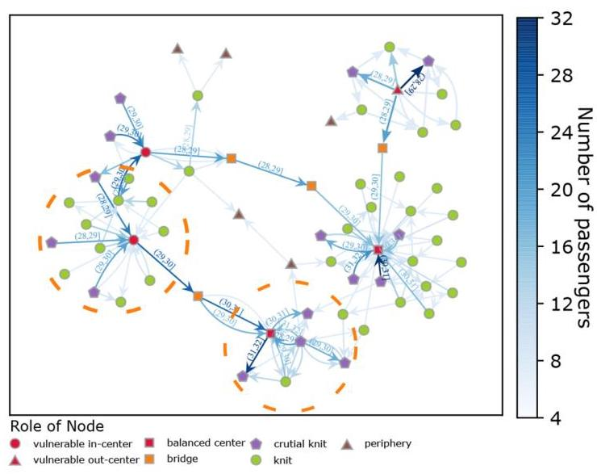

Fig. 5. Role discovery of nodes in the dynamical bikesharing flow network within checking window $T$

High node degree indicates a station's extensive connections with other stations, while a high clustering coefficient suggests the presence of densely connected neighboring stations. These measurements can be indicative of a station that serves as a central hub within a localized cluster of stations. Such a station, due to its high connectivity and clustering, may experience increased demand and become a potential bottleneck. Stations with high betweenness centrality act as critical connectors between different parts of the network, and if they experience increased demand or limited capacity, they can become bottlenecks that disrupt the overall flow of bikes.

## 3. Case study

We utilized one-month SC data from the Nanjing Public Bikesharing system, covering the entire month. The dataset consists of a total of 2,381,642 bikesharing transactions. As of 2020, there are 1515 bike-sharing stations in the Nanjing Public Bikesharing system. Based on the proposed role discovery framework, Fig. 5 presents the results of role identification for the same snapshot (subgraph) of the flow network shown in Fig. 1. As a side note, the concept of roles differs significantly from that of communities. Communities are clusters of nodes with more edges within the group than outside. In contrast, roles are groups of nodes with similar structural features. Community detection is often based on density/cohesion. Nodes of the same role do not necessarily have to be in the same community. A concrete example illustrating the differences between communities and roles is presented in Fig. 5 and Fig. 6. In the community detection process, we first assume that the concerned dynamical graph is "static" and then implement spectral clustering (White and Smyth, 2005) to identify communities/clusters. Although the total number of identified communities in the entire network is 32 , only five clusters are presented in Fig. 6 since the visualized network is only a subgraph of the overall network.

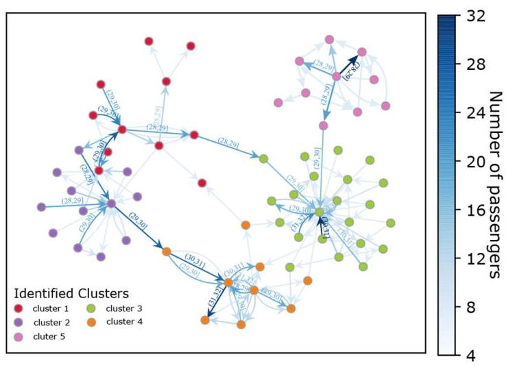

Fig. 6. Community detection on the bikesharing flow network within $T$ snapshot.

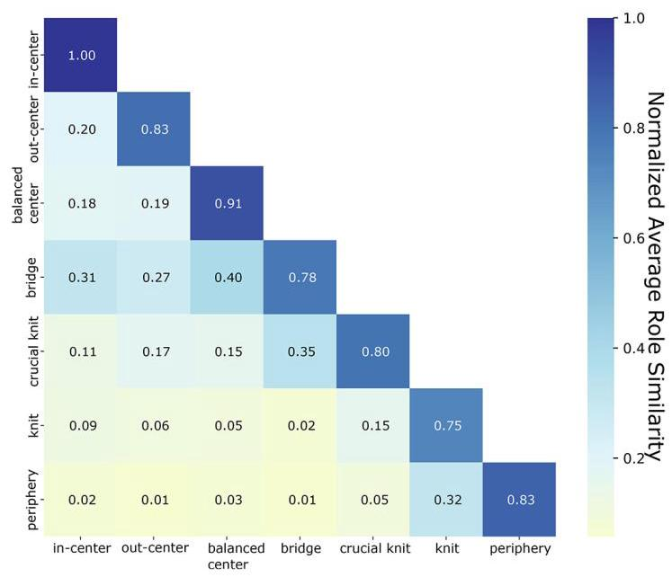

Fig. 7. Normalized average role similarity matrix of the bikesharing flow networks in Nanjing.

Fig. 7 shows the normalized average role similarity matrix calculated using Eq. (9). Squares on the diagonal illustrate intra-group role similarity, whereas the rest of the matrix denotes inter-group similarity. The intra-group role similarity shown in Fig. 7 is based on the cosine similarity of feature vectors of the nodes. Although nodes within the same role share similar structural features, there might still be some variation among them, leading to a similarity value $< 1$ . In general, Fig. 7 illustrates the consistency of role identification, demonstrating the distinguishability of the structural feature matrix $\mathbf{F}$ and the effectiveness of the proposed feature extraction DyReFeX algorithm.

### 3.1. Role interpretation of bikesharing stations

In this subsection, we interpret the roles of bikesharing stations in the context of the bikesharing flow network in Nanjing, based on the methods discussed in Section.2.4. The normalized average role contributions concerning different node measurements and the ridership OD matrix of each role pair are presented in Fig. 8. Fig. 9 and Fig. 10 show the distributions of bikesharing stations with hard-role assignments and ridership flow network. The role definitions are summarized in Table 1. For visualization purposes, flows are bundled based on their spatial correlations and weights using a self-organizing approach from Holten and Van Wijk (2009). Edge bundling could display high-level edge patterns and help us understand the topological and spatial relationships between bikesharing stations of specific roles.

- In-center (IC) role represents stations that have a high clustering coefficient (>0.8), a high betweenness centrality (>0.6), and a high flow volume. Additionally, it has a high ratio of in-flow to out-flow $\left( { > {1.5}}\right)$ . The specific flow volume threshold can be defined as a volume above ${80}\%$ of the average flow volume of all stations in the network. Three major sources of its in-flows are out-centers, crucial knits, and knits, forming its neighborhood in the bikesharing flow network. The high node degree and clustering coefficient, together with its short travel distance and large in-flows to the neighbors, demonstrate its importance in the network. However, outstanding one-way inflows might periodically overload in-centers' station capacity, increasing dispatching costs.

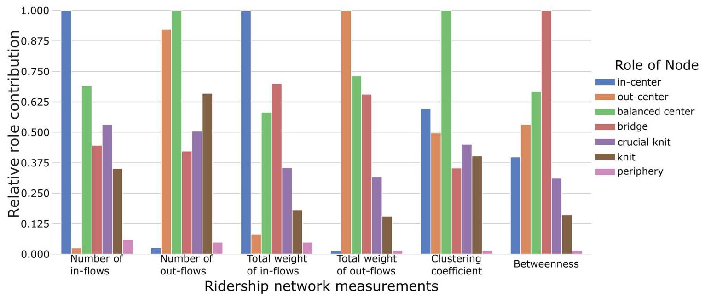

Fig. 8. Station role interpretation in bikesharing ridership networks.

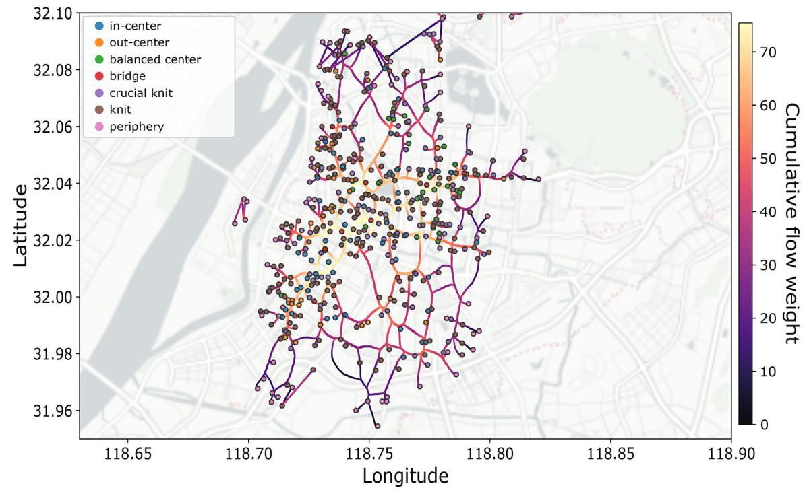

Fig. 9. The distribution of bikesharing stations with hard-role assignment and bundled ridership flow network in Nanjing (8 am to 9 am, March 4th 2019).

- Out-center (OC) role represents stations with a high clustering coefficient (>0.8), a high betweenness centrality (>0.6), and a high flow volume. Furthermore, it has a high ratio of out-flow to in-flow $\left( { > {1.5}}\right)$ . The specific flow volume threshold can be defined as a volume >80% of the average flow volume of all stations in the network. They are the opposite of in-centers. The sources of the in-center become its primary targets. The large out-flows might also affect its operation, leading to the possibility of no bicycles for rent.

- Balanced center (BC) role represents stations that exhibit a high clustering coefficient (>0.8), a high betweenness centrality (>0.6), and a high flow volume. Moreover, it maintains a balanced ratio of in-flow to out-flow, typically ranging between 0.4 and 0.6 . The specific threshold for flow volume can be defined as a volume above 80% of the average flow volume of all stations in the network. The BC center has the highest clustering coefficient among all roles, indicating the strong connectivity of its neighborhood in the ridership network. A strongly linked neighborhood often provides local robustness to its members (Ash and Newth, 2007), ensuring that there is a balance of in-flows and out-flows for BC stations.

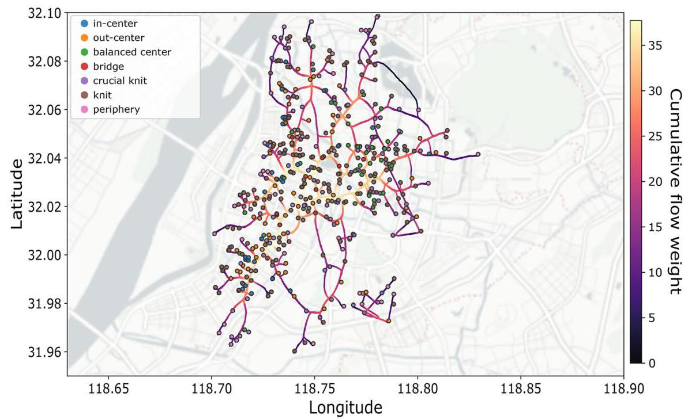

Fig. 10. The distribution of bikesharing stations with hard-role assignment and bundled ridership flow network in Nanjing (March 4th, 2019 from 5 pm to 6 pm).

Table 1

Thresholds and value ranges for role definition and separation.

<table><tr><td>Role</td><td>Thresholds/Value Ranges</td></tr><tr><td/><td>High clustering coefficient $\left( { > {0.8}}\right)$</td></tr><tr><td/><td>High betweenness centrality $\left( { > {0.6}}\right)$</td></tr><tr><td>In-center (IC)</td><td>High ratio of in-flow to out-flow (1.5)</td></tr><tr><td/><td>High flow volume (above 75% of the average flow volume of all stations)</td></tr><tr><td rowspan="4">Out-center (OC)</td><td>High clustering coefficient $\left( { > {0.8}}\right)$</td></tr><tr><td>High betweenness centrality $\left( { > {0.6}}\right)$</td></tr><tr><td>High ratio of out-flow to in-flow (1.5)</td></tr><tr><td>High flow volume (above 75% of the average flow volume of all stations)</td></tr><tr><td rowspan="4">Balanced center (BC)</td><td>High clustering coefficient $\left( { > {0.8}}\right)$</td></tr><tr><td>High betweenness centrality $\left( { > {0.6}}\right)$</td></tr><tr><td>Balanced ratio of in-flow to out-flow (0.4 to 0.6)</td></tr><tr><td>High flow volume (above 65% of the average flow volume of all stations)</td></tr><tr><td/><td>Low clustering coefficient $\left( { < {0.3}}\right)$</td></tr><tr><td/><td>High betweenness centrality $\left( { > {0.6}}\right)$</td></tr><tr><td>Bridge</td><td>High flow volume (above 65% of the average flow volume of all stations)</td></tr><tr><td rowspan="3">Crucial knit</td><td>High clustering coefficient $\left( { > {0.5}}\right)$</td></tr><tr><td>High betweenness centrality $\left( { > {0.4}}\right)$</td></tr><tr><td>High flow volume (between 50 and 65% of the average flow volume of all stations)</td></tr><tr><td/><td>Medium clustering coefficient (0.3 to 0.5)</td></tr><tr><td>Knit</td><td>Medium betweenness centrality (0.2 to 0.4)</td></tr><tr><td/><td>Medium flow volume (between 25 and 50% of the average flow volume of all stations)</td></tr><tr><td rowspan="4">Periphery</td><td>Low clustering coefficient $\left( { < {0.3}}\right)$</td></tr><tr><td>Low betweenness centrality $\left( { < {0.2}}\right)$</td></tr><tr><td>Low flow volume (below 25% of the average flow volume of all</td></tr><tr><td>stations)</td></tr></table>

- Bridge stations, as the name implies, connect groups of stations. We found that bridges typically have a low node degree but great betweenness. In other words, bridges do not have many interactions (number of flows) with other bikesharing stations. However, they function as critical nodes connecting different parts of the network with an approximately balanced flow. Specifically, the bridge role represents stations that connect different parts of the network. It has a low clustering coefficient (<0.3), a high betweenness centrality $\left( { > {0.6}}\right)$ , and a high flow volume (above ${65}\%$ of the average flow volume of all stations). In the case study, we identified bridge stations based on the observed patterns of bike pickup and drop-off locations. We tracked the movement of riders and noticed instances where they dropped off bikes at a particular station and then picked up bikes from the same station or vice versa. These bridge stations serve as intermediate points connecting different clusters or areas within the network. Observing the pickup and drop-off patterns and tracking individual riders, we were able to identify stations that act as bridges between different parts of the network. These stations play a crucial role in facilitating bikesharing flows between distinct clusters or areas.

- Crucial knit and knit. As shown in Fig. 9 and Fig. 10, most bike-sharing stations play a role of either crucial knit or knit in the flow network, close to the centers from topological and spatial perspectives. The Crucial knit role is characterized by a high clustering coefficient $\left( { > {0.5}}\right)$ , a high betweenness centrality $\left( { > {0.4}}\right)$ , and a considerably high flow volume ranging from 50 to 65% of the average flow volume of all stations. The Knit role typically exhibits a medium clustering coefficient (0.3 to 0.5), a medium betweenness centrality (0.2 to 0.4), and a medium flow volume ranging from 25 to 50% of the average flow volume of all stations.

- Periphery nodes are bikesharing stations with fewer bike flows (sometimes even zero) compared to stations of other roles. As shown in Fig. 9 and Fig. 10, periphery stations are likely to be located on the margins of the city center, often tied with knits. Specifically, the Periphery role represents stations with a low flow volume that is below 25% of the average flow volume of all stations, a low clustering coefficient $\left( { < {0.3}}\right)$ , and a low betweenness centrality $\left( { < {0.2}}\right)$ .

### 3.2. Analysis methods for exploring the spatiotemporal impact of land use on role memberships

With the rise of Location Based Service (LBS) technology, empirical studies have adopted location data, such as point of interest (POI), to identify physical environmental factors affecting transport ridership (Cui et al., 2014; Cheng et al., 2022b; Kim and Jang, 2022). The extracted roles are abstractions that describe the interplay among bikesharing stations in the passenger ridership network. By incorporating LBS data, we investigate how various land-use factors contribute to the formation of versatile roles, helping us better understand the generation and shifts in patronage at a fine spatial-temporal granularity. To be more specific, we apply multivariate regression to model roles as a function of the geospatial factors of bikesharing stations. The POI data used were collected from Baidu, one of the largest map service providers in China. Fig. 11 shows the distribution of bike-sharing stations and the POI heatmap. As presented in Table 2, POI data were categorized into nine types using a standard classification system based on the type of service or activity associated with each POI. This categorization was informed by existing urban planning taxonomies and adapted to the context of Nanjing. Duplicates in the dataset were resolved by identifying entries with matching geocodes and names, consolidating them into a single record. The geocoding process was performed using a high-precision geospatial mapping tool to ensure accurate location data. These preprocessing steps were critical to ensuring the quality and reliability of the POI data, which underpin the spatial analysis presented in our findings. Before delving into the geospatial analysis, we compute the spatial popularity (SP) of POIs within the proximity of each bikesharing station. Bikesharing stations closer to riders' origins and destinations are more likely to be visited, showing a distance-decay effect. A Gaussian function is proposed to calibrate the distance-decay effect when calculating the SP of POIs (Dai, 2011; Chen et al., 2021), as shown in Eq. (12).

$$
S{P}_{ij}\left( {{d}_{ij},{d}_{0}}\right)  = \left\{  \begin{array}{ll} \frac{{e}^{-\left( {1/2}\right)  \times  {\left( {d}_{ij}/{d}_{0}\right) }^{2}} - {e}^{-\left( {1/2}\right) }}{1 - {e}^{-\left( {1/2}\right) }}, & {d}_{ij} \leq  {d}_{0} \\  0, & {d}_{ij} > {d}_{0} \end{array}\right.  \tag{12}
$$

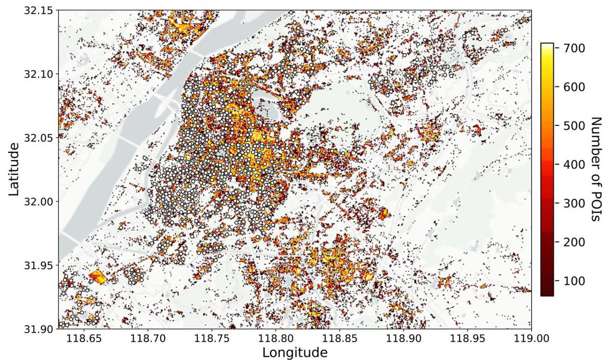

Fig. 11. Spatial distribution of bikesharing stations and heatmap of POIs.

Table 2

POI classification.

<table><tr><td>POI category</td><td>Building and facility type</td></tr><tr><td>Company</td><td>Enterprises, company, farming, forestry, animal husbandry and fishery base</td></tr><tr><td>Daily life service</td><td>Travel agency, information center, ticket office, post office, logistics service, telecom office, professional service firm, electric supply service office, beauty, and hairdressing store, etc.</td></tr><tr><td>Education</td><td>School, university, museum, exhibition hall, convention & exhibition center, art gallery, library, planetarium, cultural palace, etc.</td></tr><tr><td>Food</td><td>Food restaurant, coffee house, tea house, ice cream shop, bakery, dessert house</td></tr><tr><td>Medical</td><td>Hospital, clinic, emergency center, disease prevention institution, pharmacy, veterinary hospital</td></tr><tr><td>Residential</td><td>Building, residential area</td></tr><tr><td>Shopping</td><td>Shopping related places, shopping plaza, convenience store, supermarket, plants & pet market, comprehensive market, sports store, etc.</td></tr><tr><td>Leisure</td><td>Sports stadium, golf related, recreation center, holiday & nursing resort, recreation place, theater & cinema, tourist attraction</td></tr><tr><td>Transit</td><td>subway station, bus station, railway station, excluding bikesharing station</td></tr></table>

where $S{P}_{ij}$ is the spatial popularity of POI $i$ to bikesharing station $j,{d}_{ij}$ is the distance from $i$ to $j$ , and ${d}_{0}$ is the maximum walking distance of bikesharing riders. The value of Eq. (12) ranges from 0 to 1 . The $S{P}_{ij}$ of a bikesharing station $j$ to itself $\left( {i = j}\right)$ is equal to one since the distance ${d}_{ij}$ is zero. POIs outside the maximum walking distance ${d}_{0}$ would have a $S{P}_{ij}$ of zero. The top panel of Fig. 12 presents the cumulative percentage of bikesharing stations containing at least one POI with increasing distance. Fig. 12 suggests setting the maximum walking distance to ${100}\mathrm{\;m}$ , which covers most bikesharing stations in the network.

Given Eq. (12), the spatial popularity of POI type $k\left( {k \in  K}\right)$ for a bikesharing station $j$ can be:

$$
S{P}_{j}^{k} = \mathop{\sum }\limits_{{i \in  I}}S{P}_{ij}^{k} \tag{13}
$$

where ${I}_{k}$ is the set of type- $k$ POIs within the walking radius ${d}_{0}\left( {{d}_{ij} \leq  {d}_{0}}\right.$ , $\left. {i \in  {I}_{k}}\right)$ .

Then, we conducted multivariate regression with seven role memberships from $\mathbf{W}$ as dependent variables and nine types of spatial popularity as independent variables. The model regresses each dependent variable separately on the independent variables in the morning ( 6 am to $9\mathrm{\;{am}}$ ) and evening ( $4\mathrm{\;{pm}}$ to $6\mathrm{\;{pm}}$ ) peak periods. Table 3 summarizes the regression results where each column denotes a separate linear regression model. Several independent variables, such as "Daily life service", "Food", and "Finance", are excluded from the regression models based on a multicollinearity analysis. In Table 3, grey-filled cells present statistics from the regression on data in the evening. The numbers above the double line in the table are coefficients of independent variables in each regression model. The magnitude comparison of coefficients across different independent variables in one specific regression model (in one column) would not make much sense since the sample size (number of POIs) of different POI types varies. Fig. 13 to Fig. 15 present the distribution of bikesharing stations with hard-role assignments and heat maps of POIs gridded from Fig. 11. We only visualize geospatial distributions (in the evening period) of the three most crucial POIs identified for simplicity.

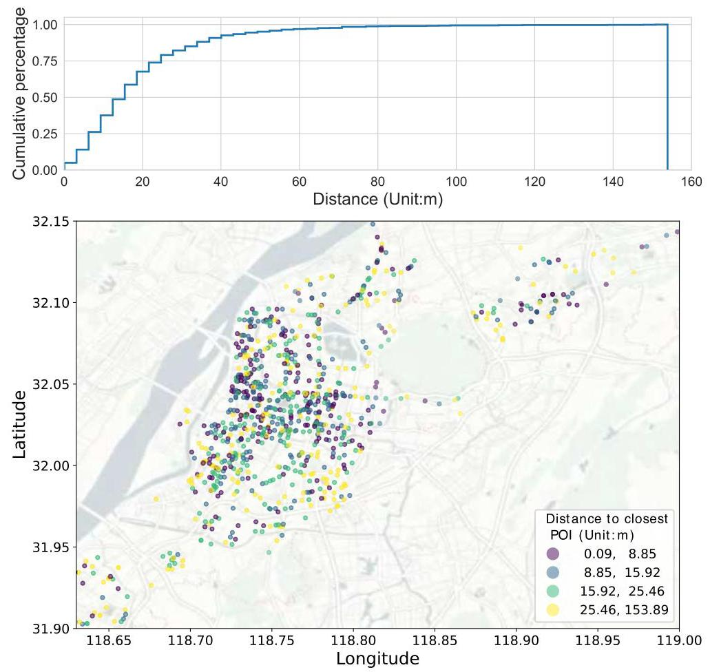

Fig. 12. The cumulative percentage of bikesharing stations containing at least one POI and the classification of bikesharing stations based on the distance to the closest POI.

Table 3

Regression summary.

<table><tr><td/><td>period</td><td>in-center</td><td>out-center</td><td>Balanced center</td><td>bridge</td><td>knit</td><td>crucial knit</td><td>periphery</td></tr><tr><td rowspan="2">Company</td><td>morning</td><td>162.068</td><td>-224.643</td><td>122.788</td><td>61.824</td><td>-</td><td>225.257</td><td>-256.77</td></tr><tr><td>evening</td><td>-61.115</td><td>30.685</td><td>23.903</td><td>24.410</td><td>-</td><td>20.041</td><td>-</td></tr><tr><td rowspan="2">Education</td><td>morning</td><td>357.033</td><td>-</td><td>-</td><td>-</td><td>-</td><td>229.821</td><td>-420.124</td></tr><tr><td>evening</td><td>-56.884</td><td>-</td><td>-</td><td>-</td><td>-</td><td>41.851</td><td>-</td></tr><tr><td rowspan="2">Residential</td><td>morning</td><td>-1185.279</td><td>1063.602</td><td>415.320</td><td>-615.060</td><td>676.079</td><td>1030.827</td><td>-</td></tr><tr><td>evening</td><td>236.836</td><td>-279.157</td><td>161.736</td><td>-303.556</td><td>-</td><td>144.557</td><td>-127.825</td></tr><tr><td rowspan="2">Shopping</td><td>morning</td><td>-</td><td>-</td><td>-</td><td>-</td><td>-</td><td>-</td><td>-</td></tr><tr><td>evening</td><td>-</td><td>-</td><td>-</td><td>-</td><td>2.504</td><td>0.707</td><td>-1.891</td></tr><tr><td rowspan="2">Leisure</td><td>morning</td><td>-</td><td>-</td><td>-</td><td>-</td><td>-</td><td>-</td><td>-</td></tr><tr><td>evening</td><td>-</td><td>-</td><td>-</td><td>-</td><td>22.009</td><td>45.102</td><td>-</td></tr><tr><td rowspan="2">Transit</td><td>morning</td><td>286.098</td><td>60.347</td><td>-</td><td>211.460</td><td>-</td><td>-</td><td>-160.476</td></tr><tr><td>evening</td><td>-</td><td>26.835</td><td>-</td><td>48.707</td><td>-</td><td>-</td><td>-</td></tr><tr><td rowspan="2">Adjusted R2</td><td>morning</td><td>0.324</td><td>0.210</td><td>0.356</td><td>0.291</td><td>0.290</td><td>0.259</td><td>0.155</td></tr><tr><td>evening</td><td>0.312</td><td>0.281</td><td>0.317</td><td>0.299</td><td>0.383</td><td>0.204</td><td>0.176</td></tr><tr><td rowspan="2">F statistics (model)</td><td>morning</td><td>36.802</td><td>20.856</td><td>42.294</td><td>31.659</td><td>31.511</td><td>27.109</td><td>14.702</td></tr><tr><td>evening</td><td>35.011</td><td>30.311</td><td>35.809</td><td>32.990</td><td>47.555</td><td>20.221</td><td>17.019</td></tr><tr><td rowspan="2">p-value (model)</td><td>morning</td><td>0.000</td><td>0.000</td><td>0.000</td><td>0.000</td><td>0.000</td><td>0.000</td><td>0.000</td></tr><tr><td>evening</td><td>0.000</td><td>0.000</td><td>0.000</td><td>0.000</td><td>0.000</td><td>0.000</td><td>0.000</td></tr></table>

* This table only shows the coefficients of the independent variables with a $p$ -value $< {0.05}$ (t-test).

### 3.3. Regression analysis on the impact of land use on role memberships

Among all the independent variables, Company and Residential POIs appear to have the most influential impact, as they exhibit statistically significant effects on almost all roles. These findings not only contribute to our understanding of the relationship between land use and role memberships but also provide insights into potential bottlenecks within the bikesharing system.

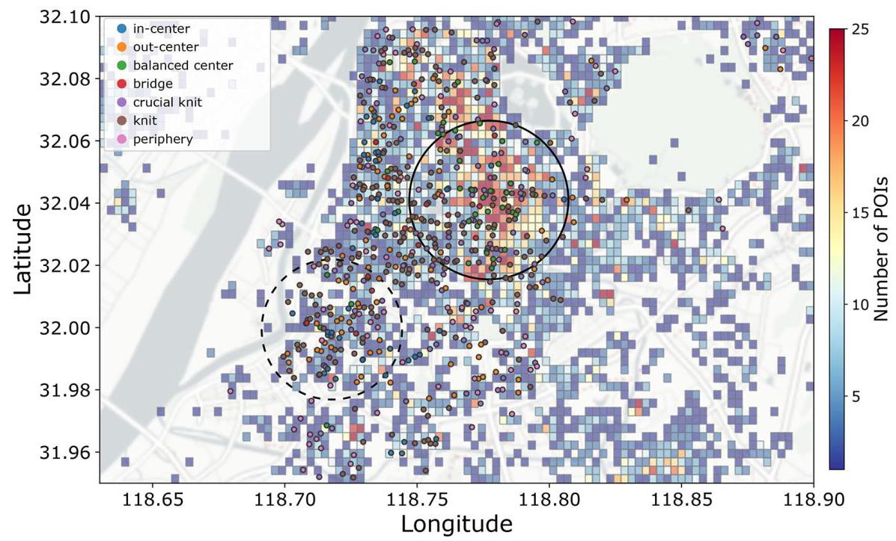

Fig. 13. The geospatial distribution of bikesharing stations with hard-role assignment in the evening and the gridded heat map of Residential POIs.

The observed pattern in which company POIs exert opposite effects on the IC and OC roles, as well as the reversed pattern exhibited by Residential POIs, reveals important information about commuter behavior and potential bottlenecks in the system. The positive and negative impacts of Company POIs on IC and OC roles during different times of the day indicate the role these POIs play in attracting riders in the morning and evening, respectively. These findings suggest that areas with a high concentration of Company POIs may experience high passenger flows toward IC stations during the morning peak hours, potentially leading to overcrowding and service capacity challenges. In contrast, during the evening peak hours, the flow direction reverses, with high passenger flows from the OC stations as commuters return to their residential areas. Understanding these patterns helps identify potential bottlenecks and informs targeted interventions to mitigate congestion and optimize service delivery.

The regression analysis revealed interesting findings regarding the sign flips observed between the morning and afternoon periods. In the morning, positive coefficients were observed, indicating a significant relationship between certain factors and bikesharing flows. These positive coefficients can be rationalized by the predominant travel patterns during this period, where individuals typically commute from residential areas to workplaces or educational institutions. As such, the positive coefficients reflect the influence of factors such as proximity to employment centers, population density, and accessibility on the morning bikesharing flows.

However, during the afternoon, we observed sign flips in the coefficients, with negative values indicating a significant relationship between factors and bikesharing flows. This sign reversal can be attributed to changing travel patterns during the afternoon period. In the afternoon, individuals return from workplaces or educational institutions to their residential areas, resulting in a reversal of the predominant flow direction. Consequently, factors that were positively associated with morning flows, such as proximity to employment centers, may now exhibit a negative relationship with afternoon flows. The reversal in the flow direction and the corresponding changes in the coefficients highlight the dynamic nature of travel patterns and commuter behavior throughout the day. Overall, the sign flips observed in our regression analysis highlight the importance of considering temporal variations in travel patterns and the reversal of the flow direction between morning and afternoon. By acknowledging these dynamics, we can gain a more comprehensive understanding of the factors influencing bikesharing flows and inform targeted interventions and improvements in bike-sharing system management.

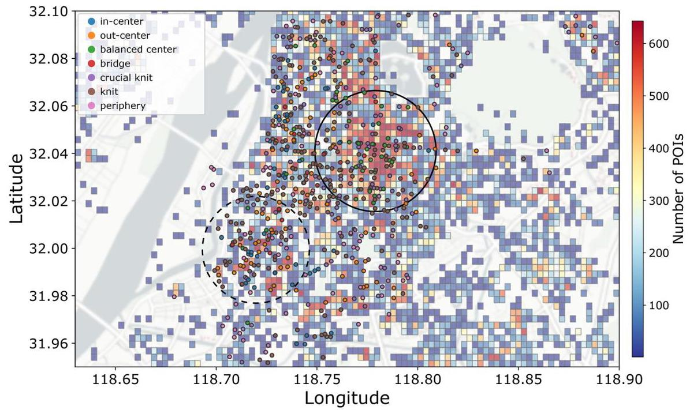

Fig. 14. The geospatial distribution of bikesharing stations with hard-role assignment in the evening and the gridded heat map of Company POIs.

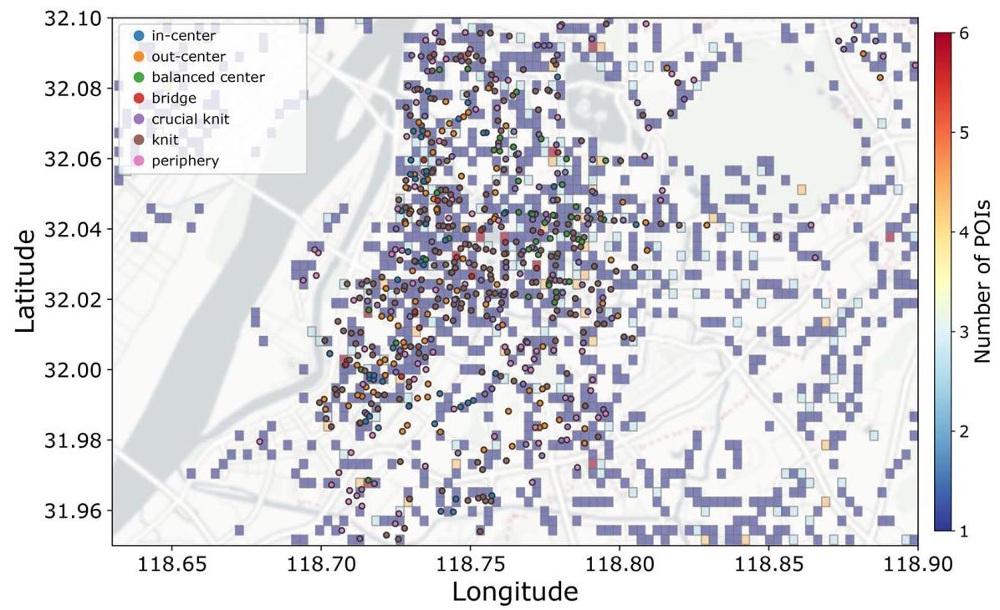

Fig. 15. The geospatial distribution of bikesharing stations with hard-role assignment in the evening and the gridded heat map of Transit POIs.

### 3.4. Visualization of bikesharing station roles and land use patterns

A more interesting finding is that both Company and Residential POIs show a positive impact on the balanced center (BC) role. Fig. 13 and Fig. 14 provide a perspective to interpret this finding, which seems contradictory to the results of the above analysis. In the dashed circle of both figures, the SP of Company is considerably higher than that of Residental, resulting in a large number of OC stations and a few IC stations in this area. On the contrary, the area marked by the solid circle exhibits significant SP of both Company and Residential, promoting greater membership of BC roles compared to IC and OC. This observation provides evidence supporting the idea of urban land use planning toward a job-housing balance. Separation of home and work often increases traffic congestion and long-distance travel. For bikesharing, the job-housing separation could lead to service interruption (e.g., situations of dock overload and bike deficit in IC and OC stations).

The SP of transit is another crucial land-use factor that affects the distribution of role memberships. Table 3 shows that Transit has a positive impact on Bridge and BC roles, with a stronger influence than on IC and OC roles. As presented in Fig. 15, "Bridge" stations (and some BC stations) are more likely to be located in areas where the SP of transportation POIs is relatively substantial. Transit POIs in these regions are hubs that integrate multiple modes, making it easier for bikesharing stations to attract transfer passengers while restraining flow imbalance. Table 3 shows that other independent variables, such as "Education", "Shopping", and "Leisure", only demonstrate statistical significance on limited roles that are often members of groups (e.g., "crucial knit" and "knit"). Moreover, the coefficients of "Shopping" and "Leisure" reach the significance level only during the rush hour in the evening, which is an expected result, as most activities related to these POIs are likely to occur in the evening (Lei et al., 2020; Cheng et al., 2022a).

To sum up, "Company", "Residential", "Transit" are the most crucial land-use factors that influence the memberships of roles with high parking/riding demands, such as IC, OC, BC, and "Bridge". Additionally, mixed land use is critical to promoting desired roles like BC and "Bridge" for bikesharing stations. Our analysis results could provide general guidance for bikesharing system planning or expansion, such as expanding the current bikesharing system in Nanjing to the region with a high POI density in the right corner of Fig. 11. Areas with a high density of the three key POIs, especially those with a job-housing balance or transfer modes, would be promising candidates to expand the bike-sharing system.

## 4. Conclusions

In this study, we proposed an efficient framework for automatically extracting the roles of each node that is involved in the passenger flow network. Our novel approach DyReFeX traces flow dynamics and interplay among stations to encode structural information in graphs into a feature matrix. We interpret each role with network-perspective measurements that capture topological features. Network hubs and potential service bottlenecks are identified, which are crucial for operators to maintain or improve the service reliability and efficiency of bikesharing systems. This helps us answer the question of which station the agencies should pay more attention to by inferring the importance of stations.

The unique contribution of this study lies in the distinction between role discovery and graph clustering. By recursively extracting topological features from passenger flow networks and implementing dimensionality reduction techniques, we identified and characterized various roles that capture the distinct behaviors and characteristics of stations within the bikesharing system. In our research, we not only identify potential service bottlenecks based on high passenger volume, but also gain a deeper understanding of these bottlenecks by characterizing them according to the roles or types identified through network metrics. This approach allows us to go beyond simply analyzing flow volume and provides insights into the specific characteristics of different roles and discerning which are most likely to become service bottlenecks. For example, while the OC and IC roles may experience a high passenger flow volume during morning and evening peak hours and become bottlenecks due to commuting patterns, the BC roles, even with high flow volume, may not be bottlenecks, as they exhibit balanced in-out flows. This information can guide them in making informed decisions to improve service efficiency. Additionally, urban planners and policy-makers can use the insights from our analysis to inform land-use planning and transportation infrastructure development, with the aim of creating a more efficient and reliable public transport system.

The future research directions of the study are as follows. To construct the dynamical passenger flow network, we grouped trips into flows that start and end in periods / intervals of a user-defined length. Decreasing the length of the intervals leads to a more comprehensive picture of network dynamics. However, a trade-off has to be made between observation granularity and computation cost. We lack methods that can cope with the challenges posed by temporal graphs built from travel transactions. Another limitation is that we applied our methods only to a single-mode passenger flow network. Role identification for a multi-mode graph, such as a bikesharing-bus-metro network, is challenging in modeling and interpretation. However, exploring the time-varying interconnectivity and heterogeneity among various networks is extremely important. While our study demonstrates the value of dynamic network analysis in understanding the intricacies of public transport systems, it is important to acknowledge the limitations of the proposed approach compared to static analysis. Static network analysis, while less nuanced in capturing temporal variations, provides a simplified and computationally less intensive snapshot of network states. This can be particularly useful for long-term strategic planning and network design. On the other hand, dynamic network analysis, as presented in our study, provides a granular view of network behavior over time, which is essential for operational decision-making and real-time system management. Future research could focus on directly comparing the insights and outcomes derived from static and dynamic network analysis to better understand the trade-offs and complemen-tarities of these two approaches. Such comparative studies would be valuable to guide the selection of analytical methods suitable for various aspects of transport system planning and management. Another avenue for future research is the incorporation of temporal detrending techniques to capture spatial associations between units in traffic data. Related studies have shown the effectiveness of temporal detrending in observing spatial correlations in traffic (Ermagun et al., 2017).

## CRediT authorship contribution statement

Da Lei: Writing - original draft, Conceptualization. Long Cheng: Methodology. Pengfei Wang: Writing - review & editing. Xuewu Chen: Supervision. Lin Zhang: Writing - review & editing.

## Data availability

The authors do not have permission to share data.

## Acknowledgement

This research is supported by the National Natural Science Foundation of China (No. 52372301 and No. 52172316) and the Key Laboratory of Transport Industry of Comprehensive Transportation Theory (Nanjing Modern Multimodal Transportation Laboratory) (No. MTF2023006). References

Airoldi, E.M., Blei, D.M., Fienberg, S.E., Xing, E.P., 2008. Mixed membership stochastic blockmodels. J. Mach. Learn. Res. 9, 1981-2014.

Ash, J., Newth, D., 2007. Optimizing complex networks for resilience against cascading failure. Physica A 380, 673-683.

Bader, D.A., Kintali, S., Madduri, K., Mihail, M., 2007. Approximating betweenness centrality. In: International Workshop on Algorithms and Models for the Web-Graph. Springer, pp. 124-137.

Batagelj, V., Mrvar, A., Ferligoj, A., Doreian, P., 2004. Generalized blockmodeling with Pajek. Metodoloski Zvezki, 1, p. 455.

Béres, F., Kelen, D.M., Pálovics, R., Benczúr, A.A., 2019. Node embeddings in dynamic graphs. Appl. Netw. Sci. 4, 1-25.

Berkhin, P., 2006. A survey of clustering data mining techniques. In: Grouping Multidimensional Data. Springer, pp. 25-71.

Builes-Jaramillo, A., Lotero, L., 2022. Spatial-temporal network analysis of the public bicycle sharing system in Medelln, Colombia. J. Transp. Geogr. 105, 103460.

Cantelmo, G., Kucharski, R., Antoniou, C., 2020. Low-dimensional model for bike-sharing demand forecasting that explicitly accounts for weather data. Transp. Res. Rec. 2674, 132-144.

Cats, O., 2017. Topological evolution of a metropolitan rail transport network: the case of Stockholm. J. Transp. Geogr. 62, 172-183.

Chen, W., Cheng, L., Chen, X., Chen, J., Cao, M., 2021. Measuring accessibility to health care services for older bus passengers: a finer spatial resolution. J. Transp. Geogr. 93, 103068.

Chen, W., Chen, X., Cheng, L., Liu, X., Chen, J., 2022a. Delineating borders of urban activity zones with free-floating bike sharing spatial interaction network. J. Transp. Geogr. 104, 103442.

Chen, W., Liu, X., Chen, X., Cheng, L., Wang, K., Chen, J., 2022b. b. Exploring year-to-year changes in station-based bike sharing commuter behaviors with smart card data. Travel Behav. Soc. 28, 75-89.

Cheng, L., Yang, J., Chen, X., Cao, M., Zhou, H., Sun, Y., 2020a. How could the station-based bike sharing system and the free-floating bike sharing system be coordinated? J. Transp. Geogr. 89, 102896.

Cheng, L., Yang, M., De Vos, J., Witlox, F., 2020b. Examining geographical accessibility to multi-tier hospital care services for the elderly: a focus on spatial equity. J. Transp. Health 19, 100926.

Cheng, L., Jin, T., Wang, K., Lee, Y., Witlox, F., 2022a. Promoting the integrated use of bikeshare and metro: a focus on the nonlinearity of built environment effects. Multim. Transp. 1, 100004.

Cheng, L., Wang, K., De Vos, J., Huang, J., Witlox, F., 2022b. b. Exploring non-linear built environment effects on the integration of free-floating bike-share and urban rail transport: a quantile regression approach. Transp. Res. A Policy Pract. 162, 175-187.

Cheng, L., Huang, J., Jin, T., Chen, W., Li, A., Witlox, F., 2023. Comparison of station-based and free-floating bikeshare systems as feeder modes to the metro. J. Transp. Geogr. 107, 103545.

Cook, D.J., Holder, L.B., Youngblood, G.M., 2007. Graph-based analysis of human transfer learning using a game testbed. IEEE Trans. Knowl. Data Eng. 19, 1465-1478.

Cui, Y., Mishra, S., Welch, T.F., 2014. Land use effects on bicycle ridership: a framework for state planning agencies. J. Transp. Geogr. 41, 220-228.

Dai, D., 2011. Racial/ethnic and socioeconomic disparities in urban green space accessibility: where to intervene? Landsc. Urban Plan. 102, 234-244.

De Bona, A., Fonseca, K., Rosa, M., Lüders, R., Delgado, M., et al., 2016. Analysis of public bus transportation of a Brazilian city based on the theory of complex networks using the P-space. Math. Probl. Eng. 2016.

Derrible, S., Kennedy, C., 2011. Applications of graph theory and network science to transit network design. Transp. Rev. 31, 495-519.

Ding, R., Ujang, N., Bin Hamid, H., Wu, J., 2015. Complex network theory applied to the growth of Kuala Lumpur's public urban rail transit network. PLoS One 10, e0139961.

Edwards, G., Crossley, N., 2009. Measures and meanings: exploring the ego-net of Helen Kirkpatrick Watts, militant suffragette. Methodol. Innov. Online 4, 37-61.

Ermagun, A., Chatterjee, S., Levinson, D., 2017. Using temporal detrending to observe the spatial correlation of traffic. PLoS One 12, e0176853.

Fu, W., Song, L., Xing, E.P., 2009. Dynamic mixed membership blockmodel for evolving networks. In: Proceedings of the 26th Annual International Conference on Machine Learning, pp. 329-336.

Grünwald, P.D., Grunwald, A., 2007. The Minimum Description Length Principle. MIT press.

Hamdouch, Y., Ho, H., Sumalee, A., Wang, G., 2011. Schedule-based transit assignment model with vehicle capacity and seat availability. Transp. Res. B Methodol. 45, 1805-1830.

Háznagy, A., Fi, I., London, A., Nemeth, T., 2015. Complex network analysis of public transportation networks: a comprehensive study. In: 2015 International Conference on Models and Technologies for Intelligent Transportation Systems (MT-ITS). IEEE, pp. 371-378.

Henderson, K., Gallagher, B., Li, L., Akoglu, L., Eliassi-Rad, T., Tong, H., Faloutsos, C., 2011. It's who you know: graph mining using recursive structural features. In: Proceedings of the 17th ACM SIGKDD International Conference on Knowledge Discovery and Data Mining, pp. 663-671.

Holten, D., Van Wijk, J.J., 2009. Force-directed edge bundling for graph visualization. In: Computer Graphics Forum. Wiley Online Library, pp. 983-990.

Joh, C.H., Arentze, T., Hofman, F., Timmermans, H., 2002. Activity pattern similarity: a multidimensional sequence alignment method. Transp. Res. B Methodol. 36, 385-403.

Kim, S., Jang, K., 2022. Effects of land use on time-of-day transit ridership patterns. Transportmetrica A Transp. Sci. 18, 1777-1793.

Lee, D.D., Seung, H.S., 1999. Learning the parts of objects by non-negative matrix factorization. Nature 401, 788-791.

Lee, J.B., Nguyen, G., Rossi, R.A., Ahmed, N.K., Koh, E., Kim, S., 2020. Dynamic node embeddings from edge streams. In: IEEE Transactions on Emerging Topics in Computational Intelligence.

Lei, D., Chen, X., Cheng, L., Zhang, L., Ukkusuri, S.V., Witlox, F., 2020. Inferring temporal motifs for travel pattern analysis using large scale smart card data. Transp. Res. Part C 120, 102810.

Lei, D., Chen, X., Cheng, L., Zhang, L., Wang, P., Wang, K., 2021. Minimum entropy rate-improved trip-chain method for origin-destination estimation using smart card data. Transp. Res. Part C 130, 103307.

Leng, B., Zhao, X., Xiong, Z., 2014. Evaluating the evolution of subway networks: evidence from Beijing subway network. Europhys. Lett. 105, 58004.

Lopez-Fernandez, L., Robles, G., Gonzalez-Barahona, J.M., et al., 2004. Applying social network analysis to the information in cvs repositories. In: MSR. IET, p. 1st.

Luo, D., Cats, O., van Lint, H., Currie, G., 2019. Integrating network science and public transport accessibility analysis for comparative assessment. J. Transp. Geogr. 80, 102505.

Ma, X., Wu, Y.J., Wang, Y., Chen, F., Liu, J., 2013. Mining smart card data for transit riders' travel patterns. Transp. Res. Part C 36, 1-12.

Morency, C., Trepanier, M., Agard, B., 2007. Measuring transit use variability with smart-card data. Transp. Policy 14, 193-203.

Nowicki, K., Snijders, T.A.B., 2001. Estimation and prediction for stochastic blockstructures. J. Am. Stat. Assoc. 96, 1077-1087.

Parsons, T., 1951. Illness and the role of the physician: a sociological perspective. Am. J. Orthop. 21, 452.

Rossi, R.A., Ahmed, N.K., 2014. Role discovery in networks. IEEE Trans. Knowl. Data Eng. 27, 1112-1131.

Rossi, R., Gallagher, B., Neville, J., Henderson, K., 2012. Role-dynamics: fast mining of large dynamic networks. In: Proceedings of the 21st International Conference on World Wide Web, pp. 997-1006.

Rossi, R.A., Gallagher, B., Neville, J., Henderson, K., 2013. Modeling dynamic behavior in large evolving graphs. In: Proceedings of the 6th ACM International Conference on Web Search and Data Mining, pp. 667-676.

Saha, T.K., Williams, T., Hasan, M.A., Joty, S., Varberg, N.K., 2018. Models for capturing temporal smoothness in evolving networks for learning latent representation of nodes arXiv preprint arXiv:1804.05816.

Susilo, Y.O., Kitamura, R., 2005. Analysis of day-to-day variability in an individual's action space: exploration of 6-week mobidrive travel diary data. Transp. Res. Rec. 1902, 124-133.

Tao, S., Rohde, D., Corcoran, J., 2014. Examining the spatial-temporal dynamics of bus passenger travel behaviour using smart card data and the flow-comap. J. Transp. Geogr. 41, 21-36.

Teixeira, F.M., Derudder, B., 2021. Spatio-temporal dynamics in airport catchment areas: the case of the New York multi airport region. J. Transp. Geogr. 90, 102916.

Wang, Y., de Almeida Correia, G.H., de Romph, E., Timmermans, H., 2017. Using metro smart card data to model location choice of after-work activities: an application to Shanghai. J. Transp. Geogr. 63, 40-47.

Wang, W., Wang, Y., Correia, G.H.D.A., Chen, Y., 2020. A network-based model of passenger transfer flow between bus and metro: an application to the public transport system of Beijing. J. Adv. Transp. 2020, 1-12.

White, S., Smyth, P., 2005. A spectral clustering approach to finding communities in graphs. In: Proceedings of the 2005 SIAM International Conference on Data Mining. SIAM, pp. 274-285.

Wright, S.J., 2015. Coordinate descent algorithms. Math. Program. 151, 3-34.

Yang, R., Bai, Y., Qin, Z., Yu, T., 2014. Egonet: identification of human disease ego-network modules. BMC Genomics 15, 314.

Yao, X.M., Zhao, P., Qiao, K., Li, W.J., 2013. Modeling on dynamic passenger flow distribution in urban mass transit network. In: LISS 2012. Springer, pp. 469-476.

Zhu, L., Luo, J., 2016. The evolution analysis of Guangzhou subway network by complex network theory. Proc. Eng. 137, 186-195.