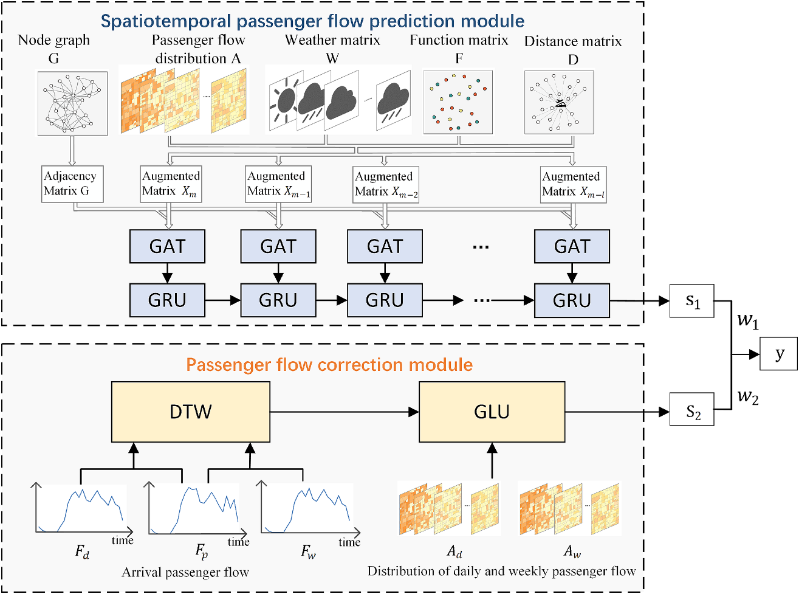
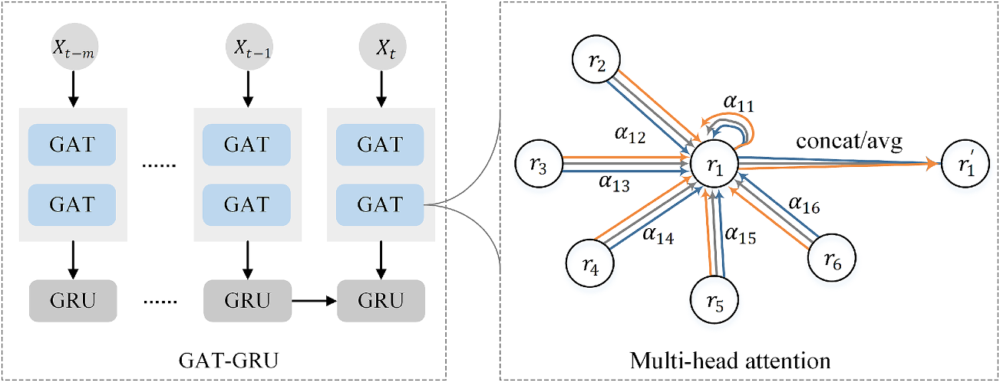
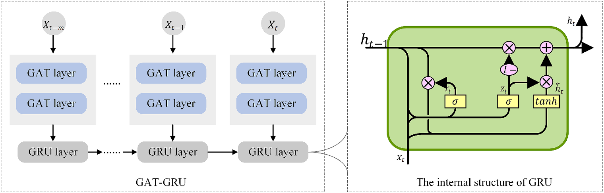
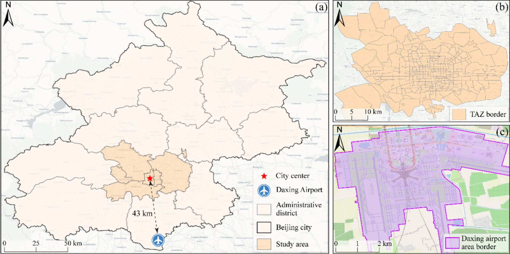
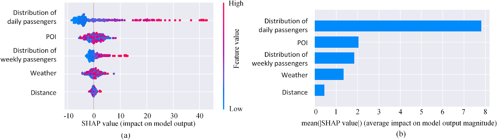
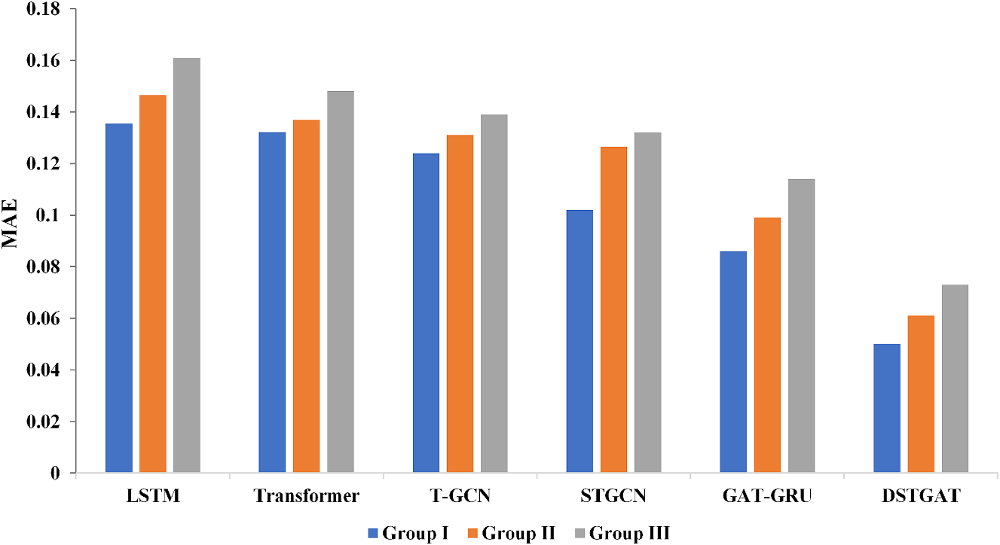
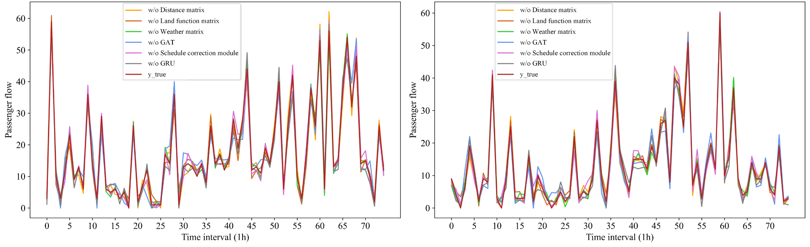
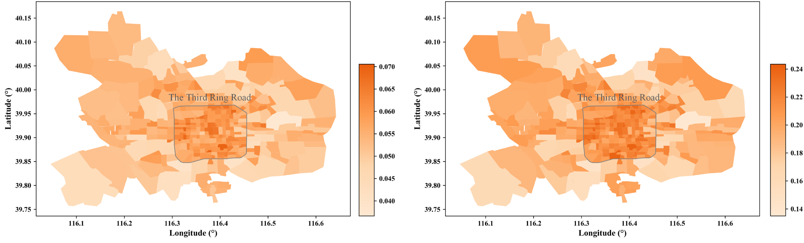
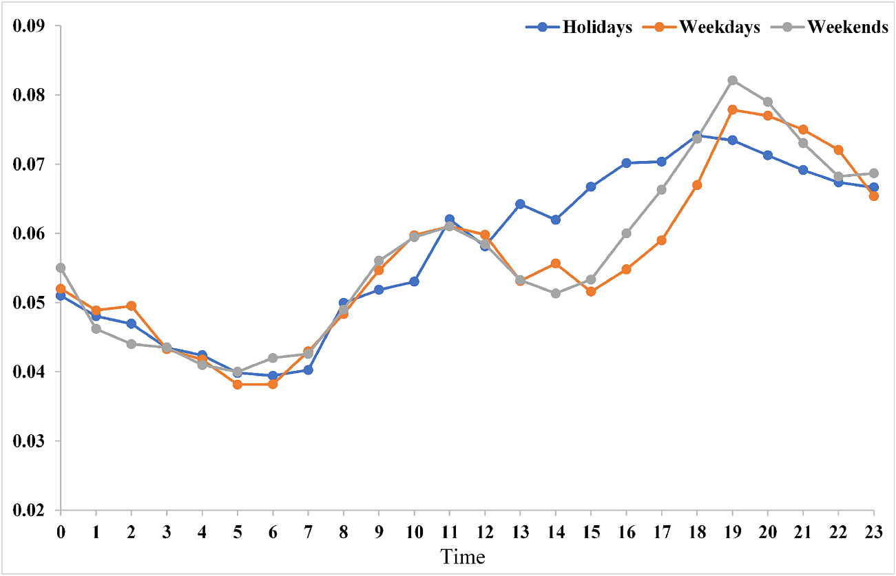

# Arrival information-guided spatiotemporal prediction of transportation hub passenger distribution* 

Long Cheng ${ }^{\mathrm{a}, \mathrm{b}}$, Xinmei Cai ${ }^{\mathrm{a}}$, Da Lei ${ }^{\mathrm{a}, *}$, Shulin $\mathrm{He}^{\mathrm{a}}$, Min Yang ${ }^{\mathrm{a}, \mathrm{b}}$ ${ }^{a}$ Jiangsu Key Laboratory of Urban ITS, School of Transportation, Southeast University, China ${ }^{\mathrm{b}}$ Laboratory of Transport Industry of Comprehensive Transportation Theory (Nanjing Modern Multimodal Transportation Laboratory), China

## A R T I C L E I N F O

Keywords:
Hub passenger flow
Spatiotemporal distribution
Deep learning
Graph Attention Network
Arrival information correction

A B STRUCT
Understanding the spatiotemporal distribution of hub passenger flow is essential for optimizing both hub and urban transportation operations. However, predicting spatiotemporal distribution of transportation hub passenger flow encounters is challenging due to complex factors influencing its dynamics. This paper proposes a deep learning model, the Deep Spatiotemporal Graph Attention Network (DSTGAT), to predict the spatiotemporal distribution of hub passenger flow in urban areas. The DSTGAT consists of two modules: a spatiotemporal passenger flow prediction module and a passenger flow correction module. The spatiotemporal prediction module integrates Graph Attention Networks (GATs) and Gated Recurrent Units (GRUs) to capture the spatial and temporal dependencies in passenger flow, considering factors such as land function, adjacency, distance to the hub, and weather conditions. The passenger flow correction module uses Dynamic Time Warping (DTW) to identify the similarity of historical arrival passenger flows. Based on this similarity, it selects the most similar passenger flow distribution for prediction correction. A case study using data from Beijing Daxing International Airport in China demonstrates the superior performance of the DSTGAT compared to baseline models. The model exhibits robust predictive accuracy, particularly in regions with high passenger flow fluctuations and during holiday periods. The study highlights the importance of considering external factors and arrival passenger flow in achieving accurate hub passenger flow predictions.

## 1. Introduction

Passenger transportation hubs play a crucial role in urban transportation systems by integrating various modes of transport, including railways, subways, buses, taxis, and private cars (Calzada and Fageda, 2023; Cheng et al., 2022, 2025; Gu et al., 2020; Lei et al., 2024). These hubs serve as essential interchange points for both intra-city and inter-city travel. With the continuous growth of urban populations and travel demands, the accurate short-term prediction of passenger distribution for hubs has become increasingly urgent. Such predictions can assist hubs optimize capacity allocation to meet fluctuating demand at different times, ultimately enhancing transportation efficiency and alleviating congestion.

Currently, studies have primarily focused on forecasting the passenger flow of a single hub (Jing et al., 2021; Gu et al., 2022; Wen et al., 2024). Some studies attempt to integrate passenger flow information from multiple transportation hubs at the network level to

[^0]
[^0]:    * This article is part of a special issue entitled: 'Multimodal_Hans' published in Transportation Research Part E.
    * Corresponding author at: Sipailou 2, Nanjing 210096, China.

    E-mail address: greatradar@gmail.com (D. Lei).

predict overall flow trends (Xie et al., 2014; Yu et al., 2023). However, these studies are confined to time series forecasts of hub passenger flows, overlooking the spatiotemporal distribution of flows within the urban context. In reality, passengers departing from transportation hubs travel to different areas of the city for different purposes, such as commuting, tourism, and business trips (Huang et al., 2020; Zhong et al., 2018). Simultaneously, city residents and visitors travel to transportation hubs for transfers. Considering the diverse functions and characteristics of different urban areas (Cheng et al., 2024), the demand for travel varies across regions (Zhang et al., 2022). Therefore, accurately predicting the spatiotemporal distribution of passenger flows in the urban context is critical for ensuring the seamless integration of hubs with urban transportation systems and optimizing resource allocation.

In recent years, significant advancements have been achieved in forecasting urban transportation flows across diverse modes, including subway (Liu et al., 2019; Yang et al., 2023; Zhang et al., 2020), bus (Baghbani et al., 2023; Jung et al., 2020; Zhang et al., 2023), and online car (Lu et al., 2021; Shuai et al., 2023). However, hub passenger flow, distinct from these modes, exhibits prominent characteristics as aggregation nodes. Hub passenger flow involves both dispersion from the hub to various urban zones and aggregation from urban zones back to the hub. Predicting the distribution of hub passenger flow poses a complex challenge due to two main factors: (1) This distribution is influenced by various external factors. Common influencing factors in predicting passenger flow for urban transportation include regional function and weather conditions. Additionally, it is closely related to the distance to the hub and the number of passengers arriving at the hub. These factors increase the complexity of passenger flow prediction. (2) Forecasting passenger flow is particularly challenging due to inherent instability, influenced by special dates such as holidays. Urban traffic flows exhibit clear commuting patterns, with higher volumes on weekdays than on weekends (Chen et al., 2022; Jin et al., 2022; Park et al., 2022; Si et al., 2024; Wang et al., 2022a; Yang et al., 2022). In contrast, hubs such as airports often show less distinct commuting patterns, with weekend volumes sometimes surpassing weekday volumes (Matthews, 1995; Wang et al., 2022). This instability in passenger flow complicates predictions.

To address these issues, we propose a deep spatiotemporal graph attention network for predicting the spatiotemporal distribution of hub passenger flow in urban areas. The primary contributions of this paper are as follows: (1) We propose a deep learning model for predicting this distribution in urban areas. The model integrates various factors affecting it, including region functionality, adjacency, distance to the hub, weather, and arrival passenger flow information. (2) The prediction accuracy of the proposed model generally surpasses that of traditional baseline models. Moreover, the model demonstrates robust predictive accuracy, particularly in regions with high passenger flow fluctuations.

The remaining sections of this paper are organized as follows: Section 2 reviews relevant literature. Section 3 defines the research problem and introduces the proposed deep learning model. Section 4 provides an empirical analysis using Beijing Daxing International Hub as a case study. Finally, Section 5 concludes the paper by summarizing the research findings, identifying limitations, and suggesting directions for future work.

# 2. Literature review 

### 2.1. Deep learning models for predicting spatiotemporal passenger flows

In recent years, deep learning models have gained prominence in spatiotemporal passenger flow prediction, with Graph Convolutional Networks (GCNs) and Convolutional Neural Networks (CNNs) being widely adopted. CNNs, which treat data as images and employ convolutional operations to capture spatial features, have been used to predict passenger flows between various areas. For example, Wang et al. (2022) processed urban Origin-Destination (OD) matrices within a CNN framework to capture spatial correlations and predict passenger flows. Similarly, Zhang et al. (2022) partitioned the city into zones and used convolutional layers to extract spatial dependencies among these zones. Ke et al. (2017) also employed convolutional techniques to capture passenger demand for ondemand rides.

However, CNNs are limited to Euclidean data and do not effectively capture the complexities of transportation network topologies (Jiang \& Luo, 2022). Graph Attention Networks (GATs) have emerged as a more powerful alternative, offering improved expressiveness by assigning different weights to neighboring nodes, thereby capturing nuanced spatial relationships. Chen et al. (2022) developed a Spatial-Temporal Graph Sequence with Attention Network (STGSAN) to predict public bus passenger flow, leveraging attention mechanisms to capture important spatiotemporal features. Zhao et al. (2023) introduces a GAT and Long Short-Term Memory (LSTM) network to predict ship trajectories, demonstrating improved prediction accuracy and reliability.

To address the limitations of individual deep learning models and effectively capture the spatiotemporal relationships of passenger flows, several frameworks combining multiple models have been proposed. Xu et al. (2023) introduced a Spatio-Temporal Multi-Graph Transformer (STMGT) for predicting real-time spatiotemporal demand for shared scooters. This framework employs multi-graph convolutional neural networks to capture spatial dependencies related to region functionality, population, and transportation supply. Additionally, it incorporates a transformer to capture weather conditions and temporal dependencies. Guo et al. (2020) combined a fully convolutional network with an extended Conv-LSTM to predict travel demands characterized by intricate spatiotemporal dependencies. Zhang et al. (2023) proposed a Spatio-Temporal Convolutional Neural Network (STCNN) by merging CNNs with Time Convolutional Neural Networks (TCNs) for short-term urban rail transit OD predictions. This model considers the significance of different OD pairs, leading to enhanced predictive performance. Furthermore, some studies (e.g., Do et al., 2019; He et al., 2022; Huang et al., 2023) combined seq2seq models with attention mechanisms to effectively capture long-term temporal dependencies and correlations. Overall, these combined frameworks tend to outperform single deep learning models.

# 2.2. Passenger flow prediction for transportation hubs 

Existing research on hub passenger flows mainly focuses on time series forecasting. In the early stages, mathematical and statistical models were the dominant methods for forecasting passenger flows in time series. Abdelghany and Guzhva (2010) utilized the ARIMA (Autoregressive Integrated Moving Average) model to predict short-term demand for passenger flows at hubs and conducted empirical studies at the largest 100 hubs in the United States. They assessed the impact of various external factors, such as seasonality, fuel prices, airline strategies, accidents, and financial conditions, on passenger flows. Building upon this, Tsui et al. (2014) introduced the BoxJenkins Seasonal ARIMA model and applied it to predict passenger volumes at Hong Kong airport. The results indicated that factors such as the number of passengers, fuel prices, and epidemics were crucial influencers on passenger flows. Subsequently, with the development of deep learning, these technologies have gradually been applied to passenger flow forecasting, resulting in significant improvements in predictive accuracy (Zhang et al., 2021; Zhang et al., 2023). The periodicity and dates of historical passenger flow changes have become important features for prediction (Jing et al., 2021). Wu et al. (2021) proposed a two-stage learning framework model to accurately predict hub passenger flows by capturing complex features in time series data.

To comprehensively understand passenger flow trends, researchers have progressively integrated passenger flow information from multiple hubs to predict trends. For example, Xie et al. (2014) constructed the origin station distribution of high-speed rail passenger flows at the traffic network level and used neural networks to predict short-term passenger flows. At the railway network level, Yu et al. (2023) constructed a passenger flow relationship graph between train stations, determining mutual influence weights among different stations. This approach not only improved the accuracy of passenger flow prediction but also considered the synergistic effects among multiple hubs. Additionally, Yue et al. (2023) employed deep learning methods to estimate short-term transfer passenger flows between two comprehensive hubs in a city cluster. Regarding research on airport hub scenarios, Xiao et al. (2016) proposed a method for mixed oscillation analysis and short- to medium-term passenger flow prediction at airports, though their approach was still limited to time series forecasting. Li et al. (2024) adopted a physics-guided spatiotemporal graph convolutional network to predict passenger flow distribution within the airport hub, but their study did not examine how passenger flow is distributed across the city. In contrast, Jie et al. (2022) analyzed the spatiotemporal distribution of passenger flow from Daxing Airport within the city using AFC card-swipe data, focusing primarily on analysis without offering predictive insights.

### 2.3. Summary and objective of this paper

In summary, previous research has forecasted hub passenger flows from different perspectives, including predicting passenger flows at individual hubs or at the network level. The central goal of these studies remains the accurate prediction of hub passenger flow time series. However, predictions of the spatiotemporal distribution of hub passenger flows within urban areas have not been thoroughly investigated. Addressing how to incorporate multiple influencing factors and accurately predict their spatiotemporal distribution within urban areas is a pressing issue that remains unresolved. Therefore, we propose a deep learning model, the Deep Spatiotemporal Graph Attention Network (DSTGAT), to predict the spatiotemporal distribution of hub passenger flow. This model integrates the effects of temporal, spatial, and external factors on hub passenger flows, aiming to achieve high prediction accuracy and

Fig. 1. The framework of the DSTGAT.

stability.

# 3. Methods 

### 3.1. Research problem definition

This section defines the prediction objective and input variables required for hub passenger flow forecasting. The objective of this study is to forecast the spatiotemporal distribution of hub passenger flow, defined as the movement of hub passengers within urban areas. The urban area is divided into several Traffic Analysis Zones (TAZs). Within each TAZ, passenger flows are counted during specific time intervals.

Let $A_{t}=\left(a_{1}, a_{2}, a_{3} \cdots a_{n}\right)$ represent the passenger count in $n$ TAZs at the $t^{\text {th }}$ time interval. Therefore, the passenger distribution is $A=$ $\left(A_{1}, A_{2}, \cdots, A_{t}\right)$. The factors influencing airport passenger flow distribution prediction include the arrival passenger flow at the airport, weather, land function, and the distance to the airport, which are represented by matrices $P$. W. FandD respectively. Passengers initially arrive at transport hubs and then disperse to various regions within the city. The urban distribution of passenger flow from these hubs is directly influenced by the volume of arriving passengers. Weather affects travel behavior, with individuals often adjusting their travel time or plans in response to adverse weather conditions. Regional land function determines the concentration and distribution of different activities, thereby impacting passenger travel demand. The distance to the hub is another factor affecting passenger flow, particularly when multiple hubs provide similar services. Generally, passengers tend to prefer closer hubs. In summary, the passenger flow distribution prediction problem can be understood as predicting the future distribution of passenger flow $y$ based on matrix $A . P . W$. F. $D$ :

$$
y=f(A . P . W . F . D)
$$

### 3.2. Model framework overview

This section presents the DSTGAT model designed for forecasting hub passenger flow distribution. Fig. 1 illustrates the architecture framework, elucidating its division into two components: the spatiotemporal passenger flow prediction module and the passenger flow correction module. The spatiotemporal passenger flow prediction module is constructed upon GATs and GRUs. The GATs effectively integrate spatial information by combining weather, land function, and distance matrix with passenger flow distribution $A$. Subsequently, the output serves as input to the GRUs, producing a preliminary passenger flow estimate $s_{1}$. In parallel, the passenger flow correction module evaluates the similarity between the predicted and historical arrival passenger using Dynamic Time Warping (DTW). The Gated Linear Unit (GLU) determines the retention level of historical passenger flow distribution based on this similarity, yielding the retained passenger flow $s_{2}$. The final prediction $y$ is then derived through a weighted summation of $s_{1}$ and $s_{2}$, ensuring a comprehensive and accurate forecast.

### 3.2.1. The spatiotemporal passenger flow prediction module

The spatiotemporal passenger flow prediction module integrates external factors, such as weather, land function, and distance to the hub, as auxiliary features of traffic zones.

Weather matrix $W$. To capture the impact of weather on passenger flow, a weather matrix $W^{(n \times m)}$ is included, representing temporal variations in weather conditions across $n$ TAZs over $m$ time periods. Weather conditions are categorized into five types: sunny, cloudy, foggy, light rain, and heavy rain. One-hot encoding is employed to numerically represent these conditions for each TAZ during each historical time period.

Land function matrix $F$. The function of each TAZ is represented using Point of Interest (POI) data, categorized into 12 types, including "dining", "shopping", "business residence", "recreation and entertainment", "healthcare", "science and education culture", "tourist attractions", "hotel accommodation", "lifestyle services", "companies and enterprises", "transport facilities" and "others". Mapping POI coordinates to TAZs allows tallying the types and quantities of POIs within each TAZ. The number of each POI type in
each TAZ is counted, forming a POI matrix: $\left(\begin{array}{cccc}d i_{1} & s h_{1} & b r_{1} & \cdots & o t_{1} \\ d i_{2} & s h_{2} & b r_{2} & \cdots & o t_{2} \\ \vdots & \vdots & \vdots & & \vdots \\ d i_{n} & s h_{n} & b r_{n} & \cdots & o t_{n}\end{array}\right)$, where $d i_{n}, s h_{n}, b r_{n}$, and $o t_{n}$ represent the number of dining, shopping, business residence and other POIs in the $n$-th TAZ, respectively. To enhance data representation and reduce dimensionality, embedding techniques (Wang et al., 2021) are applied to the POI matrix, resulting in the formation of the land function matrix $F$.

Distance graph $D$. A distance matrix $D^{(n \times 1)}$, detailing the distances from each of the $n$ TAZs to the hub.
Node graph $G$. An adjacency matrix $G=(V . E)$ represents the connectivity between TAZs, with each TAZ considered a node $V=\left\{v_{1}\right.$. $v_{2}, \cdots, v_{n}\}$ in the graph and $E$ representing the set of edges connecting them. ' 1 ' in the matrix indicates adjacency, while ' 0 ' indicates non-adjacency.
(1) GAT

GATs operate on graph-structured data, leveraging an attention mechanism to learn the relative importance of neighboring TAZs

when aggregating information, effectively capturing the spatial relationship of the graph. Based on the research of Zhu et al. (2021), we combine the matrices into an augmented matrix (Fig. 2). At time step $m$, the augmented matrix is:

$$
X_{m}=\left\{A_{m}, W_{m}, F_{m}, D_{m}\right\}
$$

The attention coefficient $\alpha_{j j}^{m}$ between TAZ $i$ and its neighbor $j$ at time step $m$ is:

$$
\alpha_{i(j)}^{m}=\frac{\exp \left(\operatorname{LeakyReLU}\left(a^{T}\left[W X_{i}^{m} \| W X_{j}^{m}\right]\right)\right)}{\sum k \in \tilde{\mathrm{~N}}_{i} \exp \left(\operatorname{LeakyReLU}\left(a^{T}\left[W X_{i}^{m} \| W X_{k}^{m}\right]\right)\right)}
$$

where LeakyReLU is an activation function, $a^{T}$ is a learnable weight vector, $\|$ denotes concatenation of feature vectors, $W$ is a weight matrix applied to the feature vectors, and $\tilde{\mathrm{N}}_{i}$ represents the set of neighbors of node $i$.

This formula aggregates the features of neighboring TAZs based on the calculated attention coefficients:

$$
\tilde{X}_{i}^{m}=\sigma\left(\sum_{j \in \tilde{N}_{i}} \alpha_{i(j)}^{m} W X_{i}^{m}\right)
$$

where $\sigma$ represents an activation function.
To enhance the stability of model feature learning, the self-attention mechanism is extended to employ self multihead attention, where $K$ independent attention mechanisms execute formula (4), and the outputs are averaged to form the final node representation:

$$
\tilde{\boldsymbol{X}}_{i}^{m}=\sigma\left(\frac{1}{K} \sum_{k=1}^{K} \sum_{j \in, J \in J_{i}} a_{(i j)}^{m, k} W^{k} X_{i}^{m}\right)
$$

In our experiment, we chose two GAT layers and $K$ is 4.

# (2) GRU 

Upon capturing spatial dependencies with the GAT and bringing the GAT output into the GRUs, the time-varying TAZ representations are processed through the GRUs to model temporal dependencies. This selection is grounded in the GRUs' nature as a variant of Recurrent Neural Networks (RNNs) with extended memory capabilities, facilitating the effective capture of long-term dependencies in time series data. Fig. 3 demonstrates the input-output structure and internal configuration of the GRUs. Two GAT layers, denoted as $g c_{1}\left(X_{t}, A\right)$ and $g c_{2}\left(X_{t}, A\right)$, are employed to update the information within the GRU. The update gate $z_{t}$ (Equation (6)) determines the degree to which the hidden state at the current time step should incorporate historical passenger flow data $h_{t-1}$ and the current passenger flow input $x_{t}$. The reset gate $r_{t}$ (Equation (7)) specifies how much of the previous hidden state should be discarded, thereby controlling the amount of information retained from the previous time step.

$$
\begin{aligned}
& z_{t}=\sigma\left(W_{z} \cdot\left[g c_{1}\left(X_{t}, A\right), h_{t-1}\right]+b_{z}\right) \\
& r_{t}=\sigma\left(W_{r} \cdot\left[g c_{1}\left(X_{t}, A\right), h_{t-1}\right]+b_{r}\right)
\end{aligned}
$$

where $\sigma$ is the sigmoid activation function, $W_{z}$ and $W_{r}$ are the weight matrix, and $b_{z}$ and $b_{r}$ are the bias term. $g c(\cdot)$ represents the graph convolution operation.

After obtaining information from the update gate and reset gate, the candidate hidden state $\tilde{h}_{t}$ is computed by merging historical passenger flow $h_{t-1}$ and the current input $x_{t}$ (Equation (8)):

Fig. 2. Illustration of multi-head attention (with $\mathrm{K}=3$ heads) by Node l on its neighbors in a single GAT layer.

Fig. 3. The architecture of GRU.

$$
\tilde{h}_{t}=\tanh \left(W \cdot\left|g c_{2}\left(X_{t}, A\right), r_{t} \cdot h_{t-1}\right|+b\right)
$$

where $W$ is the weight matrix, and $b$ is the bias term.
Finally, by combining the update gate $z_{t}$ and candidate hidden state $\tilde{h}_{t}$, we obtain the current time step's hidden state $h_{t}$, which is comprehensive representation of the current passenger flow conditions (Equation (9)):

$$
h_{t}=\left(1-z_{t}\right) \cdot h_{t-1}+z_{t} \cdot \tilde{h}_{t}
$$

# 3.2.2. Passenger flow correction module 

Passengers initially arrive at transport hubs and subsequently disperse to various regions within the city. The urban distribution of passenger flow from these hubs is directly influenced by the volume of arriving passengers. There is a similarity in the passenger flow distribution between daily and weekly cycles (Forouzandeh Jonaghani et al., 2024). Therefore, we introduce the Passenger flow correction module, incorporating DTW and GLU. This method utilizes the periodic similarity of arrival passenger flow to select the most similar passenger flow distribution to the target prediction period. Specifically, we first calculate the similarity between the historical daily and weekly arrival passenger flows and the target prediction period using the DTW algorithm. Based on the calculated similarity, we select the most similar daily and weekly cycles. Then, the historical passenger flow distributions corresponding to these selected daily and weekly cycles are extracted. Next, we use the GLU model to determine the extent to which these historical passenger flow distributions should be preserved.

In the implementation of DTW, the similarity between two arrival passenger flow sequences $P=\left(p_{1}, \cdots, p_{n}\right)$ and $Q=\left(q, \cdots, q_{n}\right)$ is measured by the DTW distance $D T W(P, Q)$ :

$$
\begin{aligned}
& \gamma(i, j)=d\left(p_{i}-q_{i}\right)+\min \left(\gamma(i, j-1), \gamma(i-1, j), \gamma(i-1, j-1)\right) \\
& D T W(P, Q)=\gamma(n, n)
\end{aligned}
$$

where $d\left(p_{i}-q_{i}\right)$ represents the distance between the two points $p_{i}$ and $d_{i}$.
The similarity between the arrival passenger flows for the daily and weekly cycles is calculated as $D T W\left(F_{p}, F_{d}\right)$ and $D T W\left(F_{p}, F_{w}\right)$, where $F_{p}$ represents the arrival passenger flow for the target prediction period, $F_{d}$ denotes the arrival passenger flow for the daily cycle, and $F_{w}$ refers to the arrival passenger flow for the weekly cycle. The smaller the DTW distance, the more similar the two sequences are. Based on this similarity, we select the historical passenger flow distributions $A_{d}$ and $A_{w}$ corresponding to the most similar daily and weekly cycles. The GLU model is used to determine the extent to which these historical passenger flow distributions should be retained:

$$
s_{2}=\beta_{1}\left(A_{d} W_{1}+b_{1}\right) \cdot \sigma\left(A_{d} W_{2}+b_{2}\right)+\beta_{2}\left(A_{w} W_{1}+b_{1}\right) \cdot \sigma\left(A_{w} W_{2}+b_{2}\right)
$$

where $\sigma$ is the sigmoid activation function, $\beta_{1}, \beta_{2}$ are learning parameters, and $W_{1}, W_{2}, b_{1}, b_{2}$ are the parameter matrices of the gated linear cells.

The outputs $s_{1}$ of the spatiotemporal prediction module and $s_{2}$ of the schedule correction module are weighted and summed by the learning parameters $w_{1}$ and $w_{2}$ to synthesize the final output $y$ :

$$
y=\sigma\left(w_{1} s_{1}+w_{2} s_{2}\right)
$$

## 4. Case study

### 4.1. Data collection and description

The subject of this study is Daxing International Airport, located in Beijing, China. Daxing International Airport serves as a major international aviation multimodal transportation hub, featuring an enormous terminal with a footprint of 700,000 square meters

Fig. 4. Spatial distribution of the study area: (a) Beijing city; (b) study area; and (c) Daxing International Airport.
(Fig. 4c). It is situated approximately 43 km from the city center of Beijing (Fig. 4a). The hub provides various transportation options for connectivity, including high-speed rail, subway, airport buses, and taxis. In 2021, Daxing International Airport achieved a total passenger throughput of 25.05 million, underscoring its significant role in propelling the development of Beijing and its surrounding cities.

This study focuses on the hourly distribution of passenger flows at Daxing International Airport within the Beijing urban area. The forecast target is the volume of passenger flows per TAZ in the next hour. The data used in this study includes historical hub passenger flow spatiotemporal distribution data, weather data, POI data, and arrival passenger data, collected over 31 days in October 2023.

The spatiotemporal distribution data for hub passenger flows and arrival passenger data were extracted from the Beijing mobile signaling data provided by the Smart Steps. ${ }^{1}$ Trip origins and destinations were mapped to 338 TAZs (Fig. 4b), facilitating the calculation of hourly hub passenger flow within each TAZ. Weather data was obtained from the National Meteorological Science Data Center, comprising hourly weather information for various administrative regions in Beijing. By mapping TAZs to these administrative regions, weather conditions for each TAZ were obtained. POI data was obtained from the Amap ${ }^{2}$ API. By mapping POI coordinates to TAZs, a tally of the types and quantities of POIs within each TAZ was conducted. Descriptive statistics for the various data types are shown in Table 1.

The evaluation metrics are mean absolute error (MAE) and root mean square error (RMSE):

$$
\begin{aligned}
& \operatorname{MAE}(X, h)=\frac{1}{m} \sum_{i=1}^{m}\left|h\left(x_{i}\right)-y_{i}\right| \\
& \operatorname{RMSE}(X, h)=\sqrt{\frac{1}{m} \sum_{i=1}^{m}\left(h\left(x_{i}\right)-y_{i}\right)^{2}}
\end{aligned}
$$

# 4.2. SHAP analysis of influencing factors 

The selection of high-quality influencing factors is crucial for improving model performance. In this section, XGBoost and SHAP are employed to validate the rationality of the selected influencing factors and to explain their influence on passenger flow distribution prediction. SHAP (SHapley Additive exPlanations) method is a model interpretation technique based on cooperative game theory, which calculates the contribution of each feature to the prediction results. SHAP values provide insight into how input variables influence the model's predictions.

In Fig. 5a, each point represents the value of a feature in a sample. The horizontal axis represents the SHAP value, indicating the positive and negative contributions of these features to the prediction. Red points indicate higher feature values, while blue points indicate lower feature values. As shown in the figure, daily and weekly passenger flow distributions have a large positive contribution to the prediction result, and the degree of contribution increases with the increase of feature values. The effects of POI, weather, and

[^0]
[^0]:    ${ }^{1}$ The Smart Steps is a platform that collects signaling data from Chinese mobile phone users. https://dsas.smartsteps.com/\#/.
    ${ }^{2}$ Amap is one of the biggest Chinese digital map service provider that offers navigation and location services. https://ditu.amap.com/.

Table 1
Descriptive analysis of basic data.

| Data Type | Maximum | Minimum | Mean | Coefficient of variation |
| :-- | :-- | :-- | :-- | :-- |
| Distance (km) | 66.56 | 26.9 | 43.22 | 0.14 |
| arrival passenger flow | 7624 | 424 | 4233 | 0.44 |
| Passenger flow distribution | 103 | 0 | 13 | 1.17 |
| Data Type | Maximum Quantity Category | Minimum Quantity Category | Total Category |  |
| POI | shopping | recreation and entertainment | 12 |  |
| weather | sunny | heavy rain | 5 |  |

Fig. 5. Feature importance analysis using SHAP values.
distance on the prediction results are more complex, with varying degrees and magnitudes of positive and negative contributions for different samples.

Fig. 5b illustrates the overall contribution represented by the average SHAP value, i.e., the importance of the features. The daily passenger flow distribution has the highest average SHAP value, indicating its greatest impact on model predictions. POI and weekly passenger flow distribution follow in importance, making significant contributions as well. The impact of weather is moderate, while distance contributes the least to the model output. The SHAP value analysis results show that the selected influencing factors can effectively explain the passenger flow distribution prediction results. It shows that the features are reasonable and that their contributions to the prediction vary. The model's prediction performance depends heavily on these key features, particularly daily passenger flow distribution, POI, and weekly passenger flow distribution.

# 4.3. Model setting and comparison 

### 4.3.1. Model setting

The dataset is partitioned into training, validation, and test sets in a 7:2:1 ratio. For model training, a batch size of 32 is employed, and the time series length is set to 10 . The initial learning rate is set to 0.005 , and the number of hidden units is set to 32 . The hardware environment utilized consists of an Intel Core i7-13700 K CPU and NVIDIA GeForce GTX 1660 SUPER. The software environment is configured with Python 3.9 and Torch $1.12 .0+$ cu113. Five classical baseline models are selected to verify the superiority of the proposed DSTGAT.

### 4.3.2. Model performance comparison

LSTM: Long Short-Term Memory (LSTM) is a type of recurrent neural network (RNN) architecture that is well-suited for processing and predicting sequences of data. In this study, the learning rate is set to 0.005 , the batch size is set to 32 , and the number of hidden units is set to 16 .

Transformer: Transformer is a type of neural network architecture that relies on self-attention mechanisms to process input data in

Table 2
Performance metrics of DSTGAT model and the baselines.

| Models | MAE | RMSE | Execution time (s) |
| :-- | :-- | :-- | :-- |
| LSTM | 0.1438 | 0.3921 | 172 |
| Transformer | 0.1371 | 0.3508 | 85 |
| T-GCN | 0.1292 | 0.3184 | 55 |
| STGCN | 0.1047 | 0.3026 | 53 |
| GAT-GRU | 0.0939 | 0.2821 | 58 |
| DSTGAT | $\mathbf{0 . 0 5 5 9}$ | $\mathbf{0 . 2 0 4 6}$ | 62 |

parallel. In this study, the learning rate is set to 0.005 , the batch size is set to 32 , and the number of blocks is set to 8 .

T-GCN: Temporal graph convolutional network (T-GCN) model (Zhao et al., 2020) combines GCN and GRU. The GCN captures spatial dependencies by learning complex topological structures, while the GRU captures temporal dependencies in traffic data. The number of hidden units is set to 100 , the learning rate is set to 0.005 , and the batch size is set to 32 .

STGCN: Spatio-Temporal Graph Convolutional Networks (STGCN) formulate the problem on graphs and build the model with complete convolutional structures, enabling faster training speed with fewer parameters (Yu et al., 2018). The learning rate is set to 0.005 , and the batch size is set to 32 .

GAT-GRU: In this study, the number of attention heads $(K)$ is set to 4 , the learning rate to 0.005 , the batch size to 32 , and the number of hidden units is set to 50 .

Table 2 presents the performance metrics for each model, including MAE, RMSE, and execution time. In comparison to the baseline models, our proposed DSTGAT demonstrates superior performance, exhibiting the lowest MAE and RMSE values among all models. Additionally, it demonstrates a competitive execution time of 62 s , faster than the LSTM and Transformer models. DSTGAT exhibits a slightly higher execution time compared to T-GCN and STGCN. This is primarily due to the need for calculating attention weights for each node and its neighbors, which involves greater computational complexity than the graph convolution operation in GCN. This result indicates that DSTGAT can achieve state-of-the-art predictive accuracy without compromising computational efficiency. Spatialtemporal neural network models like T-GCN and STGCN surpass the LSTM model, which only considers temporal dependencies. This highlights the importance of integrating spatial correlations for enhanced predictive accuracy in traffic forecasting. Furthermore, the multi-graph STGCN model demonstrates better performance compared to the single-graph T-GCN model, indicating the benefit of utilizing multiple graph inputs to capture complex spatial relationships.

# 4.3.3. Model performance across different passenger flow variations 

This section investigates the impact of passenger flow variations on the predictive accuracy of models. The TAZs are classified into three groups based on the standard deviation of passenger flows. Specifically, Group I includes 177 TAZs with a standard deviation less than or equal to 60 passengers, Group II comprises 98 TAZs with a standard deviation between 60 and 120 passengers, and Group III consists of 63 TAZs with a standard deviation greater than 120 passengers. Fig. 6 illustrates the MAE of different models in predicting the three groups of passenger flows. The results reveal that, among the different models, Group III passenger flow predictions exhibit the highest MAE, while group I predictions have the lowest MAE. This outcome aligns with expectations, as a larger standard deviation indicates greater fluctuations in passenger flows, making predictions more challenging. Importantly, compared to other models, the DSTGAT demonstrates superior performance in passenger flow prediction, displaying the smallest prediction errors. This suggests that, in comparison to the baseline models, the DSTGAT model is generally more accurate in predicting passenger flows in TAZs with significant variations, highlighting the model's robust performance.

### 4.4. Model interpretation

### 4.4.1. Ablation study

An ablation study was conducted to evaluate the contribution of each component to the overall performance of the proposed model. In this study, we generated six models by removing distance matrix, land function matrix, weather matrix, GAT, passenger flow correction module, and GRU. Table 3 outlines the performance of these six models, and Fig. 7 shows the prediction results of the test set for two TAZs (TAZ A and TAZ B), facilitating a more intuitive comparison of the different models. The results show that the GRU significantly enhances prediction accuracy. When the GRU is removed, there is a $20.2 \%$ increase in MAE and a $4.2 \%$ increase in RMSE, demonstrating its importance. Similarly, the schedule correction module has a substantial impact, with the removal of this component

Fig. 6. MAE of different models in the three groups.

Table 3
Results of ablation study.

| Mode | MAE | RMSE |
| :-- | :-- | :-- |
| DSTGAT | $\mathbf{0 . 0 5 5 9}$ | $\mathbf{0 . 2 0 4 6}$ |
| w/o Distance matrix | 0.0573 | 0.2085 |
| w/o Land function matrix | 0.0580 | 0.2107 |
| w/o Weather matrix | 0.0616 | 0.2120 |
| w/o GAT | 0.0636 | 0.2126 |
| w/o correction module | 0.0641 | 0.2118 |
| w/o GRU | 0.0672 | 0.2131 |

Fig. 7. Results of different models in ablation analysis.
leading to a $14.7 \%$ increase in MAE and a $3.6 \%$ increase in RMSE. This confirms the value of utilizing the periodicity of arrival passenger flow and historical flow distribution to improve future predictions. Land function has a slight impact on prediction, with a $3.8 \%$ increase in MAE and a $3 \%$ increase in RMSE observed upon its removal. This aligns with expectations, as hub passenger flows often exhibit distinct travel purposes closely related to destination types. Consistent with the SHAP analysis results, distance has the least impact on prediction results.

# 4.4.2. Spatial and temporal distributions of the predictive performance 

The various TAZs exhibit significant differences in population and primary functionalities, resulting in distinct spatial distributions of prediction errors. To further evaluate the model's performance, this section analyzes the temporal and spatial distribution of MAE and RMSE. Fig. 8 illustrates the spatial distribution of MAE and RMSE. It can be observed that the overall prediction errors within the Third Ring Road are higher than those outside concerning passenger flow predictions for TAZs. This phenomenon may be attributed to the relatively higher concentration of active populations within the Third Ring Road, leading to more complex human activities and making passenger flow patterns more challenging to capture.

Fig. 8. Spatial distribution of (a) MAE and (b) RMSE.

The temporal distribution of prediction errors is presented in Fig. 9, comparing the MAE distributions for the National Day holiday, weekdays, and regular weekends. Overall, MAEs are relatively low from 0:00 a.m. to 6:00 a.m. The error starts to increase after 6:00 a. m., peaking distinctly between 18:00p.m. and 20:00p.m., and then gradually decreases. This pattern aligns with passenger activity, as higher daytime activity in the city leads to increased prediction errors compared to the quieter nighttime hours. The error between weekends and workdays has a certain similarity and greater volatility. Weekends also exhibit higher errors compared to weekdays during this peak period. Overall, the DSTGAT model is well-adapted to holiday passenger flow forecasting.

# 5. Discussion 

This study introduces a deep learning model, the Deep Spatiotemporal Graph Attention Network (DSTGAT), designed to predict the spatiotemporal distribution of hub passenger flows in urban areas. This model integrates GATs and GRUs to effectively capture spatiotemporal dependencies, incorporating factors such as regional functionality, adjacency, distance to the hub, and weather. Additionally, the DTW is employed to leverage the impact of arrival passenger flow on prediction accuracy. An illustrative analysis is conducted using data from Beijing Daxing International Hub in China.

Compared to the GAT-GRU model, DSTGAT incorporates external influencing factors into GAT node features, allowing for a more comprehensive consideration of the factors affecting passenger flow prediction. These factors include weather, land function and distance to the hub. By integrating these factors into the GAT node features, DSTGAT provides a more comprehensive framework for predicting various types of passenger flows. This integration enables the model to more accurately capture the combined effects of diverse external factors.

The similarity consideration of hub arrival passenger plays a pivotal role in enhancing prediction accuracy. The SHAP analysis reveals that historical passenger flow distribution significantly contributes to predicting future passenger flow patterns. By utilizing the cyclical similarity of arriving passenger flows, DSTGAT effectively determines how much of the historical flow distribution should be retained, further improving prediction accuracy. This approach offers valuable insights for research in passenger flow prediction, suggesting that integrating a diverse set of factors in model design improves predictive performance. The ablation study confirms the importance of different components in the model's performance. Results highlight the substantial contributions of the GAT, the schedule correction module, and the GRU, while the impact of distance remains relatively minor. This emphasizes that, while geographical distance may play a role in passenger flow prediction, the more dynamic and context-sensitive factors such as passenger flow history is more crucial to achieving high prediction accuracy.

## 6. Conclusions

Accurate prediction of spatiotemporal passenger flow provides crucial support for efficient operation in hub transportation interconnection management and urban transportation systems. Passenger flow prediction plays a substantial role in coordinated departures within a region. The model proposed in this study is capable of predicting the distribution of hub passenger flows in urban areas for the next hour with high accuracy. These predictions provide transport operators with valuable insights into the dynamic patterns of passenger flow across different zones. As a result, they can proactively adjust routes and schedules in anticipation of fluctuations in passenger demand, improving resource allocation and reducing passenger waiting times. For instance, ride-sharing services can pre-position vehicles in anticipation of high demand from specific TAZs, while public transportation authorities can adjust bus and subway frequencies to accommodate predicted fluctuations in passenger volume. The passenger flow prediction results offer very strong support for dealing with holiday traffic problems. In this context, the model performs very well on holiday traffic prediction, benefiting the effective control of a surge in traffic volume in holidays. In situations of heightened holiday passenger flow, operators can adjust capacity and service plans based on passenger flow predictions. This may include putting more buses or trains on duty, extending service hours, or implementing crowd control measures at the hub and in high-traffic TAZs.

Although the model demonstrates significant predictive accuracy, there are several limitations that should be addressed in future research. While the study considers the functionality of various TAZs (primarily characterized by Points of Interest, or POIs), it does not fully account for demographic data or specific traffic characteristics such as public transportation accessibility or road capacity within these zones. Future studies could explore these additional variables to improve model accuracy. Moreover, different types of hub passenger flows (e.g., at airports versus railway stations) may exhibit distinct characteristics, which could lead to varying prediction outcomes. Future work could focus on comparing the performance of the model across these different types of hubs. While the current model successfully captures spatiotemporal dependencies, there is room for improvement by incorporating an attention mechanism to better identify and prioritize influential temporal features.

## CRediT authorship contribution statement

Long Cheng: Writing - original draft, Supervision, Investigation, Funding acquisition, Formal analysis, Conceptualization. Xinmei Cai: Writing - original draft, Methodology, Formal analysis. Da Lei: Writing - review \& editing, Methodology, Investigation. Shulin He: Writing - review \& editing, Validation. Min Yang: Writing - review \& editing, Funding acquisition.

## Declaration of competing interest

The authors declare that they have no known competing financial interests or personal relationships that could have appeared to

Fig. 9. The MAE distributions for the National Day holiday, weekdays, and weekends.
influence the work reported in this paper.

# Acknowledgements 

This research is supported by the National Natural Science Foundation of China (No. 52432011 and 52372301), the Fundamental Research Funds for the Central Universities (No. RF1028623146 and 2242023R40027), and the Key Laboratory of Transport Industry of Comprehensive Transportation Theory (Nanjing Modern Multimodal Transportation Laboratory) (No. MTF2023006).

## Data availability

The authors do not have permission to share data.

## References

Abdelghany, A., Guzhva, V., 2010. A time-series modeling approach for hub short-term demand forecasting. J. Hub Manage. 5, 72.
Baghbani, A., Bouguila, N., Patterson, Z., 2023. Short-term passenger flow prediction using a bus network graph convolutional long short-term memory neural network model. Transp. Res. Rec. 2677 (2), 1331-1340.
Calzada, J., Fageda, X., 2023. Airport dominance, route network design and flight delays. Transp. Res. Part E: Log. Transp. Rev. 170, 103000,
Chen, T., Jie Fang, D.S., Xu, M., Tong, Y., Chen, W., 2022. Prediction of public bus passenger flow using spatial-temporal hybrid model of deep learning. J. Transp. Eng. Part A: Syst. 148 (4), 04022007.
Chen, W., Liu, X., Chen, X., Cheng, L., Wang, K., Chen, J., 2022. Exploring year-to-year changes in station-based bike sharing commuter behaviors with smart card data. Travel Behaviour and Society 28, 75-89.
Cheng, L., Cai, X., Liu, Z., Huang, Z., Chen, W., Witlox, F., 2024. Characterising travel behaviour patterns of transport hub station area users using mobile phone data. J. Transp. Geogr. 116, 103855.

Cheng, L., Chen, Y., He, S., Wang, Z., Jin, T., Yang, M., 2025. Comparing accessibility to high-speed rail stations by public transit and cars: A national-scale analysis. Journal of Transport Geography 123, 104105.
Cheng, L., Jin, T., Wang, K., Lee, Y., Witlox, F., 2022. Promoting the integrated use of bikeshare and metro: A focus on the nonlinearity of built environment effects. Multimodal transportation 1 (1), 100004.
Do, L.N.N., Vu, H.L., Vo, B.Q., Liu, Z., Phung, D., 2019. An effective spatial-temporal attention based neural network for traffic flow prediction. Transp. Res. Part C: Emerg. Technol. 108, 12-28.
Forouzandeh Jonaghani, R., Wachowicz, M., Hanson, T., 2024. Matrix factorization for globally consistent periodic flow prediction in taxi systems. Transp. Res. Record: J. Transp. Res. Board 2678 (5), 1-12.
Gu, Y., Fu, X., Liu, Z., Xu, X., Chen, A., 2020. Performance of transportation network under perturbations: reliability, vulnerability, and resilience. Transp. Res. Part E: Log. Transp. Rev. 133, 101809.
Gu, X.L., Xie, J.C., Huang, C.Y., Ma, K., Liu, J.P., 2022. Prediction of the spatiotemporal passenger distribution of a large hub terminal and its impact on energy simulation. Sustain. Cities Soc. 78, 103619.
Guo, G., Zhang, T.Q., 2020. A residual spatio-temporal architecture for travel demand forecasting. Transp. Res. Part C-Emerg. Technol. 115, 102639.
He, Y.X., Li, L.S., Zhu, X.T., Tsui, K.L., 2022. Multi-graph convolutional-recurrent neural network (MGC-RNN) for short-term forecasting of transit passenger flow. IEEE Trans. Intell. Transp. Syst. 23 (10), 18155-18174.
Huang, D., Chen, X., Liu, Z., Lyu, C., Wang, S., Chen, X., 2020. A static bike repositioning model in a hub-and-spoke network framework. Transp. Res. Part E: Log. Transp. Rev. 141, 102031.
Huang, H., Mao, J.N., Lu, W.K., Hu, G.J., Liu, L., 2023. DEASeq2Seq: An attention based sequence to sequence model for short-term metro passenger flow prediction within decomposition-ensemble strategy. Transp. Res. Part C-Emerg. Technol. 146. https://doi.org/10.1016/j.trc.2022.103965.
Jiang, W.W., Luo, J.Y., 2022. Graph neural network for traffic forecasting: a survey. Expert Syst. Appl. https://doi.org/10.1016/j.eswa.2022.117921.
Jie, Z., Ding, S.N., Guo, B.G., Ma, Z.C., Jin, J.M., 2022. Research on temporal and spatial distribution characteristics of passenger flow of Daxing hub line based on automatic fare collection data. Expert. Syst. https://doi.org/10.1111/exsy.13009.

Jin, T., Cheng, L., Zhang, X., Cao, J., Qian, X., Witlox, F., 2022. Nonlinear effects of the built environment on metro-integrated ridesourcing usage. Transportation Research Part D: Transport and Environment 110, 103426.
Jing, Y., Hu, H.T., Guo, S.Y., Wang, X., Chen, F.Q., 2021. Short-term prediction of urban rail transit passenger flow in external passenger transport hub based on LSTM-LGB-DRS. IEEE Trans. Intell. Transp. Syst. 22 (7), 4611-4621.
Jung, Y.J., Casello, J.M., 2020. Assessment of the transit ridership prediction errors using AVL/APC data. Transportation 47, 2731-2755.
Ke, J.T., Zheng, H.Y., Yang, H., Chen, X.Q., 2017. Short-term forecasting of passenger demand under on-demand ride services: a spatio-temporal deep learning approach. Transp. Res. Part C-Emerg. Technol. 85, 591-608.
Lei, D., Cheng, L., Wang, P., Chen, X., Zhang, L., 2024. Identifying service bottlenecks in public bikesharing flow networks. Journal of Transport Geography 116, 103830.

Li, Z.W., Zhang, J.L., Guan, H., 2024. Passenger spatiotemporal distribution prediction in airport terminals based on physics-guided spatio-temporal graph convolutional network and its effect on indoor environment prediction. Sustain. Cities Soc. 106. https://doi.org/10.1016/j.scs.2024.105375.
Liu, Y., Liu, Z., Jia, R., 2019. DeepFF: a deep learning based architecture for metro passenger flow prediction. Transp. Res. Part C-Emerg. Technol. 101, 18-34.
Lu, X.J., Ma, C.X., Qiao, Y.H., 2021. Short-term demand forecasting for online car-hailing using Conv-LSTM networks. Phys. A-Stat. Mech. Applic. 570, 125838.
Matthews, L., 1995. Forecasting peak passenger flows at airports. Transportation 22 (1), 55-72.
Park, Y., Choi, Y., Kim, K., Yoo, J.K., 2022. Machine learning approach for study on subway passenger flow. Sci. Rep. 12 (1), 2754.
Shuai, C.Y., Zhang, X.Q., Wang, Y.X., He, M.W., Yang, F., Xu, G., 2023. Online car-hailing origin-destination forecast based on a temporal graph convolutional network. IEEE Intell. Transp. Syst. Mag. 15 (4), 121-136.
Si, H., Li, N., Cheng, L., Wu, G., De Vos, J., 2024. Are you a happy traveler? Exploring ridesourcing travelers' satisfaction and subjective well-being. Transportation Research Part D 128, 104106.
Tsui, W., Balli, H.O., Gilbey, A., Gow, H., 2014. Forecasting of Hong Kong airport's passenger throughput. Tour. Manag. 42, 62-76.
Wang, K., Akar, G., Cheng, L., Lee, K., Sanders, M., 2022a. Investigating tools for evaluating service and improvement opportunities on bicycle routes in Ohio, United States. Multimodal Transportation 1 (4), 100040,
Wang, Y., Currim, F., Ram, S., 2022. Deep learning of spatiotemporal patterns for urban mobility prediction using big data. Inf. Syst. Res. 33 (2), 579-598.
Wang, Y., Li, M.Z., Gopalakrishnan, K., Liu, T., 2022. Timescales of delay propagation in airport networks. Transp. Res. Part E: Log. Transp. Rev. 161, 102687.
Wang, B., Shaaban, K., Kim, I., 2021. Revealing the hidden features in traffic prediction via entity embedding. Pers. Ubiquit. Comput. 25 (1), 21-31.
Wen, X., Si, B., Xu, M., Zhao, F., Jiang, R., 2024. A passenger flow spatial-temporal distribution model for a passenger transit hub considering node queuing. Transp. Res. Part C-Emerg. Technol. 163, 104640.
Wu, X.P., Xiang, Y., Mao, G., Du, M.Q., Yang, X.Q., Zhou, X.Z., 2021. Forecasting air passenger traffic flow based on the two-phase learning model. J. Supercomput. 77 (5), 4221-4243.

Xiao, Y., Liu, Y., Liu, J.J., Xiao, J., Hu, Y., 2016. Oscillations extracting for the management of passenger flows in the airport of Hong Kong. Transportmetrica A: Transp. Sci. 12 (1), 65-79. https://doi.org/10.1080/23249935.2015.1099576.
Xie, M.Q., Li, X.M., Zhou, W.L., Fu, Y.B., 2014. Forecasting the short-term passenger flow on high-speed railway with neural networks. Comput. Intell. Neurosci. 2014, 375487. https://doi.org/10.1155/2014/375487.
Xu, Y.M., Zhao, X.L., Zhang, X.J., Paliwal, M., 2023. Real-time forecasting of dockless scooter-sharing demand: A spatio-temporal multi-graph transformer approach. IEEE Trans. Intell. Transp. Syst. https://doi.org/10.1109/TITS.2023.3239309.
Yang, Y., Sasaki, K., Cheng, L., Liu, X., 2022. Gender differences in active travel among older adults: Non-linear built environment insights. Transportation research part D: transport and environment 110, 103405.
Yang, F., Shuai, C., Qian, Q., Wang, W., He, M., He, M., Lee, J., 2023. Predictability of short-term passengers' origin and destination demands in urban rail transit. Transportation 50 (6), 2375-2401.
Yu, B., Yin, H., \& Zhu, Z. (2018). Spatio-temporal graph convolutional networks: a deep learning framework for traffic forecasting. IJCAI'18: Proceedings of the 27th International Joint Conference on Artificial Intelligence, 3634 - 3640.
Yu, S., Luo, A.P., Wang, X., 2023. Railway passenger flow forecasting by integrating passenger flow relationship and spatiotemporal similarity. Intell. Autom. Soft Comput. 37 (2), 1877-1893.
Yue, M., Ma, X.H., 2023. LSTM-based transformer for transfer passenger flow forecasting between transportation integrated hubs in urban agglomeration. Appl. Sci.Basel 13 (1), 637.
Zhang, J., Chen, F., Cui, Z., Guo, Y., Zhu, Y., 2021. Deep learning architecture for short-term passenger flow forecasting in urban rail transit. IEEE Trans. Intell. Transp. Syst. 22 (11), 7004-7014.
Zhang, X.C., Sun, Y.R., Guan, F.L., Chen, K., Witlox, F., Huang, H.S., 2022. Forecasting the crowd: an effective and efficient neural network for citywide crowd information prediction at a fine spatio-temporal scale. Transp. Res. Part C-Emerg. Technol. 143, 103854.
Zhang, Y., Wang, X.D., Xie, J.J., Bai, Y., 2023. Comparative analysis of deep-learning-based models for hourly bus passenger flow forecasting. Transportation. https:// doi.org/10.1007/s11116-023-10385-1.
Zhang, Y.Y., Zhu, C.F., Wang, Q.R., 2020. LightGBM-based model for metro passenger volume forecasting. IET Intel. Transport Syst. 14 (13), 1815-1823.
Zhao, L., Song, Y.J., Zhang, C., Liu, Y., Wang, P., Lin, T., Deng, M., Li, H.F., 2020. T-GCN: a temporal graph convolutional network for traffic prediction. IEEE Trans. Intell. Transp. Syst. 21 (9), 3848-3858.
Zhao, J., Yan, Z., Zhou, Z., Chen, X., Wu, B., Wang, S., 2023. A ship trajectory prediction method based on GAT and LSTM. Ocean Eng. 289, 116159.
Zhong, G., Zhang, J., Li, L.C., Chen, X.X., Yang, F., Ran, B., 2018. Analyzing passenger travel demand related to the transportation hub inside a city area using mobile phone data. Transp. Res. Rec. 2672 (50), 23-34.
Zhu, J., Wang, Q., Tao, C., Deng, H., Zhao, L., Li, H., 2021. AST-GCN: attribute-augmented spatiotemporal graph convolutional network for traffic forecasting. IEEE Access 9, 35973-35983.

---

*Generated by Mistral OCR App | by Lei Da (David) | greatradar@gmail.com*