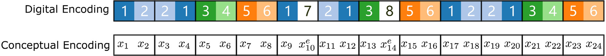
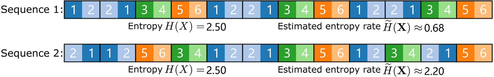
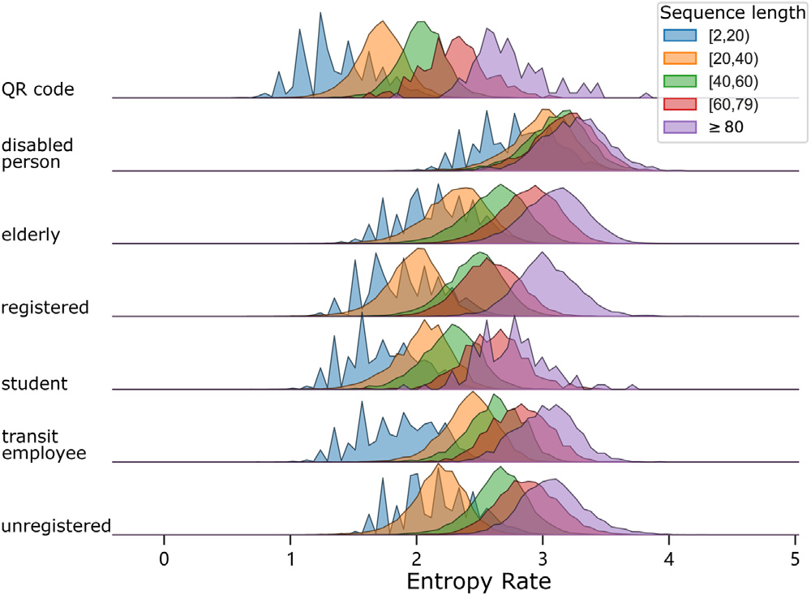
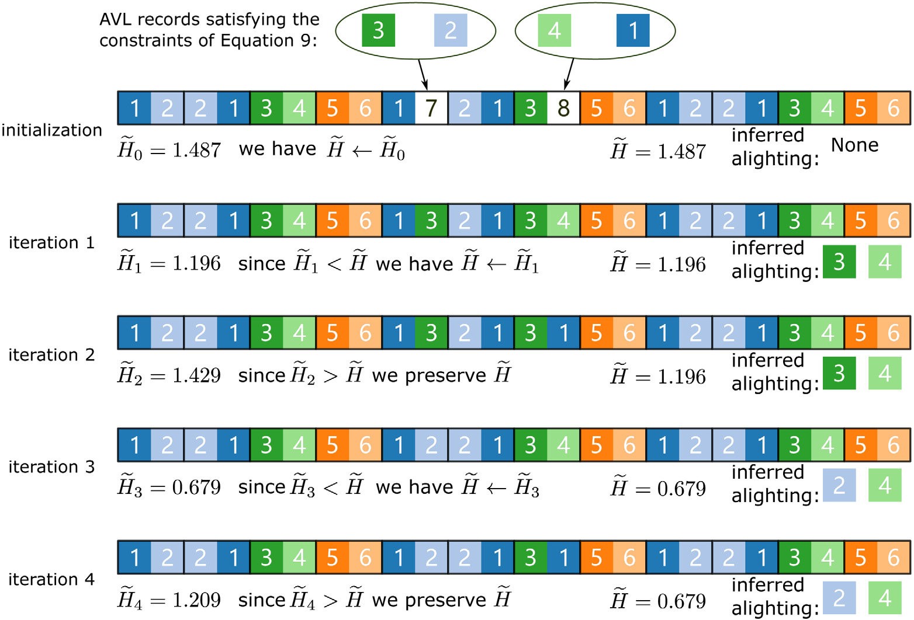

# Minimum entropy rate-improved trip-chain method for origin-destination estimation using smart card data 

Da Lei ${ }^{\mathrm{a}}$, Xuewu Chen ${ }^{\mathrm{a}, *}$, Long Cheng ${ }^{\mathrm{b}, *}$, Lin Zhang ${ }^{\mathrm{a}}$, Pengfei Wang ${ }^{\mathrm{a}}$, Kailai Wang ${ }^{\mathrm{d}}$<br>${ }^{a}$ Jiangsu Key Laboratory of Urban ITS, Jiangsu Province Collaborative Innovation Center of Modern Urban Traffic Technologies, School of<br>Transportation, Southeast University, China<br>${ }^{\mathrm{b}}$ Department of Geography, Ghent University, Krijgslaan 281 58, Ghent 9000, Belgium<br>${ }^{c}$ School of Civil Engineering and Transportation, South China University of Technology, Guangzhou, 510641, China<br>${ }^{\mathrm{d}}$ Department of Construction Management, University of Houston, Houston, TX, United States

## ARTICLE INFO

Keywords:
Entropy rate
Smart card data
Travel sequence
Public transportation
Travel regularity
O-D estimation

## A B STRACT

Smart card (SC) data has become one of the major data sources for transit passengers' behavior analysis, network modeling, and control optimization. Origin-destination (O-D) estimation has been recognized as a requisite step before utilizing the smart card data to investigate transit passengers' spatiotemporal dynamics or conduct other SC data-based transit modeling. In the recent decade, the extant literature has proposed various trip-chain-based methods for transit O-D estimation using SC data. However, one problem of the conventional trip-chaining estimation approach has been noticed but not paid enough attention to: O-D estimation of single transactions cannot be conducted since the trip-chain method generally requires at least two trip records per day to proceed with. Such a flaw in the classic trip-chain approach might lead to a considerable amount of data loss and inaccurate O-D estimation. This paper improved the existing trip-chain O-D estimation method by introducing a new framework based on the Minimum Entropy Rate (MER) criterion. The proposed MER-based method adopts a similar mechanism of noise reduction in information theory. The basic idea of our approach is to infer the alighting location of single trips using alternative stops that preserve passengers' travel regularity exhibiting in their mobility sequences. Our enhanced approach can estimate alighting stops for single trips with decent accuracy, thus preventing a potential massive data loss. Moreover, the study also provides an in-depth insight into the relationship between entropy rates estimated using trip sequences and passengers' travel regularity. The estimation results can further benefit future transit studies with reliable data sources.

## 1. Introduction

Smart card data has become the most common source of big data used in public transit studies like passenger behavior analysis and demand modeling of large transit systems due to its ease of use and wide availability (Welch and Widita, 2019). Origindestination (O-D) estimation has been recognized as a preliminary step before utilizing the smart card data to conduct various transit studies, thus attracting many research efforts in the recent decade (Morency et al., 2007; Barry et al., 2009; Wang et al., 2010; Ma et al., 2013; Kusakabe and Asakura, 2014; Bhaskar et al., 2014; Ma et al., 2017). The main problem these O-D estimation studies try to address is to infer the alighting time and stop of trips, as SC databases of most automated fare collection (AFC) systems only collect passengers' boarding information (Li et al., 2018). The trip-chain method is reported to be the most common approach adopted in

[^0]
[^0]:    * Corresponding authors.

    E-mail addresses: chenxuewu@seu.edu.cn (X. Chen), Long.Cheng@ugent.be (L. Cheng).
    https://doi.org/10.1016/j.trc.2021.103307
    Received 21 January 2021; Received in revised form 29 June 2021; Accepted 11 July 2021
    Available online 22 July 2021
    0968-090X/© 2021 Elsevier Ltd. All rights reserved.

Table 1
Proportion of daily single transaction in different studies.

| Paper | AFC or Location | Whole dataset size | Single-trip proportion | Exclude single trips? |
| :-- | :-- | :-- | :-- | :-- |
| Munizaga and Palma (2012) | Santiago, Chile | over 35 million | $5.4 \%$ | Yes |
| Gordon et al. (2013) | London Oyster and iBus | 21 million | $4.9 \%$ | Yes |
| Ma et al. (2013) | Beijing, China | about 4 million | around $42 \%{ }^{\circ}$ | Yes |
| Munizaga et al. (2014) | Santiago, Chile | over 20 million | $5 \%$ | No |
| Nunes et al. (2015) | Porto, Portugal | 3 million | $17.5 \%$ | Yes |
| Aliger et al. (2016) | GoCard in South-East Queensland | 184,074 | less than $12.3 \%{ }^{\circ}$ | Yes |
| Jung and Sohn (2017) | Seoul, South Korea | 12 million | $10 \%$ | Yes |
| Hora et al. (2017) | Porto, Portugal | 11 million | $8.06 \%$ (working days) | Yes |
| Cong et al. (2018) | Shaoxing, China | 949,228 | $31.5 \%$ | No |
| Kumar et al. (2018) | Twin Cities, Minnesota | 85,123 | $12.6 \%$ | Yes |
| Assemi et al. (2020) | GoCard in South-East Queensland | less than $12.3 \%{ }^{\circ}$ | Yes |  |

${ }^{\circ}$ Authors did not explicitly state the proportion of single trips in their datasets.
such O-D inferences. The basic idea is to infer alighting time and location under the assumption that the most probable location for a passenger to get off a transit vehicle is the stop closest to his/her next boarding location (Barry et al., 2002; Zhao et al., 2007; Farzin, 2008; Barry et al., 2009; Wang et al., 2011; Devillaine et al., 2012). In the recent decade, researchers have also proposed several modifications to improve the inference rate or estimation accuracy of the classical trip-chaining approach, i.e., relaxing the assumption that the alighting stop of the last trip and the boarding stop of the first trip on a given day are identical (Gordon et al., 2013; Alsger et al., 2016) (the current research also uses this assumption in the first phase of the alighting inference); incorporating geographical features of individual mobility to enhance inference accuracy (Gordon et al., 2013; Munizaga et al., 2014). Recent years have also witnessed an increase in the implementation of probabilistic and machine learning methods for improving the alighting estimation accuracy. For example, Kumar et al. (2018) proposed a multinomial logit route choice model to estimate the likelihood of a set of potential alighting stops and identified the one with the highest probability as the actual alighting stop. Based on a deep learning model, Jung and Sohn (2017) utilized SC data and land use information to estimate the alighting stops for bus passengers. Assemi et al. (2020) developed a neural network model to improve the alighting inference accuracy using SC data of transit passengers in Southeast Queensland, Australia. Such machine learning-based methods generally require data with both boarding and alighting details when training the model.

We noticed one flaw in the trip-chaining approach that has not received enough attention from the existing studies. The conventional trip-chain method and its variants cannot infer the alighting location of a passenger if he/she only takes a "single trip" in a day, as the approach itself requires at least two trips to form a chain for the estimation. The single trip here appertains to the case when a passenger only has one transit transaction in a day. Table 1 shows that the proportion of single-trip transit trips can vary across different transit systems. In some cases, single trips could constitute a large proportion of the whole transaction dataset. Most of the previous studies excluded such single transactions in the alighting estimation procedure, resulting in a potential data loss. A consensus in the recent literature indicates that more and more citizens make their daily trips using a combination of various travel modes as some emerging mobility-on-demand services (e.g., Uber, ZipCar, dockless bikesharing) are increasingly entering and transforming the transportation market (Dias et al., 2017; Yan et al., 2019; Cheng et al., 2019). The development of such travel-on-demand services leads to the growing variability of passengers' travel-mode combinations and result in the rising number of single trips in the transit AFC database. For example, the Nanjing Transit AFC database, described later in Section 2, shows that the single-trip proportion can now reach up to $30 \%$ per day. Given this trend, the inability of classic trip-chaining approaches to estimate the alighting of single-trip transactions could lead to an enormous amount of data loss for transit network modeling and passengers' travel behavior analysis using O-D estimation results. Moreover, a passenger's single trip in a day indicates his/her travel characteristics. The exclusion of single trips in the conventional trip-chain estimation would impair our capturing and understanding of the variability in passengers' travel choice behavior.

Trepanier and Chapleau (2006) pointed out that the existence of single trips is a relevant cause of failure in the estimation for alighting and suggested one should integrate historical transaction data for extracting more personal travel information when dealing with single trips. Munizaga et al. (2014) also observed that the presence of single trips might lead to a low matching rate in the O-D estimation procedure. They found that an essential proportion of single trips occur in the evening and the afternoon and suggested that the alighting stop of a single trip is likely to be identical to the first boarding stop of the next day (referred to as "return-home" assumption). Such an extra assumption is reported to apply to $7 \%$ of single trips. Cong et al. (2018) adopted Munizaga et al. (2014)'s assumption for the alighting estimation of single trips and reported an $8.6 \%$ increase in match rate in their case study. The plausibility of the return-home assumption needs to be further validated. For example, as shown in Fig. 1, single transactions in Nanjing transit systems are distributed throughout the day with morning and evening peaks. It is indicative that a large proportion of single transactions in Nanjing AFC systems would contradict the return-home assumption. We will delve deeper into this in Section 4.2.

To this end, there is a compelling need to develop an efficient method to estimate the alighting of single trips in order to prevent potential massive data loss and preserve the integrity of individual travel information. In this paper, we bridge the notion of travel regularity and the entropy rate of a trip sequence. Then, a destination inference algorithm is proposed for the alighting estimation of single transactions based on the minimum entropy rate (MER) criterion, referred to as a post-process of the trip-chain-based O-D


Fig. 1. Boarding time distribution of single trips in Nanjing. Nanjing Bus provides "early morning" service (from 12 pm to 5 am ) while the metro service starts from 5 am .
estimation. To be more specific, we complete the initial O-D estimation using the conventional trip-chaining approach. The O-D inference results are then arranged into individual mobility sequences by time followed by the estimation of entropy rates (as a measure of travel irregularity) based on travel sequences. We then select a transit stop recorded in vehicle operating logs, which minimize the entropy rate, as the alighting stop of the concerned single trip. The final estimation results highlight the MER-based estimation algorithm's capability to leverage information about travel regularity revealed in individual passengers' long-term travel trajectories. Our proposed method shows higher accuracy over a naive frequency-based method in single-trip destination inference. The algorithms we introduced to implement the estimation framework are automatic, nonparametric, parallelizable and feasible to similar entry-only AFC systems.

The remainder of this paper is organized as follows. Section 2 describes the data utilized in this study, followed by a brief introduction of the trip-chaining method and MER-based destination inference algorithm in Section 3. Section 4 presents OD estimation and validation results, followed by an investigation of passengers' travel regularity. Section 5 provides the main conclusions, limitations, and suggestions for future work.

# 2. Data description 

Estimating alighting time and location from individual travel transactions is a data-specific process. One can approximate bus arrival time at each stop solely based on SC boarding records if only the SC data is available. However, additional data sources like Automatic Vehicle Location (AVL) data would be an excellent complement to SC data for obtaining the complete records of transit service information since some stops might not have any boarding passengers. This study utilizes two types of data for one month (July 2020): (1) SC data (including bus and metro transactions) from the Nanjing Transit Automatic Fare Collection (AFC) system; (2) AVL data only available for buses. In Nanjing, metro passengers need to tap their smart cards when entering and leaving stops, while bus passengers are only required to tap their smart cards when boarding vehicles. The anonymous SC dataset contains information fields including transaction date, card ID, card type, vehicle ID (only in bus records), transaction starting time, transaction ending time (only in metro records), stop sequence ID, route, origin, and destination (only in metro records). Table 2 shows the number of SC holders of different card (payment) type. Elderly passengers, disabled people, students and transit employees enjoy various fare discounts ranging from $50 \%$ to $100 \%$ per transaction. Note that QR code is an emerging transit payment method in China that is popular among young adults due to its convenience. In Nanjing, metro and bus use the same AFC system; thus, we can construct passengers' complete transit travel sequences by linking their bus and metro transactions through card IDs. In the case study, we will only utilize metro transactions to validate and evaluate the feasibility and efficiency of the proposed method, as bus transactions do not contain any details about alighting stops.

The AVL data provide bus service information, including bus stop name, vehicle ID, route, arrival and departure time. A data cleaning procedure is implemented to exclude duplicate transactions and records with missing card ID or boarding information, resulting in the remaining 52 million valid SC data ( $93 \%$ of the raw dataset). Ordinarily, passengers with only one travel record in a day would be excluded from the dataset in previous O-D estimation studies as the trip-chain approach inherently requires at least two trip records. The current research preserves such single transactions, which could account for a large proportion in the whole dataset. Fig. 2 shows the distribution of various lengths of trip sequences across days. Single trips represented by the bar plot of "1-trip "sequences generally comprise more than $40 \%$ of Nanjing's daily total transit transactions.

Table 2
Description of different transit smart cards in Nanjing (July 2020).

| Card Type | Payment type | Number of cardholders | Discount off |
| :-- | :-- | :-- | :-- |
| QR code | virtual card | 887,936 | - |
| disabled people | physical card | 64,628 | $100 \%$ |
| elderly | physical card | $1,008,296$ | $50 \%$ to $100 \%$ |
| registered | physical card | 842,528 | $20 \%$ |
| unregistered | physical card | 862,530 | - |
| student | physical card | 205,921 | $50 \%$ |
| transit employee | physical card | 51,476 | $50 \%$ to $100 \%$ |


Fig. 2. Distribution of transit trip sequences of different lengths in Nanjing (July 2020). Bar plots correspond to the count of each type of daily trip sequence. Line plots represent the proportion of different trip sequences with day of week.

# 3. Methodology 

This section first discusses the conventional trip-chaining method employed to estimate alighting in the extant literature. A post-procedure based on Minimum Entropy Rate (MER) criteria aiming to estimate alighting time and stops for single transactions is then proposed to improve the match rate of transit O-D estimation.

### 3.1. OD estimation based on trip-chain approach

First introduced by Barry et al. (2002), the trip-chaining method makes two key assumptions: (1) the alighting stop of the current trip is close to the boarding stop of the next trip, and (2) most passengers end their last journey at (or close to) the stop where they start their first trip of the day. There are two parameters under the above assumptions we can tune: allowable transfer distance and transfer time. These two parameters function as a spatiotemporal inspection to exclude alternative alighting stops of trips that contradict the above assumptions. Many existing studies have evaluated the impact of different values of these two parameters on the O-D estimation accuracy. For a detailed discussion of the parameter choice, we refer to Alsger et al. (2016). In the later case study, we set the values of allowable transfer distance and time to be 400 m and 30 min in the O-D estimation.

Fig. 3 presents the basic idea of how to estimate alighting location under the assumptions mentioned above. A passenger initially boards at transit stop B1 of Route 1. The passenger's travel sequence in the dataset shows he/she then boards at B2 of Route 2. The transit stop A1 within the transfer constraints and closest to B2 is estimated to be his/her first alighting stop. The arrival time of the vehicle at A1 regarded as the estimated alighting time of the first trip can be queried from AVL records or estimated by other passengers' boarding time at A1 from their SC data if the AVL data is unavailable. Using the same mechanism, we can estimate A2 within the spatiotemporal proximity to B3 as the passenger's second alighting stop. For the third and final trip, we only implement the spatial (distance) check to find the closest stop to B1 for inferring the alighting stop. Besides the two key assumptions under which the O-D estimation proceeds with, trivial but necessary rules are also applied to avoid inaccurate estimation such as: for the trip, the alighting stop sequence ID must be greater than that of the boarding stop; estimated alighting time must lie between the boarding time of the concerned passenger's current and next travel transactions. Fig. 4 presents a complete O-D estimation


Fig. 3. An illustration of O-D estimation using existing trip-chaining approach.
procedure, including a prior-process using the trip-chaining approach (Nassir et al., 2011; Alsger et al., 2016) and a post-process for estimating alighting locations of single transactions drawn on the travel regularity exhibited from trip trajectories.

# 3.2. Definition and construction of mobility sequence 

We first provide the definition of mobility sequence and travel regularity before introducing the alighting-estimation method for single trips. In this study, mobility sequence is defined as an ordered chain of boarding and alighting stops instead of trips or movements for the purpose of alighting estimation. A passenger's mobility sequence can be generated by sorting his/her long-term transit trip records by transaction time and encode boarding and alighting stops accordingly. As shown in the top layer visualization of Fig. 5, we encode a passenger's mobility sequence with different digits and colored squares. Each rectangle represents one trip within which the two consecutive squares denote boarding and alighting stops respectively. The white (empty) squares denoting unestimated alighting of single trips using the classic trip-chain method are encoded with random and unique numbers that have not appeared in colored squares. Following this definition, the mobility sequence can capture passengers' travel patterns in terms of an array of discrete events. For example, there is a clear pattern [1,2,2,1,3,4,5,6] repeating in the sample mobility sequence presented in Fig. 5. The first four events [1,2,2,1] mean that the passenger boards at stop 1 and alights at stop 2 in the first trip, and then starts his/her next trip from the alighting stop of the first trip to travel back to stop 1 , which indicates a commuting pattern.

Given such individual mobility sequences, a natural thought is to estimate/approximate these empty slots referring to single trips based on passengers' travel regularity revealed in their long-term journey trajectories. For example, when estimating alighting stops for single trips of the sample sequence, we may find it preferable to replace label " 7 " and " 8 " in the empty squares with " 2 " and " 4 " (if stop 2 and stop 4 appear in the corresponding AVL data), to match the repeated pattern we mentioned above. To this end, a measure of travel regularity (or irregularity) is needed and the value of this measure is expected to increase (or decrease for a travel irregularity measurement) as we implement the replacement. However, the sample sequence shown in Fig. 5 is not derived from real-world data and is constructed only for illustration purpose. Obviously, it would be very challenging to identify travel patterns and evaluate travel regularity for actual mobility sequences with longer lengths and considerably higher variability compared to the sample sequence. Thus, we propose and mathematically define a travel regularity measure based on entropy rate in the Section 3.3 and Section 3.4.

### 3.3. Travel regularity measurement

In the recent decade, studies across a diverse stream of disciplines have adopted entropy-based methods to simplify and denoise models from audio signal, text, image and electroencephalogram wavelet (Mahajan and Morshed, 2014; Figlus et al., 2016; Henter and Kleijn, 2016; Yu et al., 2017). Simplification or noise reduction is commonly defined as a decrease in quantitative information measures like Shannon entropy and its variants. The empty boxes/elements representing unestimated alighting stops of single trips perform like "noise" in the sample mobility sequence shown in Fig. 5 as we label these unestimated alighting stops with unique numbers (" 7 " and " 8 " in the illustration). Therefore, we can propose a mechanism similar to that of signal denoising or simplification for the alighting inference of single trips. Recent years have also observed increasing efforts on implementing entropy-based measurements for analyzing transit passengers' regularity in the transport community (Rodriguez-Carrion et al., 2015; Goulet-Langlois et al., 2017; Lei et al., 2020), further demonstrating the potential and feasibility of entropy-based methods for estimating single-trip alighting stops by leveraging the information of passenger travel regularity. We start our discussion on the mechanism of single-trip alighting inference by mathematically defining the travel regularity of individual transit passengers.


Fig. 4. Procedure of alighting inference including a prior-estimation using trip-chain method (Alager et al., 2016) and a post-estimation using entropy rate.

Given any discrete random variable $X$ with $m$ probable events (e.g., $m$ different possible stops at which a passenger boarding or alighting a bus), entropy is defined as the function of the probability of a specific event $p(x)$ to measure the randomness of $X$ (Adjeroh et al., 2008),

$$
H(X)=-\sum_{i=1}^{m} p\left(x_{i}\right) \log _{2} p\left(x_{i}\right)
$$



Fig. 5. Encodings of an individual mobility sequence after the initial O-D estimation using the classic trip-chaining approach. In both encodings, each rectangle stands for a transit trip within which the first and second squares represent boarding and alighting stops respectively. Identical stops are encoded with the same color and number in the digital encoding. In the conceptual encoding, the mobility sequence denotes a realization of $\mathbf{X}$ since we define each passenger's travel behavior as a random process $\mathbf{X}$. The unestimated alighting stops of single trips are represented by white (empty) squares in the digital encoding and the variable $x$ with a superscript " e " in the conceptual encoding.

Entropy can capture passengers' travel variability in terms of the number/frequency of unique stops a passenger boarding or alighting. However, the order where stops are visited is another crucial property embedded in travel sequences for evaluating individual mobility behavior, which cannot be identified by Shannon entropy. In the transport community, Goulet-Langlois et al. (2017) and Lei et al. (2020) adopted entropy rate to measure the extent to which ordered sequences of travel events repeat. The decreasing entropy rate of travel event sequences means an increasing travel pattern regularity and vice versa. In this study, we make a reasonable assumption that one passenger's long-term transit travel is a stopary process $\mathbf{X}$. The random variable $X$ denotes boarding or alighting with a discrete probability $p(x)$ at a transit stop $s$ along a route $\{s: s \in S\}$.

For such a stopary and discrete-time process, entropy can be generalized by taking the limit to quantify the asymptotic rate at which the entropy of sub-sequence $\left\{X_{t+1}^{t+T}\right\}=\left\{X_{t+1}, X_{t+2}, \ldots, X_{t+T-1}, X_{t+T}\right\}$ changes with $T$ (Gao et al., 2008). Thus, we have the following definition of entropy rate $H(\mathbf{X})$ for the random process $\mathbf{X}$,

$$
H(\mathbf{X})=\lim _{T \rightarrow \infty} \frac{1}{T} H\left(\left\{X_{t+1}^{t+T}\right\}\right)=\lim _{T \rightarrow \infty} \frac{1}{T} H\left(X_{t+1}, X_{t+2}, X_{t+3}, \ldots, X_{t+T}\right) \geq 0
$$

For brevity, we assume that one passenger's travel process starts at $t=0$. It has been proved that the entropy rate of a stopary stochastic process exists and equals to (Cover, 1999),

$$
H(\mathbf{X})=\lim _{T \rightarrow \infty} H\left(X_{T} \mid\left\{X_{1}^{T-1}\right\}\right)=\lim _{T \rightarrow \infty} H\left(X_{T} \mid X_{T-1}, \ldots, X_{2}, X_{1}\right)
$$

where the conditional entropy $H\left(X_{T} \mid\left\{X_{1}^{T-1}\right\}\right)$ is inferred as (see details in Gao et al. (2008)),

$$
H\left(X_{T} \mid\left\{X_{1}^{T-1}\right\}\right)=-\sum_{\left\{x_{1}^{T}\right\} \in\left\{x^{T}\right]: s \in S\}} p\left(\left\{x_{1}^{T}\right\}\right) \log _{2} \frac{p\left(\left\{x_{1}^{T}\right\}\right)}{p\left(\left\{x_{1}^{T-1}\right\}\right)}
$$

In Eq. (4), $\left\{\left\{s^{T}\right\}: s \in S\right\}$ denotes the set of possible mobility sequence of length $T$ for a specific passenger. In other words, $s^{T}$ denotes all possible ordered length-T sequences of boarding and alighting stops for a transit user. $p\left(\left\{x_{1}^{T}\right\}\right)$ represents the joint probability of a mobility sequence of length $T$ where $\left\{x_{1}^{T}\right\}$ is a specific instance of $\left\{\left\{s^{T}\right\}: s \in S\right\}$. The bottom layer of Fig. 5 shows an example of $\left\{x_{1}^{T}\right\}$. Allied with Eq. (4), Eq. (3) provides us with the theoretical definition of entropy rate of the individual travel process $\mathbf{X}$. Since the entropy rate depends on the order of visited locations, it has been reported to be effective for distinguishing transit passengers who exhibit different travel patterns even though having the same location-frequency distribution. However, estimating the entropy rate of the random process $\mathbf{X}$, only based on $\left\{x_{1}^{T}\right\}$ presenting a length-T realization instance drawn from $\mathbf{X}$, is challenging for several reasons. (1) we cannot compute the limit for $T \rightarrow \infty$ as we only observe finite samples of the process; (2) the joint probability distributions $p\left(\left\{x_{1}^{T}\right\}\right)$ and $p\left(\left\{x_{1}^{T-1}\right\}\right)$ are unknown.

# 3.4. Estimation of entropy rate 

A robust estimator of entropy rate should be able to hold the assumption that the process is ergodic; thus, the statistical properties of X can be inferred from a sufficiently long random sample. Three popular entropy rate estimators have been proposed in the literature, namely context-tree weighting (CTW) based entropy estimator (Willems, 1998), Burrows-Wheeler transform (BWT) based estimator (Cai et al., 2004; Goulet-Langlois et al., 2017; Lei et al., 2020) and Lempel-Ziv (LZ) based methods (Ziv and Lempel, 1977; Wyner and Ziv, 1989; Damiani et al., 2020). These estimators exhibit different performances depending on data properties (e.g., size of information sequence). In this study, we applied the LZ-based method to estimate travel regularity for transit passengers since this entropy-rate estimator possesses several beneficial properties: (1) it shows consistency as its estimated output converges to the exact value of entropy rate for $T \rightarrow \infty$; (2) it performs robustly even on short sequences; (3) it is very simple to implement. The second advantage of the LZ-based estimator mentioned above is crucial for this research. The size of mobility sequences derived from SC data is generally much shorter than that of simulated sequences in previous entropy-rate studies (Cai et al., 2004).

The family of LZ-based estimators depends on the computation of the lengths of repeated subsequences in the data. Specifically, given one passenger's mobility sequence $\left\{x_{i}^{T}\right\}$, an LZ-based estimator calculates the longest match-length $l_{i}\left(\left\{x_{1}^{T}\right\}\right)$ for every position $i$. As shown in Eq. (5), $l_{i}\left(\left\{x_{1}^{T}\right\}\right)$ represents the longest length of segment $\left\{x_{i}^{t+m-1}\right\}$ starting at $i$ which also appears as $\left\{x_{j}^{j+m-1}\right\}$ beginning at the preceding position $j(j \leq i-1)$.

$$
l_{i}\left(\left\{x_{1}^{T}\right\}\right)=\max \left\{\begin{array}{c|c}
m & \left\lvert\, \begin{array}{c}
m \in\{0, \ldots, T-i+1\} \\
\left\{x_{i}^{t+m-1}\right\}=\left\{x_{j}^{j+m-1}\right\} \\
j \in\{1, \ldots, i-1\}
\end{array}\right. \\
\hline
\end{array}\right.
$$

Ornstein and Weiss (1993) and Wyner and Ziv (1989) proved that, given an infinite sequence $\mathbf{x}=\left\{x_{1}, \ldots, x_{m}\right\}$, the matchlength $l_{i}\left(\left\{x_{i}^{T}\right\}\right)$ of a subsequence $\left\{x_{i}^{T}\right\}$ starting at any fixed position $i$ grows logarithmically as $T$ increases. Also, the quantity $\frac{l_{i}\left(\left\{x_{i}^{T}\right\}\right)+1}{\log _{2}(T)} \rightarrow \frac{1}{H(\mathbf{x})}$ as $T \rightarrow \infty$ with probability 1 , as presented in Eq. (6).

$$
p\left(\lim _{T \rightarrow \infty} \frac{l_{i}\left(\left\{x_{i}^{T}\right\}\right)+1}{\log _{2}(T)}=\frac{1}{H(\mathbf{x})}\right)=1
$$

Thus we can use the quantity $\frac{l_{i}\left(\left\{x_{i}^{T}\right\}\right)+1}{\log _{2}(T)}$ to estimate entropy rates. Kontoyiannis et al. (1998) demonstrated that by averaging different $l_{i}\left(\left\{x_{i}^{T}\right\}\right)$ starting from various positions $i$, we could fully use the data and decrease estimation variance, and define the following LZ based estimator,

$$
\widetilde{H}_{T}(\mathbf{x})=\left[\frac{1}{T} \sum_{i=1}^{T} \frac{l_{i}\left(\left\{x_{i}^{T}\right\}\right)+1}{\log _{2}(T)}\right]^{-1}
$$

For a finite sequence $\left\{x_{1}^{T}\right\}$ of length $T$ beginning at position 1 , a robust estimator could be,

$$
\widetilde{H}\left(\left\{x_{1}^{T}\right\}\right)=\frac{T \log _{2}(T)}{\sum_{i=1}^{T}\left(l_{i}\left(\left\{x_{1}^{T}\right\}\right)+1\right)}
$$

We propose Algorithm 1 to estimate the entropy rate shown in Eq. (8). The algorithm first checks whether the length $(T)$ of the sequence is no less than 2 . If $T=1$, it returns 0 since a sequence of length 1 shows invariant and always has a entropy rate of 0 . Otherwise, we initialize sum denoting the denominator of Eq. (8) with $T$ since the longest match for the complete sequence $\left\{x_{i}^{T}\right\}$ is the sequence itself. Since the algorithm starts at position $i=2$, there is no need to add the extra 1 that appeared in the denominator of Eq. (8). The algorithm then iteratively counts the number of repeated location as $i \rightarrow T$ and $j \rightarrow(i-1)$ (thus compute all match-lengths $m$ for each position $i$ ), and find out the longest match $l$ (presented as $l_{i}\left(\left\{x_{1}^{T}\right\}\right)$ in Eq. (5)) from the set of all match-length $\{m\}$ for every position $i$. The estimated entropy rate can be eventually calculated through $\frac{T \log _{2}(T)}{\text { sum }}$ after summing up all longest match-length $l$ of each position $i$.

# Algorithm 1 LZ based entropy rate estimator 

Input: $\left\{x_{i}^{T}\right\}$ which is a finite individual mobility sequence of length $T$.
Output: $\widetilde{H}\left(\left\{x_{1}^{T}\right\}\right)$, the estimated value for the entropy rate of a transit passenger's travel process $\mathbf{X}$ which generates $\left\{x_{1}^{T}\right\}$.
Variables: $m$ is one of the match-length when evaluating $\left\{x_{i}^{T}\right\}$ at position $i ; l$ is the longest match length at position $i$ of $\left\{x_{1}^{T}\right\} ;$ sum is the sum of all longest match-length $l$ 's for each position of $\left\{x_{1}^{T}\right\}$.
if $T==1$ then
return 0
end if
sum $\leftarrow T$
for $i=2$ to $T$ do
$l \leftarrow 0$
for $j=1$ to $i-1$ do
$m \leftarrow 0$
while $i+m \leq T$ and $x_{j+m}==x_{i+m}$ do
$m \leftarrow m+1$
end while
if $m>l$ then
$l \leftarrow m$
end if
end for
sum $\leftarrow$ sum $+l$
end for
return $\frac{T \log _{2}(T)}{\text { sum }}$

Given Eq. (1) and Algorithm 1, we compute and estimate the entropy and entropy rate of two synthetic mobility sequences encoded with digits and present the results in Fig. 6, to further demonstrate the reason why we choose the entropy rate, instead of the entropy, as the measure of passengers' travel regularity. Sequence 1 is designed to exhibit a periodic travel pattern, while Sequence 2 is generated by breaking that periodicity via randomly switching some trips in Sequence 1. Thus, these two sequences would have the same combination of trips (visited stops) but different orders. Fig. 6 shows that these two synthetic mobility sequences have an identical entropy but considerably different entropy rates estimated using the LZ-based estimator. Intuitively, the entropy can only convey the frequency or randomness of visited stops. In contrast, the entropy rate can capture the periodicity



Fig. 6. Comparison of entropy and entropy rate. The frequency of each digital label in sequences is used to approximate the probability of $x_{i}$ in Eq. (1).
other than the frequency of visitations in Sequence 1. In this experiment, the lower entropy rate of Sequence 1 suggests a greater travel regularity compared to Sequence 2.

# 3.5. MER-based single-trip alighting inference 

Drawing on the above discussion, we now restate the key assumption we proposed above for inferring the alighting of single trips: the empty squares in mobility sequences (e.g., $x_{i}^{e}$ of $\left\{x_{1}^{T}\right\}$ presented in Fig. 5) should be the ones that preserve travel regularity exhibited in passengers' long-term trip sequence. Thus, we can infer these empty alighting slots $x_{i}^{e}$ by identifying the potential destination stop that minimizes the entropy rate estimated using $\left\{x_{i}^{T}\right\}$. Lower entropy rate should assure a more accurate alighting estimation of single trips. Moreover, the alighting stop selected from a set of alternative transit vehicle arrival records in AVL data must satisfy four service-schedule constraints (shown in Eq. (9)) other than the minimum entropy rate (MER) hypothesis: (1) the alighting stop ID should be greater than that of the boarding stop. (2) the corresponding alighting time of the selected stop must be behind the boarding time. (3)(4) the estimated departure record should be of the same transit route and vehicle as the passenger's boarding record. Note that these constraints also apply to the conventional trip-chain method presented in Section 3.1.

$$
\begin{aligned}
& \min _{x_{i}^{e} \in S} \widetilde{H}\left(\left\{x_{1}^{T}\right\}\right) \\
& \text { s.t. } \operatorname{StOPID}\left(x_{i}^{e}\right)>\operatorname{StOPID}\left(x_{i-1}\right) \\
& \operatorname{TIME}\left(x_{i}^{e}\right)>\operatorname{TIME}\left(x_{i-1}\right) \\
& \operatorname{ROUTE}\left(x_{i}^{e}\right)=\operatorname{ROUTE}\left(x_{i-1}\right) \\
& \operatorname{Vehicle}\left(x_{i}^{e}\right)=\operatorname{Vehicle}\left(x_{i-1}\right)
\end{aligned}
$$

The entropy of a discrete random variable is a concave function reaching minima at the simplex corner points (Cover, 1999; Henter and Kleijn, 2016). Thus, entropy minimization is a non-convex optimization problem (and so is the entropy rate minimization shown in Eq. (9)). Trivial local minima may arise during numerical optimization procedure. However, we can obtain the optimum of our specific MER problem by greedily iterating every possible alighting stop recorded in the AVL data, since the number of potential alighting locations satisfying the service-schedule constraints mentioned above are usually very limited. To this end, we propose Algorithm 2 to estimate alighting time and stops of single trips using the MER method.

Fig. 7 illustrates the operation of Algorithm 2 using the same sample sequence shown in Fig. 5. Fig. 7 first estimates the entropy rate $\widetilde{H}_{0}$ of the concerned mobility sequence with unestimated alighting stops labeled by random and unique digits (" 7 " and " 8 " in the sample sequence). $\widetilde{H}$ is initialized with $\widetilde{H}_{0}\left(\widetilde{H} \leftarrow \widetilde{H}_{0}\right) . \widetilde{H}_{0}$ is always the maximum value for $\widetilde{H}$ since the unestimated stops are assigned with stop labels that have never appeared in the sequence (unseen labels increase the value of entropy rates). Our assumption states that the alighting stops of single transactions should match as much as possible to passengers' travel patterns exhibiting in their historical travel records. Thus, the optimal inferences for the unestimated alighting should be the ones that minimize the entropy rate. Therefore, the algorithm tries to find alternatives (for the virtual stops " 7 " and " 8 ") satisfying all constraints shown in Eq. (9) from the AVL data in an iterative manner. In the first iteration, we calculate the entropy rate $\widetilde{H}_{1}$ of the sample sequence where the labels of the unestimated stops have been replaced with the first set of possible alighting candidates (" 3 " and " 4 "). Since $\widetilde{H}_{1}<\widetilde{H}$, we update $\widetilde{H}$ with $\widetilde{H}_{1}\left(\widetilde{H} \leftarrow \widetilde{H}_{1}\right)$ and preserve the currently inferred alighting stops " 3 " and " 4 ". In iteration 2, the algorithm continues to conduct Algorithm 1 to estimate the entropy rate $\widetilde{H}_{2}$ of the sample sequence where the empty slots have been substituted with another set of potential alighting stops (" 3 " and " 1 "). These two inference candidates are rejected since they fail to further decrease $\widetilde{H}\left(\widetilde{H}_{2}>\widetilde{H}\right)$. After exploring all possible single-trip alighting, the algorithm outputs the minimum entropy rate and the corresponding mobility sequence where the inferred alighting stops are our best guess for the alighting stops of single transactions. In this example, the optimal inferences labeled by " 2 " and " 4 " are identified in iteration 3.

## 4. Results

This section first investigates the distribution of entropy rate exhibiting passengers' travel regularity based on which we infer the alighting of single trips. We then discuss the evaluation of O-D estimation using the classic trip-chain method for chainable transactions and a post-process of alighting inference based on the MER approach for unchained single trips.

# Algorithm 2 Alighting stop estimation for daily single trips 

Input: Each passenger's one-month mobility sequence $\left\{x_{1}^{T}\right\}$ after the conventional trip-chaining estimation introduced in Section 3.1.
Output: updated $\left\{x_{1}^{T}\right\}$ in which all empty alighting stops of single trips are inferred using MER method; estimated entropy rate $\widetilde{H}$ of $\left\{x_{1}^{T}\right\}$
Variables: $T$ is the length of the mobility sequence $\left\{x_{i}^{T}\right\}$ for an individual passenger; $E$ is the set of uninferred alighting slots $x_{i}^{e}$ in $\left\{x_{1}^{T}\right\} ; A_{i}$ is the set of potential alighting stops for each empty slot $x_{i}^{e}$ at position $i$ of the sequence.

```
if \(T \leq 2\) then
    return \(\left\{x_{1}^{T}\right\}\)
end if
\(E \leftarrow\) find all empty alighting slots \(x_{i}^{e}\) 's in \(\left\{x_{1}^{T}\right\}\)
\(n \leftarrow \operatorname{length}(E)\)
if \(n==0\) then
    return \(\left\{x_{1}^{T}\right\}\)
end if
\(\left\{x_{1}^{T}\right\} \leftarrow\) encode all empty alighting slots \(x_{i}^{e}\) in \(E\) with unique random numbers.
\(\widetilde{H} \leftarrow\) compute the initial entropy rate of \(\left\{x_{1}^{T}\right\}\) using Algorithm. 1
for each \(x_{i}^{e} \in E\) do
    \(A_{i} \leftarrow\) find all probable alighting stops of \(x_{i}^{e}\) which satisfy constraints in Equation (9)
    \(k_{i} \leftarrow \operatorname{length}\left(A_{i}\right)\)
end for
\(\{\widetilde{E}\} \leftarrow\) create a total number of \(\prod_{j=1}^{e}\left(k_{i}\right)_{j}\) possible combinations \(\widetilde{E}\) by selecting one \(\widetilde{x_{i}^{e}}\) from each \(A_{i}\)
for each \(\widetilde{E}\) do
    \(\left\{x_{1}^{T}\right\}^{\prime} \leftarrow\) update \(x_{i}^{e}\) in \(\left\{x_{1}^{T}\right\}\) using \(\widetilde{E}\)
    \(\widetilde{H}\left(\left\{x_{1}^{T}\right\}^{\prime}\right) \leftarrow\) compute entropy rate using Algorithm. 1
    if \(\widetilde{H}\left(\left\{x_{1}^{T}\right\}^{\prime}\right)<\widetilde{H}\) then
        \(\widetilde{H} \leftarrow \widetilde{H}\left(\left\{x_{1}^{T}\right\}^{\prime}\right)\)
        \(\left\{x_{1}^{T}\right\} \leftarrow\left\{x_{1}^{T}\right\}^{\prime}\)
    end if
end for
return \(\left\{x_{1}^{T}\right\}, \widetilde{H}\)
```


### 4.1. Regularity measure

Before we jump to evaluating the alighting inference and exploring the impact of entropy rates on the alighting estimation accuracy, we first investigate how the entropy rate, as the regularity measure, varies across different types of cardholders with various trip frequencies. In Algorithm 2, we calculated the entropy rate of each transit passenger during the alighting inference for single trips. Clustering the estimation results by card type, we plot the entropy rate distribution of different types of transit passengers in Fig. 8. For our visualization purpose, entropy-rate distributions of the same sequence length across distinct smart card holders are normalized.

Some of these distributions present multiple peaks with varying entropy rates, indicating that we can further subdivide each type of cardholders into passenger groups with different levels of travel regularity. In general, the entropy rate distributions capture a higher travel regularity among QR code users, students and registered card passengers, compared to disabled people, unregistered card users and the elderly. This is an expected result since activities of the former three types of transit passengers are considered to be more compulsory than those of the later types. Within the same card type, passengers with longer monthly trip sequences tend to show higher entropy rates. Fig. 8 presents the distributions of entropy rates arranging from left to right in ascending order of sequence length. However, we found that, as shown in Fig. 9, the order of these entropy-rate distributions reversed in almost every card type of passengers when estimating individuals' entropy rates using only at most the first 19 transactions during the study period (to limit the length of all sequences into the range $[2,19)$ ). This indicates that the comparison of entropy rates between two individual passengers is only deemed meaningful if their mobility sequences are of equal lengths.

To give a concrete example of the difference in travel regularity between regular and irregular transit passengers, we visualize 40 mobility sequences (within) of passengers with entropy rates $\leq 2$ and $\geq 4$ respectively, in Fig. 11 and Fig. 12. For simplicity, these figures only present the first 30 transit transactions of the 40 passengers. Each row of the visualization matrix denotes the mobility sequence for an individual. Each square in one row represents a visited alighting/boarding stop, and different colors in the same row stand for different transit stops. Note that identical colors in different rows denote different visited stops for various passengers. Fig. 11 indicates passengers with relatively low entropy rates exhibiting certain repeated travel patterns, even though these patterns might not be strictly regular and periodic. Note that rectangles appearing in mobility sequences are formed by two squares with



Fig. 7. An illustration of the MER-based alighting inference.


Fig. 8. Entropy rate distributions of different smart card holders with varying monthly travel frequencies.
the same color, suggesting the passenger ends one trip and starts the next trip at the same transit stop (e.g., a same-stop transfer). However, when we take a close look at each row of Fig. 12, it is difficult for us to find duplicate squares with the same color or identify any specific pattern in sequences. Fig. 12 shows that passengers with considerably high entropy rates present significant variability in their long-term travel behavior.

# 4.2. Entropy rate and single-trip O-D estimation accuracy 

As we discussed in Section 3, we implement the trip-chaining approach to conduct the first round of O-D estimation for transit transactions that can form a chain in a day. We reconstruct one-month mobility sequences for all transit passengers based on the estimation results, then implement the proposed MER method to estimate alighting stops for single trips. Our O-D estimation validation procedure is performed drawn on metro transactions containing both boarding and alighting information. The last section demonstrates the capability of entropy rate to capture variability in passengers' travel trajectories, based on which we infer the


Fig. 9. Entropy rate distributions of different smart card holders with varying monthly travel frequencies. Entropy rates of mobility sequences with length over 19 are estimated using their first 19 transactions.


Fig. 10. Distribution of monthly mobility sequence length.
alighting of single trips. By leveraging regularity or "memory" in mobility sequences, we could identify the most probable alighting stop for a single transaction. This section investigates the impact of entropy rate on single-trip O-D estimation accuracy for mobility sequences with different lengths. Moreover, we implement the single-trip alighting inference based on the return-home assumption proposed by the existing literature (Munizaga et al., 2014; Cong et al., 2018) for comparison. As its name implies, the assumption suggests using the boarding information from the first trip of the next day to estimate alighting stops for single transactions. The results of the single-trip O-D inference based on the return-home assumption serve as a benchmark for demonstrating the validity and efficiency of our proposed MER method.

As shown in Fig. 13, average estimation accuracy logarithmically grows as the entropy rate decreases. This is consistent with our assumption that the alighting estimation of single trips for passengers with great travel regularity should benefit more from the "memory" in mobility sequences, compared to passengers with small regularity. At high entropy rates, the estimation performance of longer travel sequences is better than that of shorter sequences. An expected result is that a long mobility sequence is inclined to have a high entropy rate, while short sequences tend to have low entropy rates. In general, our proposed MER-based method outperforms the alighting estimation approach based on the return-home assumption in terms of alighting inference accuracy since most transit passengers exhibit entropy rates of less than 3, as shown in Figs. 8 and 10, which ensures a decent estimation performance. It is also indicative that lower entropy rates are required to guarantee some level of expected estimation accuracy when inferring the single-trip alighting in shorter mobility sequences compared to longer sequences. The alighting inference accuracy of single transactions based on the return-home assumption is not desirable in our case study. This could be attributed to the evidence against the return-home assumption, which is the fact that single trips in our case distribute throughout the day instead of concentrating in the afternoon or evening, as presented in Fig. 1.

Based on logistic regression, we also investigate the potential impact of factors including entropy rate, length of monthly mobility sequence, number of unestimated alighting using the trip-chaining approach and number of correct alighting inferences using the trip-chain method on the estimation accuracy of single-trip alighting inference. A binary number indicating whether or not an alighting stop is inferred correctly is used as the dependent variable ( 1 for correct and 0 for incorrect). The regression model utilizes the method of maximum likelihood estimation to fit the data. The log-likelihood (LL) of the model concerning all explanatory


Fig. 11. Mobility sequences of 40 transit passengers with entropy rate $\leq 2$. Each row denotes one passenger's first 30 transit trips ( 60 visited stops) in one month. Squares with different colors in the same row stand for different boarding/alighting stops. The colorbar on the right-hand side presents the digital encoding for transit stops appearing in passengers' mobility sequences. (For interpretation of the references to color in this figure legend, the reader is referred to the web version of this article.)


Fig. 12. Mobility sequences of 40 transit passengers with entropy rate $\geq 4$. Each row denotes one passenger's first 30 transit trips ( 60 visited stops) in one month. Squares with different colors in the same row stand for different boarding/alighting stops. The colorbar on the right-hand side presents the digital encoding for transit stops appearing in passengers' mobility sequences. (For interpretation of the references to color in this figure legend, the reader is referred to the web version of this article.)
variables is computed, while the log-likelihood of the null model (LL-Null) is calculated when only the intercept term is included. Based on "LL" and "LL-Null", we estimate McFadden's R squared measure (Pseudo $R^{2}$ ) and log-likelihood ratio (LLR) $p$-value.
Table 3 shows the regression results when all the four variables are included in a single model. The LLR $p$-value indicates that the model is relevant. The sequence length and unestimated alighting count are invalid estimators since their p-values being greater


Fig. 13. Accuracy comparison between the MER-based method and the approach using return-home assumption for single-trip alighting estimation. The bottom $x$-axis presents an tick array of decreasing entropy rates for the MER-based method. The top $x$-axis shows time of day for the accuracy distribution of alighting inference using return-home assumption.

Table 3
Logistic regression with four variables.

| Model | DF | Log likelihood (LL) | LL-Null | Pseudo $R^{2}$ | LLR p-value $^{\text {a }}$ |
| :-- | :-- | :-- | :-- | :-- | :-- |
| Regression with four explanatory variables | 4 | -7059.4 | -9362.6 | 0.246 | 0.000 |
| Parameter estimates |  |  |  |  |  |
| Term | coef | std. err | p-value $^{\text {a }}$ | Lower CL 95\% | Upper CL 95\% |
| Intercept | 1.6639 | 0.022 | 0.000 | 1.620 | 1.708 |
| Entropy rate | -0.5388 | 0.007 | 0.000 | -0.552 | -0.526 |
| Num. of total transactions | 0.0105 | 0.006 | 0.074 | 0.008 | 0.014 |
| Num. of unestimated alighting | 0.0078 | 0.005 | 0.145 | 0.007 | 0.018 |
| Num. of accurate alighting inference | 0.0591 | 0.024 | 0.015 | 0.111 | 0.123 |

${ }^{a}$ Level of significance $a=5 \%$.
than 0.05 . Drawing on the above discussion, we conclude that the entropy rate and the number of correct inferred alighting using the trip-chaining method are more crucial factors influencing the estimation accuracy of single trips.

# 4.3. Entropy-rate threshold and overall estimation performance 

In the last section, we revealed that the entropy rate and the number of correct alighting inferences using the trip-chaining approach are the two significant factors affecting the estimation accuracy of single transactions. Extant studies have investigated the impact of other two parameters - allowable transfer time and distance - on the alighting inference accuracy of the trip-chain method. For an in-depth discussion of the parameter choice, we refer to Alsger et al. (2016) and Assemi et al. (2020). The remaining controllable factor for optimizing alighting estimation accuracy is entropy rate. Lying at the heart of the proposed MER-based method, different entropy rates render different single-transaction alighting inference accuracy for mobility sequences of various lengths, as shown in Fig. 13.

In this section, we first present a comparison between daily count distributions of various types of metro transactions, namely the unchained, the chained and the single, excluding using any entropy-rate thresholds in the procedure of alighting inference. As presented in Fig. 14, the estimation accuracy of the unchained is consistently slightly smaller than that of the chained transactions across different types of passengers. The MER-based alighting inference without setting entropy-rate thresholds (green bars in Fig. 14) generally shows worse performance than the trip-chaining-based alighting estimation (blue and orange bar plots in Fig. 14). The potential reasons are as follows. First, the alighting inference of single transactions is based on the mobility sequences constructed from the trip-chain approach-based estimation results where some inferred alighting might not be correct. Moreover, mobility sequences with considerably high entropy rates expressing low levels of travel regularity may not provide reliable information to facilitate an accurate single-transaction alighting inference. Evidence from the analysis in Section 4.1 and Section 4.2 supports our conjecture of these two potential causes. The second potential cause also gains support from the finding in Fig. 14 that the single-trip alighting estimation of passengers (e.g., QR code, student, registered) exhibiting relatively lower entropy rates achieve better accuracy compared to types of cardholders with high entropy rates (e.g., the elderly). We also observed that single


Fig. 14. Daily count distribution of alighting estimation for three types of transit transactions without the entropy-rate threshold setting. The alighting inference of the chained and unchained transactions uses the trip-chain method, while the single-trip alighting estimation is based on the MER approach. The percentage on each bar plot denotes the corresponding alighting estimation accuracy.
transactions accounting for the majority of the unestimated trips in the trip-chain approach-based alighting inference are more likely to concentrate on types of passengers with relatively high entropy rates.

Based on the above, we establish entropy-rate thresholds beyond which the results of single-trip estimation would be rejected. Obviously, there is a trade-off between improving inference accuracy and increasing the number of inferred alighting. In our case study, the thresholds are empirically set to reach an expected accuracy of $80 \%$ according to Fig. 13. Eventually, we obtain an overall distribution of accurate estimation shown in Fig. 15 by assuming metro transactions also contain no information about alighting time and stop. In general, the improvement of O-D estimation achieved by including an MER-based post-process is remarkable and expected. Estimation errors in both the original and post alighting inference process remain under $25 \%$. Implementing our proposed MER approach facilitates an increase of roughly 200,000 correctly inferred single-transaction alighting (accounting for about 20\% of the total daily transactions) on a weekday. Note that there are also non-negligible proportions of unestimated metro transactions, mainly due to the missing schedule information, violation of the O-D estimation constraints, and unidentified inner-system transfer in the Nanjing metro network. Implementing our proposed O-D estimation framework to infer alighting stops for bus transactions should produce a similar performance if considerably complete data of bus service schedule are available.

# 5. Conclusion 

In this paper, we proposed a new method to estimate single-trip alighting stops which cannot be inferred using the conventional trip-chaining approach. The proposed MER-based estimation method makes a reasonable assumption that single-trip alighting stops in mobility sequences should be stops appearing in the vehicle operating log that preserve transit passengers' travel regularity. The algorithms we introduced to perform the MER method are automatic, nonparametric, parallelizable and applicable to similar entryonly AFC systems. The main novelty of the proposed MER method is the mining of regularity or "memory" information embedded in passengers' long-term travel sequences, which is similar to the approach often adopted in noise reduction in information theory. However, a significant difference exists between our introduced MER-based estimation method and the MER-based noise reduction approach. The latter generally tries to change every event/signal in a sequence and has an analytical solution under the Markov Chain assumption. In contrast, our method attempts to minimize the entropy rate by replacing the randomly pre-assigned stop labels in a limited number of alighting slots of single trips with vehicle arrival records that follow service-schedule constraints.

Single-trip alighting inference based on the return-home assumption in the existing literature is used as the benchmark to demonstrate the performance of the MER-based approach in Section 4.2. The comparison results show that our proposed method generally outperforms the existing approach concerning the alighting inference of single trips in terms of estimation accuracy. The advance of our approach lies in the exploitation of passengers' travel behavior information, delivering more feasibility and tenability for the OD estimation involving single transactions, compared to the oversimplified return-home assumption which arbitrarily uses the boarding stop of the next day's first trip as the alighting of the concerning single transaction. The extracted entropy rate of each transit passenger demonstrates its capability to capture travel variability, which in turn contributes to the O-D estimation for single trips. Our study also investigates the relationship between estimation accuracy and entropy rates of mobility sequences with


Fig. 15. Day of week distribution of estimation results. Bar plots show the count of alighting inferences using different methods. Orange and green lines present the stacked percentage of correctly inferred alighting based on the trip-chain method and MER approach. (For interpretation of the references to color in this figure legend, the reader is referred to the web version of this article.)
different lengths. Moreover, this study highlights the future potential of utilizing entropy rate to classify passengers with different travel regularity.

The limitation of this study remains: we have to admit that utilizing metro records to evaluate the estimation performance for all transit transactions in Section 4.3 is a bit "tricky" as bus passengers' travel behavior might differ from metro users'. However, we cannot validate the O-D estimation results of bus transactions only using smart card records as passengers in Nanjing solely need to tap their cards when boarding buses. Some feasible evaluation methods with their own pros and cons exist in the literature, such as conducting a travel survey as a validation source (Barry et al., 2002; Devillaine et al., 2012; Munizaga et al., 2014). A manual survey with cardholders could track passengers' actual travel trajectories. However, it is often too costly and the size of the collected sample is relatively small. Moreover, the alightings of single trips is estimated using travel records from passengers' historical transit itineraries. That means the estimation could be incorrect if the actual alighting stop has never appeared in one passenger's mobility sequence. Such an unprecedented alighting stop could be close to a boarding/alighting stop in the historical mobility sequence. One possible solution would be incorporating spatiotemporal information of individuals' mobility unexploited in this study, along with the measured travel regularity, to estimate the likelihood of being the actual alighting stop for potential alighting stops (including the unseen ones in mobility sequences) using alternative methods such as probabilistic models (He and Trépanier, 2015; Kumar et al., 2018) or neural networks (Jung and Sohn, 2017; Assemi et al., 2020).

Despite these limitations, our study fills the gap in the classic trip-chaining O-D estimation research and provides an in-depth insight into the relationship between entropy rates of trip sequences and passengers' travel regularity. The proposed method prevents potential massive data loss, and the inferred O-D matrices can be utilized for travel behavior analysis and transit network modeling in the future.

# CRediT authorship contribution statement 

Da Lei: Conceptualization. Xuewu Chen: Supervision. Long Cheng: Methodology. Lin Zhang: Writing - review \& editing. Pengfei Wang: Writing - review \& editing. Kailai Wang: Writing - review \& editing.

## Acknowledgments

This research is funded by the National Key R\&D Program of China (2020YFB1600502) and the National Natural Science Foundation of China (U20A20330; No. 71801041)

# References 

Adjeroh, D., Bell, T., Mukherjee, A., 2008. The Burrows-Wheeler Transform:: Data Compression, Suffix Arrays, and Pattern Matching. Springer Science \& Business Media.
Alsger, A., Assemi, B., Mesbah, M., Ferreira, L., 2016. Validating and improving public transport origin-destination estimation algorithm using smart card fare data. Transp. Res. C 68, 490-506.
Assemi, B., Alsger, A., Moghaddam, M., Hickman, M., Mesbah, M., 2020. Improving alighting stop inference accuracy in the trip chaining method using neural networks. Public Transp. 12 (1), 89-121.
Barry, J.J., Freimer, R., Slavin, H., 2009. Use of entry-only automatic fare collection data to estimate linked transit trips in New York City. Transp. Res. Rec. 2112 (1), 53-61.
Barry, J.J., Newhouser, R., Rahbee, A., Sayeda, S., 2002. Origin and destination estimation in New York City with automated fare system data. Transp. Res. Rec. 1817 (1), 183-187.
Bhaskar, A., Chung, E., et al., 2014. Passenger segmentation using smart card data. IEEE Trans. Intell. Transp. Syst. 16 (3), 1537-1548.
Cai, H., Kulkarni, S.R., Verdi, S., 2004. Universal entropy estimation via block sorting. IEEE Trans. Inform. Theory 50 (7), 1551-1561.
Cheng, L., Chen, X., De Vos, J., Lai, X., Witlox, F., 2019. Applying a random forest method approach to model travel mode choice behavior. Travel Behav. Soc. $14,1-10$.
Cong, J., Gao, L., Juan, Z., 2018. Improved algorithms for trip-chain estimation using massive student behaviour data from urban transit systems. IET Intell. Transp. Syst. 13 (3), 435-442.
Cover, T.M., 1999. Elements of Information Theory. John Wiley \& Sons.
Damiani, M.L., Hachem, F., Quadri, C., Rossini, M., Gaito, S., 2020. On location relevance and diversity in human mobility data. ACM Trans. Spatial Algorithms Syst. (TSAS) 7 (2), 1-38.
Devillaine, F., Munizaga, M., Trépanier, M., 2012. Detection of activities of public transport users by analyzing smart card data. Transp. Res. Rec. 2276 (1), 48-55.
Dias, F.F., Lavieri, P.S., Garikapati, V.M., Astroza, S., Pendyala, R.M., Bhat, C.R., 2017. A behavioral choice model of the use of car-sharing and ride-sourcing services. Transportation 44 (6), 1307-1323.
Farzin, J.M., 2008. Constructing an automated bus origin-destination matrix using farecard and global positioning system data in Sao Paulo, Brazil. Transp. Res. Rec. 2072 (1), 30-37.
Figlus, T., Gnap, J., Skrícaný, T., Šarkan, B., Stoklosa, J., 2016. The use of denoising and analysis of the acoustic signal entropy in diagnosing engine valve clearance. Entropy 18 (7), 253.
Gao, Y., Kontoyiannis, I., Bienenstock, E., 2008. Estimating the entropy of binary time series: Methodology, some theory and a simulation study. Entropy 10 (2), $71-99$.
Gordon, J.B., Koutsopoulos, H.N., Wilson, N.H., Attanucci, J.P., 2013. Automated inference of linked transit journeys in London using fare-transaction and vehicle location data. Transp. Res. Rec. 2343 (1), 17-24.
Goulet-Langlois, G., Koutsopoulos, H.N., Zhao, Z., Zhao, J., 2017. Measuring regularity of individual travel patterns. IEEE Trans. Intell. Transp. Syst. 19 (5), 1583-1592.
He, L., Trépanier, M., 2015. Estimating the destination of unlinked trips in transit smart card fare data. Transp. Res. Rec. 2535 (1), 97-104.
Henter, G.E., Kleijn, W.B., 2016. Minimum entropy rate simplification of stochastic processes. IEEE Trans. Pattern Anal. Mach. Intell. 38 (12), 2487-2500.
Hora, J., Dias, T.G., Camanho, A., Sobral, T., 2017. Estimation of origin-destination matrices under automatic fare collection: the case study of Porto transportation system. Transp. Res. Procedia 27, 664-671.
Jung, J., Sohn, K., 2017. Deep-learning architecture to forecast destinations of bus passengers from entry-only smart-card data. IET Intell. Transp. Syst. 11 (6), $334-339$.
Kontoyiannis, I., Algoet, P.H., Suhov, Y.M., Wyner, A.J., 1998. Nonparametric entropy estimation for stationary processes and random fields, with applications to english text. IEEE Trans. Inform. Theory 44 (3), 1319-1327.
Kumar, P., Khani, A., He, Q., 2018. A robust method for estimating transit passenger trajectories using automated data. Transp. Res. C 95, 731-747.
Kusakabe, T., Asakura, Y., 2014. Behavioural data mining of transit smart card data: A data fusion approach. Transp. Res. C 46, 179-191.
Lei, D., Chen, X., Cheng, L., Zhang, L., Ukkusuri, S.V., Witlox, F., 2020. Inferring temporal motifs for travel pattern analysis using large scale smart card data. Transp. Res. C 120, 102810.
Li, T., Sun, D., Jing, F., Yang, K., 2018. Smart card data mining of public transport destination: A literature review. Information 9 (1), 18.
Ma, X., Liu, C., Wen, H., Wang, Y., Wu, Y.-J., 2017. Understanding commuting patterns using transit smart card data. J. Transp. Geogr. 58, 135-145.
Ma, X., Wu, Y.-J., Wang, Y., Chen, F., Liu, J., 2013. Mining smart card data for transit riders' travel patterns. Transp. Res. C 36, 1-12.
Mahajan, R., Morshed, B.I., 2014. Unsupervised eye blink artifact denoising of EEG data with modified multiscale sample entropy, kurtosis, and wavelet-ICA. IEEE J. Biomed. Health Inf. 19 (1), 158-165.
Morency, C., Trepanier, M., Agard, B., 2007. Measuring transit use variability with smart-card data. Transp. Policy 14 (3), 193-203.
Munizaga, M., Devillaine, F., Navarrete, C., Silva, D., 2014. Validating travel behavior estimated from smartcard data. Transp. Res. C 44, 70-79.
Munizaga, M.A., Palma, C., 2012. Estimation of a disaggregate multimodal public transport origin-destination matrix from passive smartcard data from Santiago, Chile. Transp. Res. C 24, 9-18.
Nassir, N., Khani, A., Lee, S.G., Noh, H., Hickman, M., 2011. Transit stop-level origin-destination estimation through use of transit schedule and automated data collection system. Transp. Res. Rec. 2263 (1), 140-150.
Nunes, A.A., Dias, T.G., e Cunha, J.F., 2015. Passenger journey destination estimation from automated fare collection system data using spatial validation. IEEE Trans. Intell. Transp. Syst. 17 (1), 133-142.
Ornstein, D.S., Weiss, B., 1993. Entropy and data compression schemes. IEEE Trans. Inform. Theory 39 (1), 78-83.
Rodríguez-Carrion, A., Garcia-Rubio, C., Campo, C., Das, S.K., 2015. Analysis of a fast LZ-based entropy estimator for mobility data. In: 2015 IEEE International Conference on Pervasive Computing and Communication Workshops (PerCom Workshops). IEEE, pp. 451-456.
Trepanier, M., Chapleau, R., 2006. Destination estimation from public transport smartcard data. IFAC Proc. Vol. 39 (3), 393-398.
Wang, W., Attanucci, J.P., Wilson, N.H., 2011. Bus passenger origin-destination estimation and related analyses using automated data collection systems.
Wang, W., et al., 2010. Bus passenger origin-destination estimation and travel behavior using automated data collection systems in London, UK (Ph.D. thesis). Massachusetts Institute of Technology.
Welch, T.F., Widita, A., 2019. Big data in public transportation: a review of sources and methods. Transp. Rev. 39 (6), 795-818.
Willems, F.M., 1998. The context-tree weighting method: Extensions. IEEE Trans. Inform. Theory 44 (2), 792-798.
Wyner, A.D., Ziv, J., 1989. Some asymptotic properties of the entropy of a stationary ergodic data source with applications to data compression. IEEE Trans. Inform. Theory 35 (6), 1250-1258.
Yan, X., Levine, J., Zhao, X., 2019. Integrating ridesourcing services with public transit: An evaluation of traveler responses combining revealed and stated preference data. Transp. Res. C 105, 683-696.
Yu, J., Tan, L., Zhou, S., Wang, L., Siddique, M.A., 2017. Image denoising algorithm based on entropy and adaptive fractional order calculus operator. IEEE Access 5, 12275-12285.
Zhao, J., Rahbee, A., Wilson, N.H., 2007. Estimating a rail passenger trip origin-destination matrix using automatic data collection systems. Comput.-Aided Civ. Infrastruct. Eng. 22 (5), 376-387.
Ziv, J., Lempel, A., 1977. A universal algorithm for sequential data compression. IEEE Trans. Inform. Theory 23 (3), 337-343.

---

*Generated by Mistral OCR App | by Lei Da (David) | greatradar@gmail.com*