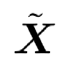
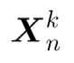
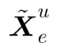
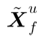
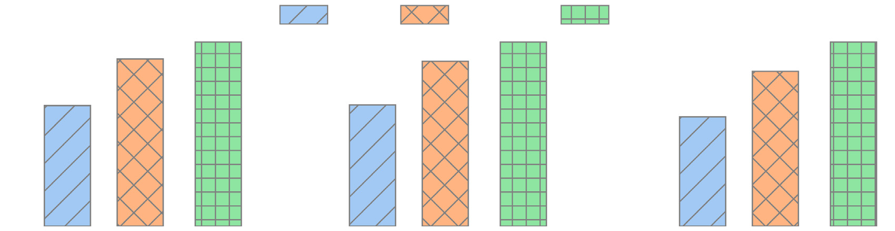

# A conditional diffusion model for probabilistic estimation of traffic states at sensor-free locations 

Da Lei ${ }^{\mathrm{a}}$, $\operatorname{Min} \mathrm{Xu}^{\mathrm{b}, *}$, Shuaian Wang ${ }^{\mathrm{a}}$ ${ }^{a}$ Department of Logistics and Maritime Studies, Faculty of Business, The Hong Kong Polytechnic University, Hong Hom, Hong Kong ${ }^{\mathrm{b}}$ Department of Industrial and Systems Engineering, The Hong Kong Polytechnic University, Hong Hom, Hong Kong

## A R T I C L E I N F O

Keywords
Conditional diffusion model
Probabilistic estimation
Network-wide estimation
Insufficient sensor coverage
Spatio-temporal estimator

## A B S T R A C T

Transportation administrators and urban planners rely on accurate network-wide traffic state estimation to make well-informed decisions. However, due to insufficient sensor coverage, traffic state estimation at sensor-free locations (TSES) poses significant challenges for downstream network-wide traffic analysis. This is because direct observations are not available at these sensor-free locations. Most existing traffic state estimation (TSE) research focuses on inferring several unknown time points based on observed historical data using deterministic models. In contrast, TSES is to infer the entire unknown traffic time series of a given sensor-free node, thereby presenting high predictive difficulty, as we could not learn any historical traffic patterns locally. In this study, we introduce a novel probabilistic model - the conditional diffusion framework with spatio-temporal estimator (CDSTE) - to tackle the TSES problem. When dealing with TSES, deterministic models can only produce point value estimates, which may substantially deviate from the actual traffic states of sensor-free locations. To mitigate this, the proposed CDSTE integrates the conditional diffusion framework with cutting-edge spatio-temporal networks to extract the underlying dependencies in traffic states between sensor-free and sensor-equipped nodes. This integration enables reliable probabilistic traffic state estimations for sensor-free locations, which can be used to quantify the variability of estimations in TSES to support flexible and robust decision-making processes for traffic management and control. Extensive numerical experiments on real-world datasets demonstrate the superior performance of CDSTE for TSES over five widely-used baseline models.

## 1. Introduction

Transportation administrators and urban planners depend on the network-wide estimation of traffic states, such as traffic volume, speed, and occupancy, to make informed decisions to improve the efficiency and sustainability of transportation systems (Cheng et al., 2020; Lei et al., 2020). In the past decade, various traffic sensors have been introduced into intelligent transportation systems for real-time traffic monitoring and continuous data collection, allowing the estimation and prediction of network-wide traffic state (Lei et al., 2021; Xu et al., 2022; Cheng et al., 2023). However, due to limited municipal funding, built-environment constraints, and substantial maintenance costs, traffic sensors are typically installed only at selected locations, such as major roads, junctions, and transit hubs (Zhang et al., 2020). As a result, transport managers can only track current traffic states and predict future ones on certain roads and in specific areas, lacking comprehensive monitoring of traffic states throughout the network. In the context

[^0]
[^0]:    * Corresponding author.

    E-mail address: min.m.xu@polyu.edu.hk (M. Xu).

Fig. 1. Experimental results for TSEP using LSTM.

Fig. 2. Experimental results for TSEP using Bayesian network.
of this prevalent reality of insufficient sensor coverage, estimating traffic in sensor-free locations for network-wide traffic analysis presents a significant challenge for transportation researchers and practitioners.

Most existing research on traffic state estimation (TSE) focuses on inferring several unknown time points in a traffic time series of the concerned locations based on partially observed data (Qu et al., 2009). This TSE problem, referred to as TSE with partial observations (TSEP), requires the concerned locations to be sensor-equipped nodes. The conventional methods used for TSEP include matrix factorization techniques and deep learning approaches, most of which are deterministic models that generate point-value estimates (Qiu et al., 2019; Chen et al., 2021; Wang et al., 2023). Although promising, deterministic models have one major drawback: it is difficult to handle the high uncertainty in traffic states, which is inevitable in real-world traffic situations. Fig. 1 illustrates the experimental results using a long short-term memory (LSTM) model, which is a deterministic model, to address TSEP at a specific location. The point-value estimates, particularly those during peak hours, deviate from the ground truth due to the challenges posed by the multifactorial nature of traffic states, such as weather conditions, missing values, road conditions, and driver behavior. These factors can cause fluctuations and anomalies in traffic patterns, which cannot be effectively captured and predicted by deterministic models because they lack the ability to provide a measure of confidence for their estimates (Zhou et al., 2020). Consequently, the quality and reliability of these estimates cannot be accurately evaluated, preventing flexible and robust decision-making processes for traffic management and control (Jin et al., 2022). For example, the traffic signal control strategy optimization depends on not only the point-value estimates, but also the variability of the estimates. The information allows them to assess the risks and benefits of different strategies.

One way to bridge the research gap mentioned above is to use probabilistic models, which can explicitly represent the variability of traffic states and models. In probabilistic models, the traffic state is treated as a random variable, and probabilistic methods are used to infer the distribution of the traffic state given the observed data (Gu et al., 2016). This provides a measure of confidence for their estimates. The existing probabilistic models for TSEP can be broadly categorized into three classes: those based on the Bayesian framework (Mena-Yedra et al., 2019), the Gaussian process (GP) (Lin et al., 2018), and the generative deep learning framework (Shi et al., 2021). For example, Fig. 2 shows the experimental results of TSEP using a Bayesian probabilistic model for the same location as shown in Fig. 1. Instead of providing point-value estimates, the Bayesian probabilistic model infers a distribution of estimated traffic states, covering the ground truth of the estimation target. However, like most deterministic models for TSE, most existing probabilistic models focus on TSEP, which requires the concerned locations to be equipped with sensors. In other words, most probabilistic models for TSE rely on learning the historical patterns of the concerned location based on its partial observations to estimate the distribution of its unknown target points.

Unlike previous research, this study focuses on a new problem, namely, traffic state estimation at sensor-free locations (TSES). The TSES problem is different from the TSEP problem, as there are no available observations at the sensor-free locations, and the

Fig. 3. Problem diagram and desired probabilistic estimation results for TSES.
objective is to infer the entire unknown time series of these sensor-free locations, as shown in Fig. 3(a). TSES is more challenging than TSEP due to increased predictive difficulty, as it is impossible to learn historical patterns of traffic states in the sensor-free locations concerned. Fig. 3(b) shows the desired probabilistic estimation results in TSES for a specific sensor-free location, where the estimated distribution accurately covers the ground truth. To achieve this, the expected probabilistic model must have a specific design for TSES to explore the spatio-temporal dependencies between the unknown traffic states of sensor-free locations and the observed traffic states of sensor-equipped locations.

To address the challenge of TSES, we develop a novel probabilistic learning framework named conditional diffusion framework with spatio-temporal estimator (CDSTE) by extending the denoising diffusion probabilistic models (DDPM) (Ho et al., 2020). Previous research on TSEP using DDPM-based models often employs a conditional probabilistic framework, where the task is to estimate the distribution of the estimation target of the concerned sensor-equipped locations conditioned on the partially observed traffic states of those locations (Rasul et al., 2021; Tashiro et al., 2021). Unlike the existing conditional DDPMs for TSEP, the proposed CDSTE uses a different conditional probabilistic scheme to estimate the distribution of the target points of the concerned sensor-free locations conditioned on the available observed traffic states of sensor-equipped locations. To learn the spatio-temporal dependencies of traffic states between sensor-free locations and sensor-equipped locations, we incorporate an Inception network (Wu et al., 2023b) as the temporal feature extraction module and a spatial transformer (Xu et al., 2020c) as the spatial feature extraction module into the noise estimator of the proposed CDSTE framework. The CDSTE is trained and evaluated on five traffic datasets, and its performance is compared with seven state-of-the-art baseline models. The experimental results indicate that the proposed CDSTE outperforms all baseline models in almost all datasets for the probabilistic estimation in TSES.

The contributions of this study can be summarized as follows:

1. Introducing a novel conditional diffusion framework designed for TSES, which is a new application area for diffusion models.
2. Integrating spatio-temporal dependency modeling into the diffusion framework with a specific conditioning scheme that leverages information from sensor-equipped locations to estimate the traffic states at sensor-free locations.
3. Providing reliable probabilistic estimations that can be used to quantify the variability of the estimation in TSES to support flexible and robust decision making in traffic management and control.
4. Demonstrating the effectiveness of the proposed model on real-world datasets, showing significant improvements over popular baselines.

The remainder of this paper is organized as follows. Section 2 reviews related studies for TSE. Section 3 introduces different diffusion frameworks for TSE. Section 4 formulates the proposed CDSTE, followed by the elaboration of the technical modules of the noise estimator in Section 5. After this, Section 6 presents the findings from a comprehensive series of experiments to assess the performance of our model against three benchmark methods. Finally, Section 7 summarizes the main conclusions and provides future research directions.

# 2. Literature review 

This section reviews the state-of-the-art on TSE with a focus on two main types of models: deterministic and probabilistic. Each type of model has been widely applied for TSEP, while applications for TSES are rare.

### 2.1. Deterministic models for TSEP

The conventional deterministic models used for TSEP include matrix factorization techniques and deep learning approaches. The widely used matrix factorization methods for TSEP include Principle Component Analysis (PCA) and matrix completion algorithms. For example, Li et al. (2013) extended the PCA method by incorporating traffic flow information from neighboring detection points to develop a kernel PCA for deterministic estimation in TSEP. Chen et al. (2021) introduced a low-rank autoregressive tensor completion

framework that incorporated temporal variation to capture global consistency to produce point-value estimates. Similarly, Wang et al. (2023) employed a low-rank Hankel tensor completion approach for TSE using partial observations from mobile sensors. Recent years have witnessed a surge in using deterministic deep learning models for TSEP. In particular, Qiu et al. (2019) developed the Nei-TTE method for TSEP in smart cities, utilizing deep learning and historical trajectory data to capture segment characteristics and improve prediction accuracy. Xu et al. (2020b) introduced a deep learning framework called GE-GAN for real-time TSEP using graph embedding and generative adversarial network techniques.

# 2.2. Probabilistic models for TSEP 

As aforementioned in Section 1, there are three types of probabilistic models for TSEP, which are based, respectively, on the Bayesian framework, GP models, and deep learning generative models. Bayesian-based models allow the integration of prior knowledge and data likelihood to obtain the posterior distribution of traffic states. For example, Han and Ahn (2021) presented traffic flow rate estimation methods using headway data from connected automated vehicles and compared Bayesian inference and deep learning-based methods. Zhang et al. (2023) developed switching state-space models based on a Bayesian learning framework to approximate dynamic traffic flows at signalized intersections.

Apart from the Bayesian framework, GP models, a non-parametric method for modeling complex and nonlinear functions, have also been used for TSEP. These models provide flexibility in modeling the spatio-temporal dynamics of traffic states and can quantify the variability of estimates. For example, Borovitskiy et al. (2021) explored the adaptation of Matérn Gaussian Processes to graph settings by leveraging stochastic partial differential equation characterization. This adaptation facilitates efficient computation and expands the application of Gaussian processes in modeling graph-embedded data structures, making it particularly relevant for spatial data kriging and network science. Wu et al. (2023a) proposed a topic-enhanced GP aggregation model for road traffic speed prediction, which integrated multiple source data, such as vehicle probe data, loop detector data, and road network information. Liu et al. (2023) adopted the GP model as the base model to learn the optimal mapping of input features to traffic volume. Although GP methods are powerful for TSEP or prediction tasks, applying them to TSES poses a great challenge. Specifically, TSES requires a model design capable of learning and inferring spatio-temporal patterns from sensor-equipped locations to sensor-free locations, a requirement that most existing GP methods, including spatio-temporal variational GP models (Todescato et al., 2020; Hamelijnck et al., 2021), cannot address.

Recently, deep-generative models have been employed for TSEP as well. Zhao and Yu (2022) introduced an observer-informed deep learning paradigm for TSEP. As a relatively new type of deep generative model, diffusion models for TSEP have not received sufficient attention. Among the limited studies, Appleby et al. (2020) proposed the Kriging Convolutional Network, a model that combines traditional kriging with GNNs to enhance spatial interpolation, utilizing training labels directly for prediction, and outperforming both kriging and GNNs in handling non-Gaussian and non-stationary data effectively. Similarly, Wu et al. (2021) developed the Inductive Graph Neural Network Kriging (IGNNK) model for real-time spatio-temporal interpolation on dynamic network structures, significantly improving predictability and providing a comprehensive solution for generating estimations of spatio-temporal data without retraining the model on new data inputs by leveraging off-site data. Nag et al. (2023) introduced a two-stage deep neural network model for efficient and effective spatio-temporal interpolation and forecasting, demonstrating its ability to handle large-scale non-Gaussian and non-stationary spatio-temporal data efficiently. Based on conditional DDPMs, Tashiro et al. (2021) proposed a novel method for time series imputation using conditional DDPMs. Similarly, Wen et al. (2023) proposed a probabilistic spatio-temporal graph forecasting model for TSEP. To the best of our knowledge, no one has explored probabilistic models for TSES. Such methods have also been applied to other fields. For example, Agoua et al. (2018) introduced a probabilistic spatio-temporal model to forecast photovoltaic power production using neighboring production data and NWP forecasts, employing quantile regression with L1 penalization for variable selection and demonstrating improved performance in very short-term forecasting without the need for satellite or sky camera data.

## 3. Diffusion frameworks for TSE

Before delving into the details of the proposed model, we first compare the fundamentals of different diffusion frameworks, including the existing unconditional DDPMs, the existing conditional DDPMs that focus on TSEP, and the dedicated conditional diffusion framework of the proposed CDSTE for TSES. In general, diffusion frameworks consist of two stages: the diffusion process and the reverse process. During the diffusion phase, noise is incrementally added to the original data until it resembles a sample of a Gaussian distribution. At the same time, a noise estimator is trained using these increasingly noisy data as input. This phase is characterized as a Markov chain that progressively generates noisier samples (Ho et al., 2020). For the reverse process, an estimated sample of the original data will be generated by subtracting the estimated noise, derived from the trained noise estimator, from a random Gaussian distribution sample. By repeating the reverse process with different random Gaussian samples, we can obtain an estimated distribution that serves as a probabilistic estimation of the original data. The key distinctions between different diffusion frameworks lie in whether noise is added and removed across the entire time series, and to what extent the diffusion model can condition on available observations. These differences determine the suitability of different diffusion frameworks for various TSE tasks, such as traffic simulation, TSEP, and TSES.

Diffusion process:gradually adding random Gaussian noise to the entire traffic time series

Fig. 4. Diffusion and reverse processes in an unconditional DDPM for traffic simulation.

# 3.1. Unconditional DDPM for traffic simulation 

Let $\mathcal{V}$ represent the set of $\mathcal{V}$ nodes in an urban road network, such as the intersections of a traffic network. In the context of unconditional DDPMs, all nodes in $\mathcal{V}$ are equipped with sensors. We represent the complete observed traffic states for all nodes by $\boldsymbol{X} \in \mathbb{R}^{L \times V}$, assuming that $\boldsymbol{X}$ is drawn from an unknown distribution $\varphi(\boldsymbol{X})$, where $L$ represents the length of the time series. The goal of an unconditional DDPM is to train a model that generates a distribution $p_{\theta}(\tilde{\boldsymbol{X}})$, which approximates $\varphi(\boldsymbol{X})$, where $\theta$ denotes the model parameters (Song and Ermon, 2020). During the diffusion process of unconditional DDPMs, noise is gradually added to the entire time series $\boldsymbol{X}$. Consequently, the estimated traffic states of the reverse process, $\tilde{\boldsymbol{X}} \in \mathbb{R}^{L \times V}$, will have the same dimensions as the original observed traffic states, $\boldsymbol{X}$. The unconditional DDPM can be applied for traffic simulation, where $\tilde{\boldsymbol{X}} \sim p_{\theta}(\tilde{\boldsymbol{X}})$ follows the general traffic patterns of $\boldsymbol{X}$, but with minor deviations since each $\tilde{\boldsymbol{X}}$ originates from a random Gaussian sample. However, the unconditional DDPM is incapable of addressing either TSEP or TSES, as it can only output the estimation for the entire original time series. The diffusion and reverse processes of an unconditional DDPM are illustrated in Fig. 4.

### 3.2. Conditional DDPM for TSEP

Previous research on conditional DDPMs for TSEP divides the node set $\mathcal{V}$ into $\mathcal{V}_{c}$ and $\mathcal{V}_{n}$, where $\mathcal{V}_{c}$ represents the set of locations with complete observations and $\mathcal{V}_{n}$ represents the set of locations with partial observations (Wen et al., 2023). The actual target of TSEP is denoted by $\boldsymbol{X}_{n}^{u} \in \mathbb{R}^{l_{n} \times V_{n}}$, which represents the unknown segment of nodes in $\mathcal{V}_{n}$, with $l_{n}$ indicating its length. The partial observations of the nodes in $\mathcal{V}_{n}$ are represented by $\boldsymbol{X}_{n}^{k} \in \mathbb{R}^{l_{k} \times V_{n}}$, and complete observations of the nodes in $\mathcal{V}_{c}$ are denoted by $\boldsymbol{X}_{c} \in \mathbb{R}^{L \times V_{c}}$. For model training, the conditional DDPM separates $\boldsymbol{X}_{c}$ into $\boldsymbol{X}_{c}^{k} \in \mathbb{R}^{l_{k} \times V_{c}}$ and $\boldsymbol{X}_{c}^{u} \in \mathbb{R}^{l_{n} \times V_{c}}$, where $L=l_{k}+l_{n}$. In the diffusion process of the conditional DDMP, random Gaussian noise $\epsilon_{i} \sim \mathcal{N}(0, \mathbf{I})$ is incrementally added to the presumed unknown $\mathbf{X}_{c}^{u}$. This process transforms the data into a Gaussian distribution by the final diffusion step, effectively simulating the process of gradually losing information about the original state. It is crucial to note that $\mathbf{X}_{c}^{k}$, representing the known segment of traffic states, serves as a conditional input to inform diffusion about observed traffic states, but does not contribute to the generation of noise. By denoising, the reverse process obtains $\tilde{\boldsymbol{X}}_{n}^{u} \sim p_{\theta}\left(\tilde{\boldsymbol{X}}_{n}^{u} \mid \boldsymbol{X}_{n}^{k}, \boldsymbol{X}_{c}\right)$, which is an approximation of $q\left(\boldsymbol{X}_{n}^{u} \mid \boldsymbol{X}_{n}^{k}, \boldsymbol{X}_{c}\right)$ (Tashiro et al., 2021). This formulation is specifically designed to address TSEP, as it estimates the unknown segments $\boldsymbol{X}_{n}^{u}$ of the time series at locations in $\mathcal{V}_{n}$, given the known segment $\boldsymbol{X}_{n}^{k}$. Fig. 5 shows the diffusion and reverse processes of conditional DDPM for TSEP.

### 3.3. Conditional diffusion framework CDSTE for TSES

Let $\boldsymbol{X}_{c}^{u} \in \mathbb{R}^{L \times V_{c}}$ denote the traffic time series of sensor-free locations, which remain completely unobserved, and $\boldsymbol{X}_{c} \in \mathbb{R}^{L \times V_{c}}$ represent the entire time series of sensor-equipped locations that are fully observable. The total set of nodes, $\mathcal{V}$, is the union of

Diffusion process:gradually adding random Gaussian noise to target segments

Fig. 5. Diffusion and reverse processes in a conditional DDPM for TSEP.
$\boldsymbol{V}_{f}$ and $\boldsymbol{V}_{e}$. For the probabilistic estimation of TSES in this study, our objective is to approximate the conditional distribution $q\left(\boldsymbol{X}_{f}^{u} \mid \boldsymbol{X}_{e}\right)$, which is the probability of unknown traffic states at sensor-free locations $\boldsymbol{X}_{f}^{u}$, conditioned on observed traffic states at sensor-equipped locations $\boldsymbol{X}_{e}$. Since only $\boldsymbol{X}_{e}$ are available for model training, we divide $\boldsymbol{X}_{e}$ into two parts: $\boldsymbol{X}_{e}^{u} \in \mathbb{R}^{L \times V_{e}^{u}}$ and $\boldsymbol{X}_{e}^{k} \in \mathbb{R}^{L \times V_{e}^{k}}$, which correspond to $\boldsymbol{V}_{e}^{u}$ and $\boldsymbol{V}_{e}^{k}$, respectively. In this study, $\boldsymbol{V}_{e}^{u}$ represents the presumptive set of sensor-free locations, which is a subset of $\boldsymbol{V}_{e}$, whereas the node set $\boldsymbol{V}_{e}^{k}=\boldsymbol{V}_{e}\left(\boldsymbol{V}_{e}^{u}\right.$ represents the presumptive set of sensor-equipped locations. In the CDSTE diffusion process, random Gaussian noise is gradually added to $\boldsymbol{X}_{e}^{u}$. The reverse process then performs denoising and outputs $\tilde{\boldsymbol{X}}_{e}^{u} \sim p_{\theta}\left(\tilde{\boldsymbol{X}}_{e}^{u} \mid \boldsymbol{X}_{e}^{k}\right)$, where the conditional distribution $p_{\theta}\left(\tilde{\boldsymbol{X}}_{e}^{u} \mid \boldsymbol{X}_{e}^{k}\right)$ is the probability of estimated traffic states of presumptive sensorfree locations $\tilde{\boldsymbol{X}}_{e}^{u}$, conditioned on traffic states of presumptive sensor-equipped locations $\boldsymbol{X}_{e}^{k}$. In particular, $\boldsymbol{X}_{e}^{k}$ remains constant during the diffusion process, serving as a stable conditional input that helps the model to focus on learning how to generate traffic states at sensor-free locations, $\boldsymbol{X}_{e}^{u}$, by leveraging the fixed, known conditions provided by $\boldsymbol{X}_{e}^{k}$. By generalizing $p_{\theta}\left(\tilde{\boldsymbol{X}}_{e}^{u} \mid \boldsymbol{X}_{e}^{k}\right)$ to $p_{\theta}\left(\tilde{\boldsymbol{X}}_{f}^{u} \mid \boldsymbol{X}_{e}\right)$, the CDSTE obtains $\tilde{\boldsymbol{X}}_{f}^{u} \sim p_{\theta}\left(\tilde{\boldsymbol{X}}_{f}^{u} \mid \boldsymbol{X}_{e}\right)$ at each run of the reverse process, where $p_{\theta}\left(\tilde{\boldsymbol{X}}_{f}^{u} \mid \boldsymbol{X}_{e}\right)$ is an approximation of $q\left(\boldsymbol{X}_{f}^{u} \mid \boldsymbol{X}_{e}\right)$ and serves as the probabilistic estimation results for TSES. The diffusion and reverse processes of the proposed CDSTE are illustrated in Fig. 6.

In the next section, we elaborate on the technical details of the formulation and implementation of the proposed CDSTE to address the challenging probabilistic estimation for TSES.

# 4. Methodology 

The overall workflow of the proposed CDSTE can be described as: Initially, the dataset is split into training and validation sets, where a subset of locations is selected as sensor-free for validation. During each training epoch, another subset of locations from the remaining nodes is randomly selected to mimic sensor-free conditions, generating diverse training samples. The diffusion process involves adding noise iteratively to the traffic states at these presumed sensor-free locations, which trains the noise estimator. For validation, the reverse process applies, where the model performs denoising on the masked input from the validation set to generate probabilistic estimations. The performance of the CDSTE is then evaluated by comparing these estimations with the ground-truth traffic states at the originally selected sensor-free locations. The overall workflow is illustrated in Fig. 7.

The core of the proposed CDSTE is to use accessible observations at sensor-equipped locations to estimate the traffic states of sensor-free locations. The primary challenge lies in the generalization of the conditional probabilities represented by

$$
p_{\theta}\left(\tilde{\boldsymbol{X}}_{e}^{u} \mid \boldsymbol{X}_{e}^{k}\right) \rightarrow p_{\theta}\left(\tilde{\boldsymbol{X}}_{f}^{u} \mid \boldsymbol{X}_{e}\right)
$$

Diffusion process:gradually adding Gaussian noise to complete observations of presumptive sensor-free nodes

Fig. 6. Diffusion and reverse processes of CDSTE for TSES.

Fig. 7. The overall scheme of CDSTE.

This challenge arises from the difficulty in establishing a direct correlation between these two conditional probabilities. A natural idea to tackle this challenge is to integrate the underlying spatial dependencies in the traffic states between sensor-free and sensor-equipped locations into model learning.

The spatial and topological relationship between sensor-free and sensor-equipped locations is typically known, and their traffic states have been shown to adhere to certain spatial patterns in prior research. For example, the existing literature has suggested that traffic states often display a proximity phenomenon, where the values of traffic states at neighboring locations are closely related (Cheng et al., 2020; Sun and Kirtonia, 2020). Motivated by this, in this study, we introduce a normalized weighted adjacency matrix $\boldsymbol{A} \in \mathbb{R}^{\mathrm{Val}}$, calculated based on the distances between locations in the network, into the model formulation to facilitate spatial dependency learning. For a given network, the adjacency matrix A is fixed and reflects the known spatial relationships between the nodes. This matrix remains unchanged regardless of the sensor status of individual nodes within the network. The objective of the

probabilistic estimation of TSES can then be expressed as $p_{\theta}\left(\tilde{\boldsymbol{X}}_{e}^{n} \mid \boldsymbol{X}_{e}, \boldsymbol{A}\right)$, which is an approximation of the actual data distribution $q\left(\boldsymbol{X}_{f}^{n} \mid \boldsymbol{X}_{e}, \boldsymbol{A}\right)$. In this context, we consider the following generalization:

$$
p_{\theta}\left(\tilde{\boldsymbol{X}}_{e}^{n} \mid \boldsymbol{X}_{e}^{k}, \boldsymbol{A}\right) \rightarrow p_{\theta}\left(\tilde{\boldsymbol{X}}_{e}^{n} \mid \boldsymbol{X}_{e}, \boldsymbol{A}\right)
$$

This generalization suggests that we could extract a general spatial dependency in the traffic states between locations in the network by learning the model $p_{\theta}\left(\tilde{\boldsymbol{X}}_{e}^{n} \mid \boldsymbol{X}_{e}^{k}, \boldsymbol{A}\right)$, though it only involves traffic states of presumptive sensor-free and sensor-equipped locations. The extracted spatial dependency can then be utilized to correlate the traffic states of the actual sensor-free locations and the sensor-equipped locations to obtain the probabilistic estimation result $p_{\theta}\left(\tilde{\boldsymbol{X}}_{f}^{n} \mid \boldsymbol{X}_{e}, \boldsymbol{A}\right)$.

The following subsections present the CDSTE diffusion process for training a noise estimator and the reverse process for obtaining $p_{\theta}\left(\tilde{\boldsymbol{X}}_{e}^{n} \mid \boldsymbol{X}_{e}^{k}, \boldsymbol{A}\right)$ by denoising.

# 4.1. Diffusion process of CDSTE 

Consider a sample $\boldsymbol{X}_{t}^{n}(0)$, drawn from the data distribution $q\left(\boldsymbol{X}_{t}^{n}(0) \mid \boldsymbol{X}_{e}^{k}, \boldsymbol{A}\right)$. Here, 0 in parentheses represents the diffusion step $t=0$, indicating that Gaussian noise has not yet been added to the sample. A diffusion process is characterized as a Markov chain that generates a sequence of progressively noisier samples, $\boldsymbol{X}_{e}^{n}(1: T)=\boldsymbol{X}_{t}^{n}(1), \ldots, \boldsymbol{X}_{t}^{n}(T)$, by iteratively incorporating Gaussian noise in diffusion steps. This can be expressed as

$$
q\left(\boldsymbol{X}_{t}^{n}(1: T) \mid \boldsymbol{X}_{t}^{n}(0), \boldsymbol{X}_{e}^{k}, \boldsymbol{A}\right)=\prod_{t=1}^{T} q\left(\boldsymbol{X}_{t}^{n}(t) \mid \boldsymbol{X}_{t}^{n}(t-1), \boldsymbol{X}_{e}^{k}, \boldsymbol{A}\right)
$$

where the conditional probability is assumed to follow a Gaussian distribution as follows:

$$
q\left(\boldsymbol{X}_{t}^{n}(t) \mid \boldsymbol{X}_{t}^{n}(t-1), \boldsymbol{X}_{t}^{k}, \boldsymbol{A}\right) \sim \mathcal{N}\left(\boldsymbol{X}_{t}^{n}(t) ; \sqrt{1-\beta_{t}} \boldsymbol{X}_{t}^{n}(t-1), \beta_{t} \boldsymbol{I}\right)
$$

where $\beta_{t}$ denotes a weight parameter that increases from 0 to 1 , utilized to control the noise intensity at each diffusion step $t$, $t \in\{1,2, \ldots, T\}$. This is a common way to model a diffusion process, where the noises added at each diffusion step are independent and identically distributed Gaussian random variables (Song et al., 2020b). As the diffusion step increases from $t=1$ to $t=T$, the original data point $\boldsymbol{X}_{t}^{n}(0)$ will gradually lose its distinctive characteristics. When $T \rightarrow \infty$, the final noised sample $\boldsymbol{X}_{t}^{n}(T)$ conforms to a Gaussian distribution (Song and Ermon, 2020), i.e., $\boldsymbol{X}_{t}^{n}(T) \sim \mathcal{N}(\mathbf{0}, \boldsymbol{I})$.

The diffusion process generally exhibits a nonautoregressive property (Ho et al., 2020), which allows us to express $\boldsymbol{X}_{t}^{n}(t)$ in any arbitrary diffusion step $t$ in a closed form. Specifically, we have the following distribution of $\boldsymbol{X}_{t}^{n}(t)$ conditioned on $\boldsymbol{X}_{t}^{n}(0), \boldsymbol{X}_{t}^{k}$, and $\boldsymbol{A}:$

$$
q\left(\boldsymbol{X}_{t}^{n}(t) \mid \boldsymbol{X}_{t}^{n}(0), \boldsymbol{X}_{t}^{k}, \boldsymbol{A}\right) \sim \mathcal{N}\left(\boldsymbol{X}_{t}^{n}(t) ; \sqrt{\bar{\alpha}_{t}} \boldsymbol{X}_{t}^{n}(0),\left(1-\bar{\alpha}_{t}\right) \boldsymbol{I}\right)
$$

where $\bar{\alpha}_{t}=\prod_{i=1}^{t} \alpha_{i}$ signifies the cumulative products of $\alpha_{t}=1-\beta_{t}$. By implementing the reparameterization trick on Eq. (5), we can express $\boldsymbol{X}_{t}^{n}(t)$ as

$$
\boldsymbol{X}_{t}^{n}(t)=\sqrt{\bar{\alpha}_{t}} \boldsymbol{X}_{t}^{n}(0)+\sqrt{1-\bar{\alpha}_{t}} \epsilon_{t}
$$

where $\epsilon_{t} \sim \mathcal{N}(\mathbf{0}, \boldsymbol{I})$ represents the random Gaussian noise added at diffusion step $t$.
The noise estimator $\epsilon_{\theta}$ can then be trained by minimizing the loss between the actual added noise at the diffusion step $t$ and the noise estimated by $\epsilon_{\theta}$. The loss function can be expressed as

$$
\min _{\theta} \mathcal{L}_{t}=\min _{\theta} \mathbb{E}_{t \in\{1, T\}, \epsilon_{t} \sim \mathcal{N}(\mathbf{0}, \boldsymbol{I})}\left[\left\|\epsilon_{t}-\epsilon_{\theta}\left(\boldsymbol{X}_{t}^{n}(t), t \mid \boldsymbol{X}_{t}^{k}, \boldsymbol{A}\right)\right\|^{2}\right]
$$

We illustrate the diffusion process of CDSTE in Fig. 8.

### 4.2. Reverse process of CDSTE

The diffusion process described above can be reversed to recover the original input $\boldsymbol{X}_{t}^{n}(0)$ from Gaussian noise $\boldsymbol{X}_{t}^{n}(T) \sim \mathcal{N}(\mathbf{0}, \boldsymbol{I})$. Conceptually, the reverse process is characterized by the conditional probability $q\left(\boldsymbol{X}_{t}^{n}(t-1) \mid \boldsymbol{X}_{t}^{n}(t)\right)$. However, it is intractable to directly estimate $q\left(\boldsymbol{X}_{t}^{n}(t-1) \mid \boldsymbol{X}_{t}^{n}(t)\right)$ as it requires the evaluation of all possible outcomes of the conditional probability. Instead, we learn the following model distribution $p_{\theta}$, which is also characterized by a Markov chain that generates a sequence of progressively denoised samples, $\tilde{\boldsymbol{X}}_{e}^{n}(T: 0)=\tilde{\boldsymbol{X}}_{e}^{n}(T), \ldots, \tilde{\boldsymbol{X}}_{e}^{n}(0)$.

$$
p_{\theta}\left(\tilde{\boldsymbol{X}}_{e}^{n}(T: 0) \mid \boldsymbol{X}_{e}^{k}, \boldsymbol{A}\right)=p\left(\tilde{\boldsymbol{X}}_{e}^{n}(T)\right) \prod_{t=T}^{1} p_{\theta}\left(\tilde{\boldsymbol{X}}_{e}^{n}(t-1) \mid \tilde{\boldsymbol{X}}_{e}^{n}(t), \boldsymbol{X}_{e}^{k}, \boldsymbol{A}\right)
$$

We assume that the conditional probability $p_{\theta}\left(\tilde{\boldsymbol{X}}_{e}^{n}(t-1) \mid \tilde{\boldsymbol{X}}_{e}^{n}(t), \boldsymbol{X}_{e}^{k}, \boldsymbol{A}\right)$ also follows a Gaussian distribution as follows:

$$
p_{\theta}\left(\tilde{\boldsymbol{X}}_{e}^{n}(t-1) \mid \tilde{\boldsymbol{X}}_{e}^{n}(t), \boldsymbol{X}_{e}^{k}, \boldsymbol{A}\right) \sim \mathcal{N}\left(\tilde{\boldsymbol{X}}_{e}^{n}(t-1) ; \mu_{\theta}\left(\tilde{\boldsymbol{X}}_{e}^{n}(t), t \mid \boldsymbol{X}_{e}^{k}, \boldsymbol{A}\right), \sigma_{\theta}^{2}\left(\boldsymbol{X}_{e}^{n}(t), t \mid \boldsymbol{X}_{e}^{k}, \boldsymbol{A}\right)\right)
$$

Fig. 8. Diffusion process of CDSTE.

Following the model construction of the unconditional DDPM introduced by Ho et al. (2020), we employ the following specific parameterization of $\boldsymbol{\mu}_{\theta}$ and $\sigma_{\theta}$ for Eq. (9):

$$
\begin{aligned}
& \mu_{\theta}\left(\overline{\boldsymbol{X}}_{e}^{n}(t), t \mid \boldsymbol{X}_{e}^{k}, \boldsymbol{A}\right)=\frac{1}{\sqrt{\alpha_{t}}}\left(\overline{\boldsymbol{X}}_{e}^{n}(t)-\frac{1-\alpha_{t}}{\sqrt{1-\bar{\alpha}_{t}}} \boldsymbol{\epsilon}_{\theta}\left(\overline{\boldsymbol{X}}_{e}^{n}(t), t \mid \boldsymbol{X}_{e}^{k}, \boldsymbol{A}\right)\right) \\
& \sigma_{\theta}(t)=\sqrt{\frac{1-\bar{\alpha}_{t-1}}{1-\bar{\alpha}_{t}} \beta_{t}}
\end{aligned}
$$

By applying the reparameterization trick to Eq. (9), we derive the following formula for denoising the sample from diffusion step $t$ to $t-1$ :

$$
\overline{\boldsymbol{X}}_{e}^{n}(t-1)=\mu_{\theta}\left(\overline{\boldsymbol{X}}_{e}^{n}(t), t \mid \boldsymbol{X}_{e}^{k}, \boldsymbol{A}\right)+\sigma_{\theta}(t) \boldsymbol{\epsilon}
$$

where $t \in\{T, \ldots, 1\}$ and $\epsilon \sim \mathcal{N}(\mathbf{0}, \boldsymbol{I})$.
Starting from $\overline{\boldsymbol{X}}_{e}^{n}(T) \sim \mathcal{N}(\mathbf{0}, \boldsymbol{I})$, the reverse process iteratively performs the denoising operation shown in Eq. (12), thus generating $\overline{\boldsymbol{X}}_{e}^{n}(0)=\mu_{\theta}\left(\overline{\boldsymbol{X}}_{e}^{n}(1), 1 \mid \boldsymbol{X}_{e}^{k}, \boldsymbol{A}\right)+\sigma_{\theta}(1) \boldsymbol{\epsilon}$ as an estimation of the ground truth $\boldsymbol{X}_{e}^{n}(0) \sim \varphi\left(\boldsymbol{X}_{e}^{n}(0) \mid \boldsymbol{X}_{e}^{k}, \boldsymbol{A}\right)$. By performing reverse processes on a set of $N$ random Gaussian samples $\left\{\overline{\boldsymbol{X}}_{e}^{n}(T)\right\}_{n=1}^{N}$, the proposed CDSTE generates a set of estimates $\left\{\overline{\boldsymbol{X}}_{e}^{n}(0)\right\}_{n=1}^{N}$. This set serves as an approximate probabilistic estimate, as it includes all possible outcomes of $\overline{\boldsymbol{X}}_{e}^{n}(0) \sim p_{\theta}\left(\overline{\boldsymbol{X}}_{e}^{n}(0) \mid \boldsymbol{X}_{e}^{k}, \boldsymbol{A}\right)$ when $N \rightarrow \infty$. Moreover, the optimized parameters $\theta$ of the trained noise estimator $\epsilon_{\theta}$ are the only parameters that determine the model $p_{\theta}\left(\overline{\boldsymbol{X}}_{e}^{n}(0) \mid \boldsymbol{X}_{e}^{k}, \boldsymbol{A}\right)$. These same parameters $\theta$ also define the generalized model $p_{\theta}\left(\overline{\boldsymbol{X}}_{e}^{n}(0) \mid \boldsymbol{X}^{k}, \boldsymbol{A}\right)$, which employs the same trained noise estimator $\epsilon_{\theta}$. Therefore, we can obtain an approximate probabilistic estimation of the traffic states in the actual sensorfree locations $\left\{\overline{\boldsymbol{X}}_{e}^{n}(0) \mid \overline{\boldsymbol{X}}_{e}^{n}(0) \sim p_{\theta}\left(\overline{\boldsymbol{X}}_{e}^{n}(0) \mid \boldsymbol{X}_{e}, \boldsymbol{A}\right)\right\}_{n=1}^{N}$, by performing the reverse process on a set of $N$ random Gaussian samples $\left\{\overline{\boldsymbol{X}}_{e}^{k}(T) \mid \overline{\boldsymbol{X}}_{e}^{k}(T) \sim \mathcal{N}(\mathbf{0}, \boldsymbol{I})\right\}_{n=1}^{N}$ (see Fig. 9).

In real implementation, to evaluate the performance of our proposed CDSTE, it is crucial to compare the estimated $\overline{\boldsymbol{X}}_{f}^{k}=\overline{\boldsymbol{X}}_{f}^{k}(0)$ with the ground truth $\boldsymbol{X}_{f}^{n}=\boldsymbol{X}_{f}^{n}(0)$. However, $\boldsymbol{X}_{f}^{n}$ is not available in reality. For an unbiased evaluation of CDSTE, the original data $\boldsymbol{X} \in \mathbb{R}^{L \times V}$ must be complete, i.e., all nodes in $\mathcal{V}$ are sensor-equipped locations. In this study, we select a subset of nodes $\mathcal{V}_{f}$ from set $\mathcal{V}$. The corresponding traffic state records $\boldsymbol{X}_{f}^{n}$ are retained as the test dataset for model evaluation. The traffic state records of the other nodes $\boldsymbol{X}_{e}$ are used for model training during the diffusion process, as shown in Fig. 10.

As presented in Section 3.3, $\mathcal{V}_{e}$ is randomly separated into presumptive sensor-free locations $\mathcal{V}_{e}^{k}$ and sensor-equipped locations $\mathcal{V}_{e}^{k}$. Consequently, $\boldsymbol{X}_{e}$ is divided into $\boldsymbol{X}_{e}^{n}$ and $\boldsymbol{X}_{e}^{k}$. Each separation of $\mathcal{V}_{e}$ leads to a specific physical spatial relationship between

Fig. 9. Reverse process of CDSTE.

Fig. 10. One split of the original dataset $\boldsymbol{X}$.
$\boldsymbol{V}_{e}^{a}$ and $\boldsymbol{V}_{e}^{b}$. To achieve robust generalization, as shown in Eq. (12), we perform $M$ random separations of $\boldsymbol{V}_{e}$. This yields different pairs of $\boldsymbol{V}_{e}^{a}$ and $\boldsymbol{V}_{e}^{b}$, which allows for an extensive exploration of the spatial dependency between $\boldsymbol{X}_{e}^{a}$ and $\boldsymbol{X}_{e}^{b}$ with varying physical spatial relationships. In this context of model implementation, the training set is defined as $\left\{\boldsymbol{X}_{e} \mid \boldsymbol{X}_{e}^{a} \cup \boldsymbol{X}_{e}^{b}\right\}_{i=1}^{M}$.

# 5. ST-ResNet-based noise estimator 

Existing diffusion models mainly use two types of noise estimators: the Unet-based architecture (Ronneberger et al., 2015) for image-related tasks (Cao et al., 2022; Saharia et al., 2022), and WaveNet-based approach (van den Oord et al., 2016) for time series analysis tasks such as prediction, imputation, and anomaly detection (Kong et al., 2021; Tashiro et al., 2021). However, these models are limited in their ability to simultaneously capture spatio-temporal correlations in traffic data.

To address this limitation, we propose a novel estimator $\epsilon_{\theta}$, termed as ST-ResNet. The design of ST-ResNet follows a ResNet-like architecture (Wu et al., 2019), comprising an embedding layer, multiple spatial-temporal residual blocks (ST-ResBlock) connected via residual connections, and a fully connected (FC) network. Each ST-ResBlock employs an Inception module with fast Fourier transform (IncepFFT) to capture multi-periodic temporal dependencies, and a transformer encoder to model the spatial correlations. The integration of the IncepFFT and Transformer is designed to address the challenges of traffic state estimation at sensorfree locations, which heavily relies on understanding complex spatio-temporal relationships within the data. To the best of our

Fig. 11. Illustration of ST-ResNet as the noise estimator.
knowledge, this is the first time these components have been integrated in this manner. ST-ResNet accepts $\left\{\boldsymbol{X}_{n}^{u}(t) \in \mathbb{R}^{L \times V_{n}^{u}}, \boldsymbol{X}_{n}^{k} \in\right.$ $\mathbb{R}^{L \times V_{n}^{k}}, t, \boldsymbol{A}\}$ and $\left\{\boldsymbol{X}_{n}^{s}(t) \in \mathbb{R}^{L \times V_{n}}, \boldsymbol{X}_{n} \in \mathbb{R}^{L \times V_{n}}, t, \boldsymbol{A}\right\}$ as primary inputs for model training in the diffusion process and model evaluation in the reverse process, respectively. It also takes additional information as side input: the timestamps $s \in \mathbb{R}^{L \times 1}$ of the original data $\boldsymbol{X}$ (such as the time of day and the day of week, if available). For brevity, we use $\left\{\boldsymbol{X}_{n}(t) \in \mathbb{R}^{L \times V_{n}}, \boldsymbol{X}_{k} \in \mathbb{R}^{L \times V_{k}}, t, \boldsymbol{A}, s\right\}$ to represent the input set of $\epsilon_{\theta}$. Here, $\boldsymbol{X}_{n}(t)$ denotes the noisy traffic states of sensor-free locations at diffusion step $t$, and $\boldsymbol{X}_{k}$ represents the traffic states of sensor-equipped locations.

In the embedding layer, ST-ResNet initially concatenates (Concat) $\boldsymbol{X}_{n}(t) \in \mathbb{R}^{L \times V_{n}}$ and $\boldsymbol{X}_{k} \in \mathbb{R}^{L \times V_{k}}$ into a new tensor $\boldsymbol{X}_{n k} \in$ $\mathbb{R}^{L \times V}$. The inputs are then projected to a high-dimensional representation of shape $(L, V, d)$ by different embedding modules in the embedding layer and then merged into one embedding representation $\boldsymbol{H}(t) \in \mathbb{R}^{L \times V \times d}$. The dimension of the model $d$, a hyperparameter, controls the model complexity of ST-ResNet. The resulting $\boldsymbol{H}(t)$ is then fed into ST-ResBlocks. Let $\boldsymbol{H}_{i}(t) \in \mathbb{R}^{L \times V \times d}$ and $\boldsymbol{H}_{i}^{t t t}(t) \in \mathbb{R}^{L \times V \times d}$ denote the input and output of the $i$ th ST-ResBlock, respectively. The residual connection between $\boldsymbol{H}_{i}(t)$ and $\boldsymbol{H}_{i}^{t t t}(t)$ provides the input for the subsequent block, as expressed in the following equation:

$$
\boldsymbol{H}_{i+1}(t)=\boldsymbol{H}_{i}(t)+\boldsymbol{H}_{i}^{t t t}(t)
$$

At the end of ST-ResNet, a FC network is deployed, which accepts the output of the last residual block as its input and generates the estimated noise $\epsilon_{\theta} \in \mathbb{R}^{L \times V_{n}}$ for diffusion step $t$. The overall structure of ST-ResNet is illustrated in Fig. 11.

Embedding modules. We employ different embedding modules in the embedding layer to project the inputs, considering their distinct original shapes/dimensions and data types. Specifically, two separate 2D convolutional (Conv2D) networks are used to embed $\boldsymbol{A} \in \mathbb{R}^{V \times V}$. A 1D convolutional (Conv1D) network is employed to project $\boldsymbol{X}_{n k} \in \mathbb{R}^{L \times V}$, which contains continuous values. For the discrete tensor $s \in \mathbb{Z}^{L \times 1}$, we use a straightforward lookup table, Lookup $(\cdot)$. The discrete scalar $t$ is embedded using sinusoidal positional encoding, $\operatorname{Simu}(\cdot)$ (Vaswani et al., 2017). To accommodate the discrepancies in the shapes, we apply Reshape $(\cdot)$ and $\operatorname{Exam}( \cdot)$ operations prior to embedding implementations. The transformation within the embedding layer can be summarized as follows.

$$
\begin{aligned}
& \operatorname{Conv} 2 D(\operatorname{Expand}(\operatorname{Reshape}(\boldsymbol{A}))): \mathbb{R}^{V \times V} \rightarrow \mathbb{R}^{L \times V \times V} \rightarrow \mathbb{R}^{L \times V \times V} \rightarrow \mathbb{R}^{L \times V \times d} \\
& \operatorname{Conv} 1 D\left(\operatorname{Reshape}\left(\boldsymbol{X}_{n k}\right)\right): \mathbb{R}^{L \times V} \rightarrow \mathbb{R}^{L \times V \times 1} \rightarrow \mathbb{R}^{L \times V \times d} \\
& \operatorname{Lookup}(\operatorname{Expand}(\operatorname{Reshape}(s))): \mathbb{Z}^{L \times 1} \rightarrow \mathbb{Z}^{L \times 1 \times 1} \rightarrow \mathbb{Z}^{L \times V \times 1} \rightarrow \mathbb{R}^{L \times V \times d}
\end{aligned}
$$

Fig. 12. IncepFFT for temporal dependency extraction.

$$
\operatorname{Simu}(\operatorname{Expand}(\operatorname{Reshape}(t))): \mathbb{Z} \rightarrow \mathbb{Z}^{l \times 1} \rightarrow \mathbb{Z}^{L \times V} \rightarrow \mathbb{R}^{L \times V \times d}
$$

Temporal dependency modeling. As depicted in Fig. 11, the embedded representation $\boldsymbol{H}_{i}(t)$ in ST-ResBlock is initially processed by a specialized version of the Inception network, referred to as IncepFFT. Introduced by Wu et al. (2023b), IncepFFT has emerged as a state-of-the-art model in time series-related tasks, surpassing even the latest widely recognized models such as Informer (Zhou et al., 2021), FEDformer (Zhou et al., 2022), LSSL (Gu et al., 2022), and DLinear (Zeng et al., 2023). Therefore, we incorporate it as the temporal module in ST-ResBlock to effectively capture temporal correlations. The key idea of IncepFFT is to transform a 1D time series into a 2D representation by applying fast Fourier transform (FFT) to convert signals in the time series from the time domain to the frequency domain. Subsequently, IncepFFT employs an Inception network consisting of multiple 2D convolutional kernels to learn the latent multi-periodic temporal dependencies in time series, akin to convolutional neural network-based learning in image-related tasks.

Let $\boldsymbol{h}_{i} \in \mathbb{R}^{L \times l \times d}$ represent the embedded time series of one node $v \in V$; then we have $\boldsymbol{H}_{i}(t)=\operatorname{Concat}\left(\left\{\boldsymbol{h}_{i}\right\}_{i}^{V}\right)$. For ease of presentation, we assume that $d=1$, and thus $\boldsymbol{h}_{i}$ is shown as a 1D time series. This is followed by the application of FFT to convert it into $k 2 \mathrm{D}$ representations of $k$ identified periods. With the inception network, these 2D tensors are convolved and merged into $\boldsymbol{h}_{i}^{\prime} \in \mathbb{R}^{L \times l \times d}$. The output of IncepFFT, $\boldsymbol{H}_{i}^{\prime}(t) \in \mathbb{R}^{L \times V \times d}$, can then be obtained by concatenating $\left\{\boldsymbol{h}_{i}\right\}_{1}^{V}$ for all nodes in $V$. In summary, IncepFFT can be briefly represented by

$$
\boldsymbol{H}_{i}^{\prime}(t)=\operatorname{IncepFFT}\left(\boldsymbol{H}_{i}(t)\right)
$$

The output $\boldsymbol{H}_{i}^{\prime}(t)$ is then fed into a Layer Normalization to stabilize model training and prevent overfitting. Fig. 12 shows an illustration of IncepFFT utilized in ST-ResNet.

Spatial dependency modeling. A transformer encoder, which serves as the spatial module within the ST-ResBlock, receives the output of the Layer Normalization, $\boldsymbol{H}_{i}^{\prime \prime}(t) \in \mathbb{R}^{L \times V \times d}$, as input. Contrary to most transformer-based models that learn temporal variations along the temporal dimension, the spatial transformer (Xu et al., 2020c) adopted in CDSTE models the spatial dependency of the embedded feature of each time point $\boldsymbol{h}_{i}^{\prime \prime} \in \mathbb{R}^{l \times V \times d}$ along the spatial dimension. As a self-attention mechanism, it assigns different weights to different locations in the spatial dimension, according to their importance evaluated by attention calculation. This allows it to effectively model complex spatial correlations in traffic data. The output of the spatial module is obtained by $\boldsymbol{H}_{i}^{\prime \prime \prime}(t)=\operatorname{Concat}\left(\left\{\boldsymbol{h}_{i}^{\prime \prime}\right\}_{i}^{V}\right)$ (see Fig. 13).

# 6. Experiments 

We conduct extensive experiments to evaluate the effectiveness of our proposed CDSTE on real-world traffic datasets and compare it with three probabilistic baselines.

### 6.1. Dataset and experiment settings

Dataset description. This study employs various open-source traffic datasets to perform benchmark experiments. These datasets record time series for either traffic speed or flow as follows:

- PeMS7 (Song et al., 2020a): This data group consists of two traffic speed datasets, namely PeMS7-M and PeMS7-L. They are derived from 228 and 1026 sensors, respectively, in District 7 of the Caltrans Performance Measurement System (PeMS). The

Fig. 13. Illustration of the spatial Transformer module.
data, captured at a resolution of five minutes (yielding 288 time points per day), were collected on weekdays from May through June in 2012. The processed datasets have dimensions of $228 \times 12,672$ and $1,026 \times 12,672$, respectively, and are structured as multivariate time series matrices.

- PeMS8 (Guo et al., 2019): This traffic flow dataset, also sourced from PeMS, was collected from 170 detectors in District 8 from July to August 2016. The processed data consists of a multivariate time series matrix with the dimension $170 \times 17,856$.
- Seattle (Cui et al., 2019): This dataset contains highway traffic speed data collected from 323 loop detectors in Seattle, USA, at a resolution of five minutes. The dataset was collected over the first four weeks of January 2015. The processed dataset is a multivariate time series matrix with dimension $323 \times 8064$.
- Kowloon: This traffic flow dataset is offered by the Government Chief Information Office of Hong Kong and is accessible through their officialwebsite. The dataset incorporates records from 159 sensors scattered throughout the Kowloon district and spans from June 1 to September 30, 2022. The processed data are structured as a multivariate time series matrix with dimension $159 \times 35,812$.

Probabilistic baselines. Given the scarcity of existing models for probabilistic traffic state estimation, we find it necessary to compare the proposed model with those in the broader field of probabilistic time series estimation/forecasting. The selected probabilistic baselines are as follows:

- CSDI (Tashiro et al., 2021): One of the earliest models based on a conditional diffusion approach for time series estimation. The primary objective of the original research is to impute partially missing data employing available observations within the time series;
- TimeGrad (Rasul et al., 2021): An auto-regressive model that incorporates a diffusion model with a recurrent neural network-based encoder;
- DeepAR (Salinas et al., 2020): The model employs autoregressive recurrent neural networks to generate accurate probabilistic estimations for time series.
- ST-VGP (Hamelijnck et al., 2021): The spatial-temporal Gaussian process model combines spatio-temporal filtering with natural gradient variational inference, resulting in a nonconjugate GP method for spatial-temporal data kriging with probabilistic estimations.

The former three probabilistic baselines, designed for general time series modeling, typically treat traffic data as either a multivariate or multi-feature time series. The last baseline, ST-VGP, incorporates specialized modules to learn both spatial and temporal dependencies.

Deterministic baselines. To provide a comprehensive evaluation of the proposed CDSTE, we have included three additional deterministic baselines for comparison: Linear Interpolation, Spatial-Temporal Transformer Networks (STTN), and Inductive Graph Neural Networks for Spatiotemporal Kriging (IGNNK). The performance of these baselines is evaluated against the deterministic approximations of the CDSTE outcomes.

- Linear Interpolation: This method serves as a deterministic baseline, where for any sensor-free location at a specific time point, we estimate the traffic state by calculating the mean of the non-lagged traffic states from the nearest sensor-equipped locations;

- STTN (Xu et al., 2020c): The model leverages dynamical directed spatial dependencies and long-range temporal dependencies to improve the accuracy of long-term traffic estimation.
- IGNNK (Wu et al., 2021): Designed for real-time spatio-temporal interpolation, this approach incorporates an inductive GNN to reconstruct the full signal from partially observed signals.

Metrics. To properly assess the results of our probabilistic model, which are represented as a set of $N$ generated samples $\left\{\widetilde{\boldsymbol{X}}_{n}\right\}_{n=1}^{N}$, we employ the continuous ranked probability score (CRPS) (Matheson and Winkler, 1976; Zamo and Naveau, 2018). This specific metric is used to gauge the alignment of the probability distribution approximated by $\left\{\widetilde{\boldsymbol{X}}_{n}\right\}_{n=1}^{N}$ and the observed ground truth $\boldsymbol{X}_{n}$. The CRPS for a single sample $\widetilde{\mathbf{X}}_{n}$ can be calculated as follows,

$$
\operatorname{CRPS}\left(\widetilde{\mathbf{X}}_{n}, \mathbf{X}_{n}\right)=\int_{-\infty}^{\infty}\left(\mathrm{F}\left(\widetilde{\mathbf{X}}_{n}\right)-\mathrm{H}\left(\widetilde{\mathbf{X}}_{n}-\mathbf{X}_{n}\right)\right)^{2} d X
$$

where $\mathrm{F}(\cdot)$ is the cumulative distribution function (CDF) of the approximated distribution. $\mathrm{H}(\cdot)$ is the Heaviside step function centered at the true value $\mathbf{X}_{n}$, which is 0 for $\widetilde{\mathbf{X}}_{n}<\mathbf{X}_{n}$ and 1 for $\widetilde{\mathbf{X}}_{n} \geq \mathbf{X}_{n}$. In practice, we approximate the overall CRPS by averaging the CRPS values for each sample in the set $\left\{\widetilde{\mathbf{X}}_{n}\right\}_{n=1}^{N}$,

$$
\operatorname{CRPS}=\frac{1}{N} \sum_{n=1}^{N} \operatorname{CRPS}\left(\widetilde{\mathbf{X}}_{n, n}, \mathbf{X}_{n}\right)
$$

In addition, we also report the mean absolute error (MAE) and the mean squared error (RMSE), which are traditional benchmarks for evaluating the effectiveness of deterministic models. For this purpose, we calculate the median of $\left\{\widetilde{\boldsymbol{X}}_{n}\right\}_{n=1}^{N}$ to serve as the approximated deterministic result of the probabilistic models for traffic state estimation. The median value is then compared with the ground truth $\boldsymbol{X}_{n}$ to determine MAE and RMSE. We prefer the median over other statistics because it is less sensitive to outliers. It is important to note that lower values for all three metrics indicate better performance.

Model training. For each dataset, we initially reserve the traffic states from a randomly selected proportion of locations as the ground truth of presumed sensor-free locations for validation or testing, denoted as $\mathbf{X}_{c}^{s}$ corresponding to $\boldsymbol{V}_{f}$. During each training epoch, a proportion of nodes (determined by the missing ratio) in $\boldsymbol{V}_{c}$ is randomly selected as presumed sensor-free locations for training, represented as $\boldsymbol{V}_{c}^{s}$. The remaining nodes are considered as presumed sensor-equipped locations, denoted as $\boldsymbol{V}_{c}^{k}$. The training samples, specified as $\left(\mathbf{X}_{c}^{s}, \mathbf{X}_{c}^{k}\right)$, vary with each training epoch, allowing us to extensively explore different patterns of spatial dependency during training. Each of the baselines is trained following the same experimental setup as CDSTE. This ensures that even though the baselines do not incorporate a module specifically for spatial dependency learning, they are provided with identical input information, including timestamps and adjacency matrices. Additionally, the random seed and training sequence lengths were standardized across all models to maintain consistency in the training conditions. This standardization allows for a fair comparison of the models' performance in estimating traffic states at sensor-free locations.

# 6.2. Performance comparison 

Table 1 summarizes the comparison results of the proposed CDSTE and the three baselines for the five datasets aforementioned. In each entry of the table, we report three values, MAE/RMSE / CRPS, where applicable. The column name "Ratio" in the table refers to the proportion of sensor-free nodes. We can see from the results that the CDSTE consistently outperforms the CSDI, TimeGrad, and DeepAR models on various datasets and in different missing ratios. In the case of the PeMS7-M dataset, with missing ratios of $30 \%, 60 \%$, and $75 \%$, the CDSTE reduces the CRPS by $33.3 \%, 37.5 \%$, and $46.2 \%$ respectively, compared to highly competitive baselines. These enhancements are not unique to the PeMS7-M dataset, but are also evident across all other datasets. The CSDI model, originally developed for time-series imputation, underperforms in our traffic state estimation for sensor-free nodes, indicating that it may not be ideally suited for such applications. The DeepAR and TimeGrad models, both of which rely on low-rank approximations of the target, have shown marginally higher error metrics. This increase in error can be attributed to their limitations in modeling the true spatio-temporal data distribution, a problem not present in the proposed CDSTE. In terms of MAE and RMSE computed using approximated deterministic estimation results, the CDSTE also performs better than other models in most experiments.

While the proposed CDSTE exhibits inferior performance when compared to baselines like STTN, ST-VGP, and IGNNK in a limited number of cases, it consistently outperforms these models in most scenarios. Specifically, CDSTE outperforms the STTN model in 14 out of 15 experimental settings. Similarly, it surpasses ST-VGP in 13 out of 15 scenarios, and it exceeds the performance of IGNNK in 12 out of 15 scenarios. In summary, despite occasional exceptions, CDSTE demonstrates significant strengths and consistently outperforms other models including the spatial-temporal baselines in most experimental settings, highlighting its capability and superiority in handling spatio-temporal complexities effectively in the task of traffic state estimation at sensor-free locations.

### 6.3. Visualization of probabilistic estimation comparison

To intuitively examine the performance of CDSTE compared to baseline models in traffic state estimation at sensor-free locations, we plot the estimation results in a single day for nine different sensor-free nodes. For this demonstration, we select CSDI as the comparative model and use the PeMS7-M dataset. We set the ratio of $V_{n}$ to $30 \%$ and present the results in Fig. 14. We have the following observations from Fig. 14: (1) CDSTE demonstrates a better capability to capture the data distribution more accurately

Table 1
Model comparison of traffic state estimation for sensor-free locations in terms of MAE/RMSE/CRPS.

| Model | Ratio | PeMS7-M (speed) | PeMS7-L (speed) | PeMS8 (flow) | Seattle (speed) | Kowloon (flow) |
| :--: | :--: | :--: | :--: | :--: | :--: | :--: |
| CDSTE | 30\% | 2.92/5.31/0.04 | 3.20/6.20/0.05 | 19.68/28.31/0.06 | 1.73/2.72/0.02 | 26.05/39.50/0.11 |
|  | 60\% | 3.66/7.14/0.05 | 4.10/7.90/0.07 | 25.03/37.68/0.09 | 2.32/3.78/0.03 | 32.11/47.40/0.12 |
|  | 75\% | 4.35/8.31/0.07 | 5.00/9.60/0.08 | 32.04/45.52/0.10 | 2.89/4.65/0.04 | 34.40/53.00/0.19 |
| ST-VGP | 30\% | 4.54/8.23/0.05 | 5.17/9.39/0.07 | 21.18/33.49/0.07 | 2.51/4.11/0.04 | 28.63/42.52/0.13 |
|  | 60\% | 5.25/9.66/0.07 | 5.82/10.77/0.09 | 27.22/41.19/0.10 | 3.29/5.43/0.05 | 34.12/50.46/0.15 |
|  | 75\% | 6.01/11.09/0.09 | 6.45/12.06/0.11 | 31.53/44.98/0.10 | 3.85/6.14/0.06 | 35.63/52.91/0.18 |
| CSDI | 30\% | 5.73/10.06/0.06 | 6.58/12.64/0.11 | 23.80/35.40/0.09 | 3.50/6.11/0.06 | 31.30/48.20/0.15 |
|  | 60\% | 5.92/10.34/0.08 | 6.50/11.90/0.11 | 26.20/40.90/0.13 | 3.62/6.40/0.06 | 32.80/50.70/0.17 |
|  | 75\% | 6.27/11.25/0.13 | 9.20/15.20/0.16 | 33.50/52.00/0.14 | 4.03/7.21/0.07 | 38.52/56.35/0.23 |
| TimeGrad | 30\% | 6.12/10.80/0.08 | 6.60/11.50/0.11 | 23.10/36.00/0.10 | 3.28/5.92/0.05 | 31.60/49.02/0.16 |
|  | 60\% | 7.40/12.56/0.11 | 7.80/13.62/0.13 | 25.88/40.12/0.11 | 4.10/7.17/0.08 | 33.10/51.48/0.18 |
|  | 75\% | 8.41/14.10/0.13 | 7.00/13.00/0.12 | 33.80/53.00/0.16 | 4.64/7.90/0.09 | 34.70/53.81/0.21 |
| DeepAR | 30\% | 6.30/11.10/0.09 | 6.80/11.70/0.12 | 23.30/36.20/0.11 | 3.72/6.34/0.07 | 31.80/49.20/0.17 |
|  | 60\% | 7.18/12.26/0.10 | 8.00/13.80/0.14 | 26.40/41.11/0.14 | 4.33/7.28/0.09 | 33.30/51.70/0.19 |
|  | 75\% | 8.60/14.40/0.14 | 9.03/15.00/0.15 | 34.00/53.20/0.17 | 4.80/8.10/0.10 | 34.90/54.13/0.22 |
| IGNNK | 30\% | 3.52/6.54/- | 3.81/7.09/- | 19.42/27.89/- | 2.18/3.43/- | 27.12/41.33/- |
|  | 60\% | 4.09/7.57/- | 4.43/8.26/- | 26.56/39.14/- | 2.76/4.55/- | 31.96/47.52/- |
|  | 75\% | 4.81/8.93/- | 4.91/9.52/- | 32.56/47.51/- | 3.36/5.24/- | 36.24/52.37/- |
| STTN | 30\% | 4.03/7.08/- | 4.17/7.45/- | 19.33/29.31/- | 3.00/4.65/- | 25.84/39.01/- |
|  | 60\% | 4.52/7.92/- | 4.88/8.50/- | 26.03/38.68/- | 3.50/5.33/- | 33.11/48.40/- |
|  | 75\% | 5.16/9.16/- | 5.63/10.09/- | 33.04/46.52/- | 3.99/5.89/- | 40.20/56.30/- |
| Linear interpolation | 30\% | 7.19/11.67/- | 7.09/11.25/- | 24.07/35.02/- | 6.63/10.27/- | 33.01/50.02/- |
|  | 60\% | 7.05/10.98/- | 7.22/11.32/- | 30.06/44.05/- | 7.09/11.38/- | 39.01/57.02/- |
|  | 75\% | 7.58/11.51/- | 7.54/11.71/- | 38.00/53.03/- | 7.33/11.54/- | 42.03/60.09/- |

Fig. 14. Comparison between CSDI and CDSTE in traffic state estimation for sensor-free nodes.
than CSDI. This was evident in the depicted instance where the estimations of both CSDI and CDSTE overlap with the observations. In such cases, CDSTE provides a more compact prediction interval, suggesting a higher reliability in its estimates. (2) During peak hours in the morning and evening, CSDI, the probabilistic model lacking in spatial dependency learning ability, fails to model high estimation variability. More specifically, some nodes only demonstrate a single peak, either in the morning or evening; yet CSDI still produces a dual-peak estimation result. This problem arises from the absence of a spatial modeling module in CSDI. When estimating traffic states for sensor-free locations based on observations from sensor-equipped nodes, CSDI tends to yield samples by averaging the observable values, resulting in a dual-peak trend. This highlights the importance of a spatial learning module, such as the one incorporated into the proposed CDSTE, for more accurate probabilistic estimation of the traffic state for sensor-free nodes.

Fig. 15. Ablation study.

# 6.4. Ablation analysis 

We conduct an ablation study using the PeMS7-M data set with a missing ratio $30 \%$ to assess the impact of temporal and spatial modules, specifically IncepFFT and Spatial Transformer, in the CDSTE framework. Fig. 15 shows the results. First, removing the temporal dependency learning module, IncepFFT, in CDSTE (denoted as w/o Temporal) brings considerable performance degeneration, which validates the importance of modeling temporal correlations between time points. Second, the exclusion of the Spatial Transformer module, which facilitates spatial dependency learning (denoted as w/o Spatial), leads to a more pronounced decline across all evaluation metrics compared to the removal of the temporal module. This greater sensitivity to the absence of spatial learning contrasts with the majority of existing deep learning-based traffic state estimation studies, which generally observe more severe performance degradation when temporal learning modules are removed (Xu et al., 2020a; Liang et al., 2022). These findings highlight the unique importance of spatial dependency learning in addressing TSES, differentiating it from the conventional focus on TSEP in existing research.

## 7. Conclusions

In this paper, we introduce a novel probabilistic model, CDSTE, for the challenging task of TSES. TSES is a crucial problem in transportation research, as it involves inferring the entire traffic time series at locations without direct observations, which presents a high predictive difficulty. We addressed this problem by integrating the conditional diffusion framework with cutting-edge spatiotemporal networks. CDSTE approximates probabilistic estimations by generating samples with introduced randomness, capturing the complex spatio-temporal dependencies between sensor-free and sensor-equipped locations. We evaluated CDSTE on five real-world traffic datasets and compared its performance with three widely-used baseline models. The experimental results demonstrated that CDSTE outperformed the baselines in terms of both probabilistic estimation metrics (CRPS) and deterministic estimation metrics (MAE and RMSE). CDSTE effectively captured the spatio-temporal correlations in the traffic data and provided reliable probabilistic estimation of traffic states even when faced with a high proportion of sensor-free locations. The results highlight the potential of CDSTE to address the challenges of network-wide traffic state estimation presented by insufficient sensor coverage.

In the future, the work in this study can be further improved and extended. For example, the model can be modified to incorporate alternative models such as graph neural networks as the spatial module in the noise estimator to investigate opportunities for further enhancing the model's performance.

## CRediT authorship contribution statement

Da Lei: Writing - original draft, Visualization, Methodology, Conceptualization. Min Xu: Writing - review \& editing, Supervision, Methodology, Conceptualization. Shuaian Wang: Writing - review \& editing, Methodology, Funding acquisition, Conceptualization.

## Data availability

I have shared the link to my data and code in the manuscript.

## Acknowledgment

This work was supported by the Research Grants Council of the Hong Kong Special Administrative Region, China [Project number HKSAR RGC TRS T32-707/22-N].

# References 

Agoua, X.G., Girard, R., Kariniotakis, G., 2018. Probabilistic models for spatio-temporal photovoltaic power forecasting. IEEE Trans. Sustain. Energy 10 (2), $780-789$.
Appleby, G., Liu, L., Liu, L.-P., 2020. Kriging convolutional networks. In: Proceedings of the AAAI Conference on Artificial Intelligence. Vol. 34, pp. 3187-3194.
Borovitskiy, V., Azangulov, I., Terenin, A., Mostowsky, P., Deisenroth, M., Durrande, N., 2021. Matérn Gaussian processes on graphs. In: International Conference on Artificial Intelligence and Statistics. PMLR, pp. 2593-2601.
Cao, H., Wang, Y., Chen, J., Jiang, D., Zhang, X., Tian, Q., Wang, M., 2022. Swin-Unet: Unet-like pure transformer for medical image segmentation. In: European Conference on Computer Vision. Springer, pp. 205-218.
Chen, X., Lei, M., Saunier, N., Sun, L., 2021. Low-rank autoregressive tensor completion for spatiotemporal traffic data imputation. IEEE Trans. Intell. Transp. Syst. 23 (8), 12301-12310.
Cheng, L., Huang, J., Jin, T., Chen, W., Li, A., Witlox, F., 2023. Comparison of station-based and free-floating bikeshare systems as feeder modes to the metro. J. Transp. Geogr. 107, 103545.

Cheng, L., Yang, M., De Vos, J., Witlox, F., 2020. Examining geographical accessibility to multi-tier hospital care services for the elderly: A focus on spatial equity. J. Transp Health 19, 100926.
Cui, Z., Henrickson, K., Ke, R., Wang, Y., 2019. Traffic graph convolutional recurrent neural network: A deep learning framework for network-scale traffic learning and forecasting. IEEE Trans. Intell. Transp. Syst..
Gu, A., Goel, K., Re, C., 2022. Efficiently modeling long sequences with structured state spaces. In: International Conference on Learning Representations.
Gu, H., Hu, J., Pei, X., Zhang, Y., 2016. A probabilistic approach for traffic state estimation. In: 2016 IEEE 19th International Conference on Intelligent Transportation Systems. IEEE, pp. 2595-2600.
Guo, S., Lin, Y., Feng, N., Song, C., Wan, H., 2019. Attention based spatial-temporal graph convolutional networks for traffic flow forecasting. In: Proceedings of the AAAI Conference on Artificial Intelligence. Vol. 33, pp. 922-929.
Hamelijnck, O., Wilkinson, W., Loppi, N., Solin, A., Damoulas, T., 2021. Spatio-temporal variational Gaussian processes. Adv. Neural Inf. Process. Syst. 34, $23621-23633$.
Han, Y., Aboi, S., 2021. Estimation of traffic flow rate with data from connected-automated vehicles using Bayesian inference and deep learning. Front. Future Transp. 2, 644988.
Ho, J., Jain, A., Abbeel, P., 2020. Denoising diffusion probabilistic models. Adv. Neural Inf. Process. Syst. 33, 6840-6851.
Jin, X.-B., Gong, W.-T., Kong, J.-L., Bai, Y.-T., Su, T.-L., 2022. A variational Bayesian deep network with data self-screening layer for massive time-series data forecasting. Entropy 24 (3), 335.
Kong, Z., Ping, W., Huang, J., Zhao, K., Catanzaro, B., 2021. DiffWave: A versatile diffusion model for audio synthesis. In: International Conference on Learning Representations.
Lei, D., Chen, X., Cheng, L., Zhang, L., Ukkusuri, S.V., Witlox, F., 2020. Inferring temporal motifs for travel pattern analysis using large scale smart card data. Transp. Res. C 120, 102810.
Lei, D., Chen, X., Cheng, L., Zhang, L., Wang, P., Wang, K., 2021. Minimum entropy rate-improved trip-chain method for origin-destination estimation using smart card data. Transp. Res. C 130, 103307.
Li, L., Li, Y., Li, Z., 2013. Efficient missing data imputing for traffic flow by considering temporal and spatial dependence. Transp. Res. C 34, 108-120.
Liang, Y., Zhao, Z., Sun, L., 2022. Memory-augmented dynamic graph convolution networks for traffic data imputation with diverse missing patterns. Transp. Res. C 143, 103826.
Lin, L., Li, J., Chen, F., Ye, J., Huai, J., 2018. Road traffic speed prediction: A probabilistic model fusing multi-source data. IEEE Trans. Knowl. Data Eng. 30 (7), 1310-1323.

Liu, Z., Lyu, C., Wang, Z., Wang, S., Liu, P., Meng, Q., 2023. A Gaussian-process-based data-driven traffic flow model and its application in road capacity analysis. IEEE Trans. Intell. Transp. Syst. 24 (2), 1544-1563.
Matheson, J.E., Winkler, R.L., 1976. Scoring rules for continuous probability distributions. Manage. Sci. 22 (10), 1087-1096.
Mena-Yedra, R., Casas, J., Gavalda, R., 2019. Probabilistic model for robust traffic state identification in urban networks. In: International Conference on Intelligent Transportation Systems.
Nag, P., Sun, Y., Reich, B.J., 2023. Spatio-temporal DeepKriging for interpolation and probabilistic forecasting. Spatial Stat. 57, 100773.
Qiu, J., Du, L., Zhang, D., Su, S., Tian, Z., 2019. Nei-TTE: Intelligent traffic time estimation based on fine-grained time derivation of road segments for smart city. IEEE Trans. Ind. Inform. 16 (4), 2659-2666.
Qu, L., Hu, J., Li, L., Zhang, Y., 2009. PPCA-based missing data imputation for traffic flow volume: A systematical approach. IEEE Trans. Intell. Transp. Syst. $10,512-522$.
Rasul, K., Seward, C., Schuster, I., Vollgraf, R., 2021. Autoregressive denoising diffusion models for multivariate probabilistic time series forecasting. In: International Conference on Machine Learning. PMLR, pp. 8857-8868.
Ronneberger, O., Fischer, P., Brox, T., 2015. U-Net: Convolutional networks for biomedical image segmentation. In: Medical Image Computing and Computer-Assisted Intervention.
Saharia, C., Chan, W., Saxena, S., Li, L., Whang, J., Denton, E.L., Ghasemipour, K., Gontijo Lopes, R., Karagol Ayan, B., Salimans, T., et al., 2022. Photorealistic text-to-image diffusion models with deep language understanding. Adv. Neural Inf. Process. Syst. 35, 36479-36494.
Salinas, D., Flunkert, V., Gasthaus, J., Jamachowski, T., 2020. DeepAR: Probabilistic forecasting with autoregressive recurrent networks. Int. J. Forecast. 36 (3), $1181-1191$.
Shi, R., Mo, Z., Huang, K., Di, X., Du, Q., 2021. Physics-informed deep learning for traffic state estimation. arXiv preprint arXiv:2101.06580.
Song, Y., Ermon, S., 2020. Improved techniques for training score-based generative models. Adv. Neural Inf. Process. Syst. 33, 12438-12448.
Song, C., Lin, Y., Guo, S., Wan, H., 2020a. Spatial-temporal synchronous graph convolutional networks: A new framework for spatial-temporal network data forecasting. In: Proceedings of the AAAI Conference on Artificial Intelligence. Vol. 34, pp. 914-921.
Song, J., Meng, C., Ermon, S., 2020b. Denoising diffusion implicit models. arXiv preprint arXiv:2010.02502.
Sun, Y., Kirtonia, S., 2020. Identifying regional characteristics of transportation research with transport research international documentation (TRID) data. Transp. Res. A 137, 111-130.
Tashiro, Y., Song, J., Song, Y., Ermon, S., 2021. CSDI: Conditional score-based diffusion models for probabilistic time series imputation. Adv. Neural Inf. Process. Syst. 34, 24804-24816.
Todescato, M., Carron, A., Carli, B., Pillonetto, G., Schenato, L., 2020. Efficient spatio-temporal Gaussian regression via Kalman filtering. Automatica 118, 109032. van den Oord, A., Dieleman, S., Zen, H., Simonyan, K., Vinyals, O., Graves, A., Kalchbrenner, N., Senior, A., Kavukcuoglu, K., 2016. WaveNet: A generative model for raw audio. arXiv preprint arXiv:1609.03499.
Vaswani, A., Shazeer, N., Parmar, N., Uszkoret, J., Jones, L., Gomez, A.N., Kaiser, Ł., Polosukhin, I., 2017. Attention is all you need. Adv. Neural Inf. Process. Syst. 30, 6000-6010.
Wang, X., Wu, Y., Zhuang, D., Sun, L., 2023. Low-rank Hankel tensor completion for traffic speed estimation. IEEE Trans. Intell. Transp. Syst. 24 (5), 4862-4871.

Wen, H., Lin, Y., Xia, Y., Wan, H., Zimmermann, R., Liang, Y., 2023. DiffSTG: Probabilistic spatio-temporal graph forecasting with denoising diffusion models. arXiv preprint arXiv:2301.13629.
Wu, F., Cheng, Z., Chen, H., Qiu, T.Z., Sun, L., 2023a. Traffic state estimation with anisotropic Gaussian processes from vehicle trajectories. arXiv preprint arXiv:2303.02311.
Wu, H., Hu, T., Liu, Y., Zhou, H., Wang, J., Long, M., 2023b. TimesNet: Temporal 2D-variation modeling for general time series analysis. In: The Eleventh International Conference on Learning Representations.
Wu, Z., Shen, C., Van Den Hengel, A., 2019. Wider or deeper: Revisiting the ResNet model for visual recognition. Pattern Recognit. 90, 119-133.
Wu, Y., Zhuang, D., Labbe, A., Sun, L., 2021. Inductive graph neural networks for spatiotemporal kriging. In: Proceedings of the AAAI Conference on Artificial Intelligence. Vol. 35, pp. 4478-4485.
Xu, T., Barman, S., Levin, M.W., Chen, R., Li, T., 2022. Integrating public transit signal priority into max-pressure signal control: Methodology and simulation study on a downtown network. Transp. Res. C 138, 103614.
Xu, M., Dai, W., Lin, C., Gao, X., Lin, W., Qi, G.-J., Xiong, H., 2020c. Spatial-temporal transformer networks for traffic flow forecasting. arXiv preprint arXiv:2001.02908.
Xu, D., Wang, Y., Peng, P., Beilun, S., Deng, Z., Guo, H., 2020a. Real-time road traffic state prediction based on kernel-KNN. Transp. A 16 (1), 104-118.
Xu, D., Wei, C., Peng, P., Xuao, Q., Guo, H., 2020b. GE-GAN: A novel deep learning framework for road traffic state estimation. Transp. Res. C 117, 102635.
Zamo, M., Naveau, P., 2018. Estimation of the continuous ranked probability score with limited information and applications to ensemble weather forecasts. Math. Geosci. 50 (2), 209-234.
Zeng, A., Chen, M., Zhang, L., Xu, Q., 2023. Are transformers effective for time series forecasting?. In: Proceedings of the AAAI Conference on Artificial Intelligence. Vol. 37, pp. 11121-11128.
Zhang, Z., Li, M., Lin, X., Wang, Y., 2020. Network-wide traffic flow estimation with insufficient volume detection and crowdsourcing data. Transp. Res. C 121, 102870 .
Zhang, N., Yang, X., Guo, H., Dong, H., Ma, W., 2023. Approximate inference of traffic flow state at signalized intersections using a Bayesian learning framework. IEEE Trans. Intell. Transp. Syst..
Zhao, C., Yu, H., 2022. Integrating PDE observer with deep learning for traffic state estimation. In: 2022 IEEE 25th International Conference on Intelligent Transportation Systems. IEEE, pp. 1964-1969.
Zhou, T., Ma, Z., Wen, Q., Wang, X., Sun, L., Jin, R., 2022. Fedformer: Frequency enhanced decomposed transformer for long-term series forecasting. In: International Conference on Machine Learning. PMLR, pp. 27268-27286.
Zhou, F., Yang, Q., Zhong, T., Chen, D., Zhang, N., 2020. Variational graph neural networks for road traffic prediction in intelligent transportation systems. IEEE Trans. Ind. Inform. 17 (4), 2802-2812.
Zhou, H., Zhang, S., Peng, J., Zhang, S., Li, J., Xiong, H., Zhang, W., 2021. Informer: Beyond efficient transformer for long sequence time-series forecasting. In: Proceedings of the AAAI Conference on Artificial Intelligence. Vol. 35, pp. 11106-11115.

---

*Generated by Mistral OCR App | by Lei Da (David) | greatradar@gmail.com*