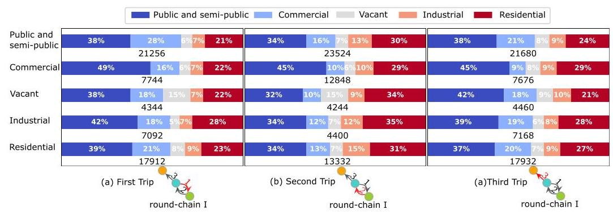
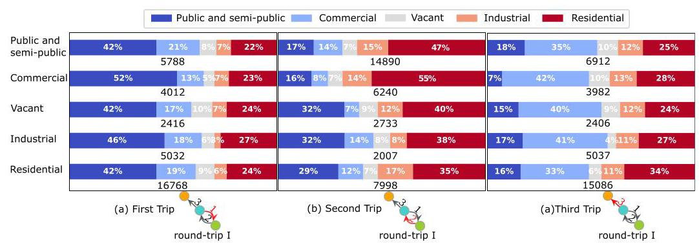

# Inferring temporal motifs for travel pattern analysis using large scale smart card data

Da Lei ${}^{a, b, c}$ , Xuewu Chen ${}^{a, b, c, * }$ , Long Cheng ${}^{d}$ , Lin Zhang ${}^{f}$ , Satish V. Ukkusuri ${}^{e}$ , Frank Witlox ${}^{d}$

${}^{a}$ Jiangsu Key Laboratory of Urban ITS, Southeast University, Nanjing 211189, China

${}^{b}$ Jiangsu Province Collaborative Innovation Center of Modern Urban Traffic Technologies, Southeast University, Nanjing 211189, China

${}^{\mathrm{c}}$ School of Transportation, Southeast University, Nanjing 211189, China

${}^{\mathrm{d}}$ Department of Geography, Ghent University, Krijgslaan 281 S8, Ghent 9000, Belgium

${}^{e}$ Purdue University, West Lafayette, IN 47907, USA

${}^{f}$ School of Civil Engineering and Transportation, South China University of Technology, Guangzhou 510641, China

## ARTICLEINFO

Keywords:

Temporal network

Smart card data

Travel pattern

Public transportation

Travel-activity chain

Travel regularity

## A B S T R A C T

In this paper, we proposed a new method to extract travel patterns for transit riders from different public transportation systems based on temporal motif, which is an emerging notion in network science literature. We then developed a scalable algorithm to recognize temporal motifs from daily trip sub-sequences extracted from two smart card datasets. Our method shows its benefits in uncovering the potential correlation between varying topologies of trip combinations and specific activity chains. Commuting, different types of transfer, and other travel behaviors have been identified. Besides, varying travel-activity chains like "Home $\rightarrow$ Work $\rightarrow$ Post-work activity (for dining or shopping) $\rightarrow$ Back home" and the corresponding travel motifs have been distinguished by incorporating the land use information in the GIS data. The analysis results contribute to our understanding of transit riders' travel behavior. We also present application examples of the travel motif to demonstrate the practicality of the proposed approach. Our methodology can be adapted to travel pattern analysis using different data sources and lay the foundation for other travel-pattern related studies.

## 1. Introduction

Analyzing travel patterns in a public transportation network is essential in understanding passengers' travel behaviors and providing insights into improving transit service management. Transportation modal choice, timing, and selection of departure and arrival locations combine to form individual travel patterns. Collectively, individual travel patterns will impact travel experience and contribute to congestion and environmental pollution. Over the past decade, many travel pattern studies have been conducted to explore habitual behaviors, patterns, and effect factors at the spatiotemporal level (Witlox and Tindemans, 2004; Hasan et al., 2013; Ma et al., 2013; Kim et al., 2017; Ma et al., 2017; Faroqi et al., 2017; Luo et al., 2019; Lei et al., 2019; Cheng et al., 2019). However, the existing literature shows less attention regarding the time-varying topology of individual travel patterns. Travel-pattern topology plays a vital role in activity-based travel behavior analysis. For example, the time-varying topology demonstrated in the subfigure of 3- back&forth motif in Fig. 1(a) could imply a typical activity-travel scenario where transit passengers reach their workplace or school and back home for lunch or other activities, followed by going back again to their workplace/school. In this case, the specific topology of 3- back&forth motif seems to correlate with a daily travel-activity pattern as: "Home $\rightarrow$ Work $\rightarrow$ Back home $\rightarrow$ Back to work". In contrast, another motif, discon-chain motif in Fig. 1(a), could demonstrate a metro-bikesharing transfer behavior. The absence of proper analytical methods concerning travel pattern topologies has restrained most previous research into a more in-depth and large-scale activity-based travel pattern analysis across different transit modes. Besides, the unavailability of a massive data source embedding precise information about each trip's time and location also constrains conducting such analysis on a large scale.

---

* Corresponding author at: Jiangsu Key Laboratory of Urban ITS, Southeast University, Nanjing 211189, China.

---

Network science provides an abstraction for analyzing complex systems in an extensive set of disciplines, including transportation, social, and bioinformatics networks (Strogatz, 2001; Girvan and Newman, 2002; Newman, 2003; Boccaletti et al., 2006; Luo et al., 2019; Yap et al., 2019). Usually, such a system is represented as a static graph that depicts relationships between entities related to each other by edges. However, many networks representing complicated systems are dynamical as the edges between entities or nodes constantly evolve (Holme and Saramäki, 2012). With the availability of massive timestamped data resulting from the fast development of various data acquisition sensors and social media, recent years have seen increasing implementation of temporal network models to study dynamics in complex systems (Pan and Saramäki, 2011; Perra et al., 2012; Scholtes et al., 2014; Holme, 2015; Valdano et al., 2015; Li et al., 2017).

Combined with the notion of temporal graph denoting travelers' daily trip sequences, the temporal motif concept is generalized for representing individual travel patterns. Motif plays a vital role in interpreting and understanding graph (Milo et al., 2002). A motif is defined as a subgraph with a significantly frequent occurrence in static networks (Mangan and Alon, 2003; Alon, 2007; Jin et al., 2007). Some recent studies utilizing static motifs to depict travelers' mobility patterns explicitly, for the first time, showed the power of exploring intricate travel patterns using motifs in terms of understandability and interpretability (Schneider et al., 2013a, b; Li et al., 2016; Yan et al., 2017). An emerging notion in complex network science, temporal motif, has recently attracted interest from researchers. A temporal motif has generally been defined as the motif considering the order of the appearance of edges. (Kovanen et al., 2011, 2013; Shao et al., 2013; Meydan et al., 2013; Paranjape et al., 2017; Sun et al., 2019). The advantage of the temporal motif is that it captures the topology of subgraphs in a network, as the conventional static motif does, and also exhibits the underneath time-varying relationships among edges in motifs.

This study aims to fill the current gap in the literature by analyzing passengers' travel behaviors concerning both the topological structure of travel patterns and spatiotemporal connections between trips based on the generalized notion of the temporal motif. There are no studies reported that utilizing temporal motifs to investigate travel behavior to the best of our knowledge. In this study, temporal motifs denoting travel patterns of transit users have been recognized from daily trip subsequences by a scalable subgraph enumeration algorithm. The proposed algorithm can be adapted to mine individual travel patterns of any transportation system, not limited to transit modes. Our approach lends itself to intuitive visualization, and its transferability enables us to conduct the comparative analysis between various transportation modes. We also presented two application examples to demonstrate the practicality of our method and its potentials for addressing other challenging tasks in transportation engineering.

## 2. Literature review

Most existing studies exploring travel patterns focus on analyzing the repeatability of trips. For example, Morency et al. (2007) measured the degree of spatiotemporal variability in transit usage in Gatineau, Quebec, based on smart card data. Buliung et al. (2008) proposed an indicator, namely the spatial repetition index, to represent the extent to which a passenger repeatedly visits a location over a week. The authors explored the discrepancies in travel patterns in different periods. Ortega-Tong (2013) examined the spatiotemporal travel patterns of transit passengers using smart card data in London. After analyzing the variations in transit riders' sociodemographics and travel-activity patterns, the authors classified them into eight groups, and transit travelers with four daily trips in a week were considered as frequent transit riders. Kieu et al. (2015) proposed a Density-Based Scanning Algorithm with Noise (DBSCAN) algorithm to recognize the regularly traveled OD pairs of transit passengers in South East Queensland, Australia. Based on smart card data from the Beijing Bus AFC system, Ouyang et al. (2018) implemented a trip reconstruction algorithm and a DBSCAN algorithm to cluster passengers and measure travel regularity.

Fig. 1. Temporal graph and temporal motifs.

Although trip combinations have caught some attention in the literature of travel behavior analysis, approaches interpreting versatility in potential trip combinations and its relationship with activity behaviors of transit riders remain absent from the transportation science community. The most studied and perhaps the simplest trip combination is the commuting pattern consisting of two trips in most cases. The recent advances in sensor data collection techniques have drawn more academic attention on commuting behavior analysis at both spatial and temporal levels. For example, Ma et al. (2013) proposed a DBSCAN algorithm and identified commuting patterns of transit passengers in Beijing. The authors also implemented clustering algorithms to evaluate travel pattern regularity and recognized frequent transit users. Based on cellphone data, Kung et al. (2014) explored and compared home-work commuting behaviors in different places in the world (Portugal, Boston, Ivory Coast, and Saudi Arabia). They concluded that commuting time distributions and mean values within a single zone are primarily independent of commute distance or places. Zhou et al. (2014) investigated the travel commuting pattern of bus passengers and private vehicle users based on the smart card and household survey data. They found the differences in commuting range and commuting capacity between bus riders and car users. Ma et al. (2017) developed the Technique for Order Preferences by Similarity to an Ideal Solution (TOPSIS) method to measure travel regularity and used an Iterative Self-Organizing Data Analysis Techniques (ISODATA) method to distinguish transit commuters based regularity score automatically. Zhao et al. (2017) identified commuting patterns at a spatiotemporal level based on OD pairs extracted from smart card data collected in Shenzhen, China.

Some studies investigated trip/activity combinations with more than two trips but remain limited in scope regarding the types of trip combinations. In the literature of activity-based transport demand modeling, Recker et al. (1985) proposed a classification procedure to refine travelers' whole daily movements as their travel-activity patterns based on household survey data collected from Orange County, California. Joh et al. (2002) considered the whole record of activities as a trip/activity combination. Based on a 2-day household survey in Netherland, the authors developed a multidimensional sequence alignment method to estimate differences in sequential and interdependent information underneath travel-activity patterns. Goulet-Langlois et al. (2017) modeled the day-to-day individual movements as a random process and represented the travel-activity pattern as a random variable sequence. Briand et al. (2017) applied clustering techniques to analyze year-to-year dynamics in public transportation passengers' behavior based on smart card data. They identified work/study travel-activity pattern and three-peak travel patterns referring to some diffuse activities.

In summary, most existing studies on travel pattern analysis focus on measuring the repeatability of single trip or commuting behavior. Some previous studies investigated complete activity-trip chains in a day. Besides, less attention has been paid to the order in which trips are undertaken. Different trip orders can lead to variability in trip chains' dynamical topology, which we will demonstrate in our analysis. We argue that topology is an intrinsic property of a trip sequence and connotes the relationship between travel patterns and passengers' daily joint activities. In the following sections, we present a universal way to represent individual travel patterns based on the notion of temporal motif so that information like the topology of a travel pattern and the order in which each trip takes place can be recorded for travel behavior analysis. Our approach can provide a better understanding of travel patterns, which further benefits the comparison of travel behavior of different transit passengers.

## 3. Preliminaries

We now provide some formal definitions related to temporal motifs.

Definition 1 Temporal Edge: A temporal edge ${e}_{i} = \left( {{u}_{i},{v}_{i},{t}_{i}}\right)$ is defined as a directed edge with timestamp attributes, where ${u}_{i}$ and ${v}_{i}$ are the source and destination nodes respectively, and ${t}_{i}$ is the corresponding timestamp of ${e}_{i}$ . We assume that one temporal edge has a timestamp so that the timestamped edges can be strictly ordered. In reality, a temporal edge may have multiple timestamps. For example, a temporal edge referring to one trip of a transit passenger typically has both departure and arrival time. Our method can be adapted to such cases and even more sophisticated situations when appending one trip’s duration as a timestamp attribute to the temporal edge is expected, but one needs to determine the criteria to order temporal edges based on timestamps.

Definition 2 Temporal Graph: A temporal graph or temporal network $T = \left( {V, E}\right)$ comprises a set of nodes $V$ and a temporal edge set $E = \left\{  {\left( {{u}_{i},{v}_{i},{t}_{i}}\right)  \mid  {u}_{i},{v}_{i} \in  V}\right\}$ . Under this definition, multiple edges could appear between the same pair of nodes. The temporal graph in this study is represented as an unweighted directed multigraph with timestamped edges. Fig. 1(b) shows an example of a 3-node, 5- edge temporal graph.

Definition 3 Temporal Motif: A temporal motif $M$ is a frequent subgraph with ordered temporal edges in the temporal graph $T$ , $M = \left\{  {\left( {{u}_{1},{v}_{1},{t}_{1}}\right) ,\left( {{u}_{2},{v}_{2},{t}_{2}}\right) ,\ldots ,\left( {{u}_{l},{v}_{l},{t}_{l}}\right) }\right\}$ , where $l$ is the number of temporal edges in $M$ . In this study, each individual’s travel records in one day are used to build up a temporal graph. One temporal edge in the graph corresponds to one trip of a passenger, and we choose the departure time of that trip as the timestamp of the temporal edge. Temporal motif (temporal subgraphs with high repeatability) have been extracted from temporal graphs. For brevity, we use "travel motif" or "motif" to represent "temporal motif" in the following sections. Most existing studies on temporal motif have some time constraints on edges. For example, Goulet-Langlois et al. (2017) restricted the time difference between the first and last edges to be within a time window $\delta$ . Sun et al. (2019) and Kovanen et al. (2011) have an even stricter time limitation of edges in a temporal motif. In their studies, any consecutive edges in motif must be within a time interval ${\Delta T}$ . In this study, we do not impose any time limits on edges representing trips because we want to retain all spatiotemporal information of trips in the raw dataset for investigating the spatial distribution and the time-varying characteristics of trips, plus the time interval between tours. Fig. 1(c) and (d) are two temporal subgraphs existing in the temporal network in Fig. 1(b). Fig. 1(c) is an instance of loop motif in Fig. 1(a) since it matches the structure and edge order $\{ \mathrm{A} \rightarrow  \mathrm{B},\mathrm{B} \rightarrow  \mathrm{C},\mathrm{C} \rightarrow  \mathrm{A}\}$ of loop motif. Fig. 1(d) is not an instance of loop motif since the edge order is $\{ \mathrm{A} \rightarrow  \mathrm{B},\mathrm{C} \rightarrow  \mathrm{A},\mathrm{B} \rightarrow  \mathrm{C}\}$ , does not form a "loop" as loop motif shows.

We are typically only interested in small constant values of the number of edges $l$ , which is 2 to 3 in our case study because most urban travelers tend to have less than three trips in a day as shown in the distribution of daily trip sequences in Fig. 2, and small-sized motifs can be viewed as building blocks for larger-sized motifs. However, our algorithm can easily be generalized to the case when the length of trip subsequences are much longer. We exhaust all possible permutations of 2 to 3 directed edges to construct potential 2-edge and 3-edge motifs (42 motifs in total) and present some of them in Fig. 1(a). Single trips can be considered as special cases of travel motifs and are indexed as single-trip motif in this paper. We use blue, green, orange and red to color node 1 to node4 in motifs.

Definition 4 Temporal network complexity: In network science, entropy is one of the most popular methods for measuring network complexity (Mowshowitz,1968; Dehmer,2008; Dehmer and Mowshowitz,2011). Given any discrete random variable $X$ with $m$ possible outcomes (e, g, $m$ possible types of travel motifs), entropy is defined as the function of the probability of a specific motif $p\left( x\right)$ to measure the average information or surprise regardless of order,

$$
H\left( X\right)  =  - \mathop{\sum }\limits_{{i = 1}}^{m}p\left( {x}_{i}\right) {\log }_{2}p\left( {x}_{i}\right)  \tag{1}
$$

To measure the complexity of temporal networks in terms of motifs, we need a metric that can capture the extent to which ordered sequences of motifs reoccur. We assume that the sequence of motifs of an individual passenger is a stationary random process $\mathbf{X}$ in which $X$ denotes an event with a discrete probability $p\left( x\right)$ to be a set of different types of travel motifs $S$ . Entropy rate is defined as the asymptotic rate at which the entropy of sub-sequence ${X}_{1}^{n} = \left\{  {{X}_{1},{X}_{2},\ldots ,{X}_{n - 1},{X}_{n}}\right\}$ changes with $n$ (Gao et al.,2008),

$$
H\left( \mathbf{X}\right)  = \mathop{\lim }\limits_{{n \rightarrow  \infty }}\frac{1}{n}H\left( {{X}_{1},{X}_{2},{X}_{3},\ldots ,{X}_{n}}\right)  \tag{2}
$$

For a stationary process, the entropy rate exists and equals(Cover, 1999),

$$
H\left( \mathbf{X}\right)  = \mathop{\lim }\limits_{{n \rightarrow  \infty }}H\left( {{X}_{n} \mid  {X}_{n - 1},\ldots ,{X}_{2},{X}_{1}}\right)  \tag{3}
$$

where the conditional entropy $H\left( {{X}_{n} \mid  {X}_{1}^{n - 1}}\right)  = H\left( {{X}_{n} \mid  {X}_{n - 1},\ldots ,{X}_{2},{X}_{1}}\right)$ is defined as,

$$
H\left( {{X}_{n} \mid  {X}_{1}^{n - 1}}\right)  = \mathop{\lim }\limits_{{n \rightarrow  \infty }} - \mathop{\sum }\limits_{{{x}_{1}^{n} \in  S}}p\left( {x}_{1}^{n}\right) {\log }_{2}\frac{p\left( {x}_{1}^{n}\right) }{p\left( {x}_{1}^{n - 1}\right) } \tag{4}
$$

## 4. Algorithm

Here we propose an algorithm for extracting instances of $l$ -edge motifs and present the pseudocode in Algorithm.1. This temporal motif enumeration algorithm is inspired by the temporal subgraph enumeration algorithms proposed by Paranjape et al. (2017). Different from many other temporal/dynamical motif studies that aggregate temporal information into a network snapshot sequence in which the "temporal motif" is still static (with weighted edges) within a specific period (Tantipathananandnh et al., 2007; Jin et al., 2007; Araujo et al., 2014), their method assigned unique timestamps to each unweighted edge which can represent single trips in travel trajectories. However, some differences in our modified algorithm and their approach exist: we do not check if two edges are within a predefined time window because we do not want to set time limits on the edges of motifs. Also, we label trip records constituting motif instances instead of only counting the number of instances for each motif in their study. Another difference is the way we construct the null model for computing z-score of motis, which we will explain in the following content. The algorithm performs dynamical programming that first extracts 2-edge motif instances and then extends these 2-edge instances to 3-edge sequences to identify 3-edge motifs.

Fig. 2. Distributions of daily trip sequences.

Algorithm 1. Motif Enumeration. The subgraph set ${E}_{sub}$ is the set of edges added for building a motif in current iteration. The extension set ${E}_{\text{ext }}$ is the set of edges adjacent to an edge in ${E}_{\text{sub }}$ qualified to be added for constructing a motif in the next iteration. The adjacent set ${E}_{adj}$ includes edges in ${E}_{sub}$ and all neighbor edges of nodes in ${E}_{sub}$ .

---

Input: Temporal Graph $T$ , the maximum number of edges $l$ in the targeted $l$ -edge motif.

Output: Labeled temporal edges in which a motif it belongs to.

	procedureEnumerateMotifs $T,\max \left( l\right)$

		forallnode in $T$ do

			assign ${E}_{\text{ext }}$ with all edges linked to node in $T$

			${E}_{\text{adj }} \leftarrow$ a copy of ${E}_{\text{ext }}$

			${E}_{\text{sub }} \leftarrow  \varnothing$

			ExtendSubgraph $\left( {T,\max \left( l\right) ,{E}_{\text{sub }},{E}_{\text{ext }},{E}_{\text{adj }}}\right)$

		end for

	end procedure

	procedure ExtendSubgraph $T,\max \left( l\right) ,{E}_{\text{sub }},{E}_{\text{ext }},{E}_{\text{adj }}$

		if all edges in ${E}_{sub}$ are labeled by any motif index then

			break

		end if

		if $\left| {E}_{sub}\right|  \leq  l$ and ${E}_{sub}$ can be recognized as an instance of a specifc motifthen

			label edges in ${E}_{\text{sub }}$ with the corresponding motif index

		end if

		while $\left| {E}_{\text{ext }}\right|  > 0$ do

			extend ${E}_{\text{sub }}$ with the first edge $e$ in ${E}_{\text{ext }}$ and remove $e$ from ${E}_{\text{ext }}$

			append a set of edges $\left( {{E}_{\text{ext }}{}^{\prime }}\right)$ linked to $e$ but not in ${E}_{\text{adj }}$ if any exist

			update ${E}_{adj}$ by ${E}_{adj} \cup  {E}_{ext}{}^{\prime }$

			ExtendSubgraph $\left( {T, l,{E}_{sub},{E}_{ext},{E}_{adj}}\right)$

		end while

	end procedure

---

Fig. 3 shows an example of the execution of the motif enumeration algorithm for 2-edge motif instances. For simplicity, we only depict the leftmost branch of the detailed execution procedure. For each temporal graph, the algorithm starts with the procedure ENUMERATEMOTIFS, traversing all nodes. The dynamical expansion of ${E}_{\text{ext }}$ and ${E}_{\text{adj }}$ will ensure that the subgraph set ${E}_{\text{sub }}$ can gradually stretch to its adjacent edges, reaching its neighbors’ neighbors, and form the targeted temporal subgraph of length $l$ eventually. The labeled 2-edge motif instances will be extended to 3-edge sequences for extracting 3-edge motif instances in the next iteration of procedure EXTENDSUBGRAPH. Notice that multiple motifs could be assigned to the same trip. We only append motif index with the highest z-score (see details in Eq. (5)) to trips of passengers. In most existing motif studies, one needs to construct a set of random graphs to compute the relative z-score for measuring the motif significance in the target graph(Wernicke and Rasche, 2006; Alon, 2007; Kovanen et al., 2013; Shao et al., 2013). However, we adopted the temporal graphs built from trip subsequences of all transit travelers as the null model to measure the significance of motif $M$ .

$$
z\left( M\right)  = \frac{C\left( M\right)  - \mu \left( {\widetilde{C}\left( M\right) }\right) }{\sigma \left( {\widetilde{C}\left( M\right) }\right) } \tag{5}
$$

where $C\left( M\right)$ is the count of a specific motif $M$ in the temporal graph. $\mu \left( {\widetilde{C}\left( M\right) }\right)$ and $\sigma \left( {\widetilde{C}\left( M\right) }\right)$ are the mean and standard deviation of the count in the null model.

Fig. 3. An example of Algorithm 1 execution for extracting motif instances with $k = 2$ nodes and $l = 2$ edges.

## 5. Data description

This study exploits two types of data: (1) smart card data from the Nanjing Metro Automatic Fare Collection(AFC) system and Nanjing Public Bikesharing AFC system; (2) the GIS data of Nanjing city containing a layer of land-use map and the road network. The two AFC systems are separated from each other, and the user IDs in these two systems cannot match. A smart card in one AFC system cannot be used to access another one. We cannot infer across-mode transfer behavior from the data directly. Table 1 summarizes some basic information about these two public transit systems in Nanjing. Transit riders of both systems need to tap their smart cards when entering(or unlocking bicycles) and leaving stations(or returning bikes). Both smart card datasets comprise transaction date, card ID, transaction starting time, transaction ending time, origin station ID, and destination station ID. The smart card data are grouped by day per transit rider to obtain individual daily trip sequences for building temporal networks. Fig. 2 depicts the distribution of the length of daily trip sequences. The bikesharing has a broader service coverage than the metro in Nanjing since it is developed as a complementary service (the "last mile travel tool") for other public transportation modes, including bus and metro.

Another source of data we utilized in this study is the GIS data of Nanjing from the local urban planning department. As presented in Fig. 4, one layer of the GIS data is a map of land use in the urban area of Nanjing. The land use map is constituted by many polygons representing different zones with an attribute to describe their land-use type. There are five types of land use defined by Nanjing's urban planning commission, namely public and semi-public, commercial, Recreational and greenfield, industrial, residential. Table 2 shows what constructions or facilities are most likely to be built on different land-use zones. However, the definition of land-use type of polygons in the Nanjing GIS map does not strictly limit the construction type. For example, residential buildings can also be built in a commercial area as long as its construction planning passes the investigation of the urban planning bureau. We implemented the land-use information for the inference of transit riders' trip purpose. We also utilize the road network in the GIS data to compute network distance between stations instead of Euclidean distance.

## 6. Analysis of travel motif instances

The bottom panels of Figs. 5 and 6 depict the distributions of motif occurrence and cumulative distribution functions for the two transit systens in Feb 2017. The upper panels show the top 11 temporal subgraphs whose instances constitute about ${98}\%$ of the extracted dataset. These temporal subgraphs are considered as motifs in this study. We also name these most frequently appeared motifs based on their structural feature. As we can see, metro passengers and bikesharing riders share many travel patterns in common even though they use different transport modes, such as round motif, chain motif, discon-chain motif and loop motif. This observation indicate that riders using distinct transit modes have topologically the same set of temporal travel motifs. However, significant differences exist in motif instance distributions between metro and bikesharing users: the proportions and ranks of different motifs vary vastly across different types of transit riders. For example, although round motif is the most frequent motif for both transit riders, round motif dominates the metro motif instance distribution with a much higher frequency (around 45%) than that (around 26%) in the bikesharing motif instance distribution.

Moreover, the fourth most reoccurred motif is loop motif in the metro system, while that in the bikesharing system is discon-chain motif ('disconnected chain' motif). From the comparison of Figs. 5 and 6, we also notice that bikesharing riders have greater versatility than metro passengers in terms of the number of motif types. The motif occurrence distribution of bikesharing riders achieves more uniformity than that of metro passengers. The potential reason is that traveling by bikesharing is based on the urban road network where riders can flexibly choose the origin and destination. In contrast, OD pairs of metro trips are restrained to stations along metro routes of a relatively smaller-sized network concerning the number of nodes and edges.

In general, motif instance frequencies of bikesharing riders distribute more evenly than those of metro passengers, and the frequency ranks of motif instances for two types of transit riders differ from each other. The distribution difference between metro and bikesharing riders implies that different transit modes play different roles in serving citizens' daily traveling. The distinction in the functionality of varying transit modes exhibits not only in the service range in terms of travel distance but also in travel pattern topologies and their potential correlation with some activity chains. We will delve deeper into exploring the connection between some specific motifs and functions of distinct transit modes in the following sections.

### 6.1. Two-trip travel motif analysis

We present the distribution of trip departure time (DTDT) in 2-trip motifs for each transportation mode in Fig. 7 and the relationship between the network distance of stations and average trip length in Figs. 8-10. We conducted a spatiotemporal analysis to unveil and identify different travel behaviors in various travel motifs based on these visualizations.

Table 1

Description of the AFC systems and smart card datasets.

<table><tr><td>Transit mode</td><td>Metro</td><td>Bikesharing</td></tr><tr><td>Number of routes</td><td>9</td><td>-</td></tr><tr><td>Number of stations</td><td>159</td><td>1105</td></tr><tr><td>Introduced year</td><td>2005</td><td>2013</td></tr><tr><td>Data period</td><td>Feb,2017</td><td>Feb,2017</td></tr><tr><td>Number of records</td><td>30,959,353</td><td>3,896,270</td></tr><tr><td>Number of daily trip sequence</td><td>13,863,605</td><td>1,058,230</td></tr></table>

Fig. 4. An illustration of land use in the urban area of Nanjing. UTM zone ${50}\mathrm{\;N}$ which contains the urban area of Nanjing is used as the projected coordinate system. The units of axes are in meters.

Table 2

land-use type in Nanjing.

<table><tr><td>Land-use type</td><td>Inclusion</td></tr><tr><td>Public and semi-public</td><td>Schools, Municipal buildings, Academic institutions, Hospitals.</td></tr><tr><td>Commercial</td><td>Shopping centers, Retail and wholesale offices, Banks, Business offices.</td></tr><tr><td>Vacant</td><td>Includes undeveloped land.</td></tr><tr><td>Industrial</td><td>Light and heavy industrial use.</td></tr><tr><td>Residential</td><td>Family dwellings, Apartments, Hotels, Rooming houses, Tourist courts.</td></tr></table>

Fig. 5. The distribution of travel motifs in Nanjing metro system.

#### 6.1.1. Commuting behavior in round motif and reversed-chain motif

The DTDT of round motif for both metro and bikesharing users in Fig. 7(e) indicate commuting travel patterns. Commuting passengers/riders travel back and forth from home to work or school regularly during the morning (from 7 am to 9 am) and evening (from

Fig. 6. The distribution of travel motifs in Nanjing bikesharing system.

Fig. 7. 2-dimensional histograms of trip departure time in 2-trip motifs. Red histogram refers to metro and blue histogram refers to bikesharing. The vertical and horizontal axes show the departure time of the first and second trips respectively. The colormaps in each subfigure indicate the count of trips for each type of motif. (For interpretation of the references to colour in this figure legend, the reader is referred to the web version of this article.)

$5\mathrm{{pm}}$ to $7\mathrm{{pm}}$ ) peaks. reversed-chain motif looks less intuitive than other motifs like round motif and loop motif. The two edges in reversed-chain motif are topologically connected but undertaken in a reversed order, suggesting that transit riders expressing reversed-chain motif first travel to green node from blue node then come back to blue node from orange node instead of green node. The DTDT of reversed-chain motif for both metro and bikesharing riders indicate commuting travel behavior. The station distance density plots of reversed-chain motif in the subfigures (a) and (b) of Fig. 8 further demonstrates the commuting behavior: (1) In most reversed-chain motif instances of bikesharing riders, both the transfer distances between the orange and green nodes and the average travel distances remain around 1 $\mathrm{{km}}$ ; (2) For most metro riders performing travel reversed-chain motif, the transfer distance persists within a range from $1\mathrm{\;{km}}$ to $2\mathrm{\;{km}}$ as the average travel distance increases. One possible explanation for metro and bikesharing travelers to choose a different station (the orange node rather than the green node) to commute back home is that transit riders just randomly choose stations close to the destination of their first trip. For bikesharing riders, there exists another potential cause that is the unequal distribution of bikes among stations. Those stations where the riders drop bikes on their first trips in the morning are empty during the evening peak period, so they have to find available bicycles in nearby stations.

#### 6.1.2. Multi-modal transfer and commuting behaviors in discon-chain motif

There exists a significant discrepancy between metro and bikesharing travelers in terms of the DTDT of discon-chain motif, where metro passengers tend to reveal a commuting travel pattern in Fig. 7(d) as they undertake the two trips in the morning and evening separately. In contrast, a substantial fraction of bikesharing riders takes both trips during the morning peak period (from 7 am to 9 am), as shown in Fig. 7(h). Fig. 9 shows the correlation between the average trip length and the distance from the green node (the destination station of the first trip) to the orange node (the origin node of the second trip) for bikesharing riders. The distributions in the left and right panels of Fig. 9 correspond to two distribution peak areas depicted in the DTDT in Fig. 7(h). As we can see from the left panel of Fig. 9, the distances between the green and orange nodes are typically longer than the average trip distances in the morning peak period. Together with what we observed in Fig. 7(h), this phenomenon manifests that bikesharing has most likely been used as a transfer mode (multi-modal transfer) during the morning peak hours. We are convinced that the transferring trip (from the green node to the red node) is undertaken by a long-distance travel mode like a metro or bus rather than bikesharing in such a short time interval between the two trips in discon-chain motif. Similarly, the lower evening peak in discon-chain motif in Fig. 7h) and and the invariability in the short transfer distance shown in Fig. 9 demonstrate the commuting behavior also exists in discon-chain motif of bikesharing riders. The reasons why quite a notable portion of bikesharing riders do not commute using the same pair of stations, but nearby stations instead, could be interpreted as follows: (1) station capacity of the pair of bikesharing stations for their first trips is insufficient in the evening so that riders have to shift to an adjacent station to pick up or return a bicycle, including situations where the number of available bikes or parking docks is not enough; (2) either riders randomly choose one of nearby stations, or their choices have been affected by other activities. For metro passengers performing travel discon-chain motif, the distance between the origin (green node) of the first trip and the destination (orange node) of the second trip stays relatively constant around ${1.5}\mathrm{\;{km}}$ as is shown in Fig. 8(c), confirming our conjecture from the DTDT in Fig. 7(d) that discon-chain motif of metro passengers mainly reveals a sole commuting behavior.

Fig. 8. Frequency distribution of trip length and transition distance of reversed-chain motif, discon-chain motif in bikesharing and metro.

Fig. 9. Frequency distribution of trip length and transfer distance of discon-chain motif for bikesharing riders.

Fig. 10. Frequency distribution of trip length and transition distance of chain motif in metro.

#### 6.1.3. Single-modal transfer and commuting behaviors in chain motif

In Fig. 7, the DTDTs of chain motif for both types of transit riders suggest two kinds of travel patterns. One is commuting since the first and second trips occur in the morning peak and evening peak sequentially. However, instead of forming round trips as we observed in round motif, this commuting pattern starts at one node but ends at another node. One potential explanation for this commuting behavior is that the departure node of the first trip and the second trip’s arrival node are adjacent to each other. Another type of travel pattern revealed in chain motif is the transfer that appears during the morning peak hours. However, rather than occurring between separate travel modes as we observed in the analysis of discon-chain motif instances, this transferring pattern is considered to happen within the same transportation mode (single-modal transfer).

The above inferences can also be demonstrated in the following spatial analysis. Figs. 10 and 11 depict the distributions of average trip distance and transition distance between the blue and orange node in chain motif for metro and bikesharing users, respectively. Both figures' left panels indicate a linear correlation between the average travel distance and the transition distance when the two trips occur in the morning peak. Transition distance increases as the average travel distance grows. This linear relationship is more evident for metro passengers than that of bikesharing riders. However, when the two trips in chain motif take place in the morning peak and evening peak sequentially, both metro and bikesharing travelers' transition distance remains short as the average travel distance increases. Consistent with observations from the DTDTs in Fig. 7c) and and Fig. 7(g), chain motif instances of both travelers tend to reveal two different travel patterns. One is the chain trip pattern or single-modal transfer pattern in the morning as travelers choose to stop by the middle node (green node) for some short-time activities such as eating breakfast and then transferring from the same node to the final destination the by the same transportation mode. In this case, the distance between the starting and ending nodes of the chain trip will increase as the average trip distance increases. Another pattern is commuting as the first and last nodes of the chain trip are close to each other. The reasons why commuters have formed chain motif instances instead of round motif can be attributed to those we explained in the analysis of reversed-chain motif and discon-chain motif. The reasons commuters have formed chain motif instances

Fig. 11. Frequency distribution of trip length and transition distance of chain motif for bikesharing riders.

instead of round motif can be attributed to what we explained in the analysis of DTDTs for reversed-chain motif and discon-chain motif.

### 6.2. Three-trip motif analysis

Things become much more complex and exciting when it comes to the analysis of three-trip travel motifs. The DTDTs for each 3-trip motif are illustrated in this section. To better explain transit riders' travel behavior from the extracted three-trip motif instances, we have also conducted a geospatial analysis based on the land-use type of stations. We proposed a naive method to determine the type of each station $z$ in transit systems, as shown in Eq. (6).

$$
{\text{ landuse }}_{z} = {\operatorname{argmax}}_{x}\sum {A}_{x}^{z} \cap  {A}_{\text{buffer }}^{z} \tag{6}
$$

## where

$x$ is the land-use type of a zone in the Nanjing GIS map, $x \in  \{$ Public and semi-public, Commercial, Vacant, Industrial, Residential $\}$ . ${A}_{\text{buffer }}^{z}$ represents the area of the circle buffer of station $z$ . In this study, ${500}\mathrm{\;m}$ and ${250}\mathrm{\;m}$ are used as the radius of buffers for metro and bikesharing stations, respectively.

${A}_{x}^{z}$ denotes the area of zone of type $x$ , intersecting with the buffer of station $z$ .

From Figs. 13-18, we depict the distributions of land-use types of stations (DLTS) for each trip in varying motifs for metro passengers. Ticks on the vertical axis represent the departure station's land-use type, and the numbers under the barplots denote the total number of trips from that type of departure station. The stacked barplots and percentages depict the percent frequencies of each trip’s arrival station in travel motifs. We did not include the DLTS for bikesharing riders since most bikesharing stations have been identified as residential stops, resulting in the lack of any insightful findings.

From the DTDTs of 3-trip motifs in Fig. 12, we noticed that the DTDTs of metro passengers are generally more peaked compared to

Fig. 12. Distrbution of trip departure time in 3-trip motifs. Subfigures in the red box show the distributions for metro and the rest show distributions for bikesharing. The x-axis represents time of day, and the left y-axis represents the frequency of trips(edges) occur in different periods. The right y-axis denotes the time difference between two consecutive trips. Blue, green and orange bars in these histograms depict the first, second, and third trips. (For interpretation of the references to colour in this figure legend, the reader is referred to the web version of this article.)

Fig. 13. Distributions of land-use type of Metro station in each trip of loop motif instance.

Fig. 14. Distributions of land-use type of Metro station in each trip of 3-back&forth motif instance.

Fig. 15. Distributions of land-use type of Metro station in each trip of round-chain III motif instance.

Fig. 16. Distributions of land-use type of Metro station in each trip of round-chain II motif instance.

those of bikesharing riders, especially on the first trip. This observation demonstrated that urban citizens using the metro as their transportation mode to complete their daily travel chains generally have a stricter schedule for their daily activities than bikesharing riders. We also found that both types of travelers have more concentrated DTDTs (peaking around 8 am) on their first trips compared to their rest two trips in most travel motifs. This phenomenon is consistent with the fact that the activities related to the first trip of urban travelers, such as going to work or school in the morning, are considered to be relatively mandatory. The activities corresponding to their rest two trips could be less obligatory or even non-mandatory.

Fig. 17. Distributions of land-use type of Metro station in each trip of round-chain I motif Group A.

Fig. 18. Distributions of land-use type of Metro station in each trip of round-chain I motif Group B.

In Fig. 12(a), we found three trips in loop motif of metro passengers have three distinct peaks in the DTDTs, namely the morning peak ( $6\mathrm{\;{am}} - {10}\mathrm{\;{am}}$ ), evening peak ( $5 - 8\mathrm{\;{pm}}$ ) and night peak ( $8 - {10}\mathrm{\;{pm}}$ ). However, loop motif instances of bikesharing users exhibit only two distinct distribution peaks: the morning peak on the first trip, and the evening peaks on both the second and third trips. The distribution peaks of the second and third trips of bikesharing riders seem to overlap with each other. The average departure time differences between the first and second trips in the evening peak in Fig. 12(a) and (h) are around ${10}\mathrm{\;h}$ and $8\mathrm{\;h}$ , consistent with the fact that most cities in China have an eight-hour working day. The departure time interval between the first and second trips can be regarded as the sum of the regular eight working hours and travel time spent on the way to work. The average departure time interval of metro passengers is longer than that of bikesharing riders since the metro is generally considered as a long-distance public transport mode in the urban area.

The DLTS of loop motif is illustrated in Fig. 13. The loop motif instances of metro passengers exhibit a typical loop pattern: Most first trips start from residences to public and commercial areas. The number of metro passengers approaching commercial locations increases during the second trip. Furthermore, most passengers come back to their residences on the third trip. In short, the activity sequence of loop motif of passengers shows a "Home $\rightarrow$ Work $\rightarrow$ Post-work activity $\rightarrow$ Home" pattern. From the comparison between Fig. 12(a) and (i), we found that the departure time between the second and third trips of metro passengers $(5\mathrm{\;h}$ on average) is longer than that of bikesharing riders ( $2\mathrm{\;h}$ on average), demonstrating that the metro has been used as the transit mode for time-consuming activities in the commercial area where mega shopping centers, theaters, and restaurants located.

Fig. 12(b) and (h) illustrate that both types of transit riders performing 3-back&forth motif express similar travel behavior where transit riders travel three times back and forth between two stations. The three trips of a significant portion of transit travelers exhibiting 3-back&forth motif take place in the morning, noon, afternoon sequentially. Fig. 14 shows the DLTS of 3-back&forth motif for metro passengers. When combining temporal and geospatial distributions of 3-back&forth motif, we can depict a clear pattern for metro passengers indicating 3-back&forth motif in their trip sequences: They generally travel from home to work during the morning peak then come back home for lunch or taking a nap at noon. Later, they go back to their workplace again in the afternoon. In short, their activity chain in a day can be expressed as "Home $\rightarrow$ Work $\rightarrow$ Home $\rightarrow$ Work".

Fig. 12(d) and (f) show that both types of travelers performing round-chain III motif tend to undertake their first trips at around 8 am, forming a prominent peak in DTDTs. However, their later tours’ starting time ranges from 9 am to ${10}\mathrm{{pm}}$ , shaping the distributions in high uniformity. Fig. 15 illustrates that destinations of all trips in most round-chain III motif instances of metro passengers are (semi-) public and commercial stations. Given that employees can have multiple workplaces as they may have different job tasks in a day, metro passengers performing round-chain III motif are expected to constitute a travel pattern like "Home $\rightarrow$ Workplace $\mathrm{A} \rightarrow$ Workplace $\mathrm{B} \rightarrow$ Back to workplace A.".

round-chain II motif looks similar to round-chain III motif in terms of topology. It can be formed by switching the order of the first and second edges of round-chain III motif. However, the tiny variation in topology results in a completely different travel pattern. From Fig. 12e) and and Fig. 16, we notice that metro passengers are most likely to take their first trips to (semi-) public or commercial areas during the morning peak. Their second trips were undertaken just before $6\mathrm{{pm}}$ (the regular time off work) and are likely to be either from a commercial area to a (semi-) public region or vice versa. After a short stay following the second trip, most passengers seemed to return to their residences.

As claimed before, peaks of DTDT of the first trip are generally more significant compared to those of the rest two trips in most travel Motifs. However, round-chain I motif is an exception. The double-peaked DTDT (centered around 12 am and 6 pm separately) of the second trip presented in Fig. 12(g) also makes round-chain I motif unique as trips in other motifs usually only have a single peak in DTDTs. We grouped round-chain I motif instances of metro passengers into two clusters, namely Group A and Group B, by the period (noon peak versus evening peak) during which the second trip is undertaken. For round-chain I motif Group A, the DLTS in Fig. 17 remains almost unchanged across trips. However, passengers in round-chain I motif Group B have time-varying travel-activity patterns since the DLTS evolves over trips, as shown in Fig. 18. To sum up, metro passengers of round-chain I motif Group A are expected to travel through multiple workplaces in a day. Whereas passengers of round-chain I motif Group B tend to exhibit a travel-activity chain like "Home $\rightarrow$ Work $\rightarrow$ Home $\rightarrow$ Post-work activity.".

### 6.3. Analysis of day-to-day travel motif variation

The above analysis is conducted by the time of day in travel motifs are undertaken. It is also crucial to explore the variation of different travel motifs across days. We depicted the day-to-day distributions of frequencies for the metro and bikesharing in Figs. 19 and 20 separately. The ticks on the x-axis illustrate days of the month (February 2017), while orange color means a significant rain on that day. Different colored bars in the plots represent the frequencies of different travel motifs. Varying colored boxes around x-axis ticks illustrate the day the trip is undertaken (holiday, weekday, and weekend). The first two days are the end of the Spring Festival (holiday for the family reunion) in China. Although 4th Feb 2017 is a Saturday, it is a working day enforced by law.

In both Figs. 19 and 20, the single-trip motif constitutes the most substantial proportion in the distributions of the first two days when people are coming back from vacation or family reunion in other cities. This result is expected given that citizens are likely to reach home by metro from airports or train terminals and then rest at home instead of conducting other outdoor activities during the remaining of that day. Metro passengers clearly show a stable and periodic variation from weekdays to weekends regarding the total number of passengers performing different travel motifs. However, some motifs of metro passengers vary vastly across days when we look at them individually. The number of the travel loop motif and round-chain I motif vastly increase on Fridays then decline on weekends. The last trip of loop motif and round-chain I motif group B corresponds to post-work activities like dining and shopping, as demonstrated in the last section. The increment in their instances on Friday makes sense given that metro passengers are more likely to have post-work activities at the last working day night in a week. Weekends see a noticeable increase of instances of single-trip motif, as metro passengers are less anticipated to travel multiple times and form versatile trip-chain topologies. In general, the frequencies of less-trip travel motifs vastly rise on weekends, and round motif comprises the majority of travel motifs on most days.

The variation of the total volume of bikesharing travel motifs for weekday versus weekend followed the same trend as metro travel motifs. Nevertheless, we noticed that the usage of bikesharing could be significantly affected by weather conditions. The total number of travel motifs decreases on rainy days. This change makes sense given that bikesharing is considered more heavily influenced by weather as the riders would be entirely exposed to the outdoor environment compared with travelers using motorized public transit modes like the subway. However, single-trip motif exhibits an increase on rainy days as the severe weather condition might break up bikesharing riders' accustomed trip chains on sunny days into individual tours. Notice that the number of loop motif did not exhibit an increase on Friday as what we observed in the metro system. The potential reason is that loop motif in bikesharing does not show any evidence of its correlation to a post-work activity, as we demonstrated before.

Fig. 19. An illustration of day-to-day variation in travel motifs for metro passengers.

Fig. 20. An illustration of day-to-day variation in travel motifs for bikesharing riders.

## 7. Application examples of travel motif

In this section, we present two application examples of the travel motif to demonstrate the practicality of the proposed method. The first example predicts the missing land-use type of transit stations with and without motif information. Travel motif unveiling the travel-activity behavior shows its potential to improve model performance in such a challenging transportation engineering task. The second example bridges concepts of temporal network complexity and individual travel regularity using entropy rate allied with Levenshtein distance. The entropy-rate measured network complexity can capture within-day and day-to-day variability in the travel behavior of individuals performing specific motifs.

### 7.1. Application: classification predictive modeling with missing data

In this application example, we first make a reasonable assumption that only a part of trip records has information referring to the land-use type of the arrival and departure stations (e.g., station IDs of some SC data cannot match the station name in the transit network or missing land-use information in some areas). Missing some information in the dataset is a common situation when we initially obtain data from transit agencies. Our goal in this application case is to predict the land-use type of PT stations. Then, we can further infer the trip purpose of passengers with travel records missing station type.

We design two experiments based on 1-trip motif data and 2- to 3-trip motif data separately. In each experiment, there are a study group and a comparison group of the classification predictive modeling. The smart card dataset utilized in the experiment is split into two parts: (1) a training set employed to trains our prediction models; (2) a test set used to evaluate the prediction performance. We employ four popular machine learning algorithms, namely Gaussian Naive Bayes (GNB)(Specht, 1990), Support Vector Classifier (SVC) (Cortes and Vapnik, 1995), Logistic Regression (LR)(Menard, 2002) and Decision Tree (DT)(Safavian and Landgrebe, 1991), to conduct predictive modeling. The input variables of each trip record in the study group are the age of the passenger, gender, departure time, arrival time, the order of the trip in its corresponding motif, motif type to which the trip belong. We create the input variable set in the comparison group by removing the last two variables in the input set of the study group. The output of both groups is the land-use type of the departure station of the trip. Moreover, both groups use the same model setting in the training and prediction procedures. In the experiment, we iteratively extend the size of the training set from 0% to 50% of the whole dataset. There are 50 iterations in total, and we randomly choose an increasing proportion (increased at a rate of 1%) of data as the training set in each iteration. We apply the Average Accuracy (AA) presented in Eq. (7) as the measurement to evaluate the performance of each prediction algorithm.

$$
A{A}_{t} = \frac{\mathop{\sum }\limits_{{i = 1}}^{k}\frac{t{p}_{i} + t{n}_{i}}{t{p}_{i} + t{n}_{i} + f{p}_{i} + f{n}_{i}}}{k} \tag{7}
$$

where $k$ is the total number of land-use type, $t$ presents the prediction model type. tp (True Positive): records where the true label is positive and whose class is correctly predicted to be positive. fp (False Positive): records where the true label is negative and whose class is incorrectly predicted to be positive. fn and tn stand for "False Negative" and "True Negative".

Fig. 21 presents the average accuracy of the land-use type prediction based on trip records of 2- to 3-trip motifs. Clearly, predictions based on data embedded with motif information generally have a better performance than those solely based on the original travel records. Among other algorithms, SVC receives about 70-percent prediction accuracy utilizing only 30% of the whole dataset to train the model. The reason behind the improvement in the prediction task is what we have discussed in the above analysis sections: the topologies of travel motifs express passengers' travel-activity behavior in their trip chains. As shown in Fig. 22, motif knowledge seems to provide no benefits in promoting the accuracy of predictions based on travel records of 1-trip motifs (single-trip motifs), which is expected. The two input variables in models referring to single-trip motifs are all the same in trip records, thus offering no extra information on passengers' travel behavior.

Fig. 21. Land-use type prediction performance based on trip records of 2- to 3-trip motifs.

Fig. 22. Land-use type prediction performance based on trip records of 1-trip motifs.

### 7.2. Application: measuring travel motif regularity of transit passengers

Travel regularity analysis is an essential research topic in the transportation community as it reveals individual travel habits and provides potential for promoting advances in behavior modeling, travel prediction, and passenger segmentation. In Section 3, Eqs. (3) and (4) presented theoretical formulations of complexity for temporal graphs in terms of motifs based on entropy rate. The complexity of temporal networks directly constructed from passengers' trip trajectories is naturally equivalent to the notion of individual travel irregularity in transportation engineering. Entropy-rate measured network complexity expresses average surprise in ordered motif sequences, thus showing the extent of individual passengers' travel pattern variability. The decreasing network complexity means an increasing travel pattern regularity and vice versa. However, estimating entropy rates could be challenging. There are three popular types of entropy rate estimators in the literature, namely the context-tree weighting (CTW) based entropy estimator (Willems, 1998), the Burrows-Wheeler transform (BWT) based estimator (Cai et al., 2004; Goulet-Langlois et al., 2017) and Lempel-Ziv (LZ) based algorithm (Ziv and Lempel, 1977; Wyner and Ziv, 1989).

In this application case, we adapted the Burrows-Wheeler transform (BWT) based entropy estimator to measure individual travel regularity with respect to motifs. In the transportation community, Goulet-Langlois et al. (2017) employed BWT based entropy to compute the regularity of sequences of location changes referring to single trips or mobility events. The procedure for estimating entropy rates in this study is split into two steps: (1) the Burrows-Wheeler transform is implemented to one-month motif sequences of individual passengers. For brevity, we only present the transformation process for a one-week motif index sequence in Table 3. In short, we iteratively put the first motif index to the end of the ordered sequence until the last index of the original sequence becomes the first index in the rotated array. Then, the algorithm sorts the list of all rotated sequences by their first indices and retains each rotation's last index as the transformed motif sequence. (2) The transformed sequence is then divided into $L$ subsequences $l$ of the same length. For example, subsequence length will be seven if we perform the division weekly. Also, seven is a number closed to $\sqrt{n}$ ( $n$ equals 28 days in our case studies) which is the recommended choice from Cai et al. (2004) for splitting the complete sequence. The motif distribution of each subsequence is estimated from Eq. (8).

$$
\widetilde{d}\left( {x, l}\right)  = \frac{{N}_{l}\left( x\right) }{\mathop{\sum }\limits_{{y \in  S}}{N}_{l}\left( y\right) } \tag{8}
$$

Table 3

BWT example of a one-week motif index sequence.

<table><tr><td>Input</td><td>All Rotations</td><td>Sorted Rotations</td><td>Output</td></tr><tr><td rowspan="7">(0) $\left( {{42},1}\right) \left( 1\right) \left( {0,{42}}\right) \left( {42}\right) \left( 8\right) \left( 1\right)$</td><td>(0) $\left( {{42},1}\right) \left( 1\right) \left( {0,{42}}\right) \left( {42}\right) \left( 8\right) \left( 1\right)$</td><td>(0)(42,1)(1)(0,42)(42)(8)(1)</td><td>(1)(8)(42,1)(42)(0,42)(1)(0)</td></tr><tr><td>(42,1)(1)(0,42)(42)(8)(1)(0)</td><td>(1)(0)(42,1)(1)(0,42)(42)(8)</td><td/></tr><tr><td>(1) $\left( {0,\frac{4}{2}}\right) \left( \frac{4}{2}\right) \left( 8\right) \left( 1\right) \left( 0\right) \left( {\frac{4}{2},1}\right)$</td><td>(1) $\left( {0,\frac{4}{2}}\right) \left( \frac{4}{2}\right) \left( 8\right) \left( 1\right) \left( 0\right) \left( {\frac{4}{2},1}\right)$</td><td/></tr><tr><td>(0,42)(42)(8)(1)(0)(42,1)(1)</td><td>(8) $\left( 1\right) \left( 0\right) \left( {{42},1}\right) \left( 1\right) \left( {0,{42}}\right) \left( {42}\right)$</td><td/></tr><tr><td>(42) $\left( 8\right) \left( 1\right) \left( 0\right) \left( {{42},1}\right) \left( 1\right) \left( {0,{42}}\right)$</td><td>(42) $\left( 8\right) \left( 1\right) \left( 0\right) \left( {{42},1}\right) \left( 1\right) \left( {0,{42}}\right)$</td><td/></tr><tr><td>(8) $\left( 1\right) \left( 0\right) \left( {{42},1}\right) \left( 1\right) \left( {0,{42}}\right) \left( {42}\right)$</td><td>(0,42)(42)(8)(1)(0)(42,1)(1)</td><td/></tr><tr><td>(1)(0)(42,1)(1)(0,42)(42)(8)</td><td>(42,1)(1)(0,42)(42)(8)(1)(0)</td><td/></tr></table>

where ${N}_{l}\left( x\right)$ is the number of appearances of index $x$ in subsequence $l$ and $S$ is a set of potential motif outcomes predefined in Section 3. The entropy rate of $\mathbf{X}$ is then estimated by averaging the entropy of all subsequences out using Eq. (9).

$$
\widetilde{H}\left( \mathbf{X}\right)  =  - \frac{1}{n}\mathop{\sum }\limits_{{l \in  L}}\mathop{\sum }\limits_{{x \in  S}}{N}_{s}\left( x\right) {\log }_{2}\widetilde{d}\left( {x, l}\right)  \tag{9}
$$

However, an individual passenger could have multiple motifs on one day. Thus, we should consider $x$ as a sequence of indices of within-day motifs instead of a single motif. We proposed a modified Levenshtein-distance measure to adjust ${N}_{l}\left( x\right)$ for accounting for the occurrences of mutual motif indices in two different $x$ , as shown in Eq. (10).

$$
{\operatorname{lev}}_{{x}^{a},{x}^{b}}\left( {i, j}\right)  = \left\{  {\begin{matrix} \infty ,\text{ if }{x}^{a}\text{ and }{x}^{b}\text{ have no mutual motif indices } \\  \min \left\{  {\begin{matrix} {\operatorname{lev}}_{{x}^{a},{x}^{b}}\left( {i - 1, j}\right)  + 1 \\  {\operatorname{lev}}_{{x}^{a},{x}^{b}}\left( {i - 1, j - 1}\right)  + 1 \\  {\operatorname{lev}}_{{x}^{a},{x}^{b}}\left( {i - 1, j - 1}\right)  + 1 \end{matrix} + 1}\right. \\  1,\text{ if }{x}^{a}\text{ and }{x}^{b}\text{ are idnetical } \end{matrix} + 1}\right.  \tag{10}
$$

where ${x}^{a}$ and ${x}^{b}$ denote two different ordered sequences of within-day motif indices and ${1}_{\left( {x}_{1}^{a} \neq  {x}_{2}^{b}\right) }$ is the indicator function equal to zero when ${x}_{i}^{a} \neq  {x}_{j}^{b}$ . Notice that ${x}_{i}^{a}$ and ${x}_{j}^{b}$ are the last indices of ${x}^{a}$ and ${x}^{b}$ separately. The Lev-distance algorithm generally calculates the least number of edit operations that are required to modify one sequence to obtain another sequence. Lev-distance equals infinity if there are no common elements in ${x}^{a}$ and ${x}^{b}$ . The first component in the minimum of Eq. (10) refers to deletion (from ${x}^{a}$ to ${x}^{b}$ ), the second to insertion, and the third to match or mismatch, depending on whether the respective symbols are the same. For example, the modified Lev-distance from (42,1) to (0,42) in Table 3 is: "a deletion (42,1) → (42)" + "an insertion (42) $\rightarrow  \left( {0,{42}}\right)$ " + 1 = 3 . For a more detailed discussion on the original Levenshtein distance, we refer to Levenshtein (1966).

Eq. (11) shows the formulation of ${N}_{l}\left( x\right)$ adjusted by Lev-distance,

$$
{N}_{l}\left( {x}^{a}\right)  = \mathop{\sum }\limits_{{{x}^{a} \in  l,{x}^{b} \in  l}}\frac{1}{{\operatorname{lev}}_{{x}^{a},{x}^{b}}}{N}_{l}\left( {{x}^{a},{x}^{b}}\right)  \tag{11}
$$

where ${N}_{l}\left( {{x}^{a},{x}^{b}}\right)$ counts the number of mutual motif indices in ${x}^{a}$ and ${x}^{b}$ . To this end, we can apply Eqs. (11) to (8) and eventually estimate entropy rates of complete motif sequences for exploring individual travel pattern regularity concerning both day-to-day and within-day variability.

Figs. 23 and 24 present the distributions of entropy rate (DER) of metro and bikesharing users respectively. The DER of metro passengers has a mean of 1.6 bits and a standard deviation of 0.51 bits. In contrast, the DER of bikesharing riders has a mean of 2 and a STD of 0.73 bits. Comparing DER between metro and bikesharing users suggests that metro passengers generally have more regular travel patterns than bikesharing riders. Figs. 25 and 26 show examples of two-week motif sequences (from Feb 6 to Feb 20) for anonymous transit users with different entropy rates. Transit users with low entropy rates, such as metro passenger 2361 and bike-sharing rider 0431, consistently perform 1 to 2 travel motifs over the observation period. In contrast, metro and bikesharing users with relatively high entropy rates express high variability in their motif sequences. We can more accurately conduct transit user classification by incorporating information about passengers' motif entropy rate and their inferred trip purposes. For example, bikesharing rider 0431 could be identified as a user who regularly transfers from bikesharing to motorized transit modes for eventually arriving at his or her daily traveling destination.

Fig. 23. Distribution of entropy rate of metro passengers.

Fig. 24. Distribution of entropy rate of bikesharing riders.

## 8. Conclusion

In this paper, we proposed a new universal method for representing travel patterns for transit riders based on temporal motif. We developed an algorithm to identify motifs from daily trip subsequences extracted from smart card data of two different public transportation systems in Nanjing. The temporal motif method shows its benefits in uncovering the potential correlation between varying topologies of trip combinations and specific activity chains. The proposed method lends itself to intuitive visualization for researchers or transit operators to better understand passengers' travel behavior. Comparisons between different travel modes can also be conducted since our method can be easily modified to travel pattern analysis of different transport modes, not only public transportation systems. The variation in travel motifs across travelers from different public transportation modes reveals the difference in the travel behavior of users and captures the distinction in functionality and service between different transit modes. Some discoveries can be highlighted as follows:

- Metro passengers and bikesharing riders have almost the same set of travel motif types, demonstrating that those motifs are just intuitive with respect to daily traveling and reflecting the nature of human mobility. However, the distributions of different travel motifs vary vastly across different transit modes.

- For two-trip travel motifs, there are two significant types of travel patterns, namely commuting and transfer. Commuting pattern accounts for the most substantial fraction of all travel motifs for both metro passengers and bikesharing riders. Multi-modal transfer behavior of bikesharing riders and single-modal transfer at the same/different stations for both metro and bikesharing users have also been recognized. We have also captured the differences in 2-trip travel motifs between varying types of transit riders.

- We conducted the geospatial and temporal analysis to infer trip purpose and distinguish varying travel-activity chains for different 3-trip travel motifs by incorporating the land use information of zones in which each transit station locates. The distributions of departure time of each trip in travel motifs of metro passengers generally have more obvious peaks than those of bikesharing riders, implying that metro passengers' daily schedule is comparably stricter and mandatory. Some specific 3-trip motifs have one-to-one or one-to-many relationships with travel-activity chains like "Home-Work-Post-work activity (for dining or shopping)-Back home.", "Home $\rightarrow$ Work $\rightarrow$ Back home (for lunch or taking a nap) $\rightarrow$ Back to work" and "Home $\rightarrow$ Workplace A $\rightarrow$ Workplace B $\rightarrow$ Back to workplace A."

Fig. 25. Examples of motif sequences of metro passengers with different entropy rates.

Fig. 26. Examples of motif sequences of bikesharing riders with different entropy rates.

- In the analysis of variation in travel motifs across days, we observed expected weekday-versus-weekend shifts in the total volume of travel motifs for both metro and bikesharing systems. Also, we observed an increase in metro passengers' motif containing post-work activities on Fridays. Weekends see the increase of 2-trip motifs and single trips and the decline of relatively intricate 3- trip travel motifs. Adverse weather condition, such as rain, has an extra negative impact on the usage of bikesharing.

- In Section 7, we present two application examples of the travel motif to demonstrate the proposed method's practicality. The first example predicts the missing land-use type of transit stations with and without motif information. Travel motif unveiling the travel-activity behavior shows its potential to improve model performance in such a challenging transportation engineering task. The second example bridges concepts of temporal network complexity and individual travel regularity using entropy rate allied with Levenshtein distance. The entropy-rate measured network complexity can capture within-day and day-to-day variability in the travel behavior of individuals performing specific motifs.

The limitation of this study remains: We use land-use information in the GIS map of Nanjing to calculate and determine the type of station. Most bikesharing stations have been identified as residential stations, leading to the failure to capture any distinct and inspirational travel patterns for bikesharing riders in 3-trip motif analysis. Utilizing finer-level information like Point of Interest (POI) and social media data (Zhan et al., 2014) may improve the accuracy of trip purpose inference. The inferences of trip purpose and travel behaviors in Section 6 also need to be validated through other approaches, such as conducting a questionnaire for smart card users to fill in. The self-loop trip representing transit riders depart and arrive at the same station has not been considered.

Despite these limitations, our study still provides an in-depth insight into travel patterns across varying transit modes and the connections between their topologies and passengers' activity chains at both macroscopic and microscopic levels. Besides, our proposed approach provides the potential for future research related to travel pattern analysis. The extracted travel motif enables us to conduct travel demand modeling, individual travel pattern regularity estimation, anomaly travel behavior analysis, and travel pattern prediction based on the repeated and ordered trip sub-sequences correlating with some specific activity chains instead of separate trip records.

## CRediT authorship contribution statement

Da Lei: Conceptualization, Writing - original draft. Xuewu Chen: Supervision, Writing - original draft. Long Cheng: Writing - review & editing, Funding acquisition. Lin Zhang: Methodology, Writing - review & editing. Satish V. Ukkusuri: Writing - review & editing. Frank Witlox: Writing - review & editing.

## Acknowledgement

This research is funded by the National Key R&D Program of China (2018YFB1601300) and the National Natural Science Foundation of China (No. 5133800; No. 71801041). References

Alon, U., 2007. Network motifs: theory and experimental approaches. Nat. Rev. Genet. 8, 450.

Araujo, M., Papadimitriou, S., Günnemann, S., Faloutsos, C., Basu, P., Swami, A., Papalexakis, E.E., Koutra, D., 2014. Com2: fast automatic discovery of temporal ('comet') communities. In: Pacific-Asia Conference on Knowledge Discovery and Data Mining. Springer, pp. 271-283.

Boccaletti, S., Latora, V., Moreno, Y., Chavez, M., Hwang, D.U., 2006. Complex networks: structure and dynamics. Phys. Rep. 424, 175-308.

Briand, A.S., Cóme, E., Trépanier, M., Oukhellou, L., 2017. Analyzing year-to-year changes in public transport passenger behaviour using smart card data. Transp. Res. Part C: Emerg. Technol. 79, 274-289.

Buliung, R.N., Roorda, M.J., Remmel, T.K., 2008. Exploring spatial variety in patterns of activity-travel behaviour: initial results from the toronto travel-activity panel survey (ttaps). Transportation 35, 697.

Cai, H., Kulkarni, S.R., Verdú, S., 2004. Universal entropy estimation via block sorting. IEEE Trans. Inf. Theory 50, 1551-1561.

Cheng, L., De Vos, J., Shi, K., Yang, M., Chen, X., Wittox, F., 2019. Do residential location effects on travel behavior differ between the elderly and younger adults? Transp. Res. Part D: Transp. Environ. 73, 367-380.

Cortes, C., Vapnik, V., 1995. Support-vector networks. Mach. Learn. 20, 273-297.

Cover, T.M., 1999. Elements of Information Theory. John Wiley & Sons.

Dehmer, M., 2008. Information processing in complex networks: graph entropy and information functionals. Appl. Math. Comput. 201, 82-94.

Dehmer, M., Mowshowitz, A., 2011. A history of graph entropy measures. Inf. Sci. 181, 57-78.

Faroqi, H., Mesbah, M., Kim, J., 2017. Spatial-temporal similarity correlation between public transit passengers using smart card data. J. Adv. Transp. 2017.

Gao, Y., Kontoyiannis, I., Bienenstock, E., 2008. Estimating the entropy of binary time series: methodology, some theory and a simulation study. Entropy 10, 71-99. Girvan, M., Newman, M.E., 2002. Community structure in social and biological networks. Proc. Natl. Acad. Sci. 99, 7821-7826.

Goulet-Langlois, G., Koutsopoulos, H.N., Zhao, Z., Zhao, J., 2017. Measuring regularity of individual travel patterns. IEEE Trans. Intell. Transp. Syst. 19, 1583-1592.

Hasan, S., Schneider, C.M., Ukkusuri, S.V., González, M.C., 2013. Spatiotemporal patterns of urban human mobility. J. Stat. Phys. 151, 304-318.

Holme, P., 2015. Modern temporal network theory: a colloquium. Eur. Phys. J. B 88, 234.

Holme, P., Saramäki, J., 2012. Temporal networks. Phys. Rep. 519, 97-125.

Jin, R., McCallen, S., Almaas, E., 2007. Trend motif: A graph mining approach for analysis of dynamic complex networks. In: Seventh IEEE International Conference on Data Mining (ICDM 2007), IEEE. pp. 541-546.

Joh, C.H., Arentze, T., Hofman, F., Timmermans, H., 2002. Activity pattern similarity: a multidimensional sequence alignment method. Transp. Res. Part B: Methodol. 36, 385-403.

Kieu, L.M., Bhaskar, A., Chung, E., 2015. Passenger segmentation using smart card data. IEEE Trans. Intell. Transp. Syst. 16, 1537-1548. https://doi.org/10.1109/ TITS.2014.2368998.

Kim, J., Corcoran, J., Papamanolis, M., 2017. Route choice stickiness of public transport passengers: measuring habitual bus ridership behaviour using smart card data. Transp. Res. Part C: Emerg. Technol. 83, 146-164.

Kovanen, L., Karsai, M., Kaski, K., Kertész, J., Saramäki, J., 2011. Temporal motifs in time-dependent networks. J. Stat. Mech: Theory Exp. 2011, P11005.

Kovanen, L., Kaski, K., Kertész, J., Saramäki, J., 2013. Temporal motifs reveal homophily, gender-specific patterns, and group talk in call sequences. Proc. Nat. Acad. Sci. 110, 18070-18075.

Kung, K.S., Greco, K., Sobolevsky, S., Ratti, C., 2014. Exploring universal patterns in human home-work commuting from mobile phone data. PLOS ONE 9, 1-15. https://doi.org/10.1371/journal.pone.0096180.

Lei, D., Chen, X., Cheng, L., Luo, R., 2019. Analysis of passenger boarding time difference between adults and seniors based on smart card data. J. Southeast Univ. (Engl. Ed.) 35, 97-102. https://doi.org/10.3969/j.issn.1003-7985.2019.01.014.

Levenshtein, V.I., 1966. Binary codes capable of correcting deletions, insertions, and reversals. Sov. Phys. doklady 707-710.

Li, A., Cornelius, S.P., Liu, Y.Y., Wang, L., Barabási, A.L., 2017. The fundamental advantages of temporal networks. Science 358, 1042-1046.

Li, Z., Wang, H., Chen, X., Wang, Y., Jin, Y., Zhang, W., 2016. Discovering mass activities using anomalies in individual mobility motifs. In: 2016 Intl IEEE Conferences on Ubiquitous Intelligence & Computing, Advanced and Trusted Computing, Scalable Computing and Communications, Cloud and Big Data Computing, Internet of People, and Smart World Congress (UIC/ATC/ScalCom/CBDCom/IoP/SmartWorld), IEEE. pp. 321-326.

Luo, D., Cats, O., van Lint, H., Currie, G., 2019. Integrating network science and public transport accessibility analysis for comparative assessment. J. Transp. Geogr. 80, 102505.

Ma, X., Liu, C., Wen, H., Wang, Y., Wu, Y.J., 2017. Understanding commuting patterns using transit smart card data. J. Transp. Geogr. 58, 135-145.

Ma, X., Wu, Y.J., Wang, Y., Chen, F., Liu, J., 2013. Mining smart card data for transit riders' travel patterns. Transp. Res. Part C: Emerg. Technol. 36, 1-12.

Mangan, S., Alon, U., 2003. Structure and function of the feed-forward loop network motif. Proc. Nat. Acad. Sci. 100, 11980-11985.

Menard, S., 2002. Applied Logistic Regression Analysis, vol. 106. Sage.

Meydan, C., Otu, H.H., Sezerman, O.U., 2013. Prediction of peptides binding to mhc class $\mathrm{i}$ and ii alleles by temporal motif mining. In: BMC bioinformatics, BioMed Central. p. S13.

Milo, R., Shen-Orr, S., Itzkovitz, S., Kashtan, N., Chklovskii, D., Alon, U., 2002. Network motifs: simple building blocks of complex networks. Science 298, 824-827. Morency, C., Trepanier, M., Agard, B., 2007. Measuring transit use variability with smart-card data. Transp. Policy 14, 193-203.

Mowshowitz, A., 1968. Entropy and the complexity of graphs: I. An index of the relative complexity of a graph. Bull. Math Biophys. 30, 175-204.

Newman, M.E., 2003. The structure and function of complex networks. SIAM Rev. 45, 167-256.

Ortega-Tong, M.A., 2013. Classification of London's public transport users using smart card data. Ph.D. thesis. Massachusetts Institute of Technology.

Ouyang, Q., Lv, Y., Ren, Y., Ma, J., Li, J., 2018. Passenger travel regularity analysis based on a large scale smart card data. J. Adv. Transp. 2018.

Pan, R.K., Saramäki, J., 2011. Path lengths, correlations, and centrality in temporal networks. Phys. Rev. E 84, 016105.

Paranjape, A., Benson, A.R., Leskovec, J., 2017. Motifs in temporal networks. In: Proceedings of the Tenth ACM International Conference on Web Search and Data Mining. ACM, pp. 601-610. Perra, N., Goncalves, B., Pastor-Satorras, R., Vespignani, A., 2012. Activity driven modeling of time varying networks. Sci. Rep. 2, 469. Recker, W.W., McNally, M.G., Root, G.S., 1985. Travel/activity analysis: pattern recognition, classification and interpretation. Transp. Res. Part A: Gen. 19, 279-296. Safavian, S.R., Landgrebe, D., 1991. A survey of decision tree classifier methodology. IEEE Trans. Syst. Man Cybernet. 21, 660-674. Schneider, C.M., Belik, V., Couronné, T., Smoreda, Z., González, M.C., 2013a. Unravelling daily human mobility motifs. J. Roy. Soc. Interface 10, 20130246. Schneider, C.M., Rudloff, C., Bauer, D., González, M.C., 2013b. Daily travel behavior: lessons from a week-long survey for the extraction of human mobility motifs related information, in. In: Proceedings of the 2nd ACM SIGKDD International Workshop on Urban Computing, pp. 1-7.

Scholtes, I., Wider, N., Pfitzner, R., Garas, A., Tessone, C.J., Schweitzer, F., 2014. Causality-driven slow-down and speed-up of diffusion in non-markovian temporal networks. Nature Commun. 5, 5024.

Shao, H., Marwah, M., Ramakrishnan, N., 2013. A temporal motif mining approach to unsupervised energy disaggregation: applications to residential and commercial buildings. In: Twenty-Seventh AAAI Conference on Artificial Intelligence.

Specht, D.F., 1990. Probabilistic neural networks. Neural Netw. 3, 109-118.

Strogatz, S.H., 2001. Exploring complex networks. Nature 410, 268.

Sun, X., Tan, Y., Wu, Q., Chen, B., Shen, C., 2019. Tm-miner: Tfs-based algorithm for mining temporal motifs in large temporal network. IEEE Access 7, 49778-49789. Tantipathananandh, C., Berger-Wolf, T., Kempe, D., 2007. A framework for community identification in dynamic social networks, in. In: Proceedings of the 13th ACM SIGKDD International Conference on Knowledge Discovery and Data Mining, pp. 717-726.

Valdano, E., Ferreri, L., Poletto, C., Colizza, V., 2015. Analytical computation of the epidemic threshold on temporal networks. Phys. Rev. X 5, 021005.

Wernicke, S., Rasche, F., 2006. Fanmod: a tool for fast network motif detection. Bioinformatics 22, 1152-1153.

Willems, F.M., 1998. The context-tree weighting method: extensions. IEEE Trans. Inf. Theory 44, 792-798.

Witlox, F., Tindemans, H., 2004. The application of rough sets analysis in activity-based modelling. opportunities and constraints. Expert Syst. Appl. 27, 585-592. Wyner, A.D., Ziv, J., 1989. Some asymptotic properties of the entropy of a stationary ergodic data source with applications to data compression. IEEE Trans. Inf. Theory 35, 1250-1258.

Yan, X.Y., Wang, W.X., Gao, Z.Y., Lai, Y.C., 2017. Universal model of individual and population mobility on diverse spatial scales. Nature Commun. 8, 1639.

Yap, M., Luo, D., Cats, O., van Oort, N., Hoogendoorn, S., 2019. Where shall we sync? clustering passenger flows to identify urban public transport hubs and their key synchronization priorities. Transp. Res. Part C: Emerg. Technol. 98, 433-448.

Zhan, X., Ukkusuri, S.V., Zhu, F., 2014. Inferring urban land use using large-scale social media check-in data. Netw. Spatial Econ. 14, 647-667.

Zhao, J., Qu, Q., Zhang, F., Xu, C., Liu, S., 2017. Spatio-temporal analysis of passenger travel patterns in massive smart card data. IEEE Trans. Intell. Transp. Syst. 1 3135-3146.

Zhou, J., Murphy, E., Long, Y., 2014. Commuting efficiency in the beijing metropolitan area: an exploration combining smartcard and travel survey data. J. Transp. Geogr. 41, 175-183.

Ziv, J., Lempel, A., 1977. A universal algorithm for sequential data compression. IEEE Trans. Inf. Theory 23, 337-343.