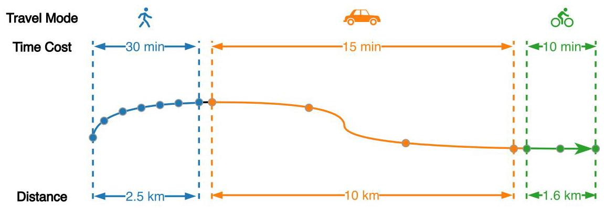
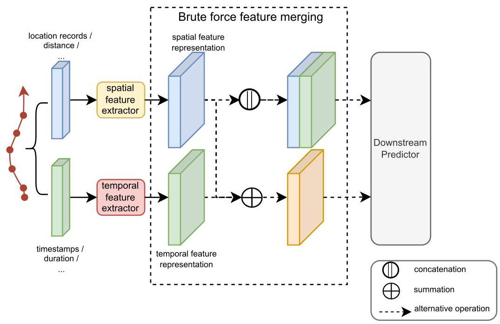
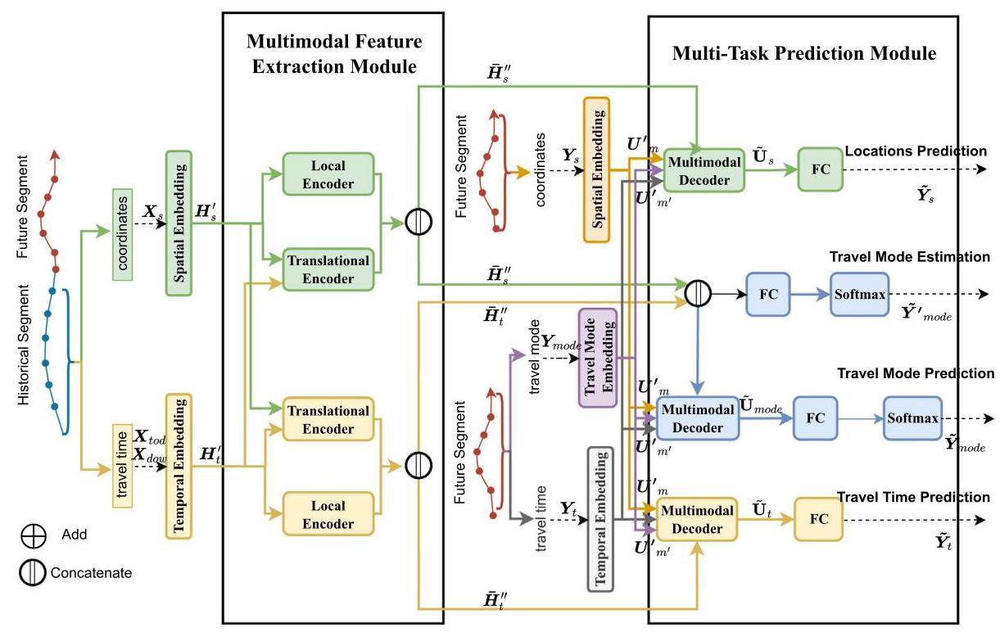
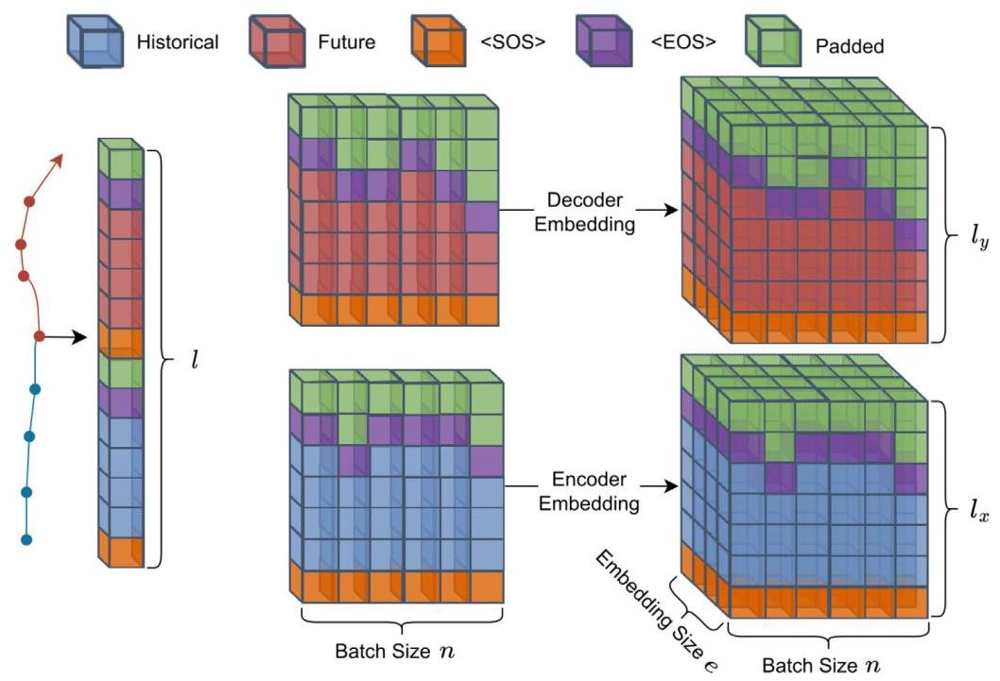
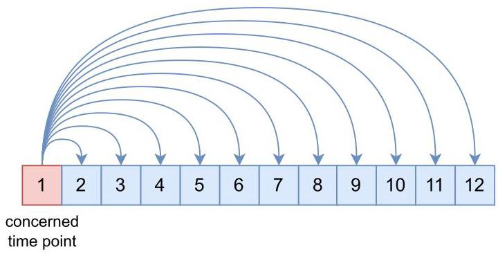
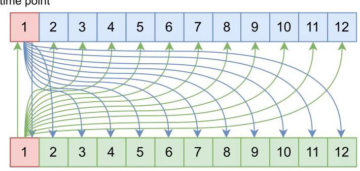
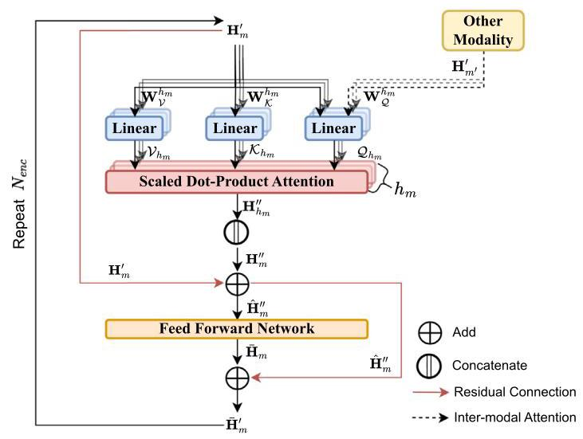
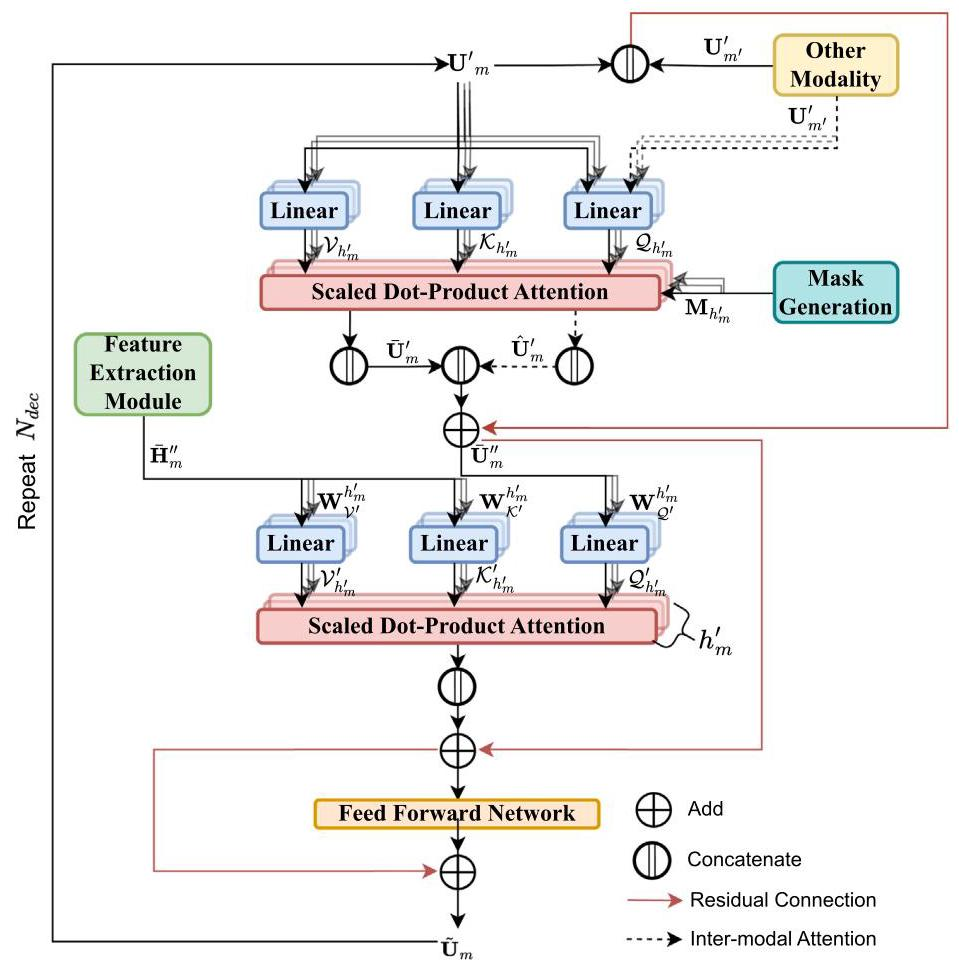
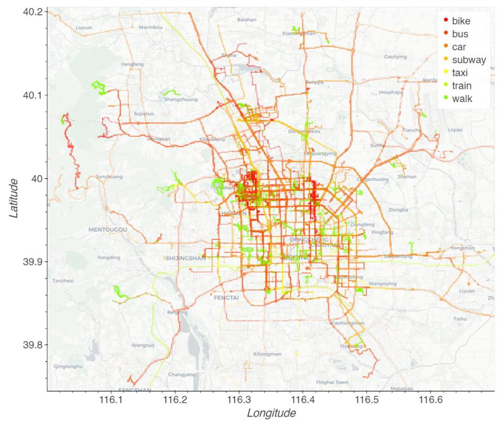
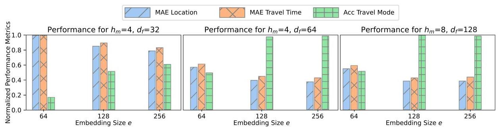

# A deep multimodal network for multi-task trajectory prediction

Da Lei ${}^{a}$ , Min Xu ${}^{b, * }$ , Shuaian Wang ${}^{a}$

${}^{a}$ Department of Logistics and Maritime Studies, Faculty of Business, The Hong Kong Polytechnic University, Hung Hom, Hong Kong

${}^{b}$ Department of Industrial and Systems Engineering, The Hong Kong Polytechnic University, Hung Hom, Hong Kong

## ARTICLE INFO

Keywords:

Individual trajectory

Multi-task prediction

Travel mode estimation

Manifold feature fusion

Inter-modal attention

## A B S T R A C T

Addressing the complexity of multi-task trajectory prediction, this study introduces a novel Deep Multimodal Network (DMN), which integrates a shared feature extractor and a multi-task prediction module with translational encoders to capture both intra-modal and inter-modal dependencies. Unlike traditional models that focus on single-task forecasting, our DMN efficiently and simultaneously predicts multiple trajectory outputs-locations, travel times, and transportation modes. Compared to baseline models including LSTM and Seq2Seq using a real-world dataset, the DMN demonstrates superior performance, reducing the location prediction error by ${67}\%$ and the travel time error by ${69}\%$ , while achieving an accuracy of 91. 44% in travel mode prediction. Statistical tests confirm the significance of these enhancements. Ablation studies further validate the critical role of modeling complex dependencies, highlighting the potential of DMN to advance intelligent and sustainable transportation systems.

## 1. Introduction

In recent years, the proliferation of smart location-tracking devices has generated massive datasets mapping the mobility patterns of individuals. These mobility trajectory datasets provide valuable insights for researchers seeking to understand the individual and collective navigation behaviors of city residents as they travel through urban road networks [1]. In computer science, artificial intelligence (AI) refers to systems capable of performing tasks that typically require human cognition [2]. AI tools, especially deep learning techniques, have demonstrated proficiency in processing and deriving insights from large volumes of data. They can identify underlying patterns to make informed predictions $\left\lbrack  {3,4}\right\rbrack$ . Deep learning offers significant potential to improve urban transportation systems and planning through its ability to handle complex data. By analyzing the mobility trajectory datasets, deep learning could help transportation agencies better understand and predict human movement patterns. This could significantly improve traffic congestion mitigation and enable more personalized transportation services [5-7]. Previous academic efforts in trajectory prediction typically focused on isolated single-task forecasting, targeting future locations, travel times, or travel modes [8,9]. Besides spatio-temporal information, trajectory data often contain crucial details like travel mode and activity, frequently overlooked in earlier trajectory prediction studies. In practice, transportation agencies need to predict multimodal travel information to guide individuals, formulate traffic controls, and allocate resources. This cannot be achieved by a single-task trajectory prediction. Although there has been some research on multi-task trajectory prediction in recent years, it is often limited to the joint inference of location and time [10,11].

As mentioned above, there are multiple types of information in trajectory data. Each type of information in a trajectory, referred to as modality, can form a time series, possessing dependencies between its respective time points. For example, predictive models can infer future locations based on past locations. In addition to the dependency on the same modality of a trajectory, there are strong interdependencies between different modalities in a trajectory. Fig. 1 provides a representative example of such interdependencies between the multimodal information of the trajectory data. The trajectory shown in Fig. 1 comprises three trips, each adopting a different travel mode. Assuming that this trajectory was sampled at regular intervals ( 5 min in this case), it is clear that the travel mode, distance (spatial feature), and time cost (temporal feature) carry not only the dependencies within themselves but also manifest evident interdependencies among them. For example, time and space are interdependent because, generally speaking, the longer the travel time in a single trip, the longer the travel distance. This interdependency can be utilized to infer future locations and travel times. Similarly, if an individual chooses a fast travel mode like a car, he/she can cover a greater distance in less time compared to walking or biking. These interdependencies among different modalities can be used to improve the accuracy of multi-task trajectory prediction.

Although previous research has recognized the importance of interdependencies between multimodal information in trajectory data, they often resorted to brute-force methods when handling different types of information [10-12]. Fig. 2 presents the general model framework of these studies. Initially, time series of different modalities in a trajectory are extracted. The high-dimensional feature representations corresponding to each modality are then learned using the corresponding feature extraction modules. Subsequently, these feature representations are merged using brute-force methods, such as concatenation or summation, and these merged feature representations are input to downstream predictors to accomplish the final prediction task. However, this approach can only implicitly learn the interdependencies between different types of information, limiting the model's expressive power in representing the interdependencies, since the downstream predictors are essentially learning the dependencies within the merged feature representation.

---

* Corresponding author.

E-mail address: min.m.xu@polyu.edu.hk (M. Xu).

---

Fig. 1. A trajectory comprising three trips with different travel modes.

Fig. 2. An illustration of the general model framework in existing trajectory prediction research.

In this paper, we introduce a novel framework called the Deep Multimodal Network (DMN), a modification of the Transformer model [13]. The DMN is designed to learn both dependency and interdependency for multi-task trajectory prediction, which includes spatiotemporal prediction and travel mode prediction. The DMN framework incorporates two distinct modules: a feature extraction module and a multi-task prediction module. Contrary to classical Transformer-based models that compute solely intra-modal attention, the proposed DMN model incorporates local and translational encoders in the feature extraction module, while developing multimodal decoders in the prediction module to calculate both intra-modal and inter-modal attentions, which could help us capture both dependency and interdependency in the data. The fusion of multimodal attention in DMN is inspired by the burgeoning field of multimodal deep learning [14]. The DMN model is trained and evaluated using an open source dataset, and its performance is compared with that of popular baseline models. We also conduct an ablation analysis to explore the contribution of translational encoders to improving prediction accuracy. Furthermore, we assess the computational efficiency of the DMN in performing multitask trajectory prediction, compared to modeling each prediction task independently.

We summarize the motivations, innovations, contributions, and remainder of the study in the following:

1. Motivations: Existing approaches to trajectory prediction often use single-task models, overlooking complex interrelations across trajectory data modalities such as location, travel time, and travel mode. This motivates us to develop a comprehensive framework that can jointly model and predict diverse modalities of trajectory data.

2. Innovations: Our key innovation is a novel Deep Multimodal Network (DMN) integrating multimodal data processing and multi-task learning within a modified Transformer architecture. In contrast to conventional isolated trajectory prediction, our DMN leverages translational encoders and multimodal decoders to capture both intra-modal and inter-modal dependencies, allowing us to predict various trajectory data modalities.

3. Contributions: Our contributions are twofold - First, we propose a new DMN framework leveraging intra-modal and inter-modal attention to boost multi-task trajectory prediction accuracy. Second, unlike existing approaches needing separate models per task, our unified DMN integrates location, time, and mode prediction to reduce computational costs and exploit inter-task synergies.

4. Organization: The remainder of this paper is organized as follows. Section 2 provides a summary of previous studies that are relevant to the research topic at hand. In Section 4, we introduce the DMN framework, which combines an upstream feature extraction process with a downstream multi-task prediction module. Moving on to Section 5, we present the results of a comprehensive set of experiments that were conducted to assess the performance of the model in predicting locations, travel times, and travel modes simultaneously. Finally, Section 6 concludes with a summary of the main findings and offers suggestions for future research directions.

## 2. Literature review

In this section, we systematically review the literature on travel prediction, categorizing the studies into two main types: single-task travel prediction and multi-task travel prediction.

### 2.1. Single-task travel prediction

Recent years have seen substantial advancements in the field of single-task travel prediction, driven by the increased availability of data and the evolution of advanced models. Researchers have explored various techniques, each with its strengths and limitations. For example, [15] presented an innovative hybrid method for predicting the next locations using hidden Markov models. [16] proposed a dynamic Bayesian network that leveraged data from individuals with similar mobility patterns to improve the accuracy to predict future location of individuals. [17] proposed a trajectory-based approach for travel-time prediction using Gaussian process regression, which allowed probabilistic prediction of travel time along an unknown path. [18] proposed a context-aware tensor decomposition approach to estimate the travel time of any path in real time in a city using sparse trajectories. [19] conducted a study using traditional machine learning methods, such as multinomial logistic regression, to predict the travel mode of individuals in Luxembourg.

Deep learning models, such as Convolutional Neural Networks (CNNs) and LSTM networks, have emerged as popular choices due to their ability to capture complex spatial-temporal relationships within data. For example, [20] proposed a CNN-LSTM model for vehicle trajectory prediction, achieving high precision in both space and time. Similarly, [21] developed a hybrid CNN-LSTM model for aircraft 4D trajectory prediction, demonstrating the effectiveness of such architectures in capturing the intricacies of movement. Other approaches, such as the Target-Driven Trajectory Prediction (TNT) model by [22], focus on predicting future modes within a moderate time horizon by leveraging target states. [23] developed a novel Trajectory-as-a-Sequence framework based on a Bi-LSTM network for the identification of travel modes.

An additional category of singular-task travel prediction/estimation involves the reconstruction of trajectories. For example, [24] employed a density-weighted ant colony algorithm to reconstruct ship trajectories, illustrating how heuristic approaches can effectively handle complex dynamic environments. This approach was echoed by [25] who proposed an enhanced search algorithm for indoor trajectory reconstruction, with the aim of optimizing the accuracy of the path prediction and the computational efficiency. The domain of vehicle trajectory reconstruction also benefited from heuristic methods, as demonstrated by [26], who utilized heuristic search algorithms to improve vehicle reidentification and trajectory reconstruction using multiple moving cameras.

### 2.2. Multi-task travel prediction

Recent progress in mobility prediction has been greatly gained from the incorporation of diverse computational methods designed to enhance multi-task travel prediction. For example, [10] proposed a context-aware deep model called DeepJMT to jointly perform mobility prediction and time prediction, which outperformed RNN and GRU in three real-world datasets. [11] proposed a noteworthy approach using LSTM neural networks to concurrently predict the next location and travel time of urban vehicle trajectories, focusing on a comprehensive pattern embedding model that captures sequential, personal, and temporal mobility factors. [27] developed a model that leverages sparse trajectory data to predict human mobility, employing a joint prediction framework that integrates travel time as a conditional distribution feature. Further refining the prediction methodologies, [28] introduced an individual mobility prediction model using attentively marked temporal point processes, which also integrated LSTM techniques for joint prediction of location and travel time. On a different note, [29] explored a joint clustering and prediction approach specifically for bus travel times, demonstrating its efficacy in generating accurate forecasts even under highly variable travel conditions. Furthermore, the study by [30] presents a graph-contextualized multitask spatio-temporal joint prediction model, emphasizing consistent patterns in cellular trajectories to enhance prediction accuracy (see Table 1).

## 3. Problem statement

The primary objective of multi-task trajectory prediction is to use historical data to predict future trajectory information, including multiple correlated outputs such as locations, travel times, and transportation modes. Formally, given a historical trajectory segment denoted as ${\mathbf{x}}_{m}$ , where $m$ represents different modalities (spatial, temporal, and mode), the goal is to predict the future segment ${\mathbf{y}}_{m}$ for each modality. The challenge lies in effectively capturing and leveraging the interdependencies among these modalities to enhance prediction accuracy.

Let ${\mathbf{x}}_{m} \in  {\mathbb{R}}^{l \times  {d}_{m}}$ represent the input features of modality $m$ on a historical trajectory segment of length $l$ , where ${d}_{m}$ is the dimension of features specific to modality $m$ . The task is to predict the future trajectory segment ${\mathbf{y}}_{m} \in  {\mathbb{R}}^{{l}^{\prime } \times  {d}_{m}}$ , where ${l}^{\prime }$ is the length of the prediction horizon. The prediction function can be represented as:

$$
{\mathbf{y}}_{m} = {f}_{m}\left( {{\mathbf{x}}_{s},{\mathbf{x}}_{t},{\mathbf{x}}_{\text{mode }};\Theta }\right) , \tag{1}
$$

where ${f}_{m}\left( \cdot \right)$ is the prediction function for modality $m$ , parameterized by $\Theta$ , and takes as input the historical segments of all modalities. The prediction function of each modality is interrelated, reflecting the underlying dependencies across modalities that the DMN model aims to capture.

The multimodal information in a trajectory can be represented as sequences with varying types and dimensions, comprising both continuous and discrete elements, such as 2D sequences of latitude and longitude coordinates ${\mathbf{z}}_{s} \in  {\mathbb{R}}^{l \times  2}$ ,1D continuous sequences of time of day ${\mathbf{z}}_{\text{tod }} \in  {\mathbb{R}}^{l \times  1}$ ,1D discrete sequences of day of week ${\mathbf{z}}_{\text{dow }} \in  {\mathbb{R}}^{l \times  1}$ , and 1D sequences of travel mode choice ${\mathbf{z}}_{\text{mode }} \in  {\mathbb{R}}^{l \times  1}$ . An information sequence ${\mathbf{z}}_{m}, m \in  \{ s,$ tod, dow, mode $\}$ can be divided into historical segments ${\mathbf{x}}_{m}$ and future segments ${\mathbf{y}}_{m}$ , with <SOS> and <EOS> tokens added to denote the start and end of a trip. To ensure equal sequence lengths within a batch for consistent model training, padding is applied, and a masking mechanism excludes padded elements from error backpropagation. The input sequences for modality $m$ in a batch are denoted as ${\mathbf{X}}_{m} \in  {\mathbb{R}}^{n \times  {l}_{x} \times  {d}_{m}}$ , where $n$ is the batch size and ${d}_{m}$ is the dimension of the modality. For instance, input sequences of coordinates in a batch are expressed as ${\mathbf{X}}_{s} \in  {\mathbb{R}}^{n \times  {l}_{x} \times  2}$ . Travel mode choices are not used as input for feature extraction but are utilized for assessing model performance in travel mode estimation for historical trajectories.

Table 1

Summary of travel prediction studies.

<table><tr><td>Author(s)</td><td>Method</td><td>Targets</td><td>Highlights</td></tr><tr><td>Mathew et al. [15]</td><td>Hybrid HMM</td><td>Locations</td><td>Improved accuracy</td></tr><tr><td>Alhasoun et al. [16]</td><td>DBN</td><td>Locations</td><td>Mobility pattern data</td></tr><tr><td>Idé and Kato [17]</td><td>GPR</td><td>Travel time</td><td>Probabilistic paths</td></tr><tr><td>Wang et al. [18]</td><td>CA tensor decomp</td><td>Travel time</td><td>Sparse env effectiveness</td></tr><tr><td>Omrani [19]</td><td>MNL regression</td><td>Travel mode</td><td>Traditional ML use</td></tr><tr><td>Xie et al. [20]</td><td>CNN-LSTM</td><td>Locations</td><td>High precision</td></tr><tr><td>Ma and Tian [21]</td><td>Hybrid CNN-LSTM</td><td>Locations</td><td>Complex movement capture</td></tr><tr><td>Zhao et al. [22]</td><td>TNT</td><td>Travel modes</td><td>Moderate time focus</td></tr><tr><td>Zeng et al. [23]</td><td>Bi-LSTM</td><td>Travel modes</td><td>Novel sequence model</td></tr><tr><td>Zhang et al. [24]</td><td>DW ant colony</td><td>Locations</td><td>Dynamic env effectiveness</td></tr><tr><td>Li et al. [25]</td><td>Enhanced search</td><td>Locations</td><td>Optimized path efficiency</td></tr><tr><td>Arman and Tampère [26]</td><td>Heuristic search</td><td>Locations</td><td>Improved reconstruction</td></tr><tr><td>Chen et al. [10]</td><td>DeepJMT</td><td>Travel time & Locations</td><td>Outperformed RNN/GRU</td></tr><tr><td>Sun and Kim [11]</td><td>LSTM</td><td>Travel time & Locations</td><td>Comprehensive model</td></tr><tr><td>Wang et al. [27]</td><td>Sparse data model</td><td>Travel time & Locations</td><td>Integrated prediction</td></tr><tr><td>Wu et al. [28]</td><td>AMTPP</td><td>Travel time & Locations</td><td>Joint LSTM prediction</td></tr><tr><td>Shaji et al. [29]</td><td>Clustering</td><td>Travel time & Locations</td><td>Accurate under variability</td></tr><tr><td>Sang et al. [30]</td><td>GC multitask model</td><td>Travel time & Locations</td><td>Enhanced accuracy</td></tr></table>

Table 2

List of Abbreviations.

<table><tr><td>Abbreviation</td><td>Description</td></tr><tr><td>DMN</td><td>Deep Multimodal Network</td></tr><tr><td>MAE</td><td>Mean Absolute Error</td></tr><tr><td>Acc</td><td>Accuracy</td></tr><tr><td>LSTM</td><td>Long Short-Term Memory</td></tr><tr><td>GRU</td><td>Gated Recurrent Unit</td></tr><tr><td>RNN</td><td>Recurrent Neural Network</td></tr><tr><td>GPS</td><td>Global Positioning System</td></tr><tr><td>FC</td><td>Fully Connected Network</td></tr><tr><td>Conv1d</td><td>1-Dimensional Convolution</td></tr></table>

## 4. Deep multimodal network

In this section, we begin by presenting the preliminaries to introduce how the various modalities of a trajectory required by the model are organized and represented. Subsequently, we provide an overview of the overall framework of the proposed DMN model. Following this, in the following subsections, we provide technical details of different modules in the DMN model.

### 4.1. Overall framework

The proposed DMN model is primarily composed of two modules: a feature extraction module and a prediction module. Before these two modules can be implemented, it is essential to learn high-dimensional feature representations. These representations, denoted as ${\mathbf{H}}_{m}^{\prime }$ where $m \in  \{ s, t\}$ , are derived from multimodal raw data by applying various embedding layers. The learned representations serve as input for local and translational encoders in the feature extraction module to obtain the extracted features of different modalities for the historical segment, denoted as ${\overline{\mathbf{H}}}_{m}^{\prime \prime }, m \in  \{ s, t\}$ . In line with the architectural convention of the Transformer model, the multimodal decoder in the prediction module operates as a holistic component and is not partitioned into "local decoder" and "translational decoder". Each multimodal decoder linked to a specific modality receives two kinds of inputs related to the two attention computations: the first type is the embedded features ${\mathbf{U}}_{m}^{\prime }$ and ${\mathbf{U}}_{{m}^{\prime }}^{\prime }, m,{m}^{\prime } \in  \{ s, t,$ mode $\}$ and $m \neq  {m}^{\prime }$ , derived from the future segment through an embedding layer, which are used to compute the intra-modal attention of a certain modality and its inter-modal attention with other modalities; the second type is ${\overline{\mathbf{H}}}_{m}^{\prime \prime }, m \in  \{ s, t\}$ , obtained from the extraction module, which is used to calculate the dependency between the historical segment and the future segment of the same modality (see Tables 2 and 3).

The final prediction layers, implemented as a Fully Connected Network (FC) or Softmax, take the output of the multimodal decoders ${\widetilde{\mathbf{U}}}_{m}, m \in  \{ s, t,$ mode $\}$ as input, ultimately yielding prediction results for future segments of different modalities. The estimation results for the travel mode of the historical segment are directly obtained by using the concatenation of ${\bar{\mathbf{H}}}_{s}^{\prime \prime }$ and ${\overline{\mathbf{H}}}_{t}^{\prime \prime }$ as input for the prediction layers. It should be noted that during the model training phase, the future segments of different modalities, ${\mathbf{Y}}_{m}$ , serve as the true values of the training dataset for the embedding layer in the prediction module. However, during the model evaluation phase, ${\mathbf{Y}}_{m}$ is initialized with the <SOS> token, and the trained model begins with this token to autoregressively generate the complete prediction target ${\widetilde{\mathbf{Y}}}_{m}$ . It can be seen from Fig. 3 that the feature extraction module accepts historical segments of spatiotemporal modality as input, but does not consider travel mode information from these historical segments.

Table 3

Variables used in the study.

<table><tr><td>Variable</td><td>Description</td></tr><tr><td>${\mathbf{z}}_{s}$</td><td>Spatial coordinates in the trajectory (latitude, longitude)</td></tr><tr><td>${\mathbf{z}}_{\text{tod }}$</td><td>Time of day sequence in the trajectory</td></tr><tr><td>${\mathbf{z}}_{\text{dow }}$</td><td>Day of week sequence in the trajectory</td></tr><tr><td>${\mathbf{z}}_{\text{mode }}$</td><td>Travel mode sequence in the trajectory</td></tr><tr><td>${\mathbf{X}}_{m}$</td><td>Input sequences for modality $m$</td></tr><tr><td>${\mathbf{Y}}_{m}$</td><td>Future segment sequences for modality $m$</td></tr><tr><td>${\mathbf{H}}_{m}$</td><td>Embedded features of sequences for modality $m$</td></tr></table>

### 4.2. Feature embedding

As stated in Section 1, the trajectory data exhibit significant interdependencies between the characteristics of the spatial, temporal, and travel modes. To capture these interdependencies, it is first essential to address the heterogeneity arising from multimodal data before performing the feature extraction and prediction modules, to enable the numerical integration of various input types. For example, discrete inputs representing the day of the week for trips, denoted by ${\mathbf{X}}_{\text{dow }}$ , must be converted into continuous values to allow numerical computation. Inputs with distinct feature dimensions, such as spatial features ${\mathbf{X}}_{s} \in$ ${\mathbb{R}}^{n \times  {l}_{x} \times  2}$ and temporal features ${\mathbf{X}}_{\text{tod }} \in  {\mathbb{R}}^{n \times  {l}_{x} \times  1}$ , also need to be projected into a common feature space with embedding dimension $e$ , e.g., ${\mathbb{R}}^{n \times  {l}_{x} \times  e}$ . Therefore, the multimodal feature extraction module initially employs two separate embedding layers to transform model input ${\mathbf{X}}_{m}, m \in$ $\{ s,{tod},{dow}\}$ . Fig. 4 illustrates the feature representation for trajectory data.

In particular, the DMN uses a lookup table as the embedding layer for discrete inputs to map discrete elements, which are usually represented by integers, to continuous vectors of fixed embedding size $e$ . The lookup table can be represented as a weight matrix $\mathbf{E} \in  {\mathbb{R}}^{v \times  e}$ , where $v$ denotes the number of categories. For example, the value of $v$ in the embedding layer for ${\mathbf{X}}_{\text{dow }}$ should be seven. Given $\mathbf{E}$ , the mapping function in an embedding layer for discrete variables ${\mathbf{X}}_{m} \in  {\mathbb{R}}^{n \times  {l}_{x}}$ can be formulated as follows:

$$
{\mathbf{H}}_{m}^{i, j} = \mathbf{E}\left( {X}_{m}^{i, j}\right) , \tag{2}
$$

Fig. 3. The framework of DMN.

where ${X}_{m}^{i, j}$ is the element of ${\mathbf{X}}_{m}$ at position(i, j)and also serves as the row index of $\mathbf{E}$ , and ${\mathbf{H}}_{m}^{i, j}$ is the embedded vector that replaces the scalar ${X}_{m}^{i, j}$ . Taking ${\mathbf{X}}_{\text{dow }}$ as an example, if ${X}_{m}^{i, j} = 5$ , then ${\mathbf{H}}_{m}^{i, j}$ corresponds to the fifth row of $\mathbf{E}$ . In summary, the overall mapping can be expressed as ${\mathbf{X}}_{m} \in  {\mathbb{R}}^{n \times  {l}_{x}} \mapsto  {\mathbf{H}}_{m} \in  {\mathbb{R}}^{n \times  {l}_{x} \times  e}$ . Eq. (2) can be considered a special type of linear layer, where the weight matrix $\mathbf{E}$ is a trainable parameter in the model.

In the case of continuous inputs, the DMN employs a continuous embedding layer, which is a one-dimensional convolution network (Conv1d). For the sake of brevity, we consider an example of ${\mathbf{X}}_{\text{tod }}$ with ${d}_{m} = 1$ . Given a sequence $\mathbf{x}$ in ${\mathbf{X}}_{tod}$ , the Conv1d operation can be expressed as

$$
\left( {\mathbf{x} \star  {\mathbf{f}}_{j}}\right) \left\lbrack  i\right\rbrack   = \mathbf{x}\left\lbrack  {i : i + \left| {\mathbf{f}}_{j}\right| }\right\rbrack   \cdot  {\mathbf{f}}_{j}, j \in  \{ 1,2,\ldots , e\} , \tag{3}
$$

where ${\mathbf{f}}_{j}$ represents a trainable weight vector, which acts as a filter for the convolution operator $\mathbf{x} \star  {\mathbf{f}}_{j}$ . The number of filters is set to $e$ to ensure that the shape of the embedded feature ${\mathbf{H}}_{\text{tod }}$ is ${\mathbb{R}}^{n \times  {l}_{x} \times  e}$ .

Fig. 4 presents an representation example for the embedded features ${\mathbf{H}}_{m} \in  {\mathbb{R}}^{n \times  {l}_{x} \times  e}$ of any modality $m \in  \{ s,{tod},{dow}\}$ . Before performing further feature transformations on these embedded features, we first merge the two temporal embedded features ${\mathbf{H}}_{\text{dow }}$ and ${\mathbf{H}}_{\text{tod }}$ to decrease overall model complexity, as follows:

$$
{\mathbf{H}}_{t} = {\mathbf{H}}_{\text{dow }} + {\mathbf{H}}_{\text{tod }}, \tag{4}
$$

where ${\mathbf{H}}_{t} \in  {\mathbb{R}}^{n \times  {l}_{x} \times  e}$ is the resulted temporal embedded feature.

Next, we augment the remaining two modality features ${\mathbf{H}}_{m} \in$ ${\mathbb{R}}^{n \times  {l}_{x} \times  e}, m \in  \{ s, t\}$ with positional encoding using

$$
{\mathbf{H}}_{m}^{\prime } = {\mathbf{H}}_{m} + {\mathbf{H}}_{p}, \tag{5}
$$

where the positional encoding ${\mathbf{H}}_{p} \in  {\mathbb{R}}^{n \times  {l}_{x} \times  e}$ is calculated by implementing discrete embedding, as defined in Eq. (2), based on a position matrix $\mathbf{P} \in  {\mathbb{R}}^{n \times  {l}_{x}}$ . To be specific, we obtain ${\mathbf{H}}_{p}^{i, j} = \mathbf{E}\left( {P}^{i, j}\right)$ , where $\mathbf{P}$ is obtained by broadcasting the position sequence $\mathbf{p} = \left\lbrack  {1,2,\ldots ,{l}_{x} - 1,{l}_{x}}\right\rbrack$ . Incorporating positional encoding is crucial to ensure that the DMN model can effectively capture the sequential information in the input sequences, as the sequences themselves lack inherent knowledge of element order.

The manifold feature fusion in our DMN model draws inspiration from the theory of manifold learning, which suggests that high-dimensional data is often located on a lower-dimensional manifold within the higher-dimensional space. Using this concept, our model aims to uncover the intrinsic geometric structure of the trajectory data that capture the essential patterns of mobility. Specifically, the manifold feature fusion is implemented through embedding layers that project the high-dimensional spatial and temporal data into a unified lower-dimensional space. This process not only reduces the dimensionality but also aligns the different modalities into a coherent representation that facilitates the learning of complex dependencies.

Mathematically, the embedding function for a modality $m$ can be represented as:

$$
{\mathbf{H}}_{m} = \phi \left( {{\mathbf{X}}_{m};{\Theta }_{m}}\right) , \tag{6}
$$

where ${\mathbf{X}}_{m}$ are the input data for modality $m,\phi$ denotes the embedding function parameterized by ${\Theta }_{m}$ , and ${\mathbf{H}}_{m}$ is the embedded feature space where manifold learning principles are applied. This embedded space is designed to ensure that similar data points in the original space remain close in the embedded space, thus preserving the intrinsic local topology of each modality and also enabling us to learn the interdependencies between modalities in the following inter-modal attention computation.

### 4.3. Multimodal feature extraction module

In this subsection, we introduce local and translational encoders, which are the main components of the multimodal feature extraction module. Traditional Transformer-based models typically only employ a local encoder to learn intra-modal attention of a single modality and extract dependencies between values at different time points within the sequence of the modality concerned, as illustrated in Fig. 5. Our approach diverges from this norm by introducing translational encoders into the DMN model. The combination of local and translational encoders allows the simultaneous computation of intra-modal and inter-modal attention in Fig. 6, capturing not only dependencies within the same modality but also interdependencies across different modalities.

Fig. 4. An illustration of feature representation for trajectory data.

Fig. 5. Intra-modal attention.

time point

Fig. 6. Inter-modal attention.

Both local and translational encoders encompass two primary steps: initially, the calculation of attention, followed by further learning of feature representation via a feed-forward network. Concretely, we first divide the embedded feature matrix into multiple heads in both types of encoder to enhance the model's ability to focus on different aspects of the input sequence simultaneously and yield a more fine-grained and diverse feature representation. Specifically, we divide the embedded matrix ${\mathbf{H}}_{m}^{\prime } \in  {\mathbb{R}}^{n \times  {l}_{x} \times  e}$ along its last dimension into ${h}_{m}$ sub-matrices ${\mathbf{H}}_{{h}_{m}}^{\prime } \in  {\mathbb{R}}^{n \times  {l}_{x} \times  {d}_{h}}$ , i.e., ${\mathbf{H}}_{m}^{\prime } = \left\langle  {{\mathbf{H}}_{1}^{\prime },{\mathbf{H}}_{2}^{\prime },\ldots ,{\mathbf{H}}_{{h}_{m} - 1}^{\prime },{\mathbf{H}}_{{h}_{m}}^{\prime }}\right\rangle   \in  {\mathbb{R}}^{n \times  {l}_{x} \times  e}$ . Here, ${h}_{m}$ denotes the number of heads, ${d}_{h}$ is the head dimension and ${d}_{h} =$ $\frac{e}{{h}_{m}}$ , and the notation $\langle  \cdot  \rangle$ represents the concatenation operation. It is necessary to ensure that the embedding size $e$ is divisible by ${h}_{m}$ to enable executable multi-head segmentation. For each submatrix ${\mathbf{H}}_{{h}_{m}}^{\prime }$ , which corresponds to a specific one-head attention, we learn three latent matrices using three independent linear layers: the query matrix ${\mathcal{Q}}_{{h}_{m}} \in  {\mathbb{R}}^{n \times  {l}_{x} \times  {d}_{h}}$ , the key matrix ${\mathcal{K}}_{{h}_{m}} \in  {\mathbb{R}}^{n \times  {l}_{x} \times  {d}_{h}}$ , and the value matrix ${\mathcal{V}}_{{h}_{m}} \in  {\mathbb{R}}^{n \times  {l}_{x} \times  {d}_{h}}$ , as follows:

$$
{\mathcal{Q}}_{{h}_{m}} = \left\{  \begin{array}{ll} {\mathbf{H}}_{{h}_{m}}^{\prime }{\mathbf{W}}_{\mathcal{Q}}^{{h}_{m}}, & \text{ if local encoder } \\  {\mathbf{H}}_{{h}_{{m}^{\prime }}}^{\prime }{\mathbf{W}}_{\mathcal{Q}}^{{h}_{m}}, & \text{ if translational encoder,}m \neq  {m}^{\prime }, \end{array}\right.  \tag{7}
$$

$$
{\mathcal{K}}_{{h}_{m}} = {\mathbf{H}}_{{h}_{m}}^{\prime }{\mathbf{W}}_{\mathcal{K}}^{{h}_{m}}, \tag{8}
$$

$$
{\mathcal{V}}_{{h}_{m}} = {\mathbf{H}}_{{h}_{m}}^{\prime }{\mathbf{W}}_{\mathcal{V}}^{{h}_{m}}, \tag{9}
$$

where ${\mathbf{W}}_{\mathcal{Q}}^{{h}_{m}} \in  {\mathbb{R}}^{{d}_{h} \times  {d}_{h}},{\mathbf{W}}_{\mathcal{K}}^{{h}_{m}} \in  {\mathbb{R}}^{{d}_{h} \times  {d}_{h}}$ , and ${\mathbf{W}}_{\mathcal{V}}^{{h}_{m}} \in  {\mathbb{R}}^{{d}_{h} \times  {d}_{h}}$ are the learnable weight matrices for ${\mathcal{Q}}_{{h}_{m}},{\mathcal{K}}_{{h}_{m}}$ , and ${\mathcal{V}}_{{h}_{m}}$ , respectively. Eq. (7) highlights the difference between local and translational encoders. In the local encoder, all one-head embedded features ${\mathbf{H}}_{{h}_{m}}^{\prime }$ are derived from the same modality $m$ . In the translational encoder, however, the one-head feature matrix ${\mathbf{H}}_{{h}_{m}}^{\prime }$ used to compute ${\mathcal{K}}_{{h}_{m}}$ and ${\mathcal{V}}_{{h}_{m}}$ is sourced from the concerned modality $m$ , whereas the one-head feature matrix ${\mathbf{H}}_{{h}_{m}}^{\prime }$ for calculating ${\mathcal{Q}}_{{h}_{m}}$ is obtained from a different modality ${m}^{\prime }$ .

Next, we compute the attention coefficient matrix ${\mathcal{A}}_{{h}_{m}} \in  {\mathbb{R}}^{{l}_{x} \times  {l}_{x}}$ using

$$
{\mathcal{A}}_{{h}_{m}} = \operatorname{softmax}\left( \frac{{\mathcal{Q}}_{{h}_{m}}{\mathcal{K}}_{{h}_{m}}^{\top }}{\sqrt{{d}_{h}}}\right) , \tag{10}
$$

where the dot product ${\mathcal{Q}}_{{h}_{m}}{\mathcal{K}}_{{h}_{m}}^{\top }$ measures the cosine similarity between different elements in the same sequence. To normalize the similarity scores, we apply the softmax function. We also scale the dot product by a factor of $\frac{1}{\sqrt{{d}_{h}}}$ to avoid gradient vanishing or exploding. Finally, we obtain the updated one-head feature representation ${\mathbf{H}}_{{h}_{m}}^{\prime \prime } \in  {\mathbb{R}}^{n \times  {l}_{x} \times  {d}_{h}}$ by multiplying ${\mathcal{A}}_{{h}_{m}}$ and ${\mathcal{V}}_{{h}_{m}}$ , as follows:

$$
{\mathbf{H}}_{{h}_{m}}^{\prime \prime } = {\mathcal{A}}_{{h}_{m}}{\mathcal{V}}_{{h}_{m}}. \tag{11}
$$

Fig. 7. The flowchart of the local and translational encoders.

The concatenated output of ${\mathbf{H}}_{{h}_{m}}^{\prime \prime }$ across various heads yields ${\mathbf{H}}_{m}^{\prime \prime } \in$ ${\mathbb{R}}^{n \times  {l}_{x} \times  e}$ , represented as ${\mathbf{H}}_{m}^{\prime \prime } = \left\langle  {{\mathbf{H}}_{1}^{\prime \prime },{\mathbf{H}}_{2}^{\prime \prime },\ldots ,{\mathbf{H}}_{{h}_{m} - 1}^{\prime \prime },{\mathbf{H}}_{{h}_{m}}^{\prime \prime }}\right\rangle$ . The final steps of the encoder involve incorporating a two-layer feed forward network, which applies two linear transformations and one non-linear activation on ${\mathbf{H}}_{m}^{\prime \prime }$ , for unveiling more intricate relationships within the sequential data represented as follows:

$$
{\overline{\mathbf{H}}}_{m} = \operatorname{ReLu}\left( {{\widehat{\mathbf{H}}}_{m}^{\prime \prime }{\mathbf{W}}_{f}^{1}}\right) {\mathbf{W}}_{f}^{2}, \tag{12}
$$

where ${\widehat{\mathbf{H}}}_{m}^{\prime \prime } = {\mathbf{H}}_{m}^{\prime \prime } + {\mathbf{H}}_{m}^{\prime }$ refers to the residual connection for improving model training stability. Here, ${\mathbf{W}}_{f}^{1} \in  {\mathbb{R}}^{e \times  {d}_{f}}$ and ${\mathbf{W}}_{f}^{2} \in  {\mathbb{R}}^{{d}_{f} \times  e}$ are weight matrices for the two linear layers of the feed forward network. The result of one encoder iteration is ${\overline{\mathbf{H}}}_{m}^{\prime } \in  {\mathbb{R}}^{n \times  {l}_{x} \times  e}$ , which is obtained by adding the output of the feed forward network ${\overline{\mathbf{H}}}_{m}$ to ${\widehat{\mathbf{H}}}_{m}^{\prime \prime }$ , via another residual connection, i.e., ${\overline{\mathbf{H}}}_{m}^{\prime } = {\overline{\mathbf{H}}}_{m} + {\widehat{\mathbf{H}}}_{m}^{\prime \prime }$ . Fig. 7 shows the flowchart of the local and translational encoders. We can see from Fig. 7 that a stacked encoder can be achieved by using the output of the current iteration of the encoder ${\overline{\mathbf{H}}}_{m}^{\prime }$ as the input for the next iteration. Increasing the number of iterations ${N}_{\text{enc }}$ can potentially enhance the model’s expressive power and improve prediction performance. However, this may also lead to higher model complexity and increased computational resource consumption.

To avoid confusion, we denote the output of the local encoder as ${\overline{\mathbf{H}}}_{m \sim  m}^{\prime }$ , and the output of the translational encoder as ${\overline{\mathbf{H}}}_{{m}^{\prime } \sim  m}^{\prime }$ . To obtain the final output of the multimodal feature extraction module, we concatenate all latent features obtained from both local and translational encoders as follows:

$$
{\overline{\mathbf{H}}}_{m}^{\prime \prime } = \left\langle  {{\overline{\mathbf{H}}}_{m \sim  m}^{\prime },{\overline{\mathbf{H}}}_{{m}^{\prime } \sim  m}^{\prime }}\right\rangle  , m,{m}^{\prime } \in  \{ s, t\} , m \neq  {m}^{\prime }\text{.} \tag{13}
$$

For example, when the modality concerned is $m = s$ , the final output of the feature extraction module for the spatial modality can be expressed as ${\bar{\mathbf{H}}}_{s}^{\prime \prime } = \left\langle  {{\bar{\mathbf{H}}}_{s \sim  s}^{\prime },{\bar{\mathbf{H}}}_{t \sim  s}^{\prime }}\right\rangle   \in  {\mathbb{R}}^{n \times  {l}_{x} \times  {2e}}$ .

As mentioned above, the inter-modal attention mechanism in our DMN model is adapted from the attention mechanisms commonly used in natural language processing. Originally developed to strengthen the model's emphasis on key elements in input sequences from diverse modalities, like text and audio, inter-modal attention mechanisms are highly skilled at modeling connections that may not be consecutive across different modalities. In the context of trajectory data, inter-modal attention allows the model to dynamically focus on specific aspects of one modality (e.g., spatial information) based on the state of another modality (e.g., temporal information). The attention function can be simplified for better understanding as follows:

$$
\operatorname{Attention}\left( {{\mathbf{Q}}_{{m}^{\prime }},{\mathbf{K}}_{m},{\mathbf{V}}_{m}}\right)  = \operatorname{softmax}\left( \frac{{\mathbf{Q}}_{{m}^{\prime }}{\mathbf{K}}_{m}^{T}}{\sqrt{{d}_{k}}}\right) {\mathbf{V}}_{\mathbf{m}}, \tag{14}
$$

where ${\mathbf{Q}}_{{m}^{\prime }},{\mathbf{K}}_{m}$ , and ${\mathbf{V}}_{m}$ represent the query, key, and value matrices derived from the features of different data modalities, i.e., $m \neq  {m}^{\prime }$ , and ${d}_{k}$ , and ${d}_{k}$ is the dimensionality of the key vectors. This formulation allows the model to weigh the importance of different features across modalities, facilitating a deeper exploration of the interdependencies between modalities that govern the dynamics of urban mobility.

### 4.4. Multi-task prediction module

The multi-task prediction module is comprised of multimodal decoders and varying prediction layers. Each multimodal decoder for a specific modality $m$ consists primarily of two layers of attention computation. The upper attention layer takes the embedded features of future segments for modality $m$ and those of future segments for other modalities ${m}^{\prime }$ as input, thereby calculating the inter-modal attention to quantify the interdependencies between future segments of different modalities. The lower attention layer, based on the output of the upper attention layer and the output from the feature extraction module, computes the intra-modal attention to quantify the dependency between historical and future segments of the same modality. The prediction layers, mainly based on FC networks, take the output of the multimodal decoders as input and generate the final model results.

We can see from Figs. 7 and 8 that many of the calculations and matrix operations performed by the decoders in the prediction module and the encoders in the feature extraction module are identical. To avoid redundancy, we will only introduce the key steps in the multimodal decoder that differ significantly from those in the encoder. To maintain conciseness, certain intermediate notations of the decoder in Fig. 8 have been omitted. Readers can refer to their counterparts on the encoder depicted in Fig. 7.

In order to ensure that the model is trained properly without "cheating" by "peeking ahead" in the target sequence, a binary mask is needed to prevent the decoder from attending to future positions in the sequence. This holds true for both intra-modal and inter-modal attention computation during model training. The calculation of masked attention for a specific head can be expressed as a formulation in which the softmax function is applied to the product of the mask matrix, query matrix, and key matrix, all scaled down by the square root of ${d}_{h}^{\prime }$ ,

$$
{\left. {\mathcal{A}}_{h}\right\}  }_{m} = \operatorname{softmax}\left( \frac{{\mathbf{M}}_{{h}_{m}^{\prime }}{\mathcal{Q}}_{{h}_{m}^{\prime }}{\mathcal{K}}_{{h}_{m}^{\prime }}^{\top }}{\sqrt{{d}_{h}^{\prime }}}\right) , \tag{15}
$$

where ${\mathbf{M}}_{{h}_{m}^{\prime }} \in  {\mathbb{R}}^{{l}_{y} \times  {l}_{y}}$ is the mask matrix with each element set to one if the column index $j$ is less than or equal to the row index $i$ , and $- \infty$ otherwise,

$$
{M}_{i, j} = \left\{  \begin{array}{ll} 1, & \text{ if }j \leq  i \\   - \infty , & \text{ otherwise } \end{array}\right.  \tag{16}
$$

In practice, a large negative value is used instead of $- \infty$ to ensure numerical stability.

The second multi-head attention layer in the decoder aims to capture long-range dependencies between historical and future features. This is achieved by computing a separate set of query, key, and value matrices, denoted by ${\mathcal{Q}}_{{h}_{m}^{\prime }}^{\prime },{\mathcal{K}}_{{h}_{m}^{\prime }}^{\prime }$ , and ${\mathcal{V}}_{{h}_{m}^{\prime }}^{\prime }$ , respectively. These matrices are obtained by using the feature representations ${\overline{\mathbf{U}}}_{m}^{\prime \prime }$ from the last attention layer in the decoder and ${\overline{\mathbf{H}}}_{m}^{\prime \prime }$ from the feature extraction module. To be more specific, we have

$$
{\mathcal{Q}}_{{h}_{m}^{\prime }}^{\prime } = {\overline{\mathbf{U}}}_{m}^{\prime \prime }{\mathbf{W}}_{\mathcal{K}}^{{h}_{m}^{\prime }}
$$

$$
{\mathcal{K}}_{{h}_{m}^{\prime }}^{\prime } = {\overline{\mathbf{H}}}_{m}^{\prime \prime }{\mathbf{W}}_{\mathcal{K}}^{{h}_{m}^{\prime }}. \tag{17}
$$

$$
{\mathcal{V}}_{{h}_{m}^{\prime }}^{\prime } = {\overline{\mathbf{H}}}_{m}^{\prime \prime }{\mathbf{W}}_{\mathcal{V}}^{{h}_{m}^{\prime }}
$$

Fig. 8. The flowchart of the decoders.

Here, ${\overline{\mathbf{U}}}_{m}^{\prime \prime }$ is the enhanced feature representation for future trajectories, which is obtained by combining intra-modal and inter-modal attentions with embedded features from the residual connection. Specifically, we have

$$
{\overline{\mathbf{U}}}_{m}^{\prime \prime } = \left\langle  {{\overline{\mathbf{U}}}_{m}^{\prime },{\widehat{\mathbf{U}}}_{m}^{\prime }}\right\rangle   + \left\langle  {{\mathbf{U}}_{m}^{\prime },{\mathbf{U}}_{{m}^{\prime }}^{\prime }}\right\rangle  . \tag{18}
$$

The final output of the decoder is denoted as ${\widetilde{\mathbf{U}}}_{m}$ , with a shape of $n \times  {l}_{v} \times  {2e}$ during the model training phase and $n \times  \left( {i + 1}\right)  \times  {2e}$ during the model evaluation phase. By utilizing ${\widetilde{\mathbf{U}}}_{m}$ as input, we can obtain the prediction or estimation results ${\widetilde{\mathbf{Y}}}_{m}$ for each modality $m \in  \{ s, t,$ mode $\}$ through the following equation:

$$
{\widetilde{\mathbf{Y}}}_{m} = \left\{  \begin{array}{ll} \operatorname{ReLu}\left( {{\widetilde{\mathbf{U}}}_{m}{\mathbf{W}}_{m}}\right) , & \text{ if }m \in  \{ s, t\} \\  \operatorname{softmax}\left( {\operatorname{ReLu}\left( {{\widetilde{\mathbf{U}}}_{m}{\mathbf{W}}_{m}}\right) }\right) , & \text{ if }m = \text{ mode }. \end{array}\right.  \tag{19}
$$

### 4.5. Pseudo-code for the DMN model

To provide a better understanding and reproducibility of the proposed DMN, we provide the following pseudo-code, which details the key computational steps of the DMN.

This algorithm outlines the main loop of training the DMN, where each modality of the input trajectory data is processed through dedicated encoders that capture both intra-modal and inter-modal dependencies. The decoders then leverage these enriched representations to predict future trajectory segments across multiple tasks simultaneously.

Algorithm 1: DMN for Multi-task Trajectory Prediction

---

Data: Historical trajectory data ${\left\{  {\mathbf{x}}_{m}\right\}  }_{m \in  \{ s,\text{ tod, dow, mode }\} }$

Result: Predicted future segments ${\left\{  {\widetilde{\mathbf{y}}}_{m}\right\}  }_{m \in  \{ s, t,\text{ mode }\} }$

Initialize model parameters $\Theta$ ;

Prepare data, ensuring training and validation sets are split;

for each training epoch do

	for each batch $\left\{  {\mathbf{x}}_{m}^{i}\right\}$ in training data do

		// Feature extraction for all modalities

		$\left\{  {\mathbf{H}}_{m}^{\prime }\right\}   \leftarrow  \operatorname{Embed}\left( \left\{  {\mathbf{x}}_{m}^{i}\right\}  \right)  + \operatorname{PositionalEncoding}\left( \left\{  {\mathbf{x}}_{m}^{i}\right\}  \right) ;$

		// Pass through encoders

		for each modality $m$ do

			${\mathcal{Q}}_{m},{\mathcal{K}}_{m},{\mathcal{V}}_{m} \leftarrow  \operatorname{Split}\left( {\mathbf{H}}_{m}^{\prime }\right) ;$

			${\mathbf{A}}_{m} \leftarrow  \operatorname{Softmax}\left( \frac{{\mathcal{Q}}_{m}{\mathcal{K}}_{m}^{\top }}{\sqrt{{d}_{h}}}\right) ;$

			${\mathbf{H}}_{m}^{\prime \prime } \leftarrow  {\mathbf{A}}_{m}{\mathcal{V}}_{m}$

		end

		// Concatenate outputs from encoders

		${\mathbf{H}}^{\prime \prime } \leftarrow$ Concatenate $\left( \left\{  {\mathbf{H}}_{m}^{\prime \prime }\right\}  \right)$ ;

		// Decode predictions for future segments

		for each modality $m$ do

			${\widetilde{\mathbf{y}}}_{m} \leftarrow  \operatorname{Decoder}\left( {{\mathbf{H}}^{\prime \prime },{\mathbf{H}}_{m}^{\prime \prime }}\right) ;$

		end

		// Compute loss and backpropagate errors

		$\mathcal{L} \leftarrow  \operatorname{ComputeLoss}\left( {\left\{  {\widetilde{\mathbf{y}}}_{m}\right\}  ,\left\{  {\mathbf{y}}_{m}^{i}\right\}  }\right)$ ;

		$\Theta  \leftarrow  \operatorname{UpdateParameters}\left( {\Theta ,\mathcal{L}}\right)$ ;

	end

	// Evaluate on validation set

	Evaluate $\left( {\Theta ,\text{Validation Set}}\right)$ ;

end

return Trained model $\Theta$ for trajectory prediction;

---

### 4.6. Model complexity and scalability discussion

In evaluating the computational complexity of DMN, we consider complexities arising from both intra-modal and inter-modal attention mechanisms integrated within the Transformer architecture. For each individual modality, such as spatial and temporal dimensions, self-attention incurs a complexity of $O\left( {{T}^{2} \cdot  e}\right)$ per modality, with $T$ denoting the sequence length and $e$ representing the embedding dimension. Additionally, the DMN model computes inter-modal attention to model dependencies between modalities, adding $O\left( {{T}^{2} \cdot  e}\right)$ complexity for each pair of interacting modalities. Given $M$ distinct modalities in general, the total complexity for all intra-modal and inter-modal attentions is approximately $O\left( {{T}^{2} \cdot  e \cdot  M}\right)$ , assuming pairwise inter-modal attention computations. Furthermore, each position in the input sequence is processed by a feedforward layer with hidden dimension ${d}_{f}$ , contributing $O\left( {T \cdot  e \cdot  {d}_{f} \cdot  M}\right)$ to the complexity per layer. Together, the resulting time complexity for the complete DMN model can be summarized as $O\left( {{T}^{2} \cdot  e \cdot  M}\right)$ .

Based on the above discussion, we found that the complexity of the proposed model is linearly proportional to the complexity of the Transformer model, typically $O\left( {{T}^{2} \cdot  e}\right)$ , by a factor of $M$ . Here, we further discuss the scalability of the proposed model: In terms of computational efficiency, the DMN model uses a multi-task learning framework to predict multiple outputs (such as locations, travel times, and travel modes) at the same time. It achieves this by incorporating shared attention computation, which eliminates the need for separate models and reduces computational overhead. For handling large-scale datasets, it is possible to implement the DMN model in a distributed computing environment. The design of the model, especially its encoder-decoder framework, is ideal for parallel processing. As an example, the model's components, including local and translational encoders, can be spread out over multiple servers to effectively manage high data volumes simultaneously. Furthermore, to ensure real-time applicability, we could utilize incremental learning techniques in which the model continuously updates its parameters as new data arrive, rather than retraining from scratch.

## 5. Case study

In this section, we utilize an open source dataset, called Geolife, to train and evaluate the performance of the proposed DMN model regarding multi-task trajectory prediction. We compare the DMN model with popular baseline approaches to demonstrate the effectiveness and efficiency of the DMN model in predicting location, travel times, and travel mode for future trajectories, as well as estimating the travel modes of historical trajectories.

### 5.1. Data description and model configuration

In this study, we use the Geolife trajectory dataset, which was collected as part of the GeoLife project by Microsoft Research Asia. This dataset consists of the real-world GPS trajectories of 182 users equipped with GPS loggers from April 2007 to August 2012. These trajectories, which span a total distance of more than 1.2 million kilometers and include more than ${48},{000}\mathrm{\;h}$ of GPS data, were recorded in a wide range of scenarios, including daily commutes, tourism trips, and various other outdoor activities. The data includes diverse travel modes such as walking, driving, cycling, and taking public transport, making it a comprehensive and realistic dataset for studying human mobility patterns and enhancing the development of GPS-based applications. The dataset has been made publicly available and meticulously documented, thereby verifying its authenticity and broad applicability in research endeavors focused on comprehending and forecasting human mobility in urban environments [31]. Each trajectory consists of sequences of timestamp points, GPS coordinates, and travel modes. Fig. 9 shows the spatial distribution of the trajectories of different travel modes in the Geolife dataset. The length of each trajectory varies, some as short as 30 time points and others approaching ten thousand. In this context, the length of a trajectory refers to the number of timestamp points in the sequence.

It should be noted that only around 2000 trajectories have been labeled with travel modes, which is a small fraction of the total number of recorded trajectories. To address this limitation, we randomly split these trajectories into segments of varying lengths, ranging from several dozen to 1000 timestamp points. In random locations, these separated trajectories were divided into two parts, representing historical and future trajectory segments for the construction of ${\mathbf{X}}_{m}$ and ${\mathbf{Y}}_{m}$ . To ensure a thorough and balanced evaluation of the proposed DMN model, we have carefully dealt with the imbalanced distribution of different travel modes in the Geolife dataset. Specifically, we split the data into individual trajectories first, and then label each trajectory with its travel mode. To address the challenge posed by the uneven number of trajectories per travel mode, we used stratified sampling to maintain a consistent ratio of each travel mode across the datasets used for training, validation, and testing. In our data partition strategy, we first reserved 10% of the dataset as a test set to ensure that our final model evaluations are performed on unseen data. We then apply 10 -fold cross-validation on the remaining ${90}\%$ of the dataset by dividing it into ten subsets, where in each fold, nine subsets are used for training and the remaining one subset is used for validation. This approach helps us to determine the best model parameters and configurations. The model performance is later evaluated using the initially reserved test dataset.

The experiments were performed with an NVIDIA 3080 GPU. The proposed model was trained using Adam optimizer for 300 epochs with a batch size of $n = {128}$ . For the location and travel time prediction tasks that produce continuous values, SmoothL1Loss was selected as the fundamental optimization objective function [32]. In addition, cross-entropy was used as training loss for travel mode estimation and prediction. To minimize these losses jointly and properly, the overall learning process was executed by computing the weighted sum of each loss given by

$$
\mathcal{L} = \mathop{\sum }\limits_{{m \in  \{ s, t,\text{ mode }\} }}{\lambda }_{m}{\mathcal{L}}_{m}^{r}\left( {{\widetilde{\mathbf{Y}}}_{m},{\mathbf{Y}}_{m}}\right) , \tag{20}
$$

where the weights ${\lambda }_{m}$ are used to determine the contribution of each loss ${\mathcal{L}}_{m}^{r}$ to the total loss $\mathcal{L}$ . The hyperparameter and model configuration settings are presented in Table 4. To better illustrate the performance of the DMN model in the practical application of multi-task trajectory prediction, we evaluate its performance using two metrics. Specifically, we employ the Mean Absolute Error (MAE) loss as the evaluation metric for location and travel time prediction. We utilize accuracy (Acc) as the evaluation and testing metric to calculate the classification error in percentage for the estimation and prediction of travel mode.

### 5.2. Baseline models

To evaluate the DMN model, we compare its performance with two well-established baseline models, namely LSTM and Seq2Seq. Both baselines are frequently utilized in trajectory prediction research due to their proficiency in handling sequence data:

- LSTM [11]: LSTM networks are a type of recurrent neural network (RNN) that is capable of learning order dependence in sequence prediction problems. This characteristic is particularly useful in the context of trajectory prediction, as it allows the model to capture temporal dependencies and patterns over time. However, LSTMs tend to struggle with very long sequences or when the required lag between important events is greater, which can be a limitation in the context of predicting trajectories over extended periods.

Fig. 9. Trajectories of different travel modes in the Geolife dataset.

- Seq2Seq [33]: The Seq2Seq model, typically comprising an encoder-decoder architecture, is widely used for tasks that involve converting sequences from one domain to another, such as machine translation. In trajectory prediction, the Seq2Seq model can encode a sequence of past locations and then decode it to predict future locations. While effective, Seq2Seq models can sometimes fail to capture finer nuances in spatial-temporal sequences and might be influenced by issues such as error propagation in longer sequence predictions.

### 5.3. Parameters tuning and impact evaluation

For a fair comparison between the proposed model and selected baselines, we conducted a parameter tuning process. We adopt a grid search approach for tuning, focusing on key parameters such as the number of layers, number of hidden units, and learning rate for the baseline models; and embedding size, number of attention heads, and the dimension of the feed-forward network for the DMN model. The parameter ranges are set as follows: number of layers (1-3), number of hidden units (64-256), and learning rates (1e-3 to 1e-5) for LSTM and Seq2Seq; embedding size (64-256), number of heads (4-8), and feed-forward network dimension (32-64) for DMN. The optimal parameters selected based on the validation set performance are: LSTM and Seq2Seq models with 2 layers, 128 hidden units, and a learning rate of $1\mathrm{e} - 4$ ; DMN model with an embedding size of 128,4 heads, and a feed-forward dimension of 32 .

We perform extensive parameter tuning to explore the impact of key control parameters on the DMN model's performance. For each configuration, we evaluate the model performance in terms of MAE for location and travel time predictions, and accuracy for travel mode prediction. The results shown in Fig. 10 highlight the impacts of these parameters. For example, as the feature dimension ${d}_{f}$ increased from 32 to 64, there is a substantial reduction in MAE for location and travel time predictions, along with an improvement in the accuracy of the travel mode prediction. However, further increases to 128 only marginally affected performance. Models with $e = {128}$ and $e = {256}$ performed similarly and provided the best results. The larger size, $e = {256}$ , did not produce significant performance improvements, suggesting that $e = {128}$ is sufficient to capture the necessary feature representations. Larger values in these parameters do not correspond to proportional gains in performance, pointing to potential upper limits in parameter scaling benefits. Based on these findings, we choose the parameter setting shown in Table 4 to reach a reasonable trade-off between model performance and training efficiency.

Table 4

Hyperparameter and model configuration settings.

<table><tr><td>Parameter</td><td>Description</td><td>Default value</td></tr><tr><td>$\alpha$</td><td>Initial learning rate for the optimizer</td><td>$3 \times  {10}^{-5}$</td></tr><tr><td>${l}_{x}^{\max }$</td><td>Maximum length of historical trajectory</td><td>300</td></tr><tr><td>${l}_{y}^{\max }$</td><td>Maximum length of future trajectory</td><td>500</td></tr><tr><td>$\left| {\mathbf{f}}_{j}\right|$</td><td>Filter size in the 1D convolutional layer</td><td>7</td></tr><tr><td>$e$</td><td>Embedding dimension for input features</td><td>128</td></tr><tr><td>${h}_{m}$</td><td>Number of attention heads</td><td>4</td></tr><tr><td>${d}_{f}$</td><td>Dimension of the feed-forward network</td><td>64</td></tr><tr><td>${N}_{enc}$</td><td>Number of encoder blocks</td><td>2</td></tr><tr><td>${N}_{dec}$</td><td>Number of decoder blocks</td><td>2</td></tr></table>

### 5.4. Model comparison in trajectory prediction

In this section, we evaluate the performance of our proposed approach, DMN, and compare it with two popular deep models, the LSTM and Seq2Seq models, for multi-task trajectory prediction. These tasks include predicting future locations, travel times, and travel modes, as well as estimating travel modes for historical trajectories. The predictive performance of each method is examined on target trajectories of varying lengths ${l}_{y} : 5,{150}$ , and 200 . In experiments employing DMN, we perform a joint prediction of trajectories across all modalities (prediction objectives, $m \in  \{ s, t,$ mode $\}$ ). In contrast, in experiments using LSTM and Seq2Seq, we train a separate model for the prediction of each modality.

Fig. 10. The impact of parameter setting on model performance

Table 5

Model comparison.

<table><tr><td>Modality and Metrics</td><td colspan="3">Location (MAE, meters)</td><td colspan="3">Travel Time (MAE, seconds)</td><td colspan="3">Travel Mode (Acc, %)</td></tr><tr><td>${l}_{y}$ Method</td><td>5</td><td>150</td><td>200</td><td>5</td><td>150</td><td>200</td><td>5</td><td>150</td><td>200</td></tr><tr><td>LSTM</td><td>31.91</td><td>314.23</td><td>462.91</td><td>11.53</td><td>356.32</td><td>480.91</td><td>88.03</td><td>54.52</td><td>42.92</td></tr><tr><td>Seq2Seq</td><td>32.43</td><td>267.95</td><td>431.75</td><td>12.78</td><td>339.44</td><td>427.32</td><td>89.16</td><td>59.34</td><td>50.26</td></tr><tr><td>DMN</td><td>24.31</td><td>103.21</td><td>180.21</td><td>11.24</td><td>110.23</td><td>209.46</td><td>91.44</td><td>78.16</td><td>73.51</td></tr></table>

Table 6

Z score and significance on Wilcoxon test (Location, MAE/Travel Time, MAE/Travel Mode, Acc).

<table><tr><td>Models</td><td>LSTM-DMN</td><td>Seq2Seq-DMN</td><td>LSTM-Seq2Seq</td></tr><tr><td>Z score</td><td>$- {3.026}/ - {2.668}/{2.181}$</td><td>$- {2.712}/ - {2.551}/{2.214}$</td><td>$- {2.085}/ - {1.569}/{1.919}$</td></tr><tr><td>p-value</td><td>0.001 / 0.008/0.023</td><td>0.006 / 0.011 / 0.026</td><td>0.036/0.117/0.057</td></tr></table>

Table 5 presents the results of the model comparison using the testing dataset. It can be observed that the DMN outperforms both LSTM and Seq2Seq models in all the metrics across different trajectory lengths. However, for the shortest trajectory length of 5 , the differences in testing errors among all modalities between the DMN and the other two models are not substantial. Concerning location prediction, the DMN achieves a significantly lower MAE in comparison to the other models. With a trajectory length of 5 , the DMN yields an MAE of ${24.31}\mathrm{\;m}$ , which is approximately ${24}\%$ and ${25}\%$ lower than the LSTM and Seq2Seq, respectively. As the length of the trajectory increases, the performance gap becomes increasingly prominent. For trajectory lengths of 150 and 200, the MAE of the DMN is 67% and 61% lower than the LSTM and 61% and 58% lower than the Seq2Seq, respectively. In terms of travel time prediction, the DMN also demonstrates superior performance. For the shortest trajectory (length 5), the DMN's MAE is marginally better than the LSTM and notably better than the Seq2Seq model. As the trajectory length increases to 150 and 200, the DMN's advantage over the other models becomes more evident. The DMN's MAE is 69% and 56% lower than the LSTM and 67% and 51% lower than the Seq2Seq for trajectory lengths of 150 and 200, respectively. In the context of travel mode prediction, the DMN consistently achieves higher accuracy compared to the other models. At a trajectory length of 5, the accuracy of DMN is 91.44%, which is 3.41 and 2.28 percentage points higher than the LSTM and Seq2Seq models, respectively. The performance gap further widens at trajectory lengths of 150 and 200 , with the DMN’s accuracy being 23.64 and 30.59 percentage points higher than the LSTM and 18.82 and 23.25 percentage points higher than the Seq2Seq.

To statistically validate the performance differences observed between the DMN model and the baselines, we performed Wilcoxon signed rank tests [42] for the three prediction tasks (Location/Travel Time/Travel Mode). For each task, we obtain 10 performance metric values from 10 randomly generated test sets through 10 -fold cross-validation. These values are used as a sample set for Wilcoxon tests of each prediction task. The significance of these tests has been evaluated using the standard normal distribution z-value presented in Table 6. The null hypothesis claims that the mean difference between the pair of performance measures is zero. A null hypothesis is rejected when the significant value is less than 0.05 , which indicates a statistically significant performance difference between the models. We observe that the p-values obtained from the tests between DMN and the two baselines are below 0.05 for all tasks, indicating that the performance differences are statistically significant. These results strengthen our claim that the DMN model significantly outperforms the LSTM and Seq2Seq models on all tasks.

Table 7

Model comparison of travel mode estimation for historical trajectories.

<table><tr><td>Study</td><td>Method</td><td>Acc (%)</td></tr><tr><td>Zheng et al. [34]</td><td>SVM</td><td>49.88</td></tr><tr><td>Zheng et al. [35]</td><td>RF</td><td>56.16</td></tr><tr><td>-</td><td>RNN</td><td>64.30</td></tr><tr><td>Zhu et al. [36]</td><td>TimeLSTM</td><td>66.68</td></tr><tr><td>Che et al. [37]</td><td>GRU-D</td><td>71.71</td></tr><tr><td>Zhao et al. [38]</td><td>STGN</td><td>75.60</td></tr><tr><td>Liu et al. [39]</td><td>STGRU</td><td>73.15</td></tr><tr><td>Liang et al. [40]</td><td>TrajODE</td><td>85.25</td></tr><tr><td>Liang et al. [41]</td><td>TrajFormer</td><td>85.45</td></tr><tr><td>This study</td><td>DMN</td><td>85.31</td></tr></table>

### 5.5. Travel mode estimation for historical trajectories

In this subsection, we compare the proposed DMN model with other methods in the literature that focused solely on the estimation of the travel mode based on the trajectories in the Geolife dataset. The comparison results are presented in Table 7. It shows that the DMN model achieved an accuracy of 85.31%, which is highly competitive with state-of-the-art methods, TrajODE and TrajFormer, with accuracies of 85.25% and 85.45%, respectively. Compared to earlier methods, such as SVM (49.88% Acc) and RF (56.16% Acc), the DMN model shows a substantial improvement in accuracy. The DMN model also outperforms more recent methods such as TimeLSTM (66.68% Acc), GRU-D (71.71% Acc), STGN (75.60% Acc), and STGRU (73.15% Acc). In comparison to the other three trajectory prediction tasks within the multi-task prediction module of DMN, travel mode estimation for historical trajectories may appear like a secondary research problem or byproduct in our study. However, the results presented in Table 7 indicate that the DMN model can effectively utilize the latent spatiotemporal interdependencies of historical trajectory segments, learned from the feature extraction module, to achieve decent performance in travel mode estimation without the need to construct and train additional models.

Table 8

Ablation study on pruning prediction branches.

<table><tr><td>Model</td><td>Task</td><td>MAE (m) (Location)</td><td>MAE (s) (Travel time)</td><td>Acc(%) (Travel mode)</td><td>Epoch time (s)</td><td>Total training time (s)</td></tr><tr><td>DMN</td><td>multi-task</td><td>103.21</td><td>110.23</td><td>78.16</td><td>22</td><td>6,600</td></tr><tr><td>DMN (pruned)</td><td>Location</td><td>97.10</td><td>-</td><td>-</td><td>18</td><td>5,400</td></tr><tr><td>DMN (pruned)</td><td>Travel Time</td><td>-</td><td>104.65</td><td>-</td><td>19</td><td>5,700</td></tr><tr><td>DMN (pruned)</td><td>Travel Mode</td><td>-</td><td>-</td><td>80.20</td><td>17</td><td>5,100</td></tr></table>

Table 9

Ablation study on inter-modal attention computations.

<table><tr><td>Model</td><td>${l}_{y}$</td><td>MAE (Location)</td><td>MAE (Travel time)</td><td>Acc (Travel mode)</td></tr><tr><td>DMN</td><td>150</td><td>103.21</td><td>110.23</td><td>78.16</td></tr><tr><td>DMN (no inter-modal)</td><td>150</td><td>130.50</td><td>140.55</td><td>70.32</td></tr></table>

### 5.6. Ablation analysis

This subsection demonstrates the effectiveness and efficiency of the DMN model through a series of ablation studies. This is performed by evaluating the model's performance when various components are removed. The ablation analysis is conducted under two scenarios. For the first scenario, we trained pruned versions of the DMN, each focusing solely on one of the prediction tasks: location, travel time, or travel mode. These models are compared with the full DMN model, which performs multi-task prediction. For example, in the case of a single-task prediction of future locations, we train a pruned DMN model by eliminating the branches associated with other tasks in the downstream prediction module. For the second scenario, we removed the inter-modal attention computations in the translational encoders and multimodal decoders. More specifically, we remove the translational encoders and only retain the local encoders in the upstream feature extraction module. Concurrently, we remove the query matrix computation of other modalities in the initial attention computation of the multi-modal decoders.

Table 8 compares the performance of the full DMN model, which performs multi-task prediction, and the pruned DMN models, which focus on individual prediction tasks. For location prediction, the pruned model achieves a slightly lower MAE than the full DMN model. Similar improvements are observed for travel time prediction and travel mode prediction. However, the performance gains are marginal, confirming that the DMN model effectively balances the trade-off between accuracy and complexity in multi-task prediction scenarios. The pruned models demonstrate shorter epoch time compared to the full DMN model. However, the summation of the training time for all pruned models combined(16,200s)is far greater than the total training time of the full DMN model (6600s), indicating that the DMN model is more computationally efficient when dealing with multi-task problems.

Table 9 presents the performance of the full DMN model and a variant of DMN without inter-modal attention computations. The performance of the DMN model without inter-modal attention computations is inferior to the full DMN model in all tasks, validating the significance of inter-modal attention in capturing interdependencies among different modalities. This confirms the value of translational encoders and multimodal decoders in improving model performance.

In summary, the ablation analysis demonstrates the robustness and efficiency of the DMN model in multi-task trajectory prediction. The full DMN model exhibits competitive performance and computational efficiency compared to the pruned models focusing on individual tasks. Additionally, the inter-modal attention computations play a crucial role in enhancing the model's performance by effectively capturing interdependencies among different modalities.

## 6. Conclusions

In this paper, we present a novel DMN framework for multi-task trajectory prediction in sustainable urban planning and management. Our work addresses the limitations of existing trajectory prediction research by incorporating the interdependencies between different modalities of trajectory data. The proposed DMN model, modified from the Transformer model, includes unique feature extraction and multi-task prediction modules. These modules capture the intra-modal and inter-modal dependencies from the historical trajectory data, thereby enhancing the accuracy of multi-task prediction. The feature extraction module uses a hybrid of local and translational encoders to capture interdependencies between different types of information within the trajectory data. The multi-task prediction module utilizes a multimodal decoder to focus on different aspects of the future sequence simultaneously and yield a more diverse feature representation. We validate the effectiveness of the DMN model using an open-source dataset in the real world, comparing its performance with popular baseline models. The results show that the DMN outperforms traditional methods in all prediction tasks. Moreover, the ablation analysis demonstrates the significance of inter-model attention in enhancing prediction accuracy and computational costs saving by concurrently performing the multi-task trajectory prediction.

The DMN model has been designed with the flexibility and robustness necessary for application in urban areas. It can be integrated into traffic management systems to optimize traffic flow, reduce congestion, and inform dynamic routing recommendations. For example, by predicting future trajectories and travel modes of individuals, city planners can adjust signal timings and manage synchronization between different travel modes, improving overall traffic efficiency and reducing travel time. However, the implementation of the DMN model in real-world settings might present several challenges, including data variability, the need for real-time processing, and integration with existing infrastructure. Future research could focus on developing robust data preprocessing techniques to handle noisy and incomplete data, optimizing the model for real-time applications, and incorporating context-aware features such as weather conditions, special events, and unusual traffic patterns, which significantly influence mobility behaviors. Further expanding the dataset to include a wider range of geographical locations would also improve the generalizability and applicability of the model across different urban contexts.

## CRediT authorship contribution statement

Da Lei: Writing - original draft, Software, Methodology, Conceptualization. Min Xu: Writing - review & editing, Supervision, Methodology, Conceptualization. Shuaian Wang: Writing - review & editing, Methodology, Funding acquisition, Conceptualization.

## Declaration of competing interest

The authors declare that they have no known competing financial interests or personal relationships that could have appeared to influence the work reported in this paper.

## Data availability

Data will be made available on request.

## Acknowledgment

This work was supported by the Research Grants Council of the Hong Kong Special Administrative Region, China [Project number HK-SAR RGC TRS T32-707/22-N].

## References

[1] D. Wang, T. Miwa, T. Morikawa, Big trajectory data mining: a survey of methods, applications, and services, Sensors 20 (16) (2020) 4571.

[2] M. Ghaderzadeh, A. Hosseini, F. Asadi, H. Abolghasemi, D. Bashash, A. Roshan-poor, Automated detection model in classification of B-lymphoblast cells from normal B-lymphoid precursors in blood smear microscopic images based on the majority voting technique, Sci. Program. 2022 (2022) 1-8.

[3] A. Garavand, A. Behmanesh, N. Aslani, H. Sadeghsalehi, M. Ghaderzadeh, Towards diagnostic aided systems in coronary artery disease detection: a comprehensive multiview survey of the state of the art, Int. J. Intell. Syst. 2023 (2023) 1-19.

[4] Z. Fasihfar, H. Rokhsati, H. Sadeghsalehi, M. Ghaderzadeh, M. Gheisari, AI-driven malaria diagnosis: developing a robust model for accurate detection and classification of malaria parasites, Iran. J. Blood Cancer 15 (3) (2023) 112-124.

[5] Y. Tu, W. Wang, Y. Li, C. Xu, T. Xu, X. Li, Longitudinal safety impacts of cooperative adaptive cruise control vehicle's degradation, J. Saf. Res. 69 (2019) 177-192.

[6] X. Pan, H. Wang, X. Cheng, X. Peng, Y. He, Online detection of anomaly behaviors based on multidimensional trajectories, Inf. Fusion 58 (2020) 40-51.

[7] D. Lei, X. Chen, L. Cheng, L. Zhang, S.V. Ukkusuri, F. Witlox, Inferring temporal motifs for travel pattern analysis using large scale smart card data, Transp. Res. C 120 (2020) 102810.

[8] J. García, J.A. Besada, J.M. Molina, G. de Miguel, Model-based trajectory reconstruction with IMM smoothing and segmentation, Inf. Fusion 22 (2015) ${127} - {140}$ .

[9] U. Mori, A. Mendiburu, M. Álvarez, J.A. Lozano, A review of travel time estimation and forecasting for advanced traveller information systems, Transp. A Transp. Sci. 11 (2) (2015) 119-157.

[10] Y. Chen, C. Long, G. Cong, C. Li, Context-aware deep model for joint mobility and time prediction, in: Proceedings of the 13th International Conference on Web Search and Data Mining, 2020, pp. 106-114.

[11] J. Sun, J. Kim, Joint prediction of next location and travel time from urban vehicle trajectories using long short-term memory neural networks, Transp. Res. C 128 (2021) 103114.

[12] D. Lei, X. Chen, L. Cheng, L. Zhang, P. Wang, K. Wang, Minimum entropy rate-improved trip-chain method for origin-destination estimation using smart card data, Transp. Res. C 130 (2021) 103307.

[13] A. Vaswani, N. Shazeer, N. Parmar, J. Uszkoreit, L. Jones, A.N. Gomez, Ł. Kaiser, I. Polosukhin, Attention is all you need, Adv. Neural Inf. Process. Syst. 30 (2017).

[14] J. Gao, P. Li, Z. Chen, J. Zhang, A survey on deep learning for multimodal data fusion, Neural Comput. 32 (5) (2020) 829-864.

[15] W. Mathew, R. Raposo, B. Martins, Predicting future locations with hidden Markov models, in: Proceedings of the 2012 ACM Conference on Ubiquitous Computing, 2012, pp. 911-918.

[16] F. Alhasoun, M. Alhazzani, F. Aleissa, R. Alnasser, M. González, City scale next place prediction from sparse data through similar strangers, in: Proceedings of ACM KDD Workshop, 2017, pp. 191-196.

[17] T. Idé, S. Kato, Travel-time prediction using Gaussian process regression: A trajectory-based approach, in: Proceedings of the 2009 SIAM International Conference on Data Mining, SIAM, 2009, pp. 1185-1196.

[18] Y. Wang, Y. Zheng, Y. Xue, Travel time estimation of a path using sparse trajectories, in: Proceedings of the 20th ACM SIGKDD International Conference on Knowledge Discovery and Data Mining, 2014, pp. 25-34.

[19] H. Omrani, Predicting travel mode of individuals by machine learning, Transp. Res. Procedia 10 (2015) 840-849.

[20] G. Xie, A. Shangguan, R. Fei, W. Ji, W. Ma, X. Hei, Motion trajectory prediction based on a CNN-LSTM sequential model, Sci. China Inf. Sci. 63 (2020) 1-21.

[21] L. Ma, S. Tian, A hybrid CNN-LSTM model for aircraft 4D trajectory prediction, IEEE Access 8 (2020) 134668-134680.

[22] H. Zhao, J. Gao, T. Lan, C. Sun, B. Sapp, B. Varadarajan, Y. Shen, Y. Shen, Y. Chai, C. Schmid, et al., Tnt: Target-driven trajectory prediction, in: Conference on Robot Learning, PMLR, 2021, pp. 895-904.

[23] J. Zeng, Y. Yu, Y. Chen, D. Yang, L. Zhang, D. Wang, Trajectory-as-a-sequence: A novel travel mode identification framework, Transp. Res. C 146 (2023) 103957.

[24] X. Zhang, J. Wang, Y. Chen, M. Li, L. Cheng, Density-weighted ant colony algorithm for ship trajectory reconstruction, Int. J. Shipp. Transp. Logist. 12 (1-2) (2020) 19-38.

[25] M. Li, J. Fu, Y. Zhang, Z. Zhang, S. Wang, H. Kong, R. Mao, An improved searching algorithm for indoor trajectory reconstruction, Int. J. Distrib. Sens. Netw. 13 (11) (2017) 1550147717743697.

[26] M.A. Arman, C.M. Tampère, Lane-level trajectory reconstruction based on data-fusion, Transp. Res. C 145 (2022) 103906.

[27] H. Wang, S. Zeng, Y. Li, P. Zhang, D. Jin, Human mobility prediction using sparse trajectory data, IEEE Trans. Veh. Technol. 69 (9) (2020) 10155-10166.

[28] Y. Wu, Z. Cheng, L. Sun, Individual mobility prediction via attentive marked temporal point processes, 2021, arXiv preprint arXiv:2109.02715.

[29] H.E. Shaji, A.K. Tangirala, L. Vanajakshi, Joint clustering and prediction approach for travel time prediction, PLoS One 17 (9) (2022) e0275030.

[30] Y. Sang, Y. Xu, B. Ning, Z. Xie, GCMT: a graph-contextualized multitask spatiotemporal joint prediction model for cellular trajectories, World Wide Web 26 (4) (2023) 1649-1665.

[31] Y. Zheng, X. Xie, W.-Y. Ma, et al., GeoLife: A collaborative social networking service among user, location and trajectory, Data Eng. Bull. 33 (2) (2010) 32-39.

[32] S. Ren, K. He, R. Girshick, J. Sun, Faster R-CNN: Towards real-time object detection with region proposal networks, Adv. Neural Inf. Process. Syst. 28 (2015).

[33] L. You, S. Xiao, Q. Peng, C. Claramunt, X. Han, Z. Guan, J. Zhang, St-seq2seq: A spatio-temporal feature-optimized seq2seq model for short-term vessel trajectory prediction, IEEE Access 8 (2020) 218565-218574.

[34] Y. Zheng, Q. Li, Y. Chen, X. Xie, W.-Y. Ma, Understanding mobility based on GPS data, in: Proceedings of the 10th International Conference on Ubiquitous Computing, 2008, pp. 312-321.

[35] Y. Zheng, L. Liu, L. Wang, X. Xie, Learning transportation mode from raw GPS data for geographic applications on the web, in: Proceedings of the 17th International Conference on World Wide Web, 2008, pp. 247-256.

[36] Y. Zhu, H. Li, Y. Liao, B. Wang, Z. Guan, H. Liu, D. Cai, What to do next: Modeling user behaviors by Time-LSTM, in: Proceedings of the Twenty-Sixth International Joint Conference on Artificial Intelligence, 17, 2017, pp. 3602-3608.

[37] Z. Che, S. Purushotham, K. Cho, D. Sontag, Y. Liu, Recurrent neural networks for multivariate time series with missing values, Sci. Rep. 8 (1) (2018) 6085.

[38] P. Zhao, A. Luo, Y. Liu, J. Xu, Z. Li, F. Zhuang, V.S. Sheng, X. Zhou, Where to go next: A spatio-temporal gated network for next POI recommendation, IEEE Trans. Knowl. Data Eng. 34 (5) (2020) 2512-2524.

[39] H. Liu, H. Wu, W. Sun, I. Lee, Spatio-temporal GRU for trajectory classification, in: 2019 IEEE International Conference on Data Mining, IEEE, 2019, pp. 1228-1233.

[40] Y. Liang, K. Ouyang, H. Yan, Y. Wang, Z. Tong, R. Zimmermann, Modeling trajectories with neural ordinary differential equations, in: IJCAI, 2021, pp. 1498-1504.

[41] Y. Liang, K. Ouyang, Y. Wang, X. Liu, H. Chen, J. Zhang, Y. Zheng, R. Zimmermann, TrajFormer: Efficient trajectory classification with transformers, in: Proceedings of the 31st ACM International Conference on Information & Knowledge Management, 2022, pp. 1229-1237.

[42] T. Lustberg, J. van Soest, M. Gooding, D. Peressutti, P. Aljabar, J. van der Stoep, W. van Elmpt, A. Dekker, Clinical evaluation of atlas and deep learning based automatic contouring for lung cancer, Radiother. Oncol. 126 (2) (2018) 312-317.